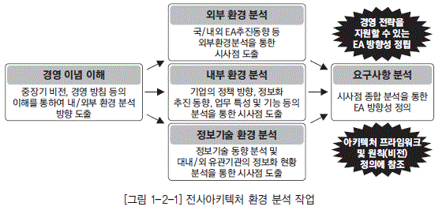

###### 과목1. 전사아키텍처 이해
###### 제2장 전사아키텍처 구축
###### 연습문제

## 1. 전사아키텍처 개념

### 가. 전사아키텍처 도입 배경

기업의 가치창출 활동에서 다양한 환경 변화에 대해 민첩하게 대응할 수 있도록 하는 능력이 정보 기술의 역할로 중요시 되고 있다. 기업의 비즈니스 복잡도는 더욱 증대되고 있고, 업무와 IT 기능의 분리는 더 이상 무의미하게 되었다. 또한 기업이 환경 변화에대응하기 위해 시스템을 변화시키고자 할 때, 시스템이 너무 복잡하여 어디를 어떻게 변경해야 할 지 모르는 상황에 이르렀다. 따라서 건축물의 설계도처럼 기업의 전체 시스템을 쉽게 파악할 수 있는 뭔가가 필요하게 되었다. 전사아키텍처는기업의 이런복잡한 시스템을 파악하기 쉽게 정리하는 것으로, 복잡한 기업 시스템을 필요한 형태로 변화시키는 것을 좀더 쉽게 하기 위해 도입되었다.

### 나. 전사아키텍처 정의

전사아키텍처는 기업의 목표와 요구를 잘 지원하기 위해 IT 인프라의 각 부분들이 어떻게 구성되고 작동되어야 하는가를 체계적으로 기술하는 것이다. 전사아키텍처는 복잡한 기업의 모습을 다양한 측면(비즈니스, 데이터, 애플리케이션, 기술 등)에서분석하고 표현하여 이해하기 쉽도록 정보체계를 구축하고 이를 활용하는 것이다. 전사아키텍처 도입의 목적은 IT 투자 대비 효과를 최대화하고, 기업의 목적을 가장 잘 달성할 수 있는 방식으로 IT 인프라를 구성하는 것이다. 기업은 전사아키텍처 도입을 통하여 비즈니스와 IT를 보다 유기적으로 연결시킬 수 있다. 또한 비즈니스 환경 변화에 대해 신속하게 대응을 할 수 있으며, IT 자체의 효율성도 증대시킬 수 있게 한다.

전사아키텍처 개념에 대한 선진 정의를 살펴보면 다음과 같다.

* 미국 예산관리국(OMB, Office of Management and Budget)의 전사아키텍처 정의

“전사아키텍처는 조직 및 업무 활동과 정보기술 간의 관계를 현재 모습과 향후 추구할 모습을 별 도로 정의한 청사진” - OMB 회람 A-130

이 정의에서는 정보화의 목표인 IT와 업무 간의 연계, 현재 모습과 미래 모습을 포함하고 있다. 또한 전사 아키텍처란 업무 프로세스(Business Processes), 정보 흐름 및 관계(Information Flow and Relationships), 애플리케이션(Applications), 데이터 명세 및 관계(Data Descriptions and Relationships), 그리고 기술 하부 구조(Technology Infrastructure)로 구성된다고 정의하였으며, 이후 실무적 차원에서 구성 요소에 대한 내용이 정리되어 네 가지 영역, 즉 비즈니스 아키텍처 (위의 업무 프로세스와 정보 흐름 및 관계가 여기에 해당됨), 애플리케이션 아키텍처, 데이터 아키텍처(위의 데이터 명세 및 관계가 여기에 해당됨), 기술 아키텍처로 구분한다.

* 미국 전자정부법의 전사아키텍처 정의

“전사아키텍처는 조직의 임무가 정의한 전략적 정보 자산, 그 임무 수행에 필요한 정보, 그 임무 수행에 필요한 기술, 변화하는 요구에 대응하기 위해 신기술의 구현을 위한 전환 과정으로 구성된 다. 전사아키텍처 각 구성 요소는 현행 아키텍처, 목표 아키텍처, 전환을 위한 계획을 포함한다” - 미 전자정부법

이 법에서는 전사아키텍처를 업무와 IT 간 관계에 포함될 내용으로 조직의 임무, 임무에 필요한 정보와 정보기술, 전환 계획을 명시하고 있으며, 현행과 목표 아키텍처를 동시에 포함하고 있다.

* 대한민국 EA/ITA법의 EA 정의

“일정한 기준과 절차에 따라 업무, 응용, 데이터, 기술, 보안 등 조직 전체의 정보화 구성 요소들을 통합적으로 분석한 뒤 이들 간의 관계를 구조적으로 정리한 체계 및 이를 바탕으로 정보시스템을 효율적으로 구성하기 위한 방법” - 정보시스템의 효율적 도입 및 운영에 관한 법률(2005년 12월 30일 공표)

이 법에서는 지식정보화 사회로의 발전에 따라 다양한 정보시스템이 도입, 운영되고 있으나 이를 체계적으로 관리할 수 있는 체제가 마련되지 못하여 중복 투자 및 시스템 간 연계 미흡 등 문제점 이 나타나고 있음을 지적하고 있다. 따라서 정보시스템을 효율적으로 구성하기 위한 체제 및 방법 인 전사아키텍처의 활용을 촉진하고, 공공 기관 등에 정보시스템을 효율적으로 도입, 운영할 수 있는 기반을 마련하기 위해 전사아키텍처를 정의하도록 하고 있다.

전사아키텍처는 다양한 정보기술의 혁신 활동과 관리 통제를 포함하며, 시스템의 도입과 구축뿐만 아니라 운영과 평가까지 통합적으로 관리하는 것을 의미한다. 기업은 전사아키텍처를 통해 IT 자산을 평가하고 전사 관점에서 재설계하고 좀 더 합리적인 구조로 재배치하며, IT의 효율성과 투자 효과를 측정하는 기준으로 활용할 수 있다.

전사아키텍처의 개념을 정확히 이해하기 위해서는 전사(Enterprise)의 개념과 아키텍처 (Architecture)의 개념을 명확히 이해할 필요가 있다.

### 다. 전사개념

전사(Enterprise)란 일반적으로 기업 또는 기관을 지칭한다. 정확하게 정의하면“공동의 목표를 추구하기 위해 고객과 상품 또는 서비스가 존재하고 이를 지원하기 위한 조직, 자원, 기술을 보유하며 필요한 업무 프로세스를 수행하는 조직의 집합체”라고 할 수 있다. 전사는 비즈니스의 변화 동인을 확인하고 전략을 정의할 수 있는 조직 단위이며, 비즈니스 활동 정보를 공유하는 조직 단위라고 할 수 있다.

  * [그림 1-1-1] 전사개념

전사의 유형은 다양하다. 전사가 하나의 기업이나 기관과 정확히 일치하지 않을 수 있다. 기업의 규모가 큰 경우 하나의 기업이 여러 개의 전사로 구성될 수 있다. 그 경우 각각의 전사는 독립적인 운영 주체로 구성된다. 또한 전사는 구분 가능한 다수의 사업 영역으로 구성된다.

전사아키텍처의 수립을 위해서는 전사의 범위를 초기에 명확히 정의해야 하며, 이를 이해당사자들이 충분이 공감할 수 있어야 한다. 전사의 정의는 전사아키텍처 수립 과정에서 중요한 판단 기준이 된다. 전사아키텍처를 수립하는 모든 활동은 정의된 전사의 성과와 목표에 초점을 두고 아키텍처를 도출해야 한다.

### 라. 아키텍처 개념

아키텍처는 고대 그리스어에서 건축 혹은 석공명인(Master)을 의미하는‘Architecton’이라는 용어로부터 유래되었다. 당시의 아키텍처는 건축물의 골격을 제공하는 설계도 역할을 했다. 좋은 아키텍처는 훌륭한 건축물을 탄생시켰고, 이들은 아직까지 인류의 훌륭한 유산으로 남겨지고 있다. 고대의 아키텍처 개념이 화강암과 대리석으로 건축물을 짓는데 적용되었다면, 산업시대에는 건축뿐만 아니라 첨단 과학기술을 이용하여 항공기, 자동차, 선박 등을 개발하는데 적용되어 왔다. 또한 오늘날 디지털 정보화 시대에는 첨단 정보기술을 이용하여 정보체계, 소프트웨어 내장형 체계, 지휘통제 통신체계 등을 구축하는데 적용되고 있다.

IEEE Std. 1971에서는 아키텍처를“ 구성요소의 구조, 구성요소들 사이의 관계, 구성요소의 설계 그리고 시간경과에 따른 구성요소의 발전을 위한 원리와 지침”으로 정의하고 있다.

아키텍처는 대상에 대한 구조뿐만 아니라, 대상 구조의 유지 관리를 위한 원칙과 지침, 그리고 향후 목표 아키텍처로 가기 위한 계획을 포함하고 있다.

  * [그림 1-1-2] 아키텍처 구성요소

* 규칙 (Rule) 관점

기업 또는 기관에서 아키텍처의 일관성이 흔들리는 이유는 기술적 문제 이전에 관리적 문제일 수 있다. 의사결정 단계에 상호운용이나 일관성의 유지를 위하여 준수하여야 하는 원칙을 수립하고 적용함으로써 아키텍처의 연속적인 모습이 관리될 수 있다.

* 모델 (Model) 관점

아키텍처는 구체적인 모델이나 기법에 의하여 분석된 후 그 결과가 정의된 표기법에 의하여 표현된다. 아키텍처의 모델은 각 아키텍처 도메인에 대한 분석 결과가 아키텍처와 관련이 있는 담당자 간에 공유되어야 하는 매우 중요한 정보이다. 모델은 전사아키텍처를 수립할 때뿐만 아니라 향후의 변경을 고려한 절차나 기법을 표준화하는 것이 중요하다.

* 계획(Plan) 관점

아키텍처는 현재 그대로의 아키텍처와 궁극적으로 지향해야 하는 목표 아키텍처를 정의하는데, 현재 상태에서 목표 상태로 되기 위한 적절한 이행 전략과 구축 계획이 필요하다. 계획이란 이런 전사아키텍처의 이행 전략과 이행 계획을 의미한다.

아키텍처란 구축하고자하는 목적에 따라 복잡한 대상을 단순하게 표현하고, 구성요소의 변화에 대한 요구를 수용할 수 있게 한 청사진(Blueprint)이라고 할 수 있다.

전사와 아키텍처의 개념을 기반으로 전사아키텍처를 다시 정의하면, 전사아키텍처란 전사에 대한 아키텍처를 정의 관리하여 전사의 비즈니스 목표를 위해 아키텍처 정보를 활용하여 IT 인프라를 최 적으로 구성하는 것이라고 할 수 있다.

## 2. 전사아키텍처 추진 현황

전사아키텍처는 최근 세계적으로 정부기관과 민간기업의 IT 혁신을 위한 주된 관심사로서, 다양한 산업에 걸쳐 전사아키텍처 프로젝트가 추진되고 있다. 특히 정부기관의 경우 전 세계적으로 전자정부 구현 사업이 활발히 추진되고 있다. 국내 정부기관도 전사아키텍처 추진 사업을 범정부 차원의 전 자정부 구현 과제 중의 하나로서 활발히 추진하고 있다. 2005년 12월 공공 부문에 전사아키텍처 도입을 의무화하는“정보시스템의 효율적 도입 및 운영 등에 관한 법률”이 제정된 것을 기반으로, 공공 부문의 정보 자원을 최적으로 관리하고 정보화 투자 효과를 제고하기 위하여 2007년부터 단계적으로 전사아키텍처가 추진되고 있다.

----
[Tip] 
----

**전사아키텍처 (EA)와 정보기술아키텍처(ITA) :**
 
ITA 는 정보기술아키텍처를 의미한다. 1996년 미국 정보기술관리혁신법에서 ITA(Information Technology Architecture)라는 용어를 사용했으나, 2000년 OBM A-130 회람에서 아키텍처 관련 이러한 개념을 전사아키텍처(Enterprise Architecture)라 명명하였다.

전사아키텍처는 광의의 아키텍처 개념으로, 정보기술아키텍처는 정보기술 중심의 아키텍처 개념으로 볼 수 있다. 국내의 경우 정보기술아키텍처라는 용어를 먼저 사용하였으나 현재는 전사아키텍처로 통합해 사용하고 있다. 이 책에서는 전사 아키텍처와 정보기술아키텍처를 특별히 구분하지 않고 유사한 의미로 사용하기로 한다.

----

EA/ITA법의 주요 내용을 살펴보면 전사아키텍처 의무 도입 기관은 범정부의 아키텍처 목표를 지원하고 각 기관의 목표에 맞는 도입 계획을 수립해 제출하여야 하며, 아키텍처 추진 조직을 구성하고 추진 인력의 아키텍처 역량 강화를 위해 교육 등을 중점 추진하며, 전사아키텍처 도입 계획에 따라 아키텍처를 도입, 운영하고 지속적으로 유지, 발전시켜야 한다. 또한 범정부 차원의 전사아키텍처 관련 정보의 공동 활용 등을 위해 전사아키텍처 관련 정보를 제공할 수 있어야 한다. 또한 아키텍처 성숙도 모델을 활용하여 전사아키텍처 도입, 운영 실태 및 추진 성과를 분석하며, 정보화 사업 추진 시 정보시스템 구축 운영 기술 지침 및 상호 운용성 확보 등을 위한 기술 평가를 수행해야 한다.

  * [그림 1-1-3] 범정부 아키텍처 추진 방향

행정안전부와 한국정보화진흥원은 공공 기관 전사아키텍처 추진의 주관 부처로서 범정부 전사아키 텍처 구현을 위한 단계별 계획에 따라 전사아키텍처의 도입 및 운영을 추진하고 있으며, 범정부 차원에 서 전사아키텍처 구성의 일관성을 확보하고 공공 기관 아키텍처 정보의 종합적인 분석 및 활용을 위하 여 공통의 기준을 적용할 수 있도록 참조 모델, 산출물 메타 모델, 지침 등을 개발하고 보급하고 있다.

[표 1-1-1] 전사아키텍처 관련 범정부 기준

| 구분 | 설명 |
|----|----|
| 범정부 전사아키텍처 참조 모델 |◼ 아키텍처 구성 요소(업무 기능 분류), SRM(서비스 컴포넌트 참조 모델), DRM(데이터 참조 모델), TRM(기술 참조 모델), PRM(성과 참조 모델) ◼  각 기관은 범정부 참조 모델을 그대로 활용하거나 각 기관의 자체 참조 모델을 수립 할 때는 범정부 참조 모델에 매핑하여야 함 |
| 범정부 전사아키텍처 산출물 메타 모델 |◼ 아키텍처를 구성하는 데 필요한 정보들과 그들 간의 관계를 정의한 모델(산출물 종류 와 구성을 정의) ◼ 전사아키텍처 필수 산출물과 보조 산출물로 구성되며, 각 기관은 필수 산출물과 필수 요소는 반드시 정의해야 함 |
| 범정부 전사아키텍처 성숙도 모델 |◼ 아키텍처 수준 및 향후 발전 방향을 수립할 수 있도록 1~5단계의 아키텍처 수준과 측 정 항목을 정의한 모델 ◼ 매년 전사아키텍처 추진 실태와 함께 성숙도를 측정해야 함 |
| 범정부 전사아키텍처 지원시스템 (GITAMS) |◼ 아키텍처 관련 표준과 기준 등을 제공하고, 각 기관의 아키텍처 정보를 공유, 활용할 수 있도록 지원하는 시스템 ◼ 각 기관은 필수 산출물에 해당하는 정보를 매년 GITAMS에 등록해야 함 |

## 3. 전사아키텍처 관련 데이터아키텍처 전문가 역할

데이터아키텍처 전문가가 기업이 필요로 하는 고품질의 데이터 모델 또는 데이터아키텍처를 정의 하기 위해서는 이러한 전사아키텍처의 개념을 충분히 이해하고 있어야 한다.

일반적으로 전사아키텍처 수립 프로젝트에서 데이터아키텍처 전문가는 아키텍처 도메인 중 데이터 아키텍처 영역을 직접 수행하거나 간접적으로 관여하게 된다. 훌륭한 데이터아키텍처 전문가가 되고자 한다면 전사아키텍처에 대해 정확히 이해하고, 소속 기업의 전사아키텍처 추진 내역에 대하여 관심을 가지고 구축된 전사아키텍처 정보를 적극 활용해야 할 것이다. 만약 소속 기업에서 전사아키텍처를 구축하지 않았다면 데이터아키텍처 영역만이라도 전사아키텍처 개념으로 데이터아키텍처 전문가 업무에 접근하는 것도 가능하다.

## 1. 전사아키텍처 프레임워크 개념

기업이 전사아키텍처를 정의하여 관리하기 위해서는 우선 전사아키텍처를 어떻게 표현하고 운영 할 것인가에 대한 전체적인 사고의 틀을 결정해야 한다. 전사아키텍처 프레임워크는 전사아키텍처 활동에서 얻어지는 산출물을 분류하고 조직화하고 이를 유지 관리하기 위한 전체적인 틀을 정의하는 것이다.

전사아키텍처 수립을 위해서는 먼저 이러한 전사아키텍처 프레임워크를 정의해야 하는데, 이미 여러 선진 모델이 나와 있고 정부에서도 가이드를 제시하고 있어, 기관이나 기업은 이를 참조할 수 있다. 하지만, 무조건적인 적용보다는 기업의 특성에 따라 적합한 형태로 정의할 필요가 있다.

## 2. 전사아키텍처 프레임워크 구성

전사아키텍처 프레임워크는 여러 참조 모델이 있다. 우선 전사아키텍처 프레임워크를 좀더 명확히 이해하기 위해서 국내에서 비교적 일반적으로 적용되고 있는 전사아키텍처 프레임워크의 한 사례를 기준으로 전사아키텍처 프레임워크의 구성을 살펴본다.

그림[1-1-4]에서 보면, 전사아키텍처 프레임워크는 전사아키텍처 정책, 전사아키텍처 정보, 전사아키텍처 관리 등의 3가지 영역으로 구분된다. 전사아키텍처 정책은 기업이 전사아키텍처 수립을 어떻게 할 것인가의 방향을 정의한 것으로 아키텍처 매트릭스, 전사아키텍처 비전, 전사아키텍처 원칙 등으로 구성된다. 전사아키텍처 정보는 기업이 구축하는 전사아키텍처 정보의 구체적인 모습으로 현행 아키텍처, 목표 아키텍처, 이행 계획으로 구성된다. 전사아키텍처 관리는 구축된 전사아키텍처를 어떻게 관리하고 활용할 것인가를 정의한 것으로 전사아키텍처 관리 체계, 전사아키텍처 관리 시스템, 전사아키텍처 평가 모형 등으로 구성된다.

  * [그림 1-1-4] 전사아키텍처 프레임 워크 구성 예

### 가. 전사아키텍처 정책

기업이 전사아키텍처를 구축하기 위해서는 먼저 기업의 전사아키텍처 구축 목적과 방향을 정의해 야 한다. 전사아키텍처 정책은 전사아키텍처의 정보를 어떻게 구성할 것이고, 전사아키텍처 수립을 통하여 기업이 달성하고자 하는 궁극적인 모습은 무엇이며, 전사아키텍처를 효과적으로 관리하고 활 용하기 위한 원칙은 어떤 것인지 등을 정의하는 것이다.

  * 아키텍처 매트릭스

아키텍처 매트릭스는 전사아키텍처의 정보를 체계적으로 분류한 틀로서, 기업이 관리하려고 하는 전사아키텍처 정보의 수준과 활용 계층을 결정하는 수단이다.

[표 1-1-2] 아키텍처 매트릭스 예

| 뷰(View)/ 관점(Perspective) | 비즈니스 아키텍처 | 애플리케이션 아키텍처 | 데이터 아키텍처 | 기술 아키텍처 |
|----|----|----|----|----|
|계획자 (개괄적) | 전체 업무, 조직의 구성 정보|전체 차원의 응용 시스템 구성 정보|전체 차원의 데이터베이스 구성 정보|기술 요소의 구성을 전체 차원에서 정리한 정보 |
| |◼ 전사 사업 모델 ◼  조직 모델 ◼  비즈니스 전략|◼ 전사 애플리케이션 영역 모델 ◼  애플리케이션 원칙|◼ 전사 데이터 영역 모델 ◼  데이터 원칙|◼ 전사 기술 영역모델 ◼  기술 참조 모델 |
| 책임자/분석자 (개념적) | 업무의 세부 구성 정보와 업무/조직 간 관계 정보|상위 수준의 기능 구성 정보와 응용시스템 간 관계 정보|데이터베이스에서 관리되는 주요 데이터 개체와 개체 간 관계|정보 기술 기반 자원의 유형별 구성과 인터페이스 정보 |
| |◼ 업무 기능 모델|◼ 애플리케이션 모델 ◼  애플리케이션 표준|◼ 개념 데이터 모델 ◼  데이터 표준|◼ 표준 프로파일 |
| 설계자 (논리적) | 업무의 연계성, 흐름 정보|응용 시스템의 상세한 기능 정보와 물리적 분산 정보|데이터베이스의 논리적 데이터 구조|기술 기반 자원의 도입과 운영을 위한 유형별 구조 및 관리 체계 정보 |
| |◼ 프로세스 모델|◼ 컴포넌트 모델|◼ 논리 데이터 모델|◼ 기술아키텍처 모델 |
| 개발자 (물리적) | 업무 수행을 위한 구체적 절차, 양식, 업무 관계 정보|프로그램의 물리적인 구성 체계와 각 프로그램 구현 정보|데이터베이스의 물리적 구조 정보|도입된 기술 기반 자원의 도입, 운영, 관리에 관한 구체적 정보 |
| |◼ 업무 매뉴얼|◼ 프로그램 목록|◼ 물리 데이터 모델 ◼ 데이터베이스 객체|◼ 기술 자원 목록 ◼ 제품 목록 |

아키텍처 매트릭스는 일반적으로 뷰와 관점의 두 차원으로 전사아키텍처 정보를 구분하고, 뷰와 관점이 교차하는 각 셀에는 전사아키텍처 정보의 실체가 되는 산출물을 정의하는 구조이다. 아키텍처 매트릭스에서 좌우로 바라보는 것을 뷰(View)라고 하고, 위에서 아래로 바라보는 것을 관점(Perspective)이라 한다. 일반적으로 뷰는 비즈니스, 애플리케이션, 데이터, 기술 등으로, 관점은 계획자, 책임자(또는 분석자), 설계자, 개발자 등으로 분류한다. 각 셀은 전후 좌우의 셀과 연관성을 가지며, 셀 간의 추적성이 확보되어야 한다.

  * 전사아키텍처 비전

전사아키텍처 비전은 전사아키텍처 수립을 통하여 기업이 궁극적으로 달성하고자 하는 모습이다. 전사아키텍처 비전에는 전사아키텍처 구축의 목표와, 그 목표를 효과적으로 달성하기 위한 전략과 방향 등을 포함한다.

  * 전사아키텍처 원칙

전사아키텍처 원칙은 전사아키텍처 정보를 효율적으로 구축하고, 기업의 목적에 맞게 전사아키텍처 정보를 효과적으로 활용하기 위해서 조직 구성원이 공유해야 할 규범을 말한다. 전사아키텍처 원칙은 전사아키텍처 대원칙, 아키텍처 원칙, 표준 등을 포함한다.

### 나. 전사아키텍처 정보

전사아키텍처 구축을 위해서는 아키텍처 매트릭스에서 정의한 각 아키텍처 산출물에 대하여 현재 상태와 목표 상태의 정보를 구축한다. 그리고 목표 아키텍처를 달성하기 위한 이행 계획을 수립한다. 아키텍처 정보를 구축하기 위해서는 우선 아키텍처 정보의 영역을 구분해야 하는데, 이런 아키텍처 영역을 구분한 것을 아키텍처 도메인(Architecture Domain)이라 한다. 정확히 말하면, 아키텍처 도메인이란 아키텍처 매트릭스 상에서 뷰의 관점으로 아키텍처 영역을 구분한 것을 말한다. 현행 아키텍처와 목표 아키텍처는 이런 아키텍처 도메인별로 아키텍처 정보를 구축한다.

  * [그림 1-1-5] 아키텍처 도메인 예

* 헌행 아키텍처

아키텍처 도메인별로 정의된 산출물에 대하여 기업의 현재 상태를 아키텍처 정보로 정의한 것을 말한다.

* 목표 아키텍처

아키텍처 도메인별로 정의된 산출물에 대하여 기업이 궁극적으로 달성하고자 하는 목표 아키텍처의 상태를 아키텍처 정보로 정의한 것을 말한다.

* 전사아키텍처 이행계획

아키텍처 도메인별로 현재 모습에서 바람직한 목표 모습으로 이행하기 위한 이행 전략과 이행계획을 정의한 것을 말한다.

----
[Tip]
----

 **비즈니스, 업무, 사업 :**

‘비즈니스’란 용어는 원어로‘Business’이다. 우리나라 말로 번역하면‘사업’또는‘업무’로 표현할 수 있다. 사업이란 용어는 전사 차원의 경영과 관련된 어감이 강하고, 업무란 실무적 차원의 업무 활동에 관련된 어감이 강하다. 비즈니스는 사업과 업무를 포함하는 포괄적인 의미를 가진다고 할 수 있다. 하지만 이 책에서는 비즈니스와 업무를 특별히 구분하지는 않는다. 주로 비즈니스라는 용어를 사용하겠지만, 정부의 참조 모델 관련 내용에서는 업무라는 용어를 그대로 사용한다.

 **애플리케이션, 응용 :**

‘애플리케이션’이란 용어는 원어로‘Application’이다. 우리나라 말로 번역하면 응용이라고 표현할 수 있다. 애플리케이션과 응용을 같은 의미라고 할 수 있다. 이책에서는 업계에서 많이 사용하고 있는 애플리케이션을 사용하겠지만 정부의 참조 모델 관련 내용에서는 응용이라는 용어를 그대로 사용한다.

----

일반적으로 아키텍처 도메인은 비즈니스 아키텍처, 애플리케이션 아키텍처, 데이터아키텍처, 기술 아키텍처 등으로 구분한다. 비즈니스아키텍처는 조직의 목적 및 임무를 지원하기 위해 수행하는 업 무를 분석하고, 이를 업무 활동 단위로 분할하여 표현한 아키텍처이다. 둘째, 데이터아키텍처는 효과 적인 업무 처리 및 의사결정을 위해 어떤 정보가 사용되고, 전달되어야 하는지를 표현한 아키텍처로 서, 전사 데이터 구성을 분류하고 데이터 모델을 정의하는 것이다. 셋째, 애플리케이션아키텍처는 조 직의 임무를 수행하는 데 필요한 애플리케이션의 기능 및 이들 간의 관계 등을 정의한 것으로, 기업 의 애플리케이션 단위를 분류하고 애플리케이션 간의 인터페이스를 정의한 아키텍처이다. 마지막으 로 기술아키텍처는 비즈니스아키텍처, 데이터아키텍처, 애플리케이션아키텍처를 지원하는 데 필요 한 정보 기술 인프라 요소 및 구조, 그리고 이들 간의 관계를 표현한 아키텍처로서, 전사의 기술 영역 을 분류하고 표준 프로파일과 기술 아키텍처 모델을 정의한 것이다.

### 다. 전사아키텍처 관리

정의된 전사아키텍처 정보를 지속적으로 유지 관리하고 효과적으로 활용하기 위해서는 전사아키텍처 관리 체계의 정립과 전사아키텍처 관리 시스템의 구축이 필요하다. 또한 전사아키텍처 관리 수준을 제고하기 위해서는 지속적으로 평가하고 개선할 필요가 있다.

* 전사아키텍처 관리 체계

전사아키텍처 관리 체계는 흔히‘전사아키텍처 거버넌스’라고 말하기도 한다. 이것은 구축된 전사 아키텍처를 유지하고 개선하기 위한 제도적 기반을 수립하는 것이며, 정의된 전사아키텍처 원칙을 준수하도록 확인하고 통제하기 위한 조직과 프로세스를 정의하는 것을 포함한다. 전사아키텍처 관 리 체계는 전사아키텍처 활동을 관리하며, 전사아키텍처의 정보 변경을 통제하고, IT 프로젝트가 전사아키텍처의 기본적인 원칙과 정책을 준수하도록 하기 위한 목적이 있다.

* 전사아키텍처 관리 시스템

전사아키텍처 관리 시스템은 전사아키텍처의 정보 관리의 효율성을 제고하고 전사아키텍처 정보의 공유를 활성화하기 위해 구축하는 정보시스템이다. 전사아키텍처 관리 시스템은 도입하는 기업의 요건에 따라 다양한 형태로 구성될 수 있는데, 일반적으로 전사아키텍처 정보를 정의하는 모델링 도구와 전사아키텍처 정보를 저장하는 전사아키텍처 리포지터리, 전사아키텍처 정보를 사용자에게 배포하는 전사아키텍처 포털 등으로 구성된다.

* 전사아키텍처 평가

전사아키텍처의 관리와 활용 수준의 제고를 위해서는 전사아키텍처에 대해 주기적으로 평가하고, 개선점을 도출하여 반영해야 한다. 이를 위해서는 전사아키텍처의 수준을 객관적이고 정확하게 평가할 수 있는 전사아키텍처 성숙 모형이 필요하다.

## 3. 아키텍처 도메인 구성

아키텍처 도메인의 구성은 기업이 아키텍처 매트릭스를 어떻게 정의하느냐에 따라 다르다. 이 절에서는 아키텍처 도메인에 대해서 이해를 좀더 깊이 하기 위하여 국내 기업에서 비교적 일반적으로 활용되고 있는 아키텍처 도메인별 구성내역을 살펴본다. [표 1-1-1] 아키텍처 매트릭스를 기준으로 설명한다.

### 가. 비즈니스 아키텍처

비즈니스 아키텍처는 기업의 경영 목표를 달성하기 위한 업무 구조를 정의한 아키텍처 영역으로,〈기업의 업무와 서비스의 실체를 명확히 하는 것이다. 비즈니스 아키텍처는 타 아키텍처(데이터, 애플리케이션, 기술)의 방향을 정의하고 검증하는 시발점이 된다.

  * [그림 1-1-6] 아키텍처 도미엔별 산출물 예

급변하는 비즈니스 환경에 대한 적응성을 높이기 위해서는 정보기술이 철저하게 비즈니스 전략과 연계되어야 한다. 데이터아키텍처는 비즈니스아키텍처에서 정의한 업무를 지원하기 위해 필요한 데 이터를 정의해야 하고, 애플리케이션아키텍처는 비즈니스 업무를 수행하기 위해서 필요한 애플리케 이션을 정의해야 한다. 기술아키텍처 역시 이러한 비즈니스를 지원하는 데이터 및 애플리케이션아키 텍처를 잘 지원하기 위한 기술적 특성을 감안하여 정의되어야 한다.

  * 전사 사업 모델 (계획자 관점)

비즈니스 아키텍처는 먼저 아키텍처 정보를 구축하는 대상인 전사(Enterprise)의 범위를 정의하는 것에서부터 시작한다. 전사를 둘러싼 내외부의 이해관계자를 분석하고, 외부 객체와의 가치사슬을 분석하여 전사를 정의한다. 전사의 정확한 가치사슬을 분석하기 위해서는 외부 객체의 가치사슬과의 연관 관계를 파악하여 어떤 기능들이 외부객체에 의해서 수행되고, 외부객체의 어떤 기능을 전사 내부가 수행하고 있는지 분석해야 한다.

  * [그림 1-1-7] 전사 가치사슬 예

  * 조직 모델 (계획자 관점)

조직 모델은 기업의 사업 모델을 지원하기 위한 기업의 조직 구조를 정의하는 것이다. 비즈니스를 수행하는 지리적 위치와 내부 객체를 도출하여 기업의 조직 구조와 업무 분장을 정의한다.

  * 업무 기능 모델 (책임자 관점)

업무 기능 모델은 기업의 업무 기능을 계층적으로 분할하고 기능 내용을 정의하는 것이다. 업무 기 능을 분할할 때는 조직 기준이 아닌 업무 기능의 유사성과 연관성을 기준으로 정의한다. 상위 업무 기능은 하위 업무 기능의 합으로 완전히 표현될 수 있어야 한다. 업무 기능 모델링은 데이터와 애 플리케이션의 상호 비교를 통한 연관 분석이 이루어진다.

  * 프로세스 모델 (설계자 관점)

프로세스 모델은 업무 기능을 상세화하여 계층적으로 프로세스을 분할하고 프로세스의 활동내용을 정의하는 것이다. 프로세스란 업무 수행을 위해 정보를 입력 받아 의미있는 활동을 통해 산출물을 생성하는 일련의 과정이다. 프로세스 모델 역시 데이터와 애플리케이션과 상호 비교를 통한 연관분석이 반복적으로 이루어진다.

  * 업무 메뉴얼 (개발자 관점)

업무 기능이나 프로세스별 업무 내역을 상세히 기술한 자료로, 전사아키텍처에서는 목록 수준의 정보를 관리한다.

### 나. 애플리케이션 아키텍처

애플리케이션 아키텍처는 기업의 업무를 지원하는 전체 애플리케이션을 식별하고 연관성을 정의 하며, 업무와 IT 특성을 고려하여 그룹화하고 범주함으로써 전체 애플리케이션 구조를 체계화하는 것이다. 애플리케이션 서비스는 애플리케이션이 지원하는 업무와 데이터의 특성을 고려하여 정의되 며, 서비스 간의 상호 연관관계를 분석 정의한다. 이는 향후 애플리케이션에 대한 배치, 통합, 포트 폴리오 관리를 위한 시각을 제공한다.

* 전사 애플리케이션 영역 모델(계획자 관점)

기업의 업무를 지원하는 애플리케이션을 식별하고 애플리케이션별 특성 분석을 통해 이를 전사 수 준에서 구조화하는 것이다. 애플리케이션의 기능과 특성에 따라 독립되어 구현되고 운영될 수 있 는 애플리케이션을 정의하고, 애플리케이션과 관련된 업무, 데이터와 IT 특성을 감안하여 애플리 케이션을 그룹화하여 애플리케이션 영역을 정의한다.

* 애플리케이션 모델(책임자 관점)

애플리케이션 모델은 각 애플리케이션이 지원하는 기능과 데이터 정보를 정의하고, 애플리케이션 이 제공하는 서비스를 도출하며, 이들 간의 연관 관계를 정의한 것이다. 애플리케이션이나 서비스 가 어느 업무 프로세스에서 활용되고, 어떠한 정보를 생산하고 관리하는지 연관성 분석을 한다. 애 플리케이션 모델의 정의는 개발 방법론에 의존적이다.

* 컴포넌트 모델, 클래스 모델(설계자 관점)

실제 애플리케이션 개발에 필요한 설계 정보를 관리하는 것으로, 컴포넌트 정의나 클래스 정의, 데 이터 흐름도(DFD, Data Flow Diagram) 등이 해당되며 기업의 개발 방법론에 영향을 많이 받는 다. 기업이 가지고 있는 업무 영역별로 애플리케이션의 개발 환경은 상이할 수 있다. 예를 들면 정 보계는 컴포넌트 기반 개발(CBD, Component Based Development) 방법론을, 운영계는 메인 프레임 중심의 구조적 방법론을 사용할 수 있다.

* 프로그램 목록(개발자 관점)

애플리케이션의 최종 단위인 프로그램에 대한 정보를 관리한다.

### 다. 데이터아키텍처

데이터아키텍처는 기업의 업무 수행에 필요한 데이터의 구조를 체계적으로 정의하는 것이다. 데이터아키텍처는 전사의 데이터 영역을 분류하는데, 업무 데이터와 메타 데이터를 구분하거나 업무 데이터는 운영계 데이터, 정보계 데이터 등으로 구분한다. 이를 기준으로 전사 수준의 주제 영역 모델, 개념데이터 모델을 정의하고, 영역별로 논리 데이터 모델, 물리 데이터 모델을 정의한다.

참고로, 데이터아키텍처 전문가가 다루는 데이터아키텍처의 범위는 데이터 구조뿐만 아니라 데이터 표준, 데이터 관리 체계 등을 포함하는 광의의 데이터아키텍처를 의미한다.아키텍처의 의미에 대해서는 1절의 아키텍처 정의를 참조하기 바라며, 데이터아키텍처 전문가의 영역에 대해서는 3장의 3절 5항을 참조 바란다.

* 전사 데이터 영역 모델 (계획자 관점)

전사 데이터 영역 모델은 개괄 데이터 모델이라고도 하며 상위 수준의 전사 데이터 영역을 분류하여 표현한 것이며, 상위 주제 영역 수준의 데이터 구성도가 이에 해당된다. 주제 영역은 업무 기능과 대응되는 개념으로 유사 데이터를 그룹화 한 것이다.

* 개념 데이터 모델 (책임자 관점)

개념 데이터 모델은 전사 수준의 데이터 모델로 단위 주제 영역 또는 핵심 엔터티 정도를 표현한 데이터 모델이다. 개념 데이터 모델은 전사 수준에서 사용하는 데이터를 전체적으로 표현할 수 있 는 기본 틀로서, 전사 데이터아키텍처를 관리하는 데 있어 매우 유용한 모델이다. 개념 데이터 모 델에서는 핵심 엔터티는 일반적으로 단위 주제 영역별로 한두 개가 정도가 도출된다.

* 논리 데이터 모델(설계자 관점)

논리 데이터 모델은 개념 데이터 모델에서 정의된 주제 영역과 핵심 엔터티를 기본 정보로 하여 업 무 요건을 충족시키기 위한 데이터의 상세한 구조를 논리적으로 구체화한 것이다. 논리 데이터 모 델링은 수집된 업무 관련 데이터 정보 및 사전에 작성된 산출물을 기반으로 필요한 모든 엔터티를 도출하고, 식별자, 속성, 관계와 서브타입 등을 정의한다. 논리 데이터 모델은 엔터티, 속성에 대 한 명칭, 정의, 형식, 규칙, 코드 등을 전사적인 차원의 표준으로 정의하여 관리해야 한다.

* 물리 데이터 모델(개발자 관점)

물리 데이터 모델은 기술적 환경과 특성을 고려하여 물리적 데이터 구조를 설계하고, 데이터베이 스 객체를 정의한 것이다. 개발자는 논리 데이터 모델을 물리적인 데이터 구조로 전환하고 데이터 무결성을 보완하여 정의하고, 데이터 분산 설계에 따른 데이터 무결성 등 추가적인 무결성 규칙을 정의한다. 데이터베이스의 성능을 고려하여 이미 설계된 데이터 구조에 추가적으로 데이터의 접근 성능 향상을 위한 인덱스 설계, 데이터 구조에 대한 비정규화 과정을 수행한다.

### 라. 기술아키텍처

기술아키텍처는 비즈니스, 데이터, 애플리케이션 아키텍처에서 정의된 요건을 지원하는 전사의 기 술 인프라 체계를 정의하는 것이다 기술 인프라는 하드웨어, 시스템 소프트웨어, 통신 네트워크, 시 스템 개발도구, 시스템 관리도구, 최종 사용자 소프트웨어 등을 포함한다. 기술 참조 모델과 표준 프 로파일 구축을 통해 애플리케이션의 이식성과 확장성을 강화하고, 벤더로부터의 독립성을 확보하며, 시스템 간의 상호운용성을 강화하는 등의 효과를 기대할 수 있다. 기술아키텍처의 경우 다른 아키텍 처와 달리 개별 기업에서도 기술 참조 모델을 정의하는 것이 일반적이다. [표 1-1-2] 아키텍처 매트 릭스에서 기술 참조 모델을 계획자 수준의 산출물로 포함한 것도 그런 의미라고 판단하면 된다.

* 전사 기술 영역 모델, 기술 참조 모델(계획자 관점)

전사 기술 영역 모델은 기업이 업무활동에 필요한 정보기술의 영역을 상위 수준에서 분류한 것이다. 기술 참조 모델(TRM, Technical Reference Model)은 기업이 업무 활동에 필요한 기능들을 수행하기 위해 요구되는 정보기술을 상위 수준에서 논리적으로 분류한 틀인데, 전사 기술 영역 모델과 같은 범주로 볼 수 있다. 다만 기술 참조 모델은 일반적인 표준을 최대한 수렴해 정의하는 것이 특징이라고 할 수 있다.

  * [그림 1-1-8] 기술 참조 모델 예

* 표준 프로파일(책임자 관점)

표준 프로파일(SP, Standard Profile)은 기술 참조 모델에 명시된 서비스를 지원하기 위한 정보기술 표준들의 집합이다. 기업의 모든 기술 아키텍처 요소들에 영향을 미치는 표준들을 포함한다. 이 표준들은 시스템의 이식성, 확장성, 상호운용성, 호환성을 제고하게 된다. 일반적으로 표준 프로파일은 기술표준을 프로파일의 대상으로 하며, 최근에는 제품을 프로파일링 대상에 포함시키는것이 추세이다.

* 기술 아키텍처 모델(설계자 관점)

기술 아키텍처 모델은 전사 기술 영역 모델이나 기술 참조 모델에서 정의된 서비스 카테고리별로 아키텍처의 패턴을 정의하거나, 기업의 소프트웨어, 하드웨어, 네트워크 등의 구성 요소에 대한 배치도를 정의하는 것이다.

* 기술 자원 목록, 제품 목록(개발자 관점)

표준 프로파일이나 기술 아키텍처별로 관련된 기술자원 목록이나 제품 목록을 기술 아키텍처 정보로 관리한다.

## 4. 전사아키텍처 프레임워크 사례

전사아키텍처 프레임워크로 참조할 수 있는 모델은 다양하다. 자크만 프레임워크(ZEAF)를 비롯하여, 미연방정부 프레임워크(FEAF), 미재무성 프레임워크(TEAF), 미국방성 프레임워크(DoDAF), 오픈그룹 프레임워크(TOGAF), 한국정보 프레임워크 등이 대표적인 사례이다.

예를 들면 자크만 프레임워크(ZEAF)는 다섯 가지 관점(Planner, Owner, Designer, Builder, Sub-contractor)과 각 관점에 따르는 여섯 가지 묘사 방법(Data, Function, Network, People, Time, Motivation)을 정의하고 있다. 전사아키텍처 프레임워크의 대표적인 예로서 많은 다른 전사아키텍처 프레임워크에서 참조되고 있다.

[표 1-1-3] 전사아키텍처 프레임워크 예

| | ZEAF | FEAF | TEAF | DoDAF | TOGAF | 공공부분EAF |
|----|----|----|----|----|----|----|
| 구성도 |  |  |  |  |  |  |
| 특징 | ◼ 1980년대 말 기업활동을 공학적 관점에서 파악하는 아키텍처 개념 최초 소개 ◼  기업 활동을 5W1H의 관점에서 모델링 관점 제공|◼ 2003년에 최신 버전 발표, 미연방정부 프레임워크 가이드 라인제공 ◼  참조 모델 기반의 EAF|◼ 미 재무성 EAF ◼ FEAF, DoDAF와 함께 대표적 EAF|◼ 효과적 작전 수행을 위해 무기 체계 간 상호운용성 보장을 위해 도입된 EAF ◼  상호운용성 분석과 향상을 위해 LIBI 분석|◼ 민간 표준 연합인 오픈그룹 EAF|◼ 정부, 공공기관에 전사아키텍처 도입시 참조할 수 있도록 표준, 가이드 목적으로 추진 |
| 장점 | ◼ 5W1H에 따라 기업활동을 상세하게 모델링할 수 있는 관점 제공 ◼  Planner, Owner, Designer, Builder, Sub-contractor 관점에서 기업 활동 관심영역을 구체화|◼ 모델링 관점뿐만 아니라 구체적 이행 계획을 프레임워크에 포함 ◼  BRM, DRM, SCRM, TRM, PRM등 다양한 참조 모델 활용|◼ How-Where-When을 표현하는 기능, What-How much-How Freq 를 표현하는 정보, Who-Why를 표현하는 조직, Enable를 표현하는 인프라 관점 중시|◼ 산출물에 대한 템플릿을 상세하게 정의하여 통일되고 검증된 방식으로 모델링 가능 ◼  운영 모델에 대한 상세한 정의 및 표현 양식 제공|◼ 구체적 아키텍처 개발 프로세스 제안 ◼ 각종 참조 모델의 활용관계를잘정의함|◼ 전사아키텍처 관련된 거의 모든 항목을 프레임워크에 포함하여 기본 프레임워크로 활용하기 용이 |
| 단점 | ◼ 정보화 측면에서 활용도 떨어지는 부문까지 정의 ◼  모델링 표현에 지나치게 집중, 실제 아키텍처 활동 계획 및 기반 정의 부족|◼ 아키텍처 모델의 이해 및 진화에 대해 잘 정의되어 있으나, 조직 및 관련 규정등 제반 요소의 진화적 관점부족|◼ 전사아키텍처 산출물 중심의 프레임워크로서 활용에 대한 접근이 부족 ◼  기업의 계속적인 활동에 대한 관점이 부족|◼ 일반 기업 현장에서는 과도한 산출물과 정확도를 요구하고 있어 과잉 투자 가능성 있음|◼ 메타 모델에 근거한 연속체 개념을 도입하여 아키텍처를 파악함으로써 조직의 특수성이프레임워크에 반영되기 어려움|◼ 표준 프레임워크만 제시하여 구체적인 내용들은 참조한 기관에서 작성하도록 권고 |

미재무성 프레임워크(FEAF)는 8개 구성요소로 이루어져 있고 4단계에 걸쳐 점차적으로 진행하여 마지막 단계에 자크만 프레임워크의 모델 내용을 모두 관리한다. 프레임워크에는 각 세그먼트별 접근법을 채택하여 현행과 목표의 갭분석을 통한 이행 계획과 프로세스를 포함하고 있다.

오픈그룹 프레임워크는 아키텍처를 정의하기 위하여 오픈그룹에서 개발한 아키텍처 개발에 대한 지침인 아키텍처 개발 방법(ADM, Architecture Development Method), 정보기술을 체계적으로 분류한 기술 참조 모델, 표준 요약 정보를 모아놓은 데이터베이스인 표준정보기반(SIB, Standard Information Base)으로 구성되어 있다. 빌딩블록 정의에 의한 접근 방식으로 구성 단위의 문제해결 방식을 제안하고 있다.

각각의 전사아키텍처 프레임워크들은 다른 점도 있지만, 공통점 또한 많다. 프레임워크를 정의할때 이러한 선진 모델을 참조하되 기업의 특성에 맞는 것을 만들어야 하며, 경직된 사고보다는 유연성을 가지는 것이 중요하다.

## 1. 참조 모델 정의

### 가. 참조 모델 개념

참조 모델(Reference Model)은 아키텍처 구성 요소를 식별하여 표준화한 것으로 기관이나 기업 의 전사아키텍처를 수립할 때 참조하는 추상화된 모델이다. 참조 모델은 다양한 관점을 충족시킬 수 있도록 시스템에 대한 개념적인 모델을 추상화하고, 구성 요소를 재사용 가능한 방식으로 생성하여, 여러 기업이 사용할 수 있도록 한 것이다.

전사아키텍처에서는 비슷한 특성이 존재하는 산업군마다 정의된 참조 모델을 활용하도록 추천하 는데, 각 기업은 동종의 참조 모델을 참조하여 고유의 아키텍처를 구성할 수 있다. 이러한 참조 모델 중 잘 알려진 것은 국방, 공공 참조 모델이다. 아키텍처별 참조 모델에는 업무 참조 모델(BRM, Business Reference Model), 데이터 참조 모델(DRM, Data Reference Model), 서비스 참조 모 델(SRM, Service Reference Model), 기술 참조 모델(TRM, Technical Reference Model), 성과 참조 모델(PRM, Performance Reference Model) 등이 있다.

### 나. 참조 모델 현황

정부는 [그림 1-1-9]와 같이 전사아키텍처 참조 모델로 업무 참조 모델, 서비스 참조 모델, 기술 참조 모델, 데이터 참조 모델, 성과 참조 모델 등 5가지 참조 모델 정의를 추진하고 있다.

  * [그림 1-1-9] 범정부 EA 참조 모델 개념 구조

  * 성과 참조 모델 : 정보화 성과의 측정을 위한 항목과 지표 및 방법을 제시
  * 업무 참조 모델 : 업무아키텍처의 기준이 되며, 아키텍처 대상 기관의 사업 또는 업무 등을 전체적으로 분류하고 정의하는 것
  * 서비스 참조 모델 : 응용아키텍처의 기준이 되며, 응용 서비스의 기능을 분류하고 정의
  * 데이터 참조 모델 : 데이터아키텍처의 기준이 되며, 기관 간에 교환되는 주요 데이터 요소를 분석하여 이를 정의하고 표준화
  * 기술 참조 모델 : 기술아키텍처의 기준이 되며, 정보기술을 분류 및 식별

[그림 1-1-9] 범정부 EA 참조 모델 개념 구조

범정부 참조 모델은 전사적 아키텍처의 일관성, 재사용성, 상호 운용성 등을 확보하기 위하여 전사 적 아키텍처의 구성에 필요한 정보화 구성 요소의 표준화된 분류 체계와 형식을 정의한 것으로서, 정 부는 공공 기관에서 공동으로 활용할 수 있는 전사적 아키텍처의 참조 모델을 개발하여 보급하고 있 다. 범정부 전사아키텍처 추진의 특징은 일반 기업의 전사아키텍처 프로젝트와 달리 범정부의 정보 화 사업을 체계적으로 추진할 수 있는 참조 모델과 지침을 만들어서 보급하는 데 역점을 두고 있다는 점이다.

참조 모델은 미 연방정부 전사아키텍처에서 처음 제시된 개념으로, 미국의 예산관리국은 2002년 부터 정부 기관 간의 업무 프로세스를 단순화하고 통합하기 위해 연방정부의 아키텍처 정보화(FEA, Federal Enterprise Architecture) 개발을 시작했고, 미 연방정부 전체 최적화 관점에서 각 기관 의 전사아키텍처 구축을 위한‘기준’을 제시하기 위해 아키텍처 영역별로 참조 모델을 정의했다. 여 기서도 역시 성과 참조 모델, 업무 참조 모델, 데이터 참조 모델, 서비스 요소 참조 모델, 기술 참조 모델 등을 정의하였다.

참조 모델 중 가장 잘 활용되고 있는 것이 기술 참조 모델이라고 할 수 있는데, [표 1-1-4]는 대표 적인 기술 참조 모델을 비교하였다.

[표 1-1-4] 기술 참조 모델 비교

| 모델 | 특징 |
|----|----|
| 미연방 TRM |◼ 프레임워크에서 업무, 서비스, 데이터와의 연관성이 높음 ◼  TRM 구조가 내부와 외부의 3계층 구조로 되어 있어, 대내외 연계 설명이 용이 ◼  최신 기술 및 메인프레임의 기술 체계를 폭넓게 수용 ◼  지방 주정부 간의 연동을 고려한 접근으로 내부 IT 서비스를 위한 참조 모델로 활용 하기에는 다소 어려움이 있음 |
| 오픈그룹 TRM |◼ 애플리케이션 이식성 지원을 위해 필요한 기반 플랫폼의 구조와 서비스에 중점 ◼  상호운용 가능한 기술 환경을 구축하기 위해 애플리케이션-통신 기반과의 인터페이 스를 중시 ◼  애플리케이션에 대한 상세한 분류 체계를 제공 ◼  표준 위주의 이론적 접근으로 플랫폼, 네트워크, 통신 기반에 대해서는 상세한 서비 스 분류가 정의되지 않음 |
| 가트너 TRM |◼ 데스크톱 애플리케이션, 엔터프라이즈 애플리케이션 구분 ◼  실용적인 분류 체계를 제공하고 있으나 상세 분류 기준 미흡 |
| 정보화진흥원 TRM |◼ 업무 참조 모델, 서비스 참조 모델, 데이터 참조 모델 등과 함께 범정부 참조 모델 중 하나로 상호 연계성을 기대 ◼  컴포넌트 기반 아키텍처 및 서비스 기반 아키텍처를 지향 ◼  시스템 및 서비스의 상호운용성을 보장 ◼  국내의 정보화 환경을 고려하여 유망하고 안정된 기술 선정 |

기술 참조 모델의 선진 사례는 기본적인 분류의 기준만을 제공한다. 선진 사례가 어떤 것은 너무 범용적이고, 어떤 것은 정부, 국방 등 특정 영역에 의존적이기 때문에 자사 혹은 해당 산업의 기술적 특성을 반영하지 못할 수 있다는 점을 고려해야 한다.

### 다. 참조 모델 구축 방법

참조 모델은 두 가지 방법으로 구축된다. 하나는 공통적인 특성을 추출하여 그 산업군에 맞게 범용 적으로 만드는 것이고, 또 하나는 복잡하고 대표적인 기업을 선정하여 그 기업의 아키텍처를 표본으 로 삼아 비슷한 타 기업에서 재활용하게 만드는 것이다. 먼저 공통적인 특징을 추출하여 만들어진 참 조 모델은 요소 간 경계가 불명확하고 하위 수준의 정의가 명확하지 않은 데 비해 이해하기 쉽고 많 은 산출물이 필요하지 않은 장점이 있다. 대표적인 기업의 아키텍처를 재활용하는 방향은 각 산출물 의 관계가 정확하고 하위 수준까지??상 대부분 공개 가 되지 않는다는 단점이 존재한다.

## 2. 참조 모델 사례

참조 모델에 대한 이해를 높이기 위해 범정부의 업무 참조 모델, 서비스 참조 모델, 기술 참조 모델, 데이터 참조 모델, 성과 참조 모델을 소개한다.

### 가. 업무 참조 모델

업무 참조 모델은 특정 기관의 독립적인 업무 기능을 중심으로 정의한 참조 모델이다. 업무 참조 모 델은 조직과 무관한 기능 위주의 접근이며, 다른 아키텍처를 정의하는 기준으로 활용될 수 있다.

업무 참조 모델은 몇 개의 업무 영역으로 구분된다. 각 업무 영역은 여러 개의 업무 단위로 구분되 고, 각 업무 단위는 세부 업무로 구성된다. 업무 참조 모델에 정의된 업무 단위는 특정 기관에 의해 수행되는 것이라기보다는 기관이 어떤 목적으로 어떤 내용의 일을 수행하든 그 업무는 여기에 정의 된 업무 단위로 묘사될 수 있다. 이는 업무 분석을 위한 공통 기준으로 활용할 수 있다. 서로 다른 기 관들이 유사한 업무를 수행하고 있는지를 파악할 수 있어 유사 업무를 지원하는 시스템을 개발할 경 우에 기관이 공동으로 활용할 수 있다. 업무 참조 모델은 다른 기관이 수행하는 프로젝트 중에서 비 슷한 내용을 검색하여 그 내용을 참고할 수 있다.

정부의 업무 참조 모델은 정책 분야, 정책 영역, 대기능, 중기능, 소기능 등으로 분류하고 있는데, 일반 기업의 업무 참조 모델은 흔히 사업 영역, 업무 영역, 업무 기능 등으로 분류하고 있다.

  * [그림 1-1-10] 범정부 업무 참조 모델 체계 예

### 나. 서비스 참조 모델

서비스 참조 모델은 업무 수행과 목표 달성을 지원하는 서비스 요소를 분류하기 위한 기능 중심의 평 가 지향적 참조 모델이다. 공공 부문의 애플리케이션 서비스에 대한 식별을 통하여 업무와 서비스의 연 계 및 재사용을 촉진하고 중복 개발을 방지하기 위한 것으로, 업무 및 조직에 독립적인 표준 서비스 분 류 체계이다. 기관들은 이를 통해 범정부 차원의 업무 및 응용 서비스 요소를 발견할 수 있다. 서비스 참조 모델을 구축하는 목적은 응용 서비스의 재활용을 촉진하기 위한 서비스 분류 체계를 제공하며, 정 부 기관 업무 지원 컴포넌트에 대한 단일화되고 통합된 분류 체계를 제공하기 위함이다. 또한 업계와 정부 간의 컴포넌트 개발, 축적, 유통의 활성화를 촉진하며, 복잡, 다양한 정부 부처 응용 서비스를 용 이하게 식별할 수 있도록 하기 위한 것이다.

서비스 참조 모델은 여러 개의 서비스 영역으로 구분된다. 각 서비스 영역은 여러 개의 서비스 유 형으로 구성되며, 서비스 유형은 서비스 컴포넌트로 분류된다.

  * [그림 1-1-11] 범정부 서비스 참조 모델 예

### 다. 기술 참조 모델

기술 참조 모델은 업무와 서비스 구성 요소의 전달과 교환, 구축을 지원해 주는 표준, 명세, 기술 요소를 기술하기 위한 것이다. 업무를 지원하는 응용 기능을 구현하는 데 필요한 정보 기술 및 표준들을 분류하고 정의한 체계로서, 기업의 정보화 추진을 위한 전체 정보 기술을 식별하고 정의하여 관 련된 기술 표준과 동향을 관리하여, 공통의 정보 기술 기반을 수립하고 기업의 정보 기술을 표준화할 수 있도록 한다. 각 기업은 이를 통하여 기술 및 응용 서비스의 재사용을 제고시키고, 업무 및 응용 서비스의 안전한 교환 및 전달을 위한 기반 환경을 구축하며, 정보 기술 간의 상호 운용성 확보를 지 원하여 정보 기술 성능과 투자의 최적화를 추구하도록 지원한다. 기술 참조 모델은 몇 개의 핵심 서 비스 영역으로 구성된다. 핵심 서비스 영역은 다시 하위 수준의 서비스 범주나 기술 표준으로 구성된 다. 기술 참조 모델은 서비스 컴포넌트와 연관을 가지며, 정보시스템 간 상호운용성 증대를 위한 기 술 표준을 강조한 구조를 갖고 있다.

기술 참조 모델은 특성상 다양한 산업군 및 기업에 바로 적용할 수 있기 때문에 구축하기 용이하고 기대 효과가 커서 가장 먼저 적용 가능한 영역이다. 기술 참조 모델의 수립은 시스템 구축 시 사용할 기술에 대한 표준 프로파일을 분류하는 데 활용 가능하다. 시스템 관리 시 정보 자산을 분류하는 데 활용 가능하고, 시스템 통합 시 정보시스템 간의 유사성을 판단하는 기준 항목으로 활용 가능하다.

  * [그림 1-1-12] 범정부 기술 참조 모델 예

### 라. 데이터 참조 모델

  * [그림 1-1-13] 범정부 DRM 프레임워크와 개별기관 데이터아키텍처의 관계

데이터 참조 모델은 기관 간의 공통 정보 파악과 활용을 지원하기 위한 모델이다. 기관 간의 정보 공유 및 데이터의 표준화, 재사용을 지원하기 위한 범정부 데이터 분류 및 데이터 표준화와 관리를 위한 기준과 체계를 정의한 것이다.

데이터 참조 모델 프레임워크는 데이터의 표준화, 참조, 재사용을 위하여 필요한 구성 요소와 구성 요소 간의 관계를 정의한 것으로서, 범정부 데이터 모델, 데이터 분류, 데이터 구조, 데이터 교환, 데 이터 관리의 5개 요소로 구성된다.

* 범정부 데이터 모델

범정부에서 구축 및 활용하고 있는 데이터를 식별하고 데이터 영역 간의 관계를 도식화한 것으로, 개별 기관은 범정부 데이터 모델을 참조함으로써 범정부에서 구축 및 운영되고 있는 데이터에 어 떤 것이 있는지를 확인할 수 있다.

* 데이터 분류

데이터에 대한 분류 기준을 정의한 것으로, 범정부 데이터 모델의 데이터들은 데이터 분류에 따라 그룹핑되고, 데이터 구조의 데이터 요소는 데이터 분류 체계에 매핑된다. 데이터 분류 체계를 활용 함으로써 좀 더 용이한 데이터 관리 및 검색이 가능해진다.

* 데이터 구조

범위 내의 모든 데이터 요소와 요소의 소유주, 표준화 항목 정의, 요소 간 관계 및 정보를 저장한 다. 구축 및 활용하는 데이터 요소에 대한 표준화 항목과 가이드를 제시하고, 궁극적으로는 주요한 표준 데이터요소를 등록하여 이를 공유 및 재사용할 수 있도록 한다.

* 데이터 교환

데이터 요소의 교환을 위하여 교환 대상 정의 및 메시지 구조, 메시지 방식을 제시하고 교환 내역 을 관리할 수 있도록 한다. 데이터 교환에서 정의한 데이터 교환 패키지를 통해서 데이터 요소를 참조/재사용할 수 있다.

* 데이터 관리

데이터 품질, 표준화, 보안 등의 유지를 위한 데이터 관리 정책 및 규칙, 프로세스, 조직 구조를 정 의한다.

  * [그림 1-1-14] 데이터 참조 모델 구조 및 활용 예

### 마. 성과 참조 모델

성과 참조 모델은 정보화 성과 관리를 위한 구성 요소와 관계를 정의한 것으로, 정보화 성과 제고 및 정보화 사업 품질 향상을 위한 기본 틀을 제공한다. 성과 참조 모델의 도입을 통하여 정보화 사업 의 성과 정보 생성을 지원하여 의사결정을 향상시킬 수 있으며, 정보화 사업의 입력, 과정, 출력, 최 종 성과 간의 인과 관계를 명확히 하여 계층별 성과의 연계를 증진시킨다. 또한 정보화 사업의 성과 를 가시화, 측정, 통제, 관리함으로써 정보화 사업의 개선 가능성을 파악하고 궁극적으로 성과를 증 진시킬 수 있다.

성과 참조 모델은 평가 분류 체계, 표준 가시 경로, 성과 관리 표준 양식으로 구성된다. 평가 분류 체계는 표준화된 평가 지표 개발 및 성과 관리를 위한 기본 틀(분류 체계 및 지표 사례)로서, 평가 영 역, 평가 항목, 평가 그룹, 평가 지표로 구분된다. 표준 가시 경로란 평가 그룹 및 평가 지표 간 관계 를 도식화한 것으로, 정보화 사업의 IT 성과가 서비스 품질, 고객 만족 등의 업무 성과에 기여하는 과정을 파악할 수 있도록 한다. 성과 관리 표준 양식은 공공 기관에서 성과 참조 모델을 활용하여 평 가 및 성과 관리를 하기 위한 표준 양식을 의미한다.

  * [그림 1-1-15] 범정부 성과 참조 모델 체계 예

## 3. 참조 모델 활용

참조 모델은 다양한 용도로 활용될 수 있으며, 용도에 따라 효과도 달라진다. 참조 모델은 정부기 관과 같이 중앙 부처가 산하기관에 참조 모델을 적용하거나, 기업군의 성격을 가지는 기업의 지주회 사나 계열사가 하위 기업에 적용하는 것을 제외하고는 일반 기업이 참조 모델을 업무에 적용하는 것 은 아직 일반화되어 있지 않다.

그러나 기술 참조 모델의 경우, 기업 전체의 기술 환경을 이해하는 논리적인 틀로 받아들여 기술 아키텍처의 현황 진단과 목표 아키텍처를 정의하는 작업의 분류 체계로 잘 활용되고 있다. 참조 모델 별로 활용 방안과 기대 효과는 [표 1-1-5]와 같다.

[표 1-1-5] 참조 모델의 활용 방안 및 기대 효과

| 모델 | 활용방안 | 기대효과 |
|----|----|----|
| 업무 참조 모델 | ◼업무 개선의 대상이 되는 관련 업무를 업무 참조 모델을 참조하여 파악 ◼  개별 기관의 비즈니스 아키텍처를 업무 참조 모델을 참조하여 정의|◼관련 기관 간 업무 흐름 촉진 ◼  업무 프로세스 혁신을 통한 업무 처리 생산성 제고 ◼  비즈니스 성과 측정 용이 |
| 데이터 참조 모델 | ◼개선 대상이 되는 관련 데이터를 데이터 참조 모델을 참조하여 파악 ◼  개별 기관의 데이터아키텍처를 데이터 참조 모델을 참조하여 정의|◼정보의 상호운용성과 교환 촉진 ◼  정부나 기업 또는 산업 차원의 통합된 데이터 활용 ◼  데이터 중복 배제 및 재사용 ◼  데이터에 대한 표준화된 정의 |
| 서비스 참조 모델 | ◼개선 대상이 되는 관련 애플리케이션을 서비스 참조 모델을 참조하여 파악 ◼  개별 기관의 애플리케이션 아키텍처를 서비스 참조 모델을 참조하여 정의|◼시스템 간 상호운용성 향상 ◼  신뢰성 있는 시스템 구축 가능 ◼  변화에 신속한 대응 가능 ◼  시스템 개발 생산성, 품질 향상 기대 |
| 기술 참조 모델 | ◼기술 참조 모델을 참조하여 개선 대상이 되는 관련 기술 인프라를 파악 ◼  상위 기술 참조 모델을 참조하여 개별 기관의 기술 아키텍처나 기술 참조 모델 을 정의|◼시스템 간 상호운용성 향상 ◼  이식성 향상 ◼  시스템 확장성 향상 ◼  표준화 따른 벤더 독립성 ◼  재활용과 리소스 공유 |
| 성과 참조 모델 | ◼정보화 성과 평가를 위한 평가 체계 및 항목을 성과 참조 모델을 참조하여 파악 ◼  개별 기관의 성과 평가 체계를 성과 참 조 모델을 참조하여 정의|◼체계적인 정보화 성과 측정 및 관리 ◼  정보화 사업의 중복 투자 최소화 ◼  성과 기반의 예산 편성 지원 ◼  IT 자원의 효율적 관리 |

기업의 데이터아키텍처 담당자는 데이터아키텍처를 정의할 때 전사아키텍처와의 통합성 및 연계 성은 물론 상위 기관 또는 산업별 데이터 참조 모델을 참조해야만 정보의 상호운용성과 교환을 촉진 할 수 있고, 데이터 중복 배제 및 재사용 증대 등의 데이터아키텍처 구축 효과를 얻을 수 있다.

## 1. 전사아키텍처 프로세스 개요

전사아키텍처 프로세스는 전사아키텍처를 구축하고 관리하는 전체 절차에 관한 것으로 작업의 단계와 공정, 작업내용 등을 정의하는 것이다. 전사아키텍처 프로세스는 일반화되어 있는 방법론이 있지만, 전사아키텍처를 도입하고자 하는 기업의 목적에 맞게 프로세스를 조정할 수 있다.

전사아키텍처 프로세스는 전사아키텍처 프레임워크 구성 요소이기도 하며, 전사아키텍처 프레임워 크 내의 다른 구성 요소를 정의하기 위한 모든 절차와 작업을 포함한다. 이 절에서는 전사아키텍처 프 로세스의 전반적인 체계를 살펴본다.

## 2. 전사아키텍처 프로세스 구성

전사아키텍처 프로세스는 전사아키텍처 비젼 수립, 전사아키텍처 구축, 전사아키텍처 관리, 전사아키텍처 활용 단계로 구분할 수 있다.

  * [그림 1-1-14] 전사아키텍처 프로세스 구성 체계

전사아키텍처 비전 수립 단계에서는 기업의 전사아키텍처 환경을 분석하고, 이를 바탕으로 기업이 추구해야 할 전사아키텍처의 방향을 수립한다. 전사아키텍처 구축 단계에서는 전사아키텍처 정보를 어떻게 구성한 것인가를 정의하고, 이를 바탕으로 현행의 아키텍처와 목포 아키텍처를 구축한다. 전사아키텍처 관리 정의 단계에서는 전사아키텍처를 효과적으로 관리 및 활용하기 위한 관리 체계를 정립하고, 관리 시스템을 구축한다. 전사아키텍처 활용 정의 단계에서는 목표 아키텍처 달성을 위한 중장기 계획을 수립하고, 전사아키텍처 정보를 전반적인 IT 관리 프로세스에 활용하도록 체계를 정의한다.

[표 1-1-6] 전사아키텍처 프로세스 단계 및 공정

| 단계 | 공정 | 내용 |
|----|----|----|
| EA 비전 수립 | EA 방향 수립|◼내외부 EA 환경 분석 ◼  기업의 EA 목적 및 방향 정의 ◼  기업의 EA 프레임워크 정의 |
| EA 구축 | EA 정보 구성 정의|◼아키텍처 매트릭스 정의 ◼  EA 정보 구성 요소 정의 ◼  EA 참조 모델 정의 ◼  EA 원칙 수립 |
|| EA 정보 구축|◼EA 자료 수집 ◼  현행 아키텍처 정보 구축 ◼  목표 아키텍처 정보 구축 |
| EA 관리 정의 | EA 관리 체계 구축|◼EA 정보를 운영 및 활용하기 위한 조직 및 프로세스 정의 ◼  기업 내 EA 홍보 및 내부 추진 체계에 대한 교육 수행 |
|| EA 관리 시스템 구축|◼EA 정보를 관리하기 위한 도구 선정 ◼  EA 정보를 관리하는 시스템 구축 |
| EA 활용 정의 | EA 이행 계획|◼목표 아키텍처를 달성하기 위한 중장기적인 계획 수립 |
|| EA 정보 활용|◼EA 정보를 적용하여 IT 관련 업무를 수행함 |

전사아키텍처 구축시에는 단계별로 보고회 및 워크샵 형태의 행사를 통해 이해관계자의 지속적인 참여를 유도한다.

----
[Tip]
----

 **전사아키텍처 프로세스 :**
ITA 는 정보기술아키텍처를 의미한다. 1996년 미국 정보기술관리혁신법에서 ITA(Information Technology Architecture)라는 용어를 사용했으나, 2000년 OBM A-130 회람에서 아키텍처 관련 이러한 개념을 전사아키텍처(Enterprise Architecture)라 명명하였다.

전사아키텍처 프로세스는 전사아키텍처에 대한 관리 프로세스 부문과 전사아키텍처를 구축하는 방법론에 해당하는 부분 으로 구분할 수 있다. 이 과목의 1장 4절은 전사아키텍처 전체 프로세스에 해당하며, 2장은 전사아키텍처 구축 방법론과 관련된 프로세스이며, 3장은 전사아키텍처 관리 프로세스와 관련되어 있다고 할 수 있다.

----

* 제1절 전사아키텍처 정의
  * 전사아키텍처는 기업의 경영 목표를 지원하기 위해 IT 인프라가 어떻게 구성되고 작동되어야 하는가를 체계화하는 것으로, 복잡한 기업의 모습을 다양한 관점에서 표현하여 정보를 구축하고 활용하는 것이다. 전사아키텍처의 목적은 IT 투자 대비 효과를 최대화하고, 기업의 목적을 가장 잘 달성할 수 있는 방식으로 IT 인프라를 구성하는 것이다.
  * 전사아키텍처는 최근 세계적으로 정부 기관과 민간 기업의 IT 혁신을 위한 주된 관심사이다. 데이터아키텍처 전문가는 기업이 필요로 하는 데이터아키텍처를 정의하기 위해서 이러한 전사아키텍처의 개념을 이해하고 활용할 수 있어야 한다.

* 제2절 전사아키텍처 프레임워크
  * 전사아키텍처 프레임워크는 전사아키텍처를 어떻게 표현하고 운영할 것인가에 대한 전체적인 사고의 틀로서, 전사아키텍처 프로젝트 수행 시 이해 당사자 간의 의사소통 수단이 된다.
  * 전사아키텍처 프레임워크에는 많은 참조 모델이 있다. 이 책에서는 전사아키텍처 방향과 원칙, 아키텍처 매트릭스를 정의하는 전사아키텍처 정책 영역, 전사아키텍처의 구체적인 모습을 표현하는 현행 및 목표 아키텍처, 이행 계획을 포함하는 전사아키텍처 정보 영역, 구축된 전사아키텍처를 어떻게 관리하고 활용할 것인가를 정의하는 전사아키텍처 관리 영역으로 구분하였다. 아키텍처 영역은 흔히 비즈니스, 데이터, 애플리케이션, 기술아키텍처 등으로 구분된다.

* 제3절 전사아키텍처 참조 모델
  * 전사아키텍처 참조 모델에는 국방과 공공 참조 모델이 활성화되어 있는데, 업무 참조 모델, 데이터 참조 모델, 서비스 참조 모델, 기술 참조 모델, 성과 참조 모델 등으로 구성된다.
  * 전사아키텍처 수립 담당자는 기업의 아키텍처를 정의할 때 상위 기관 또는 산업별 전사아키텍처 참조 모델을 참조해야 상호운용성을 촉진할 수 있고 중복을 배제하고 재사용을 증대시킬 수 있는 아키텍처를 정의할 수 있다.

* 제4절 전사아키텍처 프로세스
  * 전사아키텍처 프로세스는 전사아키텍처를 구축하고 관리하는 전체 절차에 관한 것으로 작업의 단계와 공정, 작업 내용 등을 포함한다. 전사아키텍처 프로세스는 일반적인 방법론이 있지만, 기업의 전사아키텍처 도입 목적에 맞게 프로세스를 조정할 수 있다.
  * 전사아키텍처 프로세스는 전사아키텍처 비전 수립, 전사아키텍처 구축, 전사아키텍처 관리, 전사 아키텍처 활용 단계로 구분된다. 전사아키텍처 비전 수립에서는 기업의 전사아키텍처 환경을 분석하여 기업이 추구해야 할 전사아키텍처 방향을 수립한다. 전사아키텍처 구축에서는 전사아키텍처 정보 구성을 정의하고, 현행과 목표 아키텍처 정보를 구축한다. 전사아키텍처 관리에서는 전사 아키텍처 정보를 관리하고 활용하기 위한 체계와 시스템을 구축하며, 전사아키텍처 활용에서 목표 아키텍처 달성을 위한 이행 계획을 수립하고 일상적인 IT 관리 프로세스에 전사아키텍처 정보를 활용한다.

문제 1. 아키텍처의 핵심 구성요소로 거리가 가장 먼 것은?
① 원칙(Rule)
② 모델(Model)
③ 사람(Human)
④ 계획(Plan)

문제 2. 전사아키텍처 프레임워크에 대한 내용 중 가장 맞지 않은 것은?
① 모든 전사아키텍처 프레임워크는 전사아키텍처 정책, 전사아키텍처 정보, 전사아키텍처 관리 등의 3가지 영역으로 구성된다.
② 전사아키텍처를 수립하기 위해서는 우선 전사아키텍처를 어떻게 표현하고 운영할 것인가에 대한 전체적인 사고의 틀인 전사아키텍처 프레임워크를 정립해야 한다.
③ 전사아키텍처 프레임워크는 기업의 전사아키텍처 도입 목적에 따라 조정될 수 있다.
④ 아키텍처 도메인이란 아키텍처 영역을 구분한 것이며, 아키텍처 매트릭스에서 뷰로 아키텍처를 구분한 것이라고 할 수 있다.

문제 3. 전사아키텍처 참조 모델에 대한 내용 중 가장 적절치 않은 것은?
① 참조 모델은 기관이나 기업의 전사 아키텍처 수립 시 참조하는 추상화된 모델이다. 
② 참조 모델은 추상화된 아키텍처와 구성요소 간의 인터페이스를 제공한다. 
③ 범정부 참조 모델에는 업무 참조 모델, 데이터 참조 모델, 서비스 참조 모델, 기술 참조 모델, 성과 참조 모델 등이 있다. 
④ 참조 모델은 정부기관과 같이 중앙부처가 산하기관에 참조 모델을 적용하는 것으로 민간 기업의 경우에는 해당 사항이 없다.

문제 4. 데이터 참조 모델의 활용 효과와 가장 거리가 먼 것은?
① 정보의 상호운용성과 교환 촉진
② 정부나 기업군 또는 산업 차원의 통합된 데이터 활용
③ 데이터 조회 성능의 개선
④ 데이터 중복 배제 및 재사용 증대

문제 5. 전사아키텍처 프로세스의 공정과 수행 내용의 연결 중 가장 잘못된 것은?
① 전사아키텍처 정보 구성 정의 - 아키텍처 매트릭스 정의 
② 전사아키텍처 정보 구축 - 현행 및 목표 아키텍처 정보 구축
③ 전사아키텍처 관리 체계 구축 - 전사아키텍처 정보를 운영 및 활용하기 위한 조직 및 프로세스 정의 
④ 전사아키텍처 이행 계획 전사아키텍처 프레임워크 정의

## 1. 전사아키텍처 방향 수립 개요

전사아키텍처 방향 수립은 전사아키텍처를 구축하는데 있어 어떠한 목적을 가지고 기업에게 어떠한 목표 이미지를 지향할 것인가, 이를 달성하기 위한 프레임워크는 어떠해야 하는가를 정의하는 것이다. 초기에 방향성 정립을 통하여 다수의 이해관계자에게 공동의 목표와 목적을 제공함으로써 추진 과정에서 발생할 수 있는 의견충돌을 사전에 방지할 수 있다. 이견 발생시 정의된 목표와 지향점을 상기하며 타협의 여지를 쉽게 찾을 수 있다.

전사아키텍처 방향 수립은 아키텍처가 경영 환경과 경영 전략에 능동적으로 대응하며 발전하기 위하여 전사아키텍처 변화 동인에 대한 분석 작업을 수행하는 과정이다. 비즈니스 환경 변화 요인을 아키텍처 변화 요인의 시사점으로 도출하여 반영하는 것이다.

전사아키텍처 방향 수립은 전사아키텍처 환경 분석, 전사아키텍처 구축 방향 정의, 전사아키텍처 프레임워크 정의 등으로 구성된다.

## 2. 전사아키텍처 환경 분석

전사아키텍처 환경 분석은 기업의 외부 환경과 내부 환경을 분석하고, 관련된 이해관계자로부터 전사아키텍처 수립을 위한 요건을 도출하는 것이다. 전사아키텍처 환경 분석은 기업과 관련된 고객, 외부 환경, 경쟁자, 기업의 내부 현황 등 전사아키텍처 구축에 관련될 수 있는 환경 요인을 분석하는 것이다. 또한 여러 계층의 사용자들의 기대사항을 도출하여 전사아키텍처 구축을 위한 요건으로 정리한다. 이밖에 현행 IT 현황을 파악하고, 문제점이 무엇이고, 개선되어야 할 사항이 무엇인지 정리한다.

전사의 범위를 명확히 설정하는 것도 이 단계에 포함된다.

* 전사아키텍처 환경 분석 수행 과제
  * 비즈니스 내/외부 환경 분석
  * IT 내/외부 환경 분석
  * 전사 범위 정의

  * [그림 1-2-1] 전사아키텍처 환경 분석 작업

## 3. 전사아키텍처 구축 방향 정의

### 가. 목적 및 범위 정의

전사아키텍처 목적 및 범위 정의는 전사아키텍처의 일반적 목적과 전사아키텍처 환경 분석 결과를 기반으로 기업의 전사아키텍처 구축 목적을 정의하며, 기업의 전사아키텍처에 대한 이해와 관리 역량을 고려하여 구축 범위를 정의하는 것이다. 기업의 전사아키텍처가 지향해야 하는 가치, 도입 목적의근거, 목적 달성시 추구하는 효과 등을 정의하는 것을 포함한다.

전사아키텍처 목적의 예를 들면 다음과 같다.

  * 상호운용성 증대

  * 정보화 투자 의사결정 체계 구축

  * 비즈니스 변화에 대한 신속한 대응체계 구축

  * 전사적 정보화 표준 정립

  * 고객 지향의 정보화 체계 구축

전사아키텍처 구축 대상이 되는 전사의 범위와 기업의 현실적 제약 사항을 반영한 아키텍처의 대 상 범위를 정의한다. 전사아키텍처 대상 범위를 정의하기 위해서는 기업의 미션과 업무 범위를 우선 확인하다. 이후 이에 필요한 정보화 영역을 식별하고, 해당 업무에 어느 정도 지원되고 있는지를 분 석한다. 이러한 분석을 바탕으로 전사아키텍처 대상 영역을 정의한다.

### 나. 전사아키텍처 비전 수립

전사아키텍처 비전은 기업이 전사아키텍처를 통해 실현하고자 하는 미래의 모습과 이를 확보하기 위해 기업이 공유해야 할 가치를 포함한다. 전사아키텍처 비전은 전사아키텍처 도입과 관련한 다양 한 이해 관계자에게 명확한 도입 방향성을 제공하여 전사아키텍처 도입의 궁극적 목표를 달성하도록 한다. 기업의 목표에 전사아키텍처가 제공해야 할 가치를 정확히 일치시킴으로써 기업의 방향과 정 보화 방향 사이의 연결 고리를 구축할 수 있게 된다.

전사아키텍처 비전의 구성 요소는 다음과 같다.

  *  **핵심목표** : 전사아키텍처 도입을 통하여 궁극적으로 달성하고자 하는 기업의 목표 또는 실현하고자 하는 모습

  *  **핵심가치** : 전사아키텍처의 핵심 목표 달성을 위해 구성원들이 추구하거나 지켜야 하는 신념 다음은 전사아키텍처 비전에 대한 사례이다.
  
  * 전사아키텍처 비전에 대한 사례

[표 1-2-1] 전사아키텍처 비전, 핵심 목적 및 가치

| 전사아키텍처 비전 | 핵심 목적 | 핵심 가치 |
|----|----|----|
|고객과 성과를 지향하는 업무 중심 전자 정부 통합 관리 체계 구현|◼ 행정 서비스에 대한 국민 만족 ◼  고객 중심 ◼  성과 지향 ◼  업무 중심|◼ 업무와 정보 기술 연계 노력 ◼  정보화 비전 및 설계도 ◼  변화 대응 체계 구축 ◼  통합 관리 체계 구축 ◼  정보 자원 표준 및 지식 체계 구축 |

전사아키텍처 비전을 수립할 때에는 관련 이해 관계자가 명확하게 이해할 수 있고 즉각적으로 비전 의 의미를 포착할 수 있도록 기업에서 익숙한 용어로 정의하여야 하며, 모든 전사아키텍처 이해 관계 자의 합의와 홍보를 바탕으로 수립하여야 한다. 전사아키텍처 비전은 전사아키텍처의 목적, 원칙, 프 레임워크의 방향성에 영향을 주는 가장 중요한 방향성으로, 각 아키텍처 영역은 전사아키텍처 비전과 방향성을 일치시켜야 하며, 조직 내에서 직접적으로 활용할 수 있도록 목표와도 연계되어야 한다.

## 4. 전사아키텍처 프레임워크 정의

전사아키텍처 수립을 위해서는 먼저 전사아키텍처 프레임워크가 정립되어야 한다. 여러 선진 프레 임워크가 이미 나와 있고 정부에서도 가이드를 제시하고 있어 기업은 이를 참조할 수 있다. 하지만 무조건적인 적용보다는 기업의 특성에 따라 적합한 형태로 정의할 필요가 있다.

흔히 전사아키텍처 프로젝트를 기획하는 단계에서 전사아키텍처 프레임워크가 어느 정도 도출되 기도 한다. 전사아키텍처 프레임워크의 구성 요소 중 아키텍처 매트릭스는 전사아키텍처 정보 구성 단계에서 별도로 정의한다. 따라서 이 단계에서의 전사아키텍처 프레임워크 정의는 기업의 특별한 변경 요구가 있을 경우 반영?들이 공감대를 형성하고 확인하는 과정이라고 할 수 있다. (전사아키텍처 프레임워크에 대한 자세한 사항은 전사아키텍처의 이해의 전사아키텍처 프레임워크 참고)

  * [그림 1-2-2] 공공 부문 전사아키텍처 프레임워크

[표 1-2-2] 공공 부문 전사아키텍처 프레임워크 구성 요소 설명

| 구분 | 구성요소 | 설 명 |
|----|----|----|
| 방향/지침 | 정보기술 정책|◼ 기업의 기본적인 정책에 부합하도록 정보 기술을 도입하고 적용하기 위한 시스템, 아키텍처, 도구, 제품 등에 독립적인 일관된 목표와 방향을 제시 |
| | 전사아키텍처 전략|◼ 기업의 기존 및 신규 도출될 정보 기술 전략과 전사적인 비전, 목적이 정렬된 모습을 반영 ◼  전사아키텍처 전략은 비전과 목적을 포함함으로 아키텍처 비전 수립에서 작성 |
| | 아키텍처 원칙|◼ 원칙은 전사아키텍처 목표를 달성하기 위한 투자 및 의사결정에 객관적 기준을 제시 |
| | 요구 사항|◼ 전사아키텍처 전략을 충족시키기 위한 전사적 요구 조건을 의미 ◼  요구 사항은 전사적 관점에서 작성되어야 함 |
| 전사아키텍처 활동 | 아키텍처 모델|◼ 전사의 모든 자원을 관점과 시각으로 분류한 아키텍처 모델을 정의 ◼  아키텍처 모델은 전사의 모든 자원을 관점과 시각으로 분류한 매트릭스로 표현됨 |
| | 생명주기|◼ 전사아키텍처를 계획, 개발, 적용, 유지 보수, 통제, 감독하기 위한 일련의 프로세스로 구성 ◼  계획 : 아키텍처 도입을 위하여 실무자들을 지정하고 EA의 관리 통 제 구조를 구성하며, 개발을 위한 프레임워크를 선정하고 접근방법 정의 ◼  개발 : 아키텍처 목적과 선택된 아키텍처 모델에 기초해 실제 아키텍 처를 구축하는 단계이며, 현행, 목표, 이행 계획 수립으로 이루어짐 ◼  적용 : 시스템 개발/획득을 위한 프로세스와 정보 기술에 대한 투자 여부를 결정하고 통제하는 정보 기술 투자 프로세스를 포함 ◼  유지 보수 : 정기적으로 조직 내외부의 상황을 반영하여 지속적으로 변화하는 내용을 반영하는 활동과 개선 작업을 수행함 ◼  통제와 감독 : 아키텍처 개발과 이행, 유지 보수 활동을 보증하고 문 제가 있는 환경인 경우, 이를 해결하기 위해서 지속적으로 통제와 감독을 수행 |
| | 지원 도구|◼ 지원 도구는 생명주기의 활동을 체계적, 효율적으로 지원하는 기준, 방법, 도구 등을 의미 ◼  참조 모형, 자본 투자 연계 절차, 성숙 모델, EA 관리 시스템 등으 로 구성 |
| 산출물 | 아키텍처 산출물|◼ EA 활동의 결과에 따라 개발된 산출물로서, EA 목적 및 활용을 참 조하고, 시각 및 관점별로 업무 및 IT 정보를 활용할 수 있도록 필요 한 산출물을 정의 ◼  범정부 EA 산출물 메타 모델 정의서에서 제시하고 있는 필수 산출 물을 반드시 준용하여 정의·행정 서비스에 대한 국민 만족 |

## 1. 전사아키텍처 정보 구성 개요

전사아키텍처 정보는 기업을 잘 이해하기 위해 필요한 업무와 정보기술에 대한 정보로서 활용할만한 가치가 있고 관리가 용이한 정보라고 정의할 수 있다. 또한 전사아키텍처 정보는 업무와 정보기술의 구성요소와 구성요소 간의 관계를 포함한다.

전사아키텍처 정보는 가능한 변화하지 않은 구성요소를 도출하여 정의하는 것이 이상적이다. 전사아키텍처 정보는 관리비용 대비 효과를 고려해야 한다. 궁극적으로 전사아키텍처 정보를 활용하여 얻을 수 있는 이익보다 관리하는 데 비용이 더 많이 소요된다면 전사아키텍처 정보로 관리하는 의미가 없다고 할 수 있다. 전사아키텍처 정보의 각 구성요소가 현실적으로 관리가 가능한지는 기업의 상황을 판단하여 관리 가능한 정보를 식별한 후 그 정보를 전사아키텍처 정보로 구축하여야 한다.

전사아키텍처 정보를 표현하기 위해서는 우선 전사아키텍처 산출물과 이를 구성하는 요소를 분류하는 것이 필요하다. 흔히 매트릭스 형태로 작성하는 데 이를 아키텍처 매트릭스라고 한다. 이는 기업의 업무와 정보기술을 보다 통합적으로 볼 수 있고, 전체를 이해할 수 있게 한다.

## 2. 아키텍처 매트릭스 정의

### 가. 아키텍처 매트릭스 개념

아키텍처 매트릭스는 전사아키텍처 프레임워크의 핵심 구성요소로 전사를 설명하는 모델과 원칙정보를 통일된 시각으로 볼 수 있는 논리적 틀이다. 전사아키텍처 프레임워크가 전사아키텍처 계획, 실행, 운영에 필요한 모든 구성요소와 구성요소간의 관계를 포함하는 것이라면, 매트릭스는 협의의 프레임워크로 아키텍처 도메인의 산출물을 식별하고 정의하기 위한 논리적 체계를 정의하는 것이다.

### 나. 아키텍처 매트릭스 구성

아키텍처 매트릭스는 일반적으로 의사결정 유형(관점)과 아키텍처 정보 유형(뷰)의 두 축을 기준으로 2차원의 매트릭스 형태를 띠고 있다. 아키텍처 정보의 활용 방안을 토대로 의사결정 유형과, 아키텍처 정보 유형으로 구분하여 각 항목에 필요한 산출물을 도출하여 아키텍처 매트릭스를 정의한다.

의사결정 유형은 조직의 의사결정 구조와 시스템의 생명주기와 관련된 이해관계자를 파악하여 각 조직 사이의 이해 관점을 정의한다. 아키텍처정보 유형은 정보시스템을 이해하기 위해서 필요한 정보를 유사한 것끼리 그룹화하고, 기업의 환경에 맞도록 추상화의 레벨을 맞추는 것을 의미한다.

* 의사결정 유형

의사결정 유형은 조직의 의사결정 유형을 계층적으로 구분한 것으로, 조직이 수행하는 업무의 의사결정 특성에 따라 단계를 정의한다. 업무와 IT 조직의 이해관계자를 식별하고, 이를 바탕으로 정보화 의사결정 계층의 구조를 분석하여 의사결정 유형을 정의한다. 전사아키텍처를 구축하는 목적에 따라 3~5단계로 나눌 수 있는데, 이는 전사아키텍처 정보의 관리 수준과 범위에 영향을 준다.

의사결정 단계가 많을수록 보다 상세한 전사아키텍처 정보가 관리되며 이는 전사아키텍처 정보 구축과 관리의 비용에도 영향을 준다.

  * [그림 1-2-3] 아키텍처 매트릭스 구성 정의 예

* 아키텍처 정보 유형

아키텍처 정보 유형은 특성이 비슷한 아키텍처 정보를 그룹화 한 것으로, 기업이 관리하는 모든 아키텍처 정보를 수집하여 분류한다. 아키텍처정보 유형에는 업무 영역과 정보기술 영역으로 구분한다. 업무 영역은 조직, 사업 영역, 업무 기능, 업무 프로세스 등을 포함하고 정보기술 영역은 데이터, 애플리케이션, 기술 인프라 등을 포함한다. 흔히 업무, 데이터, 애플리케이션, 기술로 나눈다.

의사결정 유형의 구성요소는 기업의 정보화 관련 의사결정 계층 구조를 업무 분장이나 전결 규정, 면담 등을 통하여 파악하고, 의사결정 범위, 주기, 간격에 따라서 각 이해관계자별로 계층 구조를 정의한다. 아키텍처 정보 유형의 구성요소는 선진 사례의 뷰 구성을 바탕으로 기업의 정보 관리 요건을 반영하여 조직간 조정과 합의를 거쳐 결정한다.

  * [그림 1-2-4] 관점(Persective) / 뷰(View) 도출 절차

아키텍처 매트릭스 정의시 선진 사례의 무조건적인 도입보다는 선진 사례에서 프레임워크를 참조하되, 기업의 현황을 고려하여 기업의 전사아키텍처 목표 달성에 필요한 구조로 아키텍처 매트릭스를 정의하는 것이 바람직하다.

### 다. 산출물 정의

의사결정 유형과 아키텍처정보 유형으로 구성된 매트릭스의 각 셀에 필요한 산출물을 정의한다. 산출물의 정의는 어떤 방법론을 사용하는가와 기업의 업무 특성이나 문화에 의하여 좌우된다. [표 1-2-1]과 [표 1-2-2]은 정보통신부와 전산원에서 발표한 아키텍처 매트릭스와 표준 산출물 예이다. 이 예는 하나의 가이드일 뿐 기업이 반드시 따라야 하는 것은 아니다.

[표 1-2-3] 공공 부문 아키텍처 매트릭스 예(공통, 보안 부분 제외)

| 뷰(View)/관점(Perspective) | 업무 | 데이터 | 응용 | 기술 |
|----|----|----|----|----|
| 계획자 | ◼ 조직 구성도/정의서 ◼  업무 구성도/정의서|◼ 데이터 구성도/정의서|◼ 응용 시스템 구성도/정의서|◼ 표준 프로파일 ◼  기반 구조 구성도/정의서 ◼  기술 자원 목록 |
| 책임자 | ◼ 업무 관계도/기술서 ◼  업무 기능 분할도/기술서|◼ 개념 데이터 관계도/기술서  ◼ 데이터 교환 기술서|◼ 응용 시스템 관계도/기술서 ◼ 응용 기능 분할도/기술서|◼ 기반 구조 관계도/ 기술서 |
| 설계자 | ◼ 업무 절차 설계서|◼ 논리 데이터 설계서 ◼  데이터 교환 설계서|◼ 응용 기능 설계서 ◼  응용 분산 시스템 설계서|◼ 기반 구조 설계서 ◼  시스템 성능 설계서 |
| 개발자 | ◼ 업무 메뉴얼|◼ 물리 데이터 모델|◼ 응용 프로그램 목록|◼ 제품 목록 |

[표 1-2-4] 공공 부문 아키텍처 산출물 예(공통, 보안 부분 제외)

| 관점 | 산출물명 | 설명 |
|----|----|----|
| 업무 | 조직 구성도/정의서|기업의 조직 또는 조직의 유형, 역할 간의 관계를 표현한 것으로 관련된 이해 당사자의 관계와 상위 조직과 하위 조직 간의 관계를 식별함 |
| 업무 | 업무 구성도/정의서|기업 비즈니스 아키텍처의 개념적 모습을 도형으로 묘사한 산출물. 기업의 업무 기능을 사용자가 이해하기 쉽게 도식화하여 표현함으로써 비즈니스 아키텍처에 대한 이해와 이해 당사자 간의 대화 수단으로 활용 |
| 업무 | 업무 관계도/기술서|업무 기능 간에 의존 관계를 도식화하여 표현. 업무 기능 간의 정보 흐름을 추적할 수 있음 |
| 업무 | 업무 기능 분할도/ 기술서|조직의 업무 기능을 계층 구조로 분류하여 표현한 것으로, 업무 기능을 식별하여 그 구조와 업무의 활동 내용을 기술함 |
| 업무 | 업무 절차 설계서|업무 활동의 흐름을 기술한 산출물로, 각 업무 활동이 어떤 역할과 이벤트에 의하여 수행되고, 어떠한 정보를 주고받는지 등을 기술함 |
| 업무 | 업무 매뉴얼|업무 기능과 업무 활동별로 세부 내역을 설명한 매뉴얼 정보 또는 그 목록 |
| 응용 | 응용 시스템 구성도 /정의서|기업의 응용 시스템을 상위 수준에서 분류하고 표현함으로써 전체적으로 응용 시스템의 구조를 파악할 수 있는 산출물 |
| 응용 | 응용 시스템 관계도 /기술서|응용 시스템 상호 간의 연계성을 표현한 것으로 응용 시스템 상호 간의 데이터 흐름을 파악할 수 있음 |
| 응용 | 응용 기능 분할도/ 기술서|응용 시스템의 기능을 계층적으로 표현한 것으로, 응용 기능의 업무 연관성과 재사용성을 파악하도록 함 |
| 응용 | 응용 기능 설계서|응용 시스템의 기능을 정의하고 응용 기능 간의 상세 구조와 데이터 흐름을 표현한 것으로, 기능 간의 완전성 확인 가능 |
| 응용 | 응용 분산 시스템 설계서|시스템의 분산 계층을 정의하고 분산 자원을 계층별로 할당하여 표현한 산출물 |
| 응용 | 응용 프로그램 목록|응용 시스템에 정의된 응용 기능을 제공하는 프로그램의 정보 또는 목록. 시스템 개발 비용 산정을 위한 기반 자료로 활용됨 |
| 데이터 | 데이터 구성도/ 정의서|기업의 전체 데이터를 상위 수준에서 표현한 것으로 데이터베이스 구성현황을 한눈에파악할수있도록함‘( 개괄데이터모델’과유사함) |
| 데이터 | 개념 데이터 관계도 /기술서|업무 수행을 위해서 필요한 데이터의 구조를 개념적 수준에서 표현 한 것. 주제 영역 또는 중요 엔터티 수준의 데이터 관계도. 업무 수행 에 필요한 데이터를 통합적으로 파악할 수 있음‘( 개념 데이터 모델’ 과 유사함) |
| 데이터 | 데이터 교환 기술서|업무 기능 간에 교환되는 데이터 교환 요구 사항을 식별하여 표현한 것 |
| 데이터 | 논리 데이터 설계서|업무를 수행하기 위해서 필요한 데이터의 구조를 논리적 수준에서 충분히 표현한 것으로, 데이터 유형(엔터티 타입), 식별자, 속성, 관계, 데이터 업무 규칙 등을 포함 |
| 데이터 | 데이터 교환 설계서|응용 기능 간의 데이터 교환의 요건을 식별하여 이를 상세화하며 표현한 산출물 |
| 데이터 | 물리 데이터 모델|업무 기능 또는 응용 시스템에 의하여 사용될 데이터를 실제 데이터 베이스로 구축하기 위해 필요한 물리적 특성을 정의한 모델. DBMS의 특성이나 거래 특성, 성능 요건 등을 고려한 설계가 됨 |
| 기술 | 표준 프로파일|기술 참조 모델에서 정의한 기술 요소별로 아키텍처 구현에 적용되어야 하는 표준과 규칙, 제품 평가 기능 등을 기술한 자료 |
| 기술 | 기반 구조 구성도/ 정의서|기업의 기반 기술 구조에 대하여 상위 수준에서 그래픽하게 표현한 것으로 기반 기술 아키텍처를 한눈에 파악할 수 있도록 함 |
| 기술 | 기술 자원 목록|기업의 기술 자원에 대해 전체적으로 현황을 파악할 수 있도록 작성된 현 시스템에 대한 현황서 |
| 기술 | 기반 구조 관계도/ 기술서|애플리케이션 또는 기술 서비스별 시스템 구성을 표현한 것으로, 시스템 간의 연결 관계 및 시스템 사양을 표현 |
| 기술 | 기반 구조 설계서|시스템의 지리적 분포를 조망할 수 있는 산출물. 하드웨어, 소프트웨어, 네트워크 등이 표현 대상 |
| 기술 | 시스템 성능 설계서|시스템에 요구되는 성능 요건을 충족시키기 위해 어떤 특성이 가장 핵심적인지를 식별하여 표현 |
| 기술 | 제품 목록|정의된 기술 서비스와 표준을 지원하는 제품에 대한 정보 또는 목록 |

* 매트릭스 셀 정의 내역
  * 현행 산출물 분석
  * 목표 산출물 정의
  * 산출물간 연관성 정의
  * 산출물 표현 방법 및 세부 구성 정의

### 라. 전사아키텍처 정보 구성 요소 정의

  * 전사아키텍처 정보 구성요소 식별

전사아키텍처 정보를 공유정보로 구축하기 위해서는 전사아키텍처 산출물에 포함된 정보를 중복이 없고 상호관계가 유기적으로 연결되도록 구성요소를 정의해야 한다. 전사아키텍처 정보가 문서 형태로만 관리될 경우에는 이러한 작업이 필요 없지만, 전사아키텍처 정보가 데이터베이스 형태로 구축되어 지속적으로 갱신되기 위해서는 전사아키텍처 산출물을 구성요소 단위로 분류하고 구성요소 간의 관계를 명확히 할 필요가 있다.

  * [그림 1-2-5] 전사아키텍처 정보 구성 요소 식별 예

[그림 1-2-3]과 같이 식별된 구성 요소는 산출물의 종류와는 다른 형태를 보인다. 전사아키텍처 구성 요소는 전사아키텍처 정보를 구성하는 기초 단위라고 할 수 있으며, 산출물은 여러 개의 전사아키텍처 정보 구성 요소로부터 도출된 복합적인 정보라 할 수 있다.

  * 전사아키텍처 정보 구성요소 연관관계

전사아키텍처 정보 구성요소 간에는 많은 연관관계가 있다. 이러한 구성요소 간 연관관계를 통해 특정 업무를 지원하는 시스템이 무엇인지, 특정 시스템이 어떤 시스템과 연계되어 있는지를 알 수 있다. 또한 특정 시스템이 사용하는 데용되고 있?? 관리하면, 구성요소 간의 관계를 분석할 수 있기 때문에 특정 업무의 변화가 있었을 때 영향 받는 시스템, 데이터, 서버 등을 파악할 수 있다. 또한, 시스템 장애 발생시 연계된 시스템을 파악하여 장애 원인을 보다 쉽게 찾아낼 수 있다. 이를 통해 다양한 연관관계 매트릭스를 정의할 수 있으며, 필요한 보고서와 분석 자료를 생성할 수 있다.

연관관계가 많을수록 전사아키텍처 정보의 활용가치는 높아진다. 그렇지만, 전사아키텍처 정보의 유지관리 비용을 감안하여 현실적인 수준에서 연관관계 정보를 관리하는 것이 바람직하다.

### 마. 아키텍처 매트릭스 정의 시 고려 사항

첫째, 아키텍처 매트릭스에 정의되는 산출물은 업무와 IT, 관리자와 실무자 사이의 중요한 커뮤니케이션 툴이다. 매트릭스를 정의할 때는 일반적인 아키텍처 개념을 포함하면서 조직 내 모든 계층의 사람이 매트릭스에 포함되는 산출물이 범위와 목적에 적합하게 정의되었음을 확신할 수 있어야 한다.

둘째, 조직적, 정치적, 지리적 특성, 조직의 편견 등 다양한 조직 문화와 의사결정 구조가 반영되어야 한다. 같은 아키텍처 정보라고 하더라도 기업의 조직문화, 의사결정에 따라 산출물이 정의되는 셀이 틀려질 수 있음으로, 기업의 조직문화와 의사결정 구조를 고려해서 추상화를 해야 한다.

셋째, 아키텍처 매트릭스는 실제 시스템과 아키텍처 개발 표준에 대한 준수성을 높이고 조직별로 통일된 접근이 가능하도록 정의되어야 한다. 이는 IT 조직의 성숙도를 충분히 고려해야 한다. 매트릭스는 추상화의 수준이 포함된 구조이기 때문에 서로 다른 개발 환경과 요건을 반영하는 동시에 통일성과 일관성을 유지할 수 있도록 되어야 한다.

넷째, 각 아키텍처 도메인은 상호 간에 연계성을 가져야 한다. 비즈니스 아키텍처에서 정의된 산출물은 상호연관성을 가지며 데이터-애플리케이션-기술 아키텍처에 반영되고, 전사 차원에서 통합적인 아키텍처 관리가 이루어지도록 한다.

## 3. 참조 모델 정의

참조 모델 정의 작업에서는 기업의 기준 모델로 정의할 참조 모델의 체계와 구조를 정의하고 컨텐 츠를 구축한다.

이 공정은 다수 전사(Enterprise)를 가지고 있는 기업은 참조 모델을 정의하고, 개별 기업은 정의 된 참조 모델을 확인하는 과정이라고 할 수 있다. 즉, 이 단계에서 정부나 지주회사 또는 다수의 전사 를 가지고 있는 기관은 하위 전사나 소속 기업에서 참고할 참조 모델을 정의하게 되며, 개별 기업은 이러한 참조 모델을 참고하여 전사아키텍처 구성 요소의 타당성을 확인하게 된다.

참조 모델은 업무와 정보기술에 대한 체계적인 분류와 표준화를 통하여 정보화의 통합성, 중복 개 발 방지, 공유 정보의 발견, 상호운용성 향상 등의 목적으로 설계되어 있기 때문에, 개별 기업은 상 위기관이나 산업별 참조 모델을 참고하여 아키텍처 정보 구성 요소를 정의하는 것이 바람직하다.

참조 모델 정의는 기업이 속한 산업이나 가치 사슬 네트워크에 따라 그 범위가 달라질 수 있다. 기 업의 미션과 비전, 서비스의 특성, 기업 간 이해 관계 등을 고려해야 한다. 기술 참조 모델의 경우 개 별 기업도 기술 환경 변화에 대응하고 기술 요소 간 상호운용성을 고려하여 전사아키텍처 구축 시 정 의하여 활용하는 것이 바람직하다. 참조 모델에 대한 설명은 본 강좌의 3차 강의를 참고 바란다.

## 4. 전사아키텍처 원칙 수립

전사아키텍처 비전 달성을 위해 구성원들이 공통적으로 지켜야 하는 규범을 정의하는 것이다. 전사아키텍처 원칙은 전사아키텍처 목표 달성을 위한 의사결정의 객관적 기준을 제시하여 줌으로써, 의사결정을 효과적으로 지원해 주고 업무 협조와 조정을 위한 의사소통 과정의 투명성을 제공한다.

이는 비즈니스 전략과 정보화 전략의 연결성을 강화하는 것이고, 구성원들의 개별적인 의사결정이 조직의목표에 쉽게 정렬될 수 있도록 한다.

[그림 1-2-6] 전사아키텍처 원칙 구성도 예

전사아키텍처 원칙의 구성 요소는 다음과 같다.

  *  **원칙 :** 원칙의 내용을 간략하게 기술

  *  **의미 :** 원칙이 가지는 의미를 설명

  *  **근거 :** 원칙으로 채택된 원인 또는 배경

  *  **기대효과 :** 원칙이 전사아키텍처 수립에 미치는 영향 또는 준수시의 기대효과

전사아키텍처 원칙은 전사아키텍처 전체에 적용되는 기본 원칙과 아키텍처별 원칙으로 구분할 수 있다. 기본 원칙은 전사아키텍처를 추진하는 전사적 차원의 대원칙을 의미하고 개별 아키텍처별 원칙의 근거가 된다.

전사아키텍처 기본원칙은 전사아키텍처 방향 수립 단계에서 정의될 수 있고, 아키텍처별 원칙은 전사아키텍처 정보 구성 정의 단계가 수행되어 아키텍처 매트릭스가 결정된 후 아키텍처 도메인별로 정의될 수 있다.

[표 1-2-5] 전사아키텍처 기본 원칙 예

| 원칙 | 의미 |
|----|----|
| 업무 지향|기업의 정보화는 업무 개선과 상품 및 서비스 품질 개선에 기여할 수 있는 방향으로 추진되어야 한다. |
| 성과 지향|기업의 정보화는 객관적인 성과 지표에 의해 관리되고 평가되어야 한다. |
| 고객 지향|기업의 정보화는 고객의 만족도를 개선하는 방향으로 추진되어야 한다. |
| 상호운용|기업의 정보화는 전사아키텍처에 정의된 원칙과 아키텍처를 준수하여 시스템 간의 연계성과 운영의 지속성을 확보할 수 있는 방향으로 추진되어야 한다. |

아키텍처 원칙은 전사아키텍처 기본원칙을 기반으로 비즈니스 아키텍처, 데이터아키텍처, 애플리케이션 아키텍처, 기술 아키텍처 등의 아키텍처 도메인별로 원칙을 정의한다. 아키텍처 원칙은 각 아키텍처 정보를 정의하고 관리하는 기준이 되는 원칙으로, 각 아키텍처 정보 구축 시 준수되어야 한다.

[표 1-2-6] 아키텍처 원칙 예

| 아키텍처 | 원칙 | 의미 |
|----|----|----|
|비즈니스|범위의 완전성|기업이 수행하는 모든 업무 기능을 누락하지 않고 중복 없이 파악하여 정의한다. |
|데이터|데이터 표준 준수|정의된 표준에 따라 생성·수정·활용되도록 한다. |
||아키텍처 모델 관리|전사 차원의 아키텍처 데이터 모델을 관리하여 전사적 데이터 통합성을 유지한다. |
|애플리케이션|지원 기능 유일성|응용 시스템의 기능은 유일해야 한다. |
|기술|기술의 표준화|모든 기술 아키텍처 설계 및 도입 시에는 정의된 TRM/SP를 반드시 준수한다. |
||운영의 안정성|시스템의 장애에 대한 대응 체계 구축으로 시스템의 안정성, 연속성을 보장한다. |

  * [그림 1-2-7] 데이터아키텍처 원칙 수립 예

전사아키텍처 원칙을 수립할 때에는 다음과 같은 사항을 고려하도록 한다.

  * 원칙의 의도가 명확하게 제시되어 원칙 적용 시 혼돈의 발생을 최소화할 수 있어야 한다.

  * 아키텍처 및 계획 수립과 관련된 의사결정을 효율적으로 할 수 있도록 가이드할 수 있어야 한다.

  * 중대한 정보 기술 관련 의사결정 시 규범으로써 활용될 수 있어야 한다.

  * 전사아키텍처 조직의 모든 정보 관리 및 기술과 관련된 의사결정은 전사아키텍처 원칙을 기반으 로 수행하여야 한다.

  * 원칙 간에 서로 상반되는 지향점을 갖지 않도록 원칙 수립 시 사용되는 용어는 주의하여 선택하여 야 한다.

## 1. 전사아키텍처 정보 구축 준비

### 가. 자료 수집

아키텍처 정보를 구축하기 위해서는 우선 기존에 작성된 자료를 수집해야 한다. 수집해야 할 자료는 정의된 아키텍처 매트릭스에 따라 달라진다.

업무에 관련된 것은 기업에서 관리하는 업무 지침서나 규정 등을 참조하고, 데이터나 애플리케이션에 관련된 것은 정보시스템 구축 시 작성한 산출물이나 완료보고서 등을 참조하고, 기술 인프라에 관한 것은 시스템 도입 관련 문서들과 운영 매뉴얼 등을 참조한다. 필요한 자료가 정의된 산출물의 형식 그대로 존재하지 않을 경우가 있는데 이런 경우에 유사한 산출물을 활용하거나 필요 시 생성 또는 보완 작업을 수행할 수 있다.

### 나. 전사아키텍처 정보 구축 방식

전사아키텍처 정보를 구축하는 방법에는 상향식과 하향식이 있다. 상향식 구축 방법은 최하위에 있는 구성요소를 조사 분석하여 구성요소들의 공통점을 파악하여 공통적인 구성요소들을 모아 상위 구성요소를 정의해 나가는 방식이다. 상향식 방식은 조직의 모든 업무가 포함되는 것을 보장할 수 있는 장점이 있는 반면, 상위 업무 기능 분류의 수준이 서로 다르게 나타날 수 있는 단점이 있다. 하향식 구축 방법은 최상위의 구성요소로부터 시작하여 분류 기준에 따라 하위 구성요소를 도출해 내는 방식이다. 하향식 방식은 일반적인 분류 기준이나 목적에 따른 분류 기준을 따르기 때문이 관점이 명확한 장점이 있다. 그러나 일부 업무가 누락될 가능성이 있으며 어디에도 포함되지 않는 구성요소가 발생할 수 있다는 것이 단점이다.

## 2. 현행 아키텍처 정보 구축

현행 아키텍처 정보의 구축은 현재 업무나 정보시스템에 대하여 기존의 자료를 분석하여 전사아키텍처 정보를 구축하는 것을 말한다. 상위 수준의 업무 기능과 시스템에 대한 분류를 우선 수행한 후 그 기준에 따라 나머지 전사아키텍처 정보를 구축하는 것이 효율적이다. 상위 수준의 분류 기준의 정리되면 나머지 정보 구축은 병렬적으로 수행해도 된다.

현행 아키텍처는 아키텍처 매트릭스의 전범위에 걸쳐 수행하는 것이 바람직하며 각 셀에서 정의하고 있는 산출물을 기준으로 현재 관리되고 있는 모델 및 문서를 정리 및 보완하여 현행화 하는 작업을 수행한다.

현행 비즈니스 아키텍처 정보 구축은 기업의 비전, 경영 목표, 조직 구조 등을 파악하여 정의하는 것에서 시작된다. 다음으로 업무 기능을 정의하는데, 하향식 방식(Top-Down Approach)으로는 가치 사슬분석을 통하여 최상위 업무 기능을 도출하고, 각 업무 기능을 점점 더 세분화하는 방식으 로 진행한다. 상향식 방식(Botton-up Approach)으로는 기업이 현재 수행하고 있는 단위 업무를 조사하고, 단위 업무를 유사성 기준으로 묶어 상위 업무기능을 도출하는 방식으로 업무 기능을 도출 한다. 도출된 업무 기능은 기업의 비전이나 조직 구조와 연계성을 파악한다. 향후 애플리케이션이나 데이터 등과의 연관 관계를 파악하여 상호 검증을 수행 한다.

업무 프로세스 정의도 마찬가지 방식으로 진행한다.

* 현행 비즈니스 아키텍처 정의 내역
  * 전사 사업모델 분석
  * 조직 모델 분석
  * 업무 기능 모델 정의
  * 프로세스 모델 정의
  * 업무 매뉴얼 파악

### 나. 현행 애플리케이션 아키텍처 정보 구축

현행 애플리케이션 아키텍처 정보 구축은 업무 기능 분류를 기반으로 전사 애플리케이션을 분류하 고, 연관 관계를 분석하는 것에서 시작된다. 애플리케이션의 구조와 서비스, 응용 기능 등을 도출한 다. 도출된 애플리케이션과 데이터, 애플리케이션 서비스와 데이터의 연관 관계를 분석하고 조직이 나 업무 기능 등의 다른 구성 요소와의 연관 관계를 분석하여 상호 간의 정합성을 검증한다.

애플리케이션 영역이나 구성요소는 서비스 참조 모델을 참조하여 연관된 서비스 영역과의 연결성을 확인한다.

* 현행 애플리케이션 아키텍처 정의 내역
  * 전사 애플리케이션 영역 식별
  * 애플리케이션 모델 정의
  * 컴포넌트 모델 정의
  * 프로그램 목록 파악
  * 애플리케이션 원칙, 표준 파악

### 다. 현행 데이터아키텍처 정보 구축

현행 데이터아키텍처 정보 구축은, 하향식의 경우 기업의 업무 수행을 위해 필요한 데이터 요건을 식별하여 데이터 모델로 표현한다. 상향식은 각 시스템에서 사용하는 데이터 정보를 분석하여 데이터 모델로 정렬하여 표현한다. 계획자 수준의 상위 정보만을 구축할 경우는 하향식 방식이 적합하며, 실무자 수준의 정보를 구축할 경우에는 상향식 방식이 더 적합하다고 할 수 있다.

하향식의 경우 의사결정이나 현황 파악의 정보 요건을 바탕으로 필요 데이터를 도출하고 정보 요건을 상세화하면서 세부 데이터 모델을 정의한다. 상향식의 경우 운영 중인 데이터베이스의 물리 테이블에 대응되는 논리 개체를 정의하고, 논리 개체 간의 관계를 정의하는 방식으로 정보를 구축하며, 논리 개체를 주제별로 묶어 개념 개체로 정의하고 그 관계를 정의한다. 데이터아키텍처 정보가 구축되면 업무 기능과 애플리케이션과의 연계성 분석을 통하여 정확성을 검증한다.

* 현행 데이터아키텍처 정의 내역
  * 전사 데이터 영역 식별
  * 개념 데이터 모델 정의
  * 논리 데이터 모델 정의
  * 물리 데이터 모델 정의
  * 데이터베이스 객체 파악
  * 데이터 원칙, 표준, 관리 프로세스 파악

### 라. 현행 기술아키텍처 정보 구축

현행 기술 아키텍처 정보 구축은 기업의 전산 장비, 시스템 소프트웨어, 네트워크 등 기술 인프라의 구성을 체계적으로 분류하여 표현하는 것이다. 먼저 전사의 기술 인프라의 영역을 분류하고, 영역별로 구성요소를 도출하고 구성요소 간의 관계를 식별하여 표현한다. 기술 아키텍처 정보 구축 시 기술 참조 모델을 사전에 정의하여 참조하면 전체적인 일관성을 확보할 수 있다.

* 현행 기술 아키텍처 정의 내역
  * 전사 기술영역 식별
  * 기술 참조 모델 정의
  * 기술 표준 분석
  * 기술 아키텍처 요소 식별
  * 기술자원 목록, 제품 목록 파악

## 3. 목표 아키텍처 정보 구축

목표 아키텍처 구축은 현행 아키텍처에 대한 문제점과 개선 사항을 도출하고, 이를 목표 아키텍처 에 반영하는 방식으로 진행한다. 아키텍처 간의 정의 순서는 비즈니스아키텍처를 먼저 정의하고 이 를 효율적으로 지원하는 아키텍처를 정의하는 것이 바람직하다.

목표 아키텍처의 구축 범위는 전사아키텍처 구축의 목적에 따라 다르지만, 일반적으로 초기 전사 아키텍처 수립 시에는 현행 아키텍처와 달리 아키텍처 매트릭스의 개념적 수준까지 정의한다. 개념 적 수준 이하의 산출물 작업은 실제 시스템 구축 단계에서 수행하는 것이 일반적인 접근이다. 이는 전사아키텍처?? 아키텍처에 대한 비즈니스와 기술 환 경 변화에 대한 유연성을 확보하기 위한 의미도 있다.

현행 추가 업무와 개선 요구 사항을 목표 비즈니스아키텍처에 반영한다. 사전에 업무 프로세스 재 설계(BPR, Business Process Reengineering)와 같은 작업이 이루어진 경우에 해당 작업의 결과 를 목표 비즈니스아키텍처에 반영한다. 업무 참조 모델과 연계성을 파악하여 관계를 확인한다.

목표 비즈니스아키텍처의 수준에 따라 데이터 및 애플리케이션아키텍처 수준이 결정되기 때문에 비즈니스아키텍처 정의는 중요한 의미를 가지고 있다. 특히, 목표 비즈니스아키텍처는 기업의 미래 비전을 달성하기 위한 모습을 정의하는 것을 포함해 다른 아키텍처의 적합성을 판단하는 중요한 기 준이 된다.

* 목표 비즈니스 아키텍처 정의 내역
  * 전사 사업 모델 정의
  * 조직 모델 정의
  * 업무 기능 모델 정의
  * 프로세스 모델 정의
  * 업무 매뉴얼 정보 구축

### 나. 목표 애플리케이션아키텍처 정보 구축

목표 애플리케이션 아키텍처 정보는 목표 비즈니스 아키텍처를 지원하는 전사 애플리케이션의 구조를 정의하는 것이라고 할 수 있다. 일반적으로 목표 업무의 개선요구나 추가적인 애플리케이션 구축 요구와 애플리케이션 자체의 개선요구를 아키텍처에 반영하는 방식으로 진행한다. 도출된 애플리케이션 아키텍처 정보는 관련 비즈니스 아키텍처나 데이터아키텍처와 연관관계를 비교하여 검증한다. 또한 목표 애플리케이션 아키텍처 정의 시 서비스 참조 모델과의 연계성을 파악하여 상위 기업이나 유관 기업과의 인터페이스를 제고할 수 있도록 한다.

* 목표 애플리케이션 아키텍처 정의 내역
  * 전사 애플리케이션 영역 모델 정의
  * 애플리케이션 모델 정의
  * 컴포넌트 모델 정의
  * 프로그램 목록 정보 구축

### 다. 목표 데이터아키텍처 정보 구축

목표 데이터아키텍처 정보는 목표 비즈니스 아키텍처를 지원하는 데이터를 식별하여 모델로 표현하는 것이라고 할 수 있다. 일반적으로 목표 업무의 개선요구나 추가적인 데이터 요구, 데이터 자체의 개선요구를 데이터아키텍처에 반영하는 방식으로 진행한다. 도출된 데이터아키텍처 정보는 관련 비즈니스 아키텍처나 애플리케이션 아키텍처와 연관관계를 비교하여 검증한다. 또한 목표 데이터아키텍처 정의시 데이터 참조 모델과의 연계성을 파악하여 상위 기업이나 유관 기업과의 데이터 인터페이스를 제고할 수 있도록 한다.

* 목표 데이터아키텍처 정의 내역
  * 전사 데이터 영역 모델 정의
  * 개념 데이터 모델 정의
  * 논리 데이터 모델 정의
  * 물리 데이터 모델 정의
  * 데이터베이스 개체 정보 구축
  * 데이터 원칙, 표준, 관리 프로세스 정의

### 라. 목표 기술아키텍처 정보 구축

목표 기술 아키텍처 정보 구축은 목표 애플리케이션 아키텍처와 데이터아키텍처를 잘 지원할 수 있는 기술 아키텍처를 정의하는 것이라고 할 수 있다. 최근의 기술 추이와 기업의 특성을 고려한 기술술 아키텍처를 정립한다. 목표 기술 아키텍처는 기술 참조 모델과 연계하여 전체 기술 인프라의 상호운용성을 제고할 있도록 해야 하는데, 일반적으로 기술 아키텍처를 기술 참조 모델을 바탕으로 기술 구성요소와 기술 분야를 상세화하는 방식으로 진행하는 것이 바람직하다.

표준 프로파일은 조직의 수준에 따라 선택되어야 하는 표준의 기준 및 수량, 깊이가 다르다. 그렇지만 동일 기업 내에 이용되는 표준은 그 기업의 표준 프로파일과 일관성을 가져야 한다. 대상이 되는 표준을 선정할 때 개방형 시스템의 구현과 국제 표준을 항상 고려해야 한다. 그렇지만, 표준 프로파일의 구성이 구체적인 개방 시스템 환경을 정의하거나 보장하는 것은 아니므로 기업에서는 표준 및 공통기술을 위한 개방형 시스템 구축에 필요한 기준을 추가로 정의해야 한다. 표준 프로파일은 기업이 관리 가능한 수준으로 구성하는 게 바람직하며, 기술의 발전 및 환경, 기업의 비전이나 업무 등에 따라 계속 갱신해야 한다.

* 목표 기술 아키텍처 정의 내역
  * 전사 기술 영역 모델 정의
  * 기술 참조 모델 정의
  * 표준 프로파일 정의
  * 기술 아키텍처 모델 정의
  * 기술자원 목록, 제품 목록 정보 구축

* 제1절 전사아키텍처 방향 수립
  * 전사아키텍처 방향 수립은 전사아키텍처를 구축하는 목적과 목표 이미지를 정립하는 것으로, 다수의 이해 관계자가 이를 공유함으로써 전사아키텍처 추진 과정에서 발생할 수 있는 의견 충돌을 사전에 방지할 수 있다.
  * 전사아키텍처 방향 수립은 기업의 환경 분석을 바탕으로 전사아키텍처의 목적과 범위를 정하고 궁극적으로 달성하고자 하는 비전을 수립하는 것이다. 그리고 이를 달성하기 위한 기본 원칙과 아키텍처별 원칙을 정의하는 것도 포함한다.

* 제2절 전사아키텍처 정보 구성 정의
  * 전사아키텍처 정보는 기업을 잘 이해하기 위해 필요한 업무와 정보기술에 대한 정보로서 활용할만한 가치가 있고 관리가 용이한 정보라고 할 수 있다. 아키텍처 매트릭스는 기업이 전사아키텍처 정보로 관리할 산출물의 수준을 정의한 틀이다.
  * 아키텍처 매트릭스는 일반적으로 의사결정 유형(관점)과 아키텍처 정보 유형(뷰)의 두 축을 기준으로 2차원의 매트릭스 형태를 띠고 있다. 두 축이 만나는 각 셀에 기업이 관리하고자 하는 전사 아키텍처 산출물이 정의된다.
  * 의사결정 유형은 조직의 의사결정 계층을 구분한 것으로, 정보의 상세화 정도를 나타낸다. 아키텍처 정보 유형은 특성이 비슷한 아키텍처 정보를 그룹화한 것으로 기업의 모든 전사아키텍처 정보를 도메인으로 구분한 것이다..

* 제3절 전사아키텍처 정보 구축
  * 아키텍처 정보를 구축하기 위해서는 우선 기존에 작성된 자료를 수집해야 한다. 수집해야 할 자료는 정의된 아키텍처 매트릭스에 따라 다르다. 전사아키텍처 정보를 구축하는 방법에는 상향식과 하향식이 있으며, 장단점을 파악하여 기업의 상황에 맞는 방식을 선택하는 것이 바람직하다.
  * 현행 아키텍처 정보의 구축은 현재의 업무나 정보시스템에 대하여 기존의 자료를 분석하여 전사 아키텍처 정보를 구축하는 것을 말한다. 일반적으로 상위 수준의 업무 기능과 시스템에 대한 분류 체계를 정의한 후 나머지 하위의 정보 구축은 병렬적으로 수행한다.
  * 목표 아키텍처 구축은 현행 아키텍처에 대한 문제점과 개선 사항을 도출하고, 이를 목표 아키텍처에 반영하는 방식으로 진행한다. 일반적으로 비즈니스아키텍처를 먼저 정의하고, 이를 효율적으로 지원하는 정보기술아키텍처를 정의한다. 목표 아키텍처의 구축 범위는 전사아키텍처 구축의 목적에 따라 다르지만 초기 전사아기텍처 수립 시 현행 아키텍처와는 달리 개념적 수준까지 정의하고, 개념적 수준 이하의 산출물 작업은 실제 시스템 구축 단계에서 수행하는 것이 일반적이다.

문제 1. 전사아키텍처 환경 분석 시 수행하는 작업과 가장 거리가 먼 것은?
① 비즈니스 내/외부 환경 분석
② IT 내/외부 환경 분석
③ 아키텍처 매트릭스 정의
④ 전사(Enterprise) 범위 정의

문제 2. 아키텍처 매트릭스에 대한 설명 중 가장 맞는 것은?
① 의사결정 유형은 정보의 상세화 정도와 연관성이 있고, 아키텍처 정보 유형은 아키텍처도메인과 연관성이 있다. 
② 아키텍처 매트릭스는 가능한 선진 사례를 그대로 도입하는 것이 바람직하다. 
③ 아키텍처 매트릭스에 정의된 산출물은 방법론에 따라 차이가 없어야 한다. 
④ 기업은 정부가 정의한 아키텍처 매트릭스를 준용해야 한다.

문제 3. 전사아키텍처 정보 구성 정의 시의 참조 모델 관련 설명 중 가장 적합하지 않은 것은?
① 복수 전사(Enterprise)를 가지고 있는 기업은 이 공정에서 참조 모델을 정의하고, 개별기업은 정의된 참조 모델을 확인하면 된다. 
② 개별 기업은 상위 기관이나 산업별 참조 모델을 참고하여 아키텍처 정보 구성 요소를 정의하는 것이 바람직하다. 
③ 참조 모델 정의는 기업이 속한 산업이나 가치 사슬 네트워크에 상관없이 그 범위가 일정하다. 
④ 기술 참조 모델은 개별 기업에서도 기술 환경 변화에 대응하고 기술 요소 간 상호운용성을 고려해 전사아키텍처 구축 시 정의 및 활용하는 것은 일반적이다.

문제 4. 데이터아키텍처 정보 구축의 대상으로 가장 거리가 먼 것은?
① 일반적인 DBMS 제품 목록
② 데이터베이스 개체 정보
③ 논리 데이터 모델 정의 
④ 개념 데이터 모델 정의

문제 5. 비즈니스 아키텍처 정보 구축의 대상으로 가장 거리가 먼 것은?
① 조직 모델 정의 
② 전사 주제영역 모델
③ 업무 매뉴얼 정보
④ 업무 기능 모델

   
> 출처 : 데이터온에어 – 한국데이터산업진흥원([https://dataonair.or.kr](https://dataonair.or.kr))