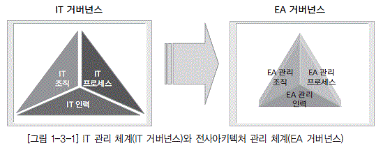
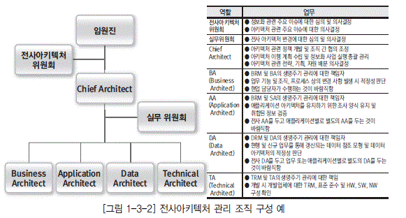

# 과목1. 전사아키텍처 이해
# 제3장 전사아키텍처 관리 및 활용
# 제1절 전사아키텍처 관리 체계
1-2-3-전사아키텍처-정보-구축.md

## 1. 전사아키텍처 관리 체계 개요

### 가. 전사아키텍처 관리 체계 개념

전사아키텍처를 도입함에 있어 아키텍처 정보를 정확하게 구축하는 것도 중요하지만, 더 중요한 것은 그러한 전사아키텍처 정보를 관리하고 활용할 수 있는 체계를 정립하는 것이다. 전사아키텍처 관리 체계는 전사아키텍처를 유지 관리하기 위한 조직과 프로세스 측면의 기반을 구축하는 것을 의미한다. IT 기획에서 서비스 제공에 이르는 모든 과정에서 전사아키텍처 정보를 활용하여 의사결정이 이루어짐으로서 일관성과 합리성이 증대되는 것을 목적으로 한다. 최근 이런 전사아키텍처 관리 체계의 중요성에 대한 인식이 높아지고 있다.

전사아키텍처 관리 체계는 전사아키텍처 관리 조직, 전사아키텍처 관리 프로세스, 전사아키텍처 관리 인력을 포함한다.

* IT 관리 체계와 전사아키텍처 관리 체계

IT 관리 체계는‘IT 거버넌스’라고도 한다. 이는 IT 관리의 효율성과 효과성을 증대하기 위한 IT전반에 관한 관리 체계를 정립하는 것을 말한다. 전사아키텍처 관리 체계는‘EA 거버넌스’라고도 하는데, 전사아키텍처를 유지하고 지속적으로 개선하기 위해 제도적 기반을 구축하는 것을 의미한다. 전사아키텍처 관리 체계는 IT 관리 체계의 틀 속에서 통합되어야 한다.

  * [그림 1-3-1] IT 관리 체계(IT 거버넌스)와 전사아키텍처 관리 체계(EA 거버넌스)

----
[Tip]
----

 **전사아키텍처 관리 체계와 EA 거버넌스 : :**
전사아키텍처 관리 체계를 최근에 EA 거버넌스라는 용어로 자주 사용한다. 이 책에서는 동일한 의미로 본다. 마찬가지로 IT 관리 체계와 IT 거버넌스도 같은 의미로 본다

----

### 나. 전사아키텍처 관리 체계 구축 방향

전사아키텍처 구축의 효과를 높이기 위해서는 전사아키텍처 간의 통합성과 전사아키텍처 내의 통합성이 확보되어야 한다. 전사아키텍처 간의 통합성이란 복수 기관 간에 통합적으로 전사아키텍처가 구축되는 것을 의미한다. 또 전사아키텍처 내의 통합성이란 단일 기업 내에서 전사아키텍처 영역 간에 통합적으로 전사아키텍처가 구축되는 것을 의미한다.

전사아키텍처 관리 체계 정착을 위해서는 장기적인 접근이 필요하며 단기 효과보다는 장기간의 효과를 중시해야 한다. 또한 전사아키텍처 수립의 효과는 IT 관련 조직만의 노력으로 달성될 수 없으며 전사적인 추진 체계가 되어야 한다. 현업 부서도 전사아키텍처를 이해하고 비즈니스 아키텍처에 대한 정보를 활용하고 IT 혁신에 대한 적극적인 의견 제시와 협조가 필요하다.

효과적인 전사아키텍처 관리관체계를 구축하기 위해서는 다음을 고려해야 한다.

* 정의된 전사아키텍처 조직 체계, 프로세스 체계 등을 문서화하여 전 조직이 준수할 수 있도록 제도화한다.

* 전사아키텍처 관련 제반 이해당사자의 전사아키텍처 인지도 향상 및 업무 수행시 전사아키텍처정보 활용도 증진을 위한 적절한 교육 프로그램을 제공한다.

* 목표 아키텍처로의 전환, 정보자원 관리의 혁신 등 전사아키텍처 도입에 따른 변화 관리를 위한 종합적인 프로그램을 운영한다.

* 전사아키텍처 관리 체계를 주기적으로 점검하여 개선점을 도출하여 반영할 수 있는 제도적 장치를 마련한다.

* 전사아키텍처 관리 시스템을 활용도와 만족도를 주기적으로 점검하여 시스템의 품질을 지속적으로 개선해 나간다.

## 2. 전사아키텍처 관리 조직 체계

### 가. 전사아키텍처 관리 조직 개요

전사아키텍처 관리 조직 체계는 전사아키텍처 관리를 위해 필요한 직무와 직무간의 관계, 업무 분장을 정립하는 것이다. 전사아키텍처 조직은 기업 전체 또는 정보관리 전체 조직과 일관성을 확보해야 한다. 전사아키텍처 관리 조직 체계는 계획자 수준에서 실무자 수준까지 다양한 시각에서 책임과역할이 정의되어야 한다.

전사아키텍처 관리 조직의 직무 예로는 다음을 들 수 있다.

  *  **전사아키텍처 담당 임원 :** 전사아키텍처 수립에 대한 투자 의사결정, 전사아키텍처의 주요 추진 과정에 대한 승인, 전사적 지원의 확보

  *  **전사아키텍처 아키텍트 :** 전사아키텍처에 대한 전체적 원칙 및 방향 정의, 전사아키텍처 관리의 총괄, 영역간의 조정

  *  **전사아키텍처 영역별 담당자 :** 비즈니스 아키텍처, 데이터아키텍처, 애플리케이션 아키텍처, 기술아키텍처 등의 전사아키텍처 영역별 원칙과 정보를 관리하는 담당자

  *  **전사아키텍처 관리시스템 관리자 :** 전사아키텍처 관리 시스템의 구축 및 운영을 담당

  *  **전사아키텍처 추진 위원회 :** 전사아키텍처 수립 및 적용에 대한 전사적인 중요 의사결정에 대한 승인 또는 자문을 수행하는 그룹

### 나. 전사아키텍처 관리 조직의 정의

구축된 전사아키텍처 정보를 담당하는 전담 조직이 없다면 전사아키텍처 정보는 하나의 문서에 불과하게 된다. 전사아키텍처 정보는 상호연관성을 유지하며 지속적으로 관리가 되어야 한다. 이를 위해서는 기업의 상황에 맞게 전사아키텍처를 담당하는 조직을 정의할 필요가 있다. 전사아키텍처 전담 조직은 선진 사례를 참고하고, 정보 관리 전체 조직과 전사아키텍처 관리 조직의 문제점을 파악 해 개선 방향을 도출하여 이를 기반으로 전사아키텍처 조직을 정의한다. [그림 1-3-2]는 전사아키텍 처 조직 구성의 예를 보여주고 있다.

[그림 1-3-2]에서 제시된 전사아키텍처 조직의 공통된 특징은 전사아키텍처 정보를 관리하기 위 한 위원회 및 전담 조직을 아키텍처 영역별로 정의하고 있다. 전사아키텍처와 관련된 이슈를 해당 팀 안에서만 아니라 공론화된 회의를 통해 관련 문제를 해결해 나갈 것을 정의하고 있다.

  * [그림 1-3-2] 전사아키텍처 관리 조직 구성 예

전사아키텍처 관리 조직 정의 시 다음과 같은 것을 고려한다.

* IT 조직의 규모
  * 전사아키텍처 관리 조직을 별도 조직으로 구성할 수 없는 중소 규모의 IT 조직은 전사아키텍처 관리 운영위원회(또는 TFT) 중심으로 전사아키텍처 관리 조직을 정의하고 전사아키텍처 전담 인력을 양성한다.
  * 전사아키텍처 관리 조직을 별도 조직으로 구성할 수 있는 대규모의 IT 조직은 전사아키텍처 관리 전담 조직을 신설하고, 전사아키텍처 관리 운영위원회를 통해 전사적으로 의사결정을 공유할 수 있는 조직 체계를 정의한다.

* 전사아키텍처 구축의 목적
  * 전사아키텍처 구축 목적이 순수하게 아키텍처 관리와 IT 표준화 등을 위한 것이면 전사 아키텍처와 IT 표준을 통합 관리할 수 있는 전사아키텍처 관리 조직을 정의한다.
  * 전사아키텍처 구축 목적이 신시스템 구축을 위한 계획 수립이면, 프로젝트 기간 중 전사아키텍처 정보를 관리할 수 있는 조직이 필요하다. 전사아키텍처 정보 중심으로 프로젝트를 관리할 수 있는 PMO(Project Management Office)와 전사아키텍처 관리 전담 조직을 정의한다.

* IT 조직과 현업과의 관계
  * 현업과 IT 조직간의 의사소통 문제가 있을 경우 현업의 요건을 종합적으로 관리하는 조직을 추가로 정의한다.

## 3. 전사아키텍처 관리 프로세스

전사아키텍처 관리 프로세스는 전사아키텍처를 관리하기 위한 활동을 정의하는 것이다. 전사아키 텍처 관리 프로세스는 전사아키텍처 관리와 관련된 모든 활동을 포함하고, 전체 정보관리 업무 체계 와 일관성이 확보되어야 한다. 전사아키텍처 관리 프로세스는 전사아키텍처 관리를 수행하는 세부 업무를 분류하고 내용을 정의하는 것은 물론 전사아키텍처 관리를 위해 준수해야 할 규정이나 구체 적이고 표준화된 수행 절차 또는 문서 양식을 정의하는 것을 포함한다.

예를 들면 전사아키텍처 관리 프로세스는 전사아키텍처 기획, 전사아키텍처 변경관리, 전사아키텍처 준수통제, 전사아키텍처 활용지원, 전사아키텍처 관리 시스템 관리, 전사아키텍처 평가 등으로 구분할 수 있다.

* 전사아키텍처 기획

전사아키텍처 관리의 방향과 전사아키텍처를 효과적으로 적용 및 활용하기 위한 계획을 수립하는 등의 전사아키텍처 추진의 기획 관련 제반 활동

* 전사아키텍처 변경 관리

영역별 전사아키텍처 정보의 변경에 대한 검토, 승인, 변경 이행 등 전사아키텍처 정보의 최신성과 품질을 확보하기 위한 제반 활동

* 전사아키텍처 준수 통제

각 정보관리 부문이나 관련 현업 부서에서 전사아키텍처 정보를 참조하고 준수하는지 점검하고 지원하는 등의 전사아키텍처 준수도 제고를 위한 제반 활동

* 전사아키텍처 활용 지원

각 정보관리 부문이나 관련 현업 부서에서 전사아키텍처 정보를 잘 활용하도록 전사아키텍처 정보의 공지, 홍보, 교육, 활용사례 전파 등 전사아키텍처 활용도를 제고하기 위한 제반 활동

* 전사아키텍처 관리 시스템 관리

전사아키텍처 관리 및 활용의 효율성 제고를 위한 정보관리 시스템을 구축하고 운영하는 제반 활동

  * [그림 1-3-3] 전사아키텍처 고나리 프로세스의 흐름 예

* 전사아키텍처 평가

전사아키텍처 관리 및 활용 수준의 제고를 위해 전사아키텍처 평가 모형을 정의하고 주기적으로 평가하여 개선의 기회를 식별하는 제반 활동

### 나. 전사아키텍처 관리 프로세스 구성

전사아키텍처 관리를 위한 프로세스는 일반적으로 전사아키텍처 구축 후 이를 활용하고 통제한다. 비즈니스 환경이나 기술환경의 변화와 전사아키텍처 활용 상태를 평가하여 필요한 변경조치를 취하며 이것이 다시 전사아키텍처 정보로 구축되어 전사적으로 적용되는 흐름을 갖는다.

전사아키텍처 관리 프로세스의 정의는 전사아키텍처 구축을 통해 모든 활동의 중심이 전사아키텍처 중심으로 수행될 수 있도록 하여야 한다. 만약에 기존의 IT 프로세스에 전사아키텍처 변경 및 관리 프로세스만을 신규로 추가하여 정의할 경우에는 기존의 IT 프로세스에 따라로세스가 제대로 수행되지 않을 가능성이 많다. 전사아키텍처 관련 프로세스가 제대로 수행하지 않을 경우에는 전사아키텍처 정보의 최신성이 유지될 수 없게 된다. 전사아키텍처 원칙이 IT 프로세스 활동에 적용되지 않아 전사아키텍처 정보의 완전성을 유지할 수 없는 문제가 발생할 수 있다.

따라서 IT 프로세스 수립-활용/통제-평가-변경 등의 흐름을 전사아키텍처 관점에서 식별하여 전 사아키텍처 정보 중심으로 설계하면 전사아키텍처 정보의 완전성을 유지할 수 있다. 전사아키텍처 정보의 변경을 개발 및 운영 프로세스에서 식별하여 전사아키텍처 정보 변경이 바로 이어질 수 있도 록 하여 전사아키텍처 정보의 최신성을 유지할 수 있어야 한다.

  * [그림 1-3-4] 생명주기 관점의 관리 프로세스 예

## 4. 전사아키텍처 관리 인력

### 가. 전사아키텍처 관리 인력 개요

전사아키텍처 관리 인력은 전사아키텍처 관리를 담당하는 직무별 역량을 정의하고 이를 확보하기 위한 방안을 정의하는 것이다. 전사아키텍처 관리를 위해 필요한 역량 요소를 분류하고, 역량 요소를 직무별로 할당하고, 이러한 역량 요소를 확보하기 위한 교육 계획을 수립하고 역량 수준을 평가할 수 있는 체계를 포함한다. 전사아키텍처가 제대로 정착되고 성과를 발휘하기 위해서는 관련 인원들의 역량 확보가 매우 중요하다. 전사아키텍처 역량 강화를 위한 교육 프로그램은 구성원의 특성에 맞게 직무별로 맞춤식 교육이 제공될 수 있도록 해야 한다.

전사아키텍처 역량 요소는 리더십 역량, 기술적 역량, 활용 역량으로 구분될 수 있다. 전사아키텍처 리더십 역량은 전사아키텍처의 사상과 가치가 기업에 어떤 의미가 있는지를 정확히 파악하고, 기업이 전사아키텍처를 효율적으로 도입하고 효과적으로 활용할 수 있도록 전사아키텍처에 대한 전사적 공감대를 형성하고 내재화를 위한 변화관리를 제대로 이끌 수 있는 관리 능력이다. 전사아키텍처 기술적 역량은 전사아키텍처의 구축 및 관리에 대한 절차와 방법론을 이해하고 있고, 전사아키텍처 정보를 정의할 수 있고, 전사아키텍처 관리 시스템을 구축할 수 있는 기술적 능력이다. 전사아키텍처 활용 역량은 전사아키텍처 정보를 활용하여 정보관리 업무와 현업의 업무활동의 효율성과 효과성을 증대할 수 있는 실용적 능력이다. 이러한 능력은 실질적으로 전사아키텍처 투자에 대한 성과와 직접적으로 연관되어 있다고 할 수 있다.

### 나. 전사아키텍처 전문가 육성

전사아키텍처 구축 완료 후 이를 관리하기 위한 조직 정의만으로 전사아키텍처 정보를 지속적으로 발전시킬 수 없다. 전사아키텍처 정보를 지속적으로 발전시킬 수 있는 아키텍처 영역별 아키텍트가 조직 내부에 있어야 한다.

전사아키텍처 구축 프로젝트가 완료된 이후에 프로젝트에 참여한 내부 인력 중심으로 관리 조직을 구성할 수도 있다. 하지만, 전사아키텍처 구축 프로젝트에 참여한 인력을 아키텍처 영역별 아키텍트로 발령만 내면 완료되는 것은 아니다. 이들이 진정한 각 영역별 아키텍트로 성장하기 위해서는 전사아키텍처 관리 직무에서 필요한 기술 수준을 정의해야 한다. 이와함께 부족한 기술이 있을 경우 교육을 통해 관련 기술을 쌓아 나갈 수 있도록 관리를 해야 한다.

  * [그림 1-3-5] 전사아키텍처 관리를 위한 직무 구성 예

현재 내부 아키텍트가 보유하고 있는 기술 수준을 평가하여 내부 아키텍트가 전사아키텍처 정보를 원활하게 관리할 수 있는 기술 수준으로 도달 할 수 있도록 인력 양성 계획을 수립해야 한다. 인력 양성 계획은 각 아키텍트에게 경력 개발 경로를 제시하고 교육 및 평가 과정을 통해 상위의 관련 직무로 성장 할 수 있도록 한다.

   
> 출처 : 데이터온에어 – 한국데이터산업진흥원([https://dataonair.or.kr](https://dataonair.or.kr))