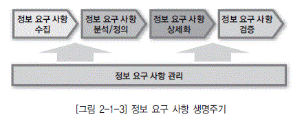

###### 과목2. 데이터 요건 분석
###### 제1장 정보 요구 사항 개요
###### 제1절 정보 요구 사항

## 1. 정의

정보 요구 사항이란 사용자가 일상적으로 수행하는 업무의 개선 사항이나 신규 개발 사항으로 시 스템을 통해 기능상의 목적을 달성하기 위해 요청하는 내용이다. 이러한 정보 요구 사항들은 현행 시 스템 분석, 사용자 요구 사항 수집, 제안 요청서, 사업 수행 계획서 등을 이용하여 수집 가능하다. 사용자의 정보 요구 사항을 정해진 일정과 비용 범위 내에서 사용자가 원하는 시스템으로 개발하기 까지는 많은 어려움이 존재한다.

현실적인 개발 환경에서 프로젝트의 성공을 위해서는 불완전하고 애매모호하게 정의된 정보 요구 사항, 현실성을 배제한 이상적인 정보 요구 사항, 특정 사용자만을 위한 정보 요구 사항들은 프로젝 트 초기 단계부터 정확한 요건 분석이 이루어져야 한다. 잘못 분석되고 설계된 정보로 시스템을 개발 한다면 사용자 요구 사항을 만족하지 못하는 시스템이 되고, 이는 사용자가 사용하지 않기 때문에 처 음부터 다시 설계하고 개발해야 하는 위험과 추가적인 비용을 지불하게 된다.

Standish Group 조사 결과에 의하면 사용자 정보 요구 사항에 대한 중요성을 확인할 수 있다. 일 반적으로 성공했다고 이야기하는 프로젝트와 실패했다고 이야기하는 프로젝트 모두 사용자 정보 요 구 사항에 대한 철저한 분석 및 변화 관리가 주요한 요인으로 작용했다. 전체 프로젝트의 29%만이 계획된 예산 내에서 납기를 준수하고, 원하는 기능과 요구 사항을 달성했다. 프로젝트의 18%는 프로 젝트 완료 전에 또는 사용자들이 사용해 보기도 전에 취소되는 경우이고, 53%의 프로젝트는 표면상 으로는 성공하였으나 내면적인 부분을 살펴보면 납기가 지연되거나 예산이 늘어나거나 기능 및 품질 에 문제가 있어 실질적인 성공으로 보기 어렵다.

  * [그림 2-1-1] 프로젝트 결과 예(2004 Standish Group Report)

[그림 2-1-1]의 3가지 사례를 초래한 각 프로젝트의 원인을 다시 한 번 살펴보면 공통적으로 사용 자의 정보 요구 사항에 대한 중요도를 알 수 있다. 따라서 현업 사용자들이 이야기하는 정보 요구 사 항을 IT 업무 담당자들은 처음부터 철저하게 이해하고, 무슨 내용이며 어떤 기능들을 요구하는지 정 확하게 분석하기 위해 많은 시간과 노력을 집중해야 한다.

  * [그림 2-1-2] 사용자 요구 사항의 중요성(2004 Standish Group Report)

더욱 구체화되고 다양화되는 사용자 정보 요구 사항과 복잡해진 정보시스템의 현행을 정확하게 분 석하고 이해할 수 있는 능력이 데이터아키텍처 전문가에게 필요하다.

## 2. 정보 요구 사항 생명주기 모형(Life Cycle)

정보 요구 사항의 생명주기 모형은 [그림 2-1-3]과 같이 정보 요구 사항 수집, 정보 요구 사항 분 석 및 정의, 정보 요구 사항 상세화, 정보 요구 사항 검증으로 구성된다. 생명주기 모형을 반복적으 로 수행하여 사용자 정보 요구 사항이 정보시스템에 누락 없이 반영되어야 한다.

  * [그림 2-1-3] 정보 요구 사항 생명주기

### 가. 정보 요구 사항 수집

사용자의 정보 요구 사항을 수집하는 단계로서 사용자 인터뷰, 설문서, 워크숍, 현행 시스템 분석 등을 통해 수집한다.

### 나. 정보 요구 사항 분석 및 정의

사용자로부터 수집된 정보 요구 사항을 정리하고 방법론에서 제시하는 다양한 기법을 이용하여 분석해서 정보 요구 사항을 정의하는 단계이다.

### 다. 정보 요구 사항 상세화

확정된 정보 요구 사항의 개별 사항에 대하여 세밀하게 분석하고 기록하는 단계이다.향후 사용자 의 정보 요구 사항이 정보시스템에 정확하게 반영될 수 있도록 상세하게 작성한다.

### 라. 정보 요구 사항 검증

사용자의 정보 요구 사항을 비즈니스 관점, 조직 관점, 애플리케이션 관점과 상관분석을 통해 누락 없이 반영되었는지를 검증하는 단계이다.

## 3. 정보 요구 사항 유형

사용자의 정보 요구 사항을 유형별로 4가지로 나누어 보면 기능 개선 요건, 성능 개선 요건, 외부 인 터페이스 요건, 보안 개선 요건 등으로 구분할 수 있으며, 신규 업무에 대한 추가 및 기존 업무에 대한 개선 사항이 대부분의 요구 사항으로 도출되는 점을 감안할 때 기능 개선 및 성능 개선 요건이 많은 비 중을 차지한다. 각각의 종류별 정의, 관리 기준, 관리 방법 측면에서 정리해 보면 [표 3-1-1] 과 같다.

[표 2-1-1] 정보 요구 사항 유형

| 유형 | 구분 | | 설명 |
|----|----|----|----|
|외부 인터페이스 요건 | 정의||시스템의 모든 입·출에 관한 요건으로서 대외기관으로부터 수신 및 대외기관으로 송신하는 입출력 방식이 추가 및 변경되었을 경우와 각종 제도 및 기준 등이 변경되었을 경우에 발생하는 요건이다. |
||관리 기준 | 중복성 | 기존에 동일한 형태의 인터페이스가 존재하는지 체크한다. |
||| 표준 준수도 | 인터페이스와 관련된 국제 표준 및 국가 표준이 존재할 경우, 그에 적합한 형태로 제공해야 한다. |
|| 관리 방법||항목 이름, 목적 설명, 입력의 원천 및 출력의 방향, 유효 범위, 시간, 다른 입/출력과의 관계, 데이터 포맷, 최종 메시지 등이 포함되어 관리되어야 한다. |
|기능 개선 요건 | 정의||시스템에서 입력을 받아들여 처리하고 출력을 만들어 내는 주요 활동 및 프로세스에 대한 요건이다. |
||관리 기준 | 불가 변성 | 기능 개선 요건이 향후에 재변경되지 않도록 근본적인 개선 방안을 요청해야 한다. |
||| 범용성 | 많은 사용자가 편리하게 사용할 수 있는 요건을 우선적으로 요청해야 한다. |
|| 관리 방법||입력에 대한 유효 체크, 정확한 처리 순서, 비정상 상태에 대한 반응(오버플로우, 통신 장비, 에러 처리), 매개변수의 기능, 출력과 입력의 관계, 입출력 순서, 입력을 출력으로 변환하는 공식 등이 포함되어 관리되어야 한다. |
|성능 개선 요건 | 정의||사용자가 원하는 성능 개선 사항으로는 동시 사용자 수, 처리하는 정보의 양과 종류, 트랜잭션 소요 시한 등이 있다. |
||관리 기준 | 실현 가능성 | 해당 성능 개선 요구 사항이 현행 기술 수준과 서비스 특성을 고려할 때 구현 가능한 요건인지를 확인한 후 제시되어야 한다. |
||| 측정 가능성 | 측정이 불가능한 모호한 형태로 요건이 제시되면 안 된다. |
|| 관리 방법||각 기관의 서비스 특성을 고려하여 정적, 동적 기준을 마련하고 해당 기준에 맞게 서비스되고 있는지를 모니터링 작업을 통해 항시 관리해야 한다. |
|보안 개선 요건 | 정의||중요 데이터에 대한 훼손, 변조, 도난, 유출에 대한 물리적 접근 통제(제한구역, 통제구역 등) 및 사용 통제(인증, 암호화, 방화벽 등)에 대한 요건을 말한다. |
||관리 기준 | 불가 변성 | 보안 개선 요건이 향후에 재변경되지 않도록 근본적인 개선 방안을 요청해야 한다. |
||| 실현 가능성 | 해당 보안 개선 요구 사항이 현행 기술 수준과 서비스 특성을 고려할 때 구현 가능한 요건인지를 확인한 후 제시되어야 한다. |
|| 관리 방법||가장 먼저 보안 관리가 필요한 정보에 대한 등급 관리가 필요하며, 해당 등급별로 접근 가능한 이용자 등급 관리가 필요하며 접근 방식에 있어서의 접근 통제 기준 및 사용 통제 기준이 제시되어야 한다. 해당 기준에 따라 모니터 작업을 통해 안정적인 서비스가 제공될 수 있도록 관리해야 한다. |

   
> 출처 : 데이터온에어 – 한국데이터산업진흥원([https://dataonair.or.kr](https://dataonair.or.kr))