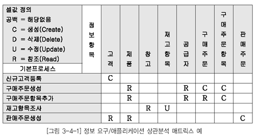
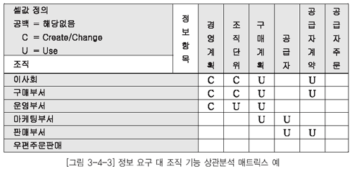

# 과목2. 데이터 요건 분석
# 제4장 정보 요구 검증
# 제1절 정보 요구 상관분석 기법

도출된 정보 요구 사항을 다른 영역(기능, 프로세스, 조직 등)과 비교 분석함으로써 정보 요구 사항의 도출이 완전하게 효과적으로 이루어졌는지를 파악할 수 있다. 이를 기반으로 향후 안정적이고 확장 가 능한 데이터 모델 설계가 가능하다. 이러한 상관분석은 매트릭스 분석 기법을 활용하며, 이 절에서는 정보 요구 사항과 애플리케이션의 기본 프로세스, 비즈니스의 업무 기능, 조직과의 매트릭스 분석 기법 을 소개한다.

정보 요구 사항의 충족도를 파악하기 위한 상관분석 수행의 주체는 다음과 같으며, 아래의 장·단점 을 고려하여 충분한 시간을 가지고 검토한다. 정보 요구 분석가나 품질보증 팀에 의해 상관분석을 진행 한 후, 단계 종료 시점에 외부 인력에 의한 요구 사항의 감리를 통하여 객관성 및 완전성을 증대시킨다.

## 1. 주체별 분류

### 가. 요구 사항 분석가 수행

정보 요구 사항을 수집하고 분석한 주 담당자를 기준으로 검토 기준 항목을 마련하고 상관분석을 수행하는 방법을 말한다.

* 정보 요구 사항을 도출한 분석가에 의해 수행되므로 자체 분석에 의한 객관성 저하의 문제점이 발생할 수 있다.

* 정보 요구 사항의 도출 절차 및 관련 업무팀과의 의사소통이 원활하므로 상관분석에 추가 인력의 투입 없이 원활하게 진행할 수 있다.

* 요구 사항 분석가의 업무에 대한 이해도가 높으므로 상관분석을 통한 정확한 업무의 분석 가능성이 높다.

### 나. 품질보증팀 수행

프로젝트팀 내의 통합 검토팀이나 품질보증팀의 협조를 얻어 도출된 정보 요구 사항의 상관분석을 수행한다.

* 요구 사항 분석가보다는 업무에 대한 이해도가 낮으나 상관분석 작업의 수행을 통한 업무 이해도를 높일 수 있으며 전체적인 인터페이스의 검증에 용이하다.

* 낮은 업무의 이해도로 인해 일부 사안에 대한 정확한 분석을 통해 단점을 지적하여 수정하기 어렵다.

### 다. 외부 감리 수행

외부 감리 인력을 이용한 정보 요구 사항 상관분석을 수행한다.

* 업무 파악의 한계가 있으나 제 3자의 시각으로 검토할 수 있다.

* 프로젝트 내부 인력이 효과적으로 지원하지 않을 경우 상황에 맞지 않는 분석 결과를 초래할 수 있다.

* 상관분석의 객관성을 극대화 할 수 있다.

## 2. 정보 요구/애플리케이션 상관분석

정보 요구 사항을 바탕으로 도출된 정보 항목을 애플리케이션 아키텍처에서 정의된 프로세스 모델과 비교하여 상호 간의 일관성을 확보하고 품질 수준을 향상시키는 동시에 누락 혹은 중복된 정보 요구 사항을 점검한다. 이는 다음과 같은 절차를 통해 매트릭스 분석을 진행한다.

* 정보 요구/애플리케이션 상관분석을 위해 정보 요구 사항을 바탕으로 도출된 정보 항목들과 애플리케이션 영역에서 도출한 기본 프로세스를 사용하여 매트릭스를 작성한다.

* 매트릭스 분석은 기본 프로세스와 정보 요구 사항을 기반으로 기본 프로세스의 액션 (C: 생성, R: 조회, U: 수정, D: 삭제)을 빠짐없이 정의한다. 그리고 기본 프로세스/정보 요구 사항 매트릭스를 작성하여 모든 정보 요구 사항들이 기본 프로세스에 의해 충분히 사용되고 있는지 또는 모든 기본 프로세스를 수행하는데 필요한 정보 요구 사항이 도출되어 있는지를 조사함으로써 정보 요구 사항과 기본 프로세스 도출의 완성도 및 일관성을 검증한다.

  * [그림 3-4-1] 정보 요구/ 애플리케이션 상관분석 매트릭스 예

* 매트릭스의 각 셀에는 기본 프로세스가 사용하는 정보 항목에 대한 액션이 생성(C), 조회(R), 수정(U), 삭제(D)로 표현되는데, 복수의 액션이 발생할 경우에는 C &gt; D &gt; U &gt; R의 우선순위에 따라 하나만을 기록한다. 그러나 분석기법의 활용시 CRUD가 복수로 발생할 경우 모두 기록할 수 있으며, 이는 분석기법을 활용하는 분석가의 매트릭스 활용 목적에 따라 선택 가능하다.

* 모든 정보 항목이 모든 기본 프로세스에서 사용되었는지 혹은 모든 정보 항목을 사용하고 있는지를 확인한다.

* 정보 요구/애플리케이션 상관분석 매트릭스는 두 가지 객체 중에서 한가지가 누락되거나 잘못 정의된 경우에는 분석이 가능하지만 정보 항목과 기본 프로세스가 모두 누락된 경우에는 분석이 불가능하다. 따라서 매트릭스가 작성되기 전에 이러한 경우가 있는지를 사전에 확인해야 하며, 매트릭스를 분석하는 경우에도 이러한 사례가 있는지를 파악해야 한다.

## 3. 정보 요구/업무 기능 상관분석

정보 요구 사항을 바탕으로 도출된 정보 항목을 비즈니스 아키텍처에서 도출된 업무 기능과 비교하여 상호 간의 일관성을 확보하고 품질수준을 향상시키는 동시에 누락 및 중복된 정보 요구 사항을 점검할 수 있다. 비즈니스에서 요구하는 정보 항목은 데이터 모델링의 근간이 되므로 업무 기능별 필요 정보 항목의 누락 여부의 확인은 매우 중요하다.

* 가치 사슬 분석 등의 기법을 통해 도출된 최하위 수준의 전사 업무 기능을 도출하고 이렇게 도출된 업무 기능을 매트릭스의 열에 배치한다.
* 정보 요구 사항에 따라 도출된 정보 항목을 매트릭스의 행에 배치한다.
* 업무 기능과 정보 항목 간의 상호작용을 다음과 같이 정의한다.
* 정보 항목의 생성, 수정, 삭제를‘C’로 표시한다.(Create 또는 Change)
* 값의 변경 없이 정보 항목을 검색만 하는 경우에는‘U’로 표시한다.(Use)
* 아무 관련이 없는 것은 빈칸으로 남겨둔다.

  * [그림 3-4-2] 정보 요구 대 업무 기능 매트릭스 예

## 4. 정보 요구/조직 기능 상관분석

정보 요구 사항을 바탕으로 도출된 정보 항목을 비즈니스 아키텍처에서 도출된 조직 단위와의 매트릭스 분석을 통해 정보 항목의 생성 주체 및 활용 부서의 매핑이 가능하다. 이를 기반으로 향후 정보 항목에 대한 오너십(Ownership)을 할당하여 관리함으로써 데이터를 효율적으로 관리할 수 있다.

* 조직 단위명은 기업의 조직도에 나타난 순서로 입력한다. 만일 기업이 둘 이상의 소재지에서 운영 된다면 조직 단위를 분할하고 소재지 타입에 따라 클러스터링한다. 매트릭스에 소재지 타입(예 : 본사, 영업소, 공장)에 의해 그룹핑된 조직 단위명을 입력한다.
* 정보 요구 사항에 따라 도출된 정보 항목을 매트릭스의 행에 배치한다.
* 조직과 정보 항목 간의 상호작용을 다음과 같이 정의한다.
  *  정보 항목의 생성, 수정, 삭제를‘C’로 표시한다. (Create 또는 Change)
  *  값의 변경 없이 정보 항목검색만 하는 경우에는‘U’로 표시한다.(Use)
  *  아무 관련이 없는 것은 빈칸으로 남겨둔다.

  * [그림 3-4-3] 정보 요구 대 조직 기능 상관분석 매트릭스 예

   
> 출처 : 데이터온에어 – 한국데이터산업진흥원([https://dataonair.or.kr](https://dataonair.or.kr))