###### 과목3. 데이터 표준화
###### 제2장 데이터 표준 수립
###### 제1절 데이터 표준화 원칙 정의

## 1. 전사아키텍처 개념

### 가. 전사아키텍처 도입 배경

기업의 가치창출 활동에서 다양한 환경 변화에 대해 민첩하게 대응할 수 있도록 하는 능력이 정보 기술의 역할로 중요시 되고 있다. 기업의 비즈니스 복잡도는 더욱 증대되고 있고, 업무와 IT 기능의 분리는 더 이상 무의미하게 되었다. 또한 기업이 환경 변화에대응하기 위해 시스템을 변화시키고자 할 때, 시스템이 너무 복잡하여 어디를 어떻게 변경해야 할 지 모르는 상황에 이르렀다. 따라서 건축물의 설계도처럼 기업의 전체 시스템을 쉽게 파악할 수 있는 뭔가가 필요하게 되었다. 전사아키텍처는기업의 이런복잡한 시스템을 파악하기 쉽게 정리하는 것으로, 복잡한 기업 시스템을 필요한 형태로 변화시키는 것을 좀더 쉽게 하기 위해 도입되었다.

### 나. 전사아키텍처 정의

전사아키텍처는 기업의 목표와 요구를 잘 지원하기 위해 IT 인프라의 각 부분들이 어떻게 구성되고 작동되어야 하는가를 체계적으로 기술하는 것이다. 전사아키텍처는 복잡한 기업의 모습을 다양한 측면(비즈니스, 데이터, 애플리케이션, 기술 등)에서분석하고 표현하여 이해하기 쉽도록 정보체계를 구축하고 이를 활용하는 것이다. 전사아키텍처 도입의 목적은 IT 투자 대비 효과를 최대화하고, 기업의 목적을 가장 잘 달성할 수 있는 방식으로 IT 인프라를 구성하는 것이다. 기업은 전사아키텍처 도입을 통하여 비즈니스와 IT를 보다 유기적으로 연결시킬 수 있다. 또한 비즈니스 환경 변화에 대해 신속하게 대응을 할 수 있으며, IT 자체의 효율성도 증대시킬 수 있게 한다.

전사아키텍처 개념에 대한 선진 정의를 살펴보면 다음과 같다.

* 미국 예산관리국(OMB, Office of Management and Budget)의 전사아키텍처 정의

“전사아키텍처는 조직 및 업무 활동과 정보기술 간의 관계를 현재 모습과 향후 추구할 모습을 별 도로 정의한 청사진” - OMB 회람 A-130

이 정의에서는 정보화의 목표인 IT와 업무 간의 연계, 현재 모습과 미래 모습을 포함하고 있다. 또한 전사 아키텍처란 업무 프로세스(Business Processes), 정보 흐름 및 관계(Information Flow and Relationships), 애플리케이션(Applications), 데이터 명세 및 관계(Data Descriptions and Relationships), 그리고 기술 하부 구조(Technology Infrastructure)로 구성된다고 정의하였으며, 이후 실무적 차원에서 구성 요소에 대한 내용이 정리되어 네 가지 영역, 즉 비즈니스 아키텍처 (위의 업무 프로세스와 정보 흐름 및 관계가 여기에 해당됨), 애플리케이션 아키텍처, 데이터 아키텍처(위의 데이터 명세 및 관계가 여기에 해당됨), 기술 아키텍처로 구분한다.

* 미국 전자정부법의 전사아키텍처 정의

“전사아키텍처는 조직의 임무가 정의한 전략적 정보 자산, 그 임무 수행에 필요한 정보, 그 임무 수행에 필요한 기술, 변화하는 요구에 대응하기 위해 신기술의 구현을 위한 전환 과정으로 구성된 다. 전사아키텍처 각 구성 요소는 현행 아키텍처, 목표 아키텍처, 전환을 위한 계획을 포함한다” - 미 전자정부법

이 법에서는 전사아키텍처를 업무와 IT 간 관계에 포함될 내용으로 조직의 임무, 임무에 필요한 정보와 정보기술, 전환 계획을 명시하고 있으며, 현행과 목표 아키텍처를 동시에 포함하고 있다.

* 대한민국 EA/ITA법의 EA 정의

“일정한 기준과 절차에 따라 업무, 응용, 데이터, 기술, 보안 등 조직 전체의 정보화 구성 요소들을 통합적으로 분석한 뒤 이들 간의 관계를 구조적으로 정리한 체계 및 이를 바탕으로 정보시스템을 효율적으로 구성하기 위한 방법” - 정보시스템의 효율적 도입 및 운영에 관한 법률(2005년 12월 30일 공표)

이 법에서는 지식정보화 사회로의 발전에 따라 다양한 정보시스템이 도입, 운영되고 있으나 이를 체계적으로 관리할 수 있는 체제가 마련되지 못하여 중복 투자 및 시스템 간 연계 미흡 등 문제점 이 나타나고 있음을 지적하고 있다. 따라서 정보시스템을 효율적으로 구성하기 위한 체제 및 방법 인 전사아키텍처의 활용을 촉진하고, 공공 기관 등에 정보시스템을 효율적으로 도입, 운영할 수 있는 기반을 마련하기 위해 전사아키텍처를 정의하도록 하고 있다.

전사아키텍처는 다양한 정보기술의 혁신 활동과 관리 통제를 포함하며, 시스템의 도입과 구축뿐만 아니라 운영과 평가까지 통합적으로 관리하는 것을 의미한다. 기업은 전사아키텍처를 통해 IT 자산을 평가하고 전사 관점에서 재설계하고 좀 더 합리적인 구조로 재배치하며, IT의 효율성과 투자 효과를 측정하는 기준으로 활용할 수 있다.

전사아키텍처의 개념을 정확히 이해하기 위해서는 전사(Enterprise)의 개념과 아키텍처 (Architecture)의 개념을 명확히 이해할 필요가 있다.

### 다. 전사개념

전사(Enterprise)란 일반적으로 기업 또는 기관을 지칭한다. 정확하게 정의하면“공동의 목표를 추구하기 위해 고객과 상품 또는 서비스가 존재하고 이를 지원하기 위한 조직, 자원, 기술을 보유하며 필요한 업무 프로세스를 수행하는 조직의 집합체”라고 할 수 있다. 전사는 비즈니스의 변화 동인을 확인하고 전략을 정의할 수 있는 조직 단위이며, 비즈니스 활동 정보를 공유하는 조직 단위라고 할 수 있다.

  * [그림 1-1-1] 전사개념

전사의 유형은 다양하다. 전사가 하나의 기업이나 기관과 정확히 일치하지 않을 수 있다. 기업의 규모가 큰 경우 하나의 기업이 여러 개의 전사로 구성될 수 있다. 그 경우 각각의 전사는 독립적인 운영 주체로 구성된다. 또한 전사는 구분 가능한 다수의 사업 영역으로 구성된다.

전사아키텍처의 수립을 위해서는 전사의 범위를 초기에 명확히 정의해야 하며, 이를 이해당사자들이 충분이 공감할 수 있어야 한다. 전사의 정의는 전사아키텍처 수립 과정에서 중요한 판단 기준이 된다. 전사아키텍처를 수립하는 모든 활동은 정의된 전사의 성과와 목표에 초점을 두고 아키텍처를 도출해야 한다.

### 라. 아키텍처 개념

아키텍처는 고대 그리스어에서 건축 혹은 석공명인(Master)을 의미하는‘Architecton’이라는 용어로부터 유래되었다. 당시의 아키텍처는 건축물의 골격을 제공하는 설계도 역할을 했다. 좋은 아키텍처는 훌륭한 건축물을 탄생시켰고, 이들은 아직까지 인류의 훌륭한 유산으로 남겨지고 있다. 고대의 아키텍처 개념이 화강암과 대리석으로 건축물을 짓는데 적용되었다면, 산업시대에는 건축뿐만 아니라 첨단 과학기술을 이용하여 항공기, 자동차, 선박 등을 개발하는데 적용되어 왔다. 또한 오늘날 디지털 정보화 시대에는 첨단 정보기술을 이용하여 정보체계, 소프트웨어 내장형 체계, 지휘통제 통신체계 등을 구축하는데 적용되고 있다.

IEEE Std. 1971에서는 아키텍처를“ 구성요소의 구조, 구성요소들 사이의 관계, 구성요소의 설계 그리고 시간경과에 따른 구성요소의 발전을 위한 원리와 지침”으로 정의하고 있다.

아키텍처는 대상에 대한 구조뿐만 아니라, 대상 구조의 유지 관리를 위한 원칙과 지침, 그리고 향후 목표 아키텍처로 가기 위한 계획을 포함하고 있다.

  * [그림 1-1-2] 아키텍처 구성요소

* 규칙 (Rule) 관점

기업 또는 기관에서 아키텍처의 일관성이 흔들리는 이유는 기술적 문제 이전에 관리적 문제일 수 있다. 의사결정 단계에 상호운용이나 일관성의 유지를 위하여 준수하여야 하는 원칙을 수립하고 적용함으로써 아키텍처의 연속적인 모습이 관리될 수 있다.

* 모델 (Model) 관점

아키텍처는 구체적인 모델이나 기법에 의하여 분석된 후 그 결과가 정의된 표기법에 의하여 표현된다. 아키텍처의 모델은 각 아키텍처 도메인에 대한 분석 결과가 아키텍처와 관련이 있는 담당자 간에 공유되어야 하는 매우 중요한 정보이다. 모델은 전사아키텍처를 수립할 때뿐만 아니라 향후의 변경을 고려한 절차나 기법을 표준화하는 것이 중요하다.

* 계획(Plan) 관점

아키텍처는 현재 그대로의 아키텍처와 궁극적으로 지향해야 하는 목표 아키텍처를 정의하는데, 현재 상태에서 목표 상태로 되기 위한 적절한 이행 전략과 구축 계획이 필요하다. 계획이란 이런 전사아키텍처의 이행 전략과 이행 계획을 의미한다.

아키텍처란 구축하고자하는 목적에 따라 복잡한 대상을 단순하게 표현하고, 구성요소의 변화에 대한 요구를 수용할 수 있게 한 청사진(Blueprint)이라고 할 수 있다.

전사와 아키텍처의 개념을 기반으로 전사아키텍처를 다시 정의하면, 전사아키텍처란 전사에 대한 아키텍처를 정의 관리하여 전사의 비즈니스 목표를 위해 아키텍처 정보를 활용하여 IT 인프라를 최 적으로 구성하는 것이라고 할 수 있다.

## 2. 전사아키텍처 추진 현황

전사아키텍처는 최근 세계적으로 정부기관과 민간기업의 IT 혁신을 위한 주된 관심사로서, 다양한 산업에 걸쳐 전사아키텍처 프로젝트가 추진되고 있다. 특히 정부기관의 경우 전 세계적으로 전자정부 구현 사업이 활발히 추진되고 있다. 국내 정부기관도 전사아키텍처 추진 사업을 범정부 차원의 전 자정부 구현 과제 중의 하나로서 활발히 추진하고 있다. 2005년 12월 공공 부문에 전사아키텍처 도입을 의무화하는“정보시스템의 효율적 도입 및 운영 등에 관한 법률”이 제정된 것을 기반으로, 공공 부문의 정보 자원을 최적으로 관리하고 정보화 투자 효과를 제고하기 위하여 2007년부터 단계적으로 전사아키텍처가 추진되고 있다.

----
[Tip] 
----

**전사아키텍처 (EA)와 정보기술아키텍처(ITA) :**
 
ITA 는 정보기술아키텍처를 의미한다. 1996년 미국 정보기술관리혁신법에서 ITA(Information Technology Architecture)라는 용어를 사용했으나, 2000년 OBM A-130 회람에서 아키텍처 관련 이러한 개념을 전사아키텍처(Enterprise Architecture)라 명명하였다.

전사아키텍처는 광의의 아키텍처 개념으로, 정보기술아키텍처는 정보기술 중심의 아키텍처 개념으로 볼 수 있다. 국내의 경우 정보기술아키텍처라는 용어를 먼저 사용하였으나 현재는 전사아키텍처로 통합해 사용하고 있다. 이 책에서는 전사 아키텍처와 정보기술아키텍처를 특별히 구분하지 않고 유사한 의미로 사용하기로 한다.

----

EA/ITA법의 주요 내용을 살펴보면 전사아키텍처 의무 도입 기관은 범정부의 아키텍처 목표를 지원하고 각 기관의 목표에 맞는 도입 계획을 수립해 제출하여야 하며, 아키텍처 추진 조직을 구성하고 추진 인력의 아키텍처 역량 강화를 위해 교육 등을 중점 추진하며, 전사아키텍처 도입 계획에 따라 아키텍처를 도입, 운영하고 지속적으로 유지, 발전시켜야 한다. 또한 범정부 차원의 전사아키텍처 관련 정보의 공동 활용 등을 위해 전사아키텍처 관련 정보를 제공할 수 있어야 한다. 또한 아키텍처 성숙도 모델을 활용하여 전사아키텍처 도입, 운영 실태 및 추진 성과를 분석하며, 정보화 사업 추진 시 정보시스템 구축 운영 기술 지침 및 상호 운용성 확보 등을 위한 기술 평가를 수행해야 한다.

  * [그림 1-1-3] 범정부 아키텍처 추진 방향

행정안전부와 한국정보화진흥원은 공공 기관 전사아키텍처 추진의 주관 부처로서 범정부 전사아키 텍처 구현을 위한 단계별 계획에 따라 전사아키텍처의 도입 및 운영을 추진하고 있으며, 범정부 차원에 서 전사아키텍처 구성의 일관성을 확보하고 공공 기관 아키텍처 정보의 종합적인 분석 및 활용을 위하 여 공통의 기준을 적용할 수 있도록 참조 모델, 산출물 메타 모델, 지침 등을 개발하고 보급하고 있다.

[표 1-1-1] 전사아키텍처 관련 범정부 기준

| 구분 | 설명 |
|----|----|
| 범정부 전사아키텍처 참조 모델 |◼ 아키텍처 구성 요소(업무 기능 분류), SRM(서비스 컴포넌트 참조 모델), DRM(데이터 참조 모델), TRM(기술 참조 모델), PRM(성과 참조 모델) ◼  각 기관은 범정부 참조 모델을 그대로 활용하거나 각 기관의 자체 참조 모델을 수립 할 때는 범정부 참조 모델에 매핑하여야 함 |
| 범정부 전사아키텍처 산출물 메타 모델 |◼ 아키텍처를 구성하는 데 필요한 정보들과 그들 간의 관계를 정의한 모델(산출물 종류 와 구성을 정의) ◼ 전사아키텍처 필수 산출물과 보조 산출물로 구성되며, 각 기관은 필수 산출물과 필수 요소는 반드시 정의해야 함 |
| 범정부 전사아키텍처 성숙도 모델 |◼ 아키텍처 수준 및 향후 발전 방향을 수립할 수 있도록 1~5단계의 아키텍처 수준과 측 정 항목을 정의한 모델 ◼ 매년 전사아키텍처 추진 실태와 함께 성숙도를 측정해야 함 |
| 범정부 전사아키텍처 지원시스템 (GITAMS) |◼ 아키텍처 관련 표준과 기준 등을 제공하고, 각 기관의 아키텍처 정보를 공유, 활용할 수 있도록 지원하는 시스템 ◼ 각 기관은 필수 산출물에 해당하는 정보를 매년 GITAMS에 등록해야 함 |

## 3. 전사아키텍처 관련 데이터아키텍처 전문가 역할

데이터아키텍처 전문가가 기업이 필요로 하는 고품질의 데이터 모델 또는 데이터아키텍처를 정의 하기 위해서는 이러한 전사아키텍처의 개념을 충분히 이해하고 있어야 한다.

일반적으로 전사아키텍처 수립 프로젝트에서 데이터아키텍처 전문가는 아키텍처 도메인 중 데이터 아키텍처 영역을 직접 수행하거나 간접적으로 관여하게 된다. 훌륭한 데이터아키텍처 전문가가 되고자 한다면 전사아키텍처에 대해 정확히 이해하고, 소속 기업의 전사아키텍처 추진 내역에 대하여 관심을 가지고 구축된 전사아키텍처 정보를 적극 활용해야 할 것이다. 만약 소속 기업에서 전사아키텍처를 구축하지 않았다면 데이터아키텍처 영역만이라도 전사아키텍처 개념으로 데이터아키텍처 전문가 업무에 접근하는 것도 가능하다.

## 1. 전사아키텍처 프레임워크 개념

기업이 전사아키텍처를 정의하여 관리하기 위해서는 우선 전사아키텍처를 어떻게 표현하고 운영 할 것인가에 대한 전체적인 사고의 틀을 결정해야 한다. 전사아키텍처 프레임워크는 전사아키텍처 활동에서 얻어지는 산출물을 분류하고 조직화하고 이를 유지 관리하기 위한 전체적인 틀을 정의하는 것이다.

전사아키텍처 수립을 위해서는 먼저 이러한 전사아키텍처 프레임워크를 정의해야 하는데, 이미 여러 선진 모델이 나와 있고 정부에서도 가이드를 제시하고 있어, 기관이나 기업은 이를 참조할 수 있다. 하지만, 무조건적인 적용보다는 기업의 특성에 따라 적합한 형태로 정의할 필요가 있다.

## 2. 전사아키텍처 프레임워크 구성

전사아키텍처 프레임워크는 여러 참조 모델이 있다. 우선 전사아키텍처 프레임워크를 좀더 명확히 이해하기 위해서 국내에서 비교적 일반적으로 적용되고 있는 전사아키텍처 프레임워크의 한 사례를 기준으로 전사아키텍처 프레임워크의 구성을 살펴본다.

그림[1-1-4]에서 보면, 전사아키텍처 프레임워크는 전사아키텍처 정책, 전사아키텍처 정보, 전사아키텍처 관리 등의 3가지 영역으로 구분된다. 전사아키텍처 정책은 기업이 전사아키텍처 수립을 어떻게 할 것인가의 방향을 정의한 것으로 아키텍처 매트릭스, 전사아키텍처 비전, 전사아키텍처 원칙 등으로 구성된다. 전사아키텍처 정보는 기업이 구축하는 전사아키텍처 정보의 구체적인 모습으로 현행 아키텍처, 목표 아키텍처, 이행 계획으로 구성된다. 전사아키텍처 관리는 구축된 전사아키텍처를 어떻게 관리하고 활용할 것인가를 정의한 것으로 전사아키텍처 관리 체계, 전사아키텍처 관리 시스템, 전사아키텍처 평가 모형 등으로 구성된다.

  * [그림 1-1-4] 전사아키텍처 프레임 워크 구성 예

### 가. 전사아키텍처 정책

기업이 전사아키텍처를 구축하기 위해서는 먼저 기업의 전사아키텍처 구축 목적과 방향을 정의해 야 한다. 전사아키텍처 정책은 전사아키텍처의 정보를 어떻게 구성할 것이고, 전사아키텍처 수립을 통하여 기업이 달성하고자 하는 궁극적인 모습은 무엇이며, 전사아키텍처를 효과적으로 관리하고 활 용하기 위한 원칙은 어떤 것인지 등을 정의하는 것이다.

  * 아키텍처 매트릭스

아키텍처 매트릭스는 전사아키텍처의 정보를 체계적으로 분류한 틀로서, 기업이 관리하려고 하는 전사아키텍처 정보의 수준과 활용 계층을 결정하는 수단이다.

[표 1-1-2] 아키텍처 매트릭스 예

| 뷰(View)/ 관점(Perspective) | 비즈니스 아키텍처 | 애플리케이션 아키텍처 | 데이터 아키텍처 | 기술 아키텍처 |
|----|----|----|----|----|
|계획자 (개괄적) | 전체 업무, 조직의 구성 정보|전체 차원의 응용 시스템 구성 정보|전체 차원의 데이터베이스 구성 정보|기술 요소의 구성을 전체 차원에서 정리한 정보 |
| |◼ 전사 사업 모델 ◼  조직 모델 ◼  비즈니스 전략|◼ 전사 애플리케이션 영역 모델 ◼  애플리케이션 원칙|◼ 전사 데이터 영역 모델 ◼  데이터 원칙|◼ 전사 기술 영역모델 ◼  기술 참조 모델 |
| 책임자/분석자 (개념적) | 업무의 세부 구성 정보와 업무/조직 간 관계 정보|상위 수준의 기능 구성 정보와 응용시스템 간 관계 정보|데이터베이스에서 관리되는 주요 데이터 개체와 개체 간 관계|정보 기술 기반 자원의 유형별 구성과 인터페이스 정보 |
| |◼ 업무 기능 모델|◼ 애플리케이션 모델 ◼  애플리케이션 표준|◼ 개념 데이터 모델 ◼  데이터 표준|◼ 표준 프로파일 |
| 설계자 (논리적) | 업무의 연계성, 흐름 정보|응용 시스템의 상세한 기능 정보와 물리적 분산 정보|데이터베이스의 논리적 데이터 구조|기술 기반 자원의 도입과 운영을 위한 유형별 구조 및 관리 체계 정보 |
| |◼ 프로세스 모델|◼ 컴포넌트 모델|◼ 논리 데이터 모델|◼ 기술아키텍처 모델 |
| 개발자 (물리적) | 업무 수행을 위한 구체적 절차, 양식, 업무 관계 정보|프로그램의 물리적인 구성 체계와 각 프로그램 구현 정보|데이터베이스의 물리적 구조 정보|도입된 기술 기반 자원의 도입, 운영, 관리에 관한 구체적 정보 |
| |◼ 업무 매뉴얼|◼ 프로그램 목록|◼ 물리 데이터 모델 ◼ 데이터베이스 객체|◼ 기술 자원 목록 ◼ 제품 목록 |

아키텍처 매트릭스는 일반적으로 뷰와 관점의 두 차원으로 전사아키텍처 정보를 구분하고, 뷰와 관점이 교차하는 각 셀에는 전사아키텍처 정보의 실체가 되는 산출물을 정의하는 구조이다. 아키텍처 매트릭스에서 좌우로 바라보는 것을 뷰(View)라고 하고, 위에서 아래로 바라보는 것을 관점(Perspective)이라 한다. 일반적으로 뷰는 비즈니스, 애플리케이션, 데이터, 기술 등으로, 관점은 계획자, 책임자(또는 분석자), 설계자, 개발자 등으로 분류한다. 각 셀은 전후 좌우의 셀과 연관성을 가지며, 셀 간의 추적성이 확보되어야 한다.

  * 전사아키텍처 비전

전사아키텍처 비전은 전사아키텍처 수립을 통하여 기업이 궁극적으로 달성하고자 하는 모습이다. 전사아키텍처 비전에는 전사아키텍처 구축의 목표와, 그 목표를 효과적으로 달성하기 위한 전략과 방향 등을 포함한다.

  * 전사아키텍처 원칙

전사아키텍처 원칙은 전사아키텍처 정보를 효율적으로 구축하고, 기업의 목적에 맞게 전사아키텍처 정보를 효과적으로 활용하기 위해서 조직 구성원이 공유해야 할 규범을 말한다. 전사아키텍처 원칙은 전사아키텍처 대원칙, 아키텍처 원칙, 표준 등을 포함한다.

### 나. 전사아키텍처 정보

전사아키텍처 구축을 위해서는 아키텍처 매트릭스에서 정의한 각 아키텍처 산출물에 대하여 현재 상태와 목표 상태의 정보를 구축한다. 그리고 목표 아키텍처를 달성하기 위한 이행 계획을 수립한다. 아키텍처 정보를 구축하기 위해서는 우선 아키텍처 정보의 영역을 구분해야 하는데, 이런 아키텍처 영역을 구분한 것을 아키텍처 도메인(Architecture Domain)이라 한다. 정확히 말하면, 아키텍처 도메인이란 아키텍처 매트릭스 상에서 뷰의 관점으로 아키텍처 영역을 구분한 것을 말한다. 현행 아키텍처와 목표 아키텍처는 이런 아키텍처 도메인별로 아키텍처 정보를 구축한다.

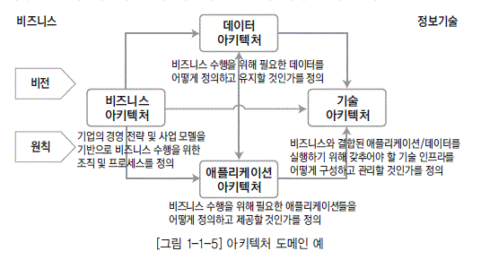

  * [그림 1-1-5] 아키텍처 도메인 예

* 헌행 아키텍처

아키텍처 도메인별로 정의된 산출물에 대하여 기업의 현재 상태를 아키텍처 정보로 정의한 것을 말한다.

* 목표 아키텍처

아키텍처 도메인별로 정의된 산출물에 대하여 기업이 궁극적으로 달성하고자 하는 목표 아키텍처의 상태를 아키텍처 정보로 정의한 것을 말한다.

* 전사아키텍처 이행계획

아키텍처 도메인별로 현재 모습에서 바람직한 목표 모습으로 이행하기 위한 이행 전략과 이행계획을 정의한 것을 말한다.

----
[Tip]
----

 **비즈니스, 업무, 사업 :**

‘비즈니스’란 용어는 원어로‘Business’이다. 우리나라 말로 번역하면‘사업’또는‘업무’로 표현할 수 있다. 사업이란 용어는 전사 차원의 경영과 관련된 어감이 강하고, 업무란 실무적 차원의 업무 활동에 관련된 어감이 강하다. 비즈니스는 사업과 업무를 포함하는 포괄적인 의미를 가진다고 할 수 있다. 하지만 이 책에서는 비즈니스와 업무를 특별히 구분하지는 않는다. 주로 비즈니스라는 용어를 사용하겠지만, 정부의 참조 모델 관련 내용에서는 업무라는 용어를 그대로 사용한다.

 **애플리케이션, 응용 :**

‘애플리케이션’이란 용어는 원어로‘Application’이다. 우리나라 말로 번역하면 응용이라고 표현할 수 있다. 애플리케이션과 응용을 같은 의미라고 할 수 있다. 이책에서는 업계에서 많이 사용하고 있는 애플리케이션을 사용하겠지만 정부의 참조 모델 관련 내용에서는 응용이라는 용어를 그대로 사용한다.

----

일반적으로 아키텍처 도메인은 비즈니스 아키텍처, 애플리케이션 아키텍처, 데이터아키텍처, 기술 아키텍처 등으로 구분한다. 비즈니스아키텍처는 조직의 목적 및 임무를 지원하기 위해 수행하는 업 무를 분석하고, 이를 업무 활동 단위로 분할하여 표현한 아키텍처이다. 둘째, 데이터아키텍처는 효과 적인 업무 처리 및 의사결정을 위해 어떤 정보가 사용되고, 전달되어야 하는지를 표현한 아키텍처로 서, 전사 데이터 구성을 분류하고 데이터 모델을 정의하는 것이다. 셋째, 애플리케이션아키텍처는 조 직의 임무를 수행하는 데 필요한 애플리케이션의 기능 및 이들 간의 관계 등을 정의한 것으로, 기업 의 애플리케이션 단위를 분류하고 애플리케이션 간의 인터페이스를 정의한 아키텍처이다. 마지막으 로 기술아키텍처는 비즈니스아키텍처, 데이터아키텍처, 애플리케이션아키텍처를 지원하는 데 필요 한 정보 기술 인프라 요소 및 구조, 그리고 이들 간의 관계를 표현한 아키텍처로서, 전사의 기술 영역 을 분류하고 표준 프로파일과 기술 아키텍처 모델을 정의한 것이다.

### 다. 전사아키텍처 관리

정의된 전사아키텍처 정보를 지속적으로 유지 관리하고 효과적으로 활용하기 위해서는 전사아키텍처 관리 체계의 정립과 전사아키텍처 관리 시스템의 구축이 필요하다. 또한 전사아키텍처 관리 수준을 제고하기 위해서는 지속적으로 평가하고 개선할 필요가 있다.

* 전사아키텍처 관리 체계

전사아키텍처 관리 체계는 흔히‘전사아키텍처 거버넌스’라고 말하기도 한다. 이것은 구축된 전사 아키텍처를 유지하고 개선하기 위한 제도적 기반을 수립하는 것이며, 정의된 전사아키텍처 원칙을 준수하도록 확인하고 통제하기 위한 조직과 프로세스를 정의하는 것을 포함한다. 전사아키텍처 관 리 체계는 전사아키텍처 활동을 관리하며, 전사아키텍처의 정보 변경을 통제하고, IT 프로젝트가 전사아키텍처의 기본적인 원칙과 정책을 준수하도록 하기 위한 목적이 있다.

* 전사아키텍처 관리 시스템

전사아키텍처 관리 시스템은 전사아키텍처의 정보 관리의 효율성을 제고하고 전사아키텍처 정보의 공유를 활성화하기 위해 구축하는 정보시스템이다. 전사아키텍처 관리 시스템은 도입하는 기업의 요건에 따라 다양한 형태로 구성될 수 있는데, 일반적으로 전사아키텍처 정보를 정의하는 모델링 도구와 전사아키텍처 정보를 저장하는 전사아키텍처 리포지터리, 전사아키텍처 정보를 사용자에게 배포하는 전사아키텍처 포털 등으로 구성된다.

* 전사아키텍처 평가

전사아키텍처의 관리와 활용 수준의 제고를 위해서는 전사아키텍처에 대해 주기적으로 평가하고, 개선점을 도출하여 반영해야 한다. 이를 위해서는 전사아키텍처의 수준을 객관적이고 정확하게 평가할 수 있는 전사아키텍처 성숙 모형이 필요하다.

## 3. 아키텍처 도메인 구성

아키텍처 도메인의 구성은 기업이 아키텍처 매트릭스를 어떻게 정의하느냐에 따라 다르다. 이 절에서는 아키텍처 도메인에 대해서 이해를 좀더 깊이 하기 위하여 국내 기업에서 비교적 일반적으로 활용되고 있는 아키텍처 도메인별 구성내역을 살펴본다. [표 1-1-1] 아키텍처 매트릭스를 기준으로 설명한다.

### 가. 비즈니스 아키텍처

비즈니스 아키텍처는 기업의 경영 목표를 달성하기 위한 업무 구조를 정의한 아키텍처 영역으로,〈기업의 업무와 서비스의 실체를 명확히 하는 것이다. 비즈니스 아키텍처는 타 아키텍처(데이터, 애플리케이션, 기술)의 방향을 정의하고 검증하는 시발점이 된다.

  * [그림 1-1-6] 아키텍처 도미엔별 산출물 예

급변하는 비즈니스 환경에 대한 적응성을 높이기 위해서는 정보기술이 철저하게 비즈니스 전략과 연계되어야 한다. 데이터아키텍처는 비즈니스아키텍처에서 정의한 업무를 지원하기 위해 필요한 데 이터를 정의해야 하고, 애플리케이션아키텍처는 비즈니스 업무를 수행하기 위해서 필요한 애플리케 이션을 정의해야 한다. 기술아키텍처 역시 이러한 비즈니스를 지원하는 데이터 및 애플리케이션아키 텍처를 잘 지원하기 위한 기술적 특성을 감안하여 정의되어야 한다.

  * 전사 사업 모델 (계획자 관점)

비즈니스 아키텍처는 먼저 아키텍처 정보를 구축하는 대상인 전사(Enterprise)의 범위를 정의하는 것에서부터 시작한다. 전사를 둘러싼 내외부의 이해관계자를 분석하고, 외부 객체와의 가치사슬을 분석하여 전사를 정의한다. 전사의 정확한 가치사슬을 분석하기 위해서는 외부 객체의 가치사슬과의 연관 관계를 파악하여 어떤 기능들이 외부객체에 의해서 수행되고, 외부객체의 어떤 기능을 전사 내부가 수행하고 있는지 분석해야 한다.

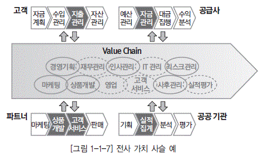

  * [그림 1-1-7] 전사 가치사슬 예

  * 조직 모델 (계획자 관점)

조직 모델은 기업의 사업 모델을 지원하기 위한 기업의 조직 구조를 정의하는 것이다. 비즈니스를 수행하는 지리적 위치와 내부 객체를 도출하여 기업의 조직 구조와 업무 분장을 정의한다.

  * 업무 기능 모델 (책임자 관점)

업무 기능 모델은 기업의 업무 기능을 계층적으로 분할하고 기능 내용을 정의하는 것이다. 업무 기 능을 분할할 때는 조직 기준이 아닌 업무 기능의 유사성과 연관성을 기준으로 정의한다. 상위 업무 기능은 하위 업무 기능의 합으로 완전히 표현될 수 있어야 한다. 업무 기능 모델링은 데이터와 애 플리케이션의 상호 비교를 통한 연관 분석이 이루어진다.

  * 프로세스 모델 (설계자 관점)

프로세스 모델은 업무 기능을 상세화하여 계층적으로 프로세스을 분할하고 프로세스의 활동내용을 정의하는 것이다. 프로세스란 업무 수행을 위해 정보를 입력 받아 의미있는 활동을 통해 산출물을 생성하는 일련의 과정이다. 프로세스 모델 역시 데이터와 애플리케이션과 상호 비교를 통한 연관분석이 반복적으로 이루어진다.

  * 업무 메뉴얼 (개발자 관점)

업무 기능이나 프로세스별 업무 내역을 상세히 기술한 자료로, 전사아키텍처에서는 목록 수준의 정보를 관리한다.

### 나. 애플리케이션 아키텍처

애플리케이션 아키텍처는 기업의 업무를 지원하는 전체 애플리케이션을 식별하고 연관성을 정의 하며, 업무와 IT 특성을 고려하여 그룹화하고 범주함으로써 전체 애플리케이션 구조를 체계화하는 것이다. 애플리케이션 서비스는 애플리케이션이 지원하는 업무와 데이터의 특성을 고려하여 정의되 며, 서비스 간의 상호 연관관계를 분석 정의한다. 이는 향후 애플리케이션에 대한 배치, 통합, 포트 폴리오 관리를 위한 시각을 제공한다.

* 전사 애플리케이션 영역 모델(계획자 관점)

기업의 업무를 지원하는 애플리케이션을 식별하고 애플리케이션별 특성 분석을 통해 이를 전사 수 준에서 구조화하는 것이다. 애플리케이션의 기능과 특성에 따라 독립되어 구현되고 운영될 수 있 는 애플리케이션을 정의하고, 애플리케이션과 관련된 업무, 데이터와 IT 특성을 감안하여 애플리 케이션을 그룹화하여 애플리케이션 영역을 정의한다.

* 애플리케이션 모델(책임자 관점)

애플리케이션 모델은 각 애플리케이션이 지원하는 기능과 데이터 정보를 정의하고, 애플리케이션 이 제공하는 서비스를 도출하며, 이들 간의 연관 관계를 정의한 것이다. 애플리케이션이나 서비스 가 어느 업무 프로세스에서 활용되고, 어떠한 정보를 생산하고 관리하는지 연관성 분석을 한다. 애 플리케이션 모델의 정의는 개발 방법론에 의존적이다.

* 컴포넌트 모델, 클래스 모델(설계자 관점)

실제 애플리케이션 개발에 필요한 설계 정보를 관리하는 것으로, 컴포넌트 정의나 클래스 정의, 데 이터 흐름도(DFD, Data Flow Diagram) 등이 해당되며 기업의 개발 방법론에 영향을 많이 받는 다. 기업이 가지고 있는 업무 영역별로 애플리케이션의 개발 환경은 상이할 수 있다. 예를 들면 정 보계는 컴포넌트 기반 개발(CBD, Component Based Development) 방법론을, 운영계는 메인 프레임 중심의 구조적 방법론을 사용할 수 있다.

* 프로그램 목록(개발자 관점)

애플리케이션의 최종 단위인 프로그램에 대한 정보를 관리한다.

### 다. 데이터아키텍처

데이터아키텍처는 기업의 업무 수행에 필요한 데이터의 구조를 체계적으로 정의하는 것이다. 데이터아키텍처는 전사의 데이터 영역을 분류하는데, 업무 데이터와 메타 데이터를 구분하거나 업무 데이터는 운영계 데이터, 정보계 데이터 등으로 구분한다. 이를 기준으로 전사 수준의 주제 영역 모델, 개념데이터 모델을 정의하고, 영역별로 논리 데이터 모델, 물리 데이터 모델을 정의한다.

참고로, 데이터아키텍처 전문가가 다루는 데이터아키텍처의 범위는 데이터 구조뿐만 아니라 데이터 표준, 데이터 관리 체계 등을 포함하는 광의의 데이터아키텍처를 의미한다.아키텍처의 의미에 대해서는 1절의 아키텍처 정의를 참조하기 바라며, 데이터아키텍처 전문가의 영역에 대해서는 3장의 3절 5항을 참조 바란다.

* 전사 데이터 영역 모델 (계획자 관점)

전사 데이터 영역 모델은 개괄 데이터 모델이라고도 하며 상위 수준의 전사 데이터 영역을 분류하여 표현한 것이며, 상위 주제 영역 수준의 데이터 구성도가 이에 해당된다. 주제 영역은 업무 기능과 대응되는 개념으로 유사 데이터를 그룹화 한 것이다.

* 개념 데이터 모델 (책임자 관점)

개념 데이터 모델은 전사 수준의 데이터 모델로 단위 주제 영역 또는 핵심 엔터티 정도를 표현한 데이터 모델이다. 개념 데이터 모델은 전사 수준에서 사용하는 데이터를 전체적으로 표현할 수 있 는 기본 틀로서, 전사 데이터아키텍처를 관리하는 데 있어 매우 유용한 모델이다. 개념 데이터 모 델에서는 핵심 엔터티는 일반적으로 단위 주제 영역별로 한두 개가 정도가 도출된다.

* 논리 데이터 모델(설계자 관점)

논리 데이터 모델은 개념 데이터 모델에서 정의된 주제 영역과 핵심 엔터티를 기본 정보로 하여 업 무 요건을 충족시키기 위한 데이터의 상세한 구조를 논리적으로 구체화한 것이다. 논리 데이터 모 델링은 수집된 업무 관련 데이터 정보 및 사전에 작성된 산출물을 기반으로 필요한 모든 엔터티를 도출하고, 식별자, 속성, 관계와 서브타입 등을 정의한다. 논리 데이터 모델은 엔터티, 속성에 대 한 명칭, 정의, 형식, 규칙, 코드 등을 전사적인 차원의 표준으로 정의하여 관리해야 한다.

* 물리 데이터 모델(개발자 관점)

물리 데이터 모델은 기술적 환경과 특성을 고려하여 물리적 데이터 구조를 설계하고, 데이터베이 스 객체를 정의한 것이다. 개발자는 논리 데이터 모델을 물리적인 데이터 구조로 전환하고 데이터 무결성을 보완하여 정의하고, 데이터 분산 설계에 따른 데이터 무결성 등 추가적인 무결성 규칙을 정의한다. 데이터베이스의 성능을 고려하여 이미 설계된 데이터 구조에 추가적으로 데이터의 접근 성능 향상을 위한 인덱스 설계, 데이터 구조에 대한 비정규화 과정을 수행한다.

### 라. 기술아키텍처

기술아키텍처는 비즈니스, 데이터, 애플리케이션 아키텍처에서 정의된 요건을 지원하는 전사의 기 술 인프라 체계를 정의하는 것이다 기술 인프라는 하드웨어, 시스템 소프트웨어, 통신 네트워크, 시 스템 개발도구, 시스템 관리도구, 최종 사용자 소프트웨어 등을 포함한다. 기술 참조 모델과 표준 프 로파일 구축을 통해 애플리케이션의 이식성과 확장성을 강화하고, 벤더로부터의 독립성을 확보하며, 시스템 간의 상호운용성을 강화하는 등의 효과를 기대할 수 있다. 기술아키텍처의 경우 다른 아키텍 처와 달리 개별 기업에서도 기술 참조 모델을 정의하는 것이 일반적이다. [표 1-1-2] 아키텍처 매트 릭스에서 기술 참조 모델을 계획자 수준의 산출물로 포함한 것도 그런 의미라고 판단하면 된다.

* 전사 기술 영역 모델, 기술 참조 모델(계획자 관점)

전사 기술 영역 모델은 기업이 업무활동에 필요한 정보기술의 영역을 상위 수준에서 분류한 것이다. 기술 참조 모델(TRM, Technical Reference Model)은 기업이 업무 활동에 필요한 기능들을 수행하기 위해 요구되는 정보기술을 상위 수준에서 논리적으로 분류한 틀인데, 전사 기술 영역 모델과 같은 범주로 볼 수 있다. 다만 기술 참조 모델은 일반적인 표준을 최대한 수렴해 정의하는 것이 특징이라고 할 수 있다.

  * [그림 1-1-8] 기술 참조 모델 예

* 표준 프로파일(책임자 관점)

표준 프로파일(SP, Standard Profile)은 기술 참조 모델에 명시된 서비스를 지원하기 위한 정보기술 표준들의 집합이다. 기업의 모든 기술 아키텍처 요소들에 영향을 미치는 표준들을 포함한다. 이 표준들은 시스템의 이식성, 확장성, 상호운용성, 호환성을 제고하게 된다. 일반적으로 표준 프로파일은 기술표준을 프로파일의 대상으로 하며, 최근에는 제품을 프로파일링 대상에 포함시키는것이 추세이다.

* 기술 아키텍처 모델(설계자 관점)

기술 아키텍처 모델은 전사 기술 영역 모델이나 기술 참조 모델에서 정의된 서비스 카테고리별로 아키텍처의 패턴을 정의하거나, 기업의 소프트웨어, 하드웨어, 네트워크 등의 구성 요소에 대한 배치도를 정의하는 것이다.

* 기술 자원 목록, 제품 목록(개발자 관점)

표준 프로파일이나 기술 아키텍처별로 관련된 기술자원 목록이나 제품 목록을 기술 아키텍처 정보로 관리한다.

## 4. 전사아키텍처 프레임워크 사례

전사아키텍처 프레임워크로 참조할 수 있는 모델은 다양하다. 자크만 프레임워크(ZEAF)를 비롯하여, 미연방정부 프레임워크(FEAF), 미재무성 프레임워크(TEAF), 미국방성 프레임워크(DoDAF), 오픈그룹 프레임워크(TOGAF), 한국정보 프레임워크 등이 대표적인 사례이다.

예를 들면 자크만 프레임워크(ZEAF)는 다섯 가지 관점(Planner, Owner, Designer, Builder, Sub-contractor)과 각 관점에 따르는 여섯 가지 묘사 방법(Data, Function, Network, People, Time, Motivation)을 정의하고 있다. 전사아키텍처 프레임워크의 대표적인 예로서 많은 다른 전사아키텍처 프레임워크에서 참조되고 있다.

[표 1-1-3] 전사아키텍처 프레임워크 예

| | ZEAF | FEAF | TEAF | DoDAF | TOGAF | 공공부분EAF |
|----|----|----|----|----|----|----|
| 구성도 |  |  |  |  |  | 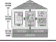 |
| 특징 | ◼ 1980년대 말 기업활동을 공학적 관점에서 파악하는 아키텍처 개념 최초 소개 ◼  기업 활동을 5W1H의 관점에서 모델링 관점 제공|◼ 2003년에 최신 버전 발표, 미연방정부 프레임워크 가이드 라인제공 ◼  참조 모델 기반의 EAF|◼ 미 재무성 EAF ◼ FEAF, DoDAF와 함께 대표적 EAF|◼ 효과적 작전 수행을 위해 무기 체계 간 상호운용성 보장을 위해 도입된 EAF ◼  상호운용성 분석과 향상을 위해 LIBI 분석|◼ 민간 표준 연합인 오픈그룹 EAF|◼ 정부, 공공기관에 전사아키텍처 도입시 참조할 수 있도록 표준, 가이드 목적으로 추진 |
| 장점 | ◼ 5W1H에 따라 기업활동을 상세하게 모델링할 수 있는 관점 제공 ◼  Planner, Owner, Designer, Builder, Sub-contractor 관점에서 기업 활동 관심영역을 구체화|◼ 모델링 관점뿐만 아니라 구체적 이행 계획을 프레임워크에 포함 ◼  BRM, DRM, SCRM, TRM, PRM등 다양한 참조 모델 활용|◼ How-Where-When을 표현하는 기능, What-How much-How Freq 를 표현하는 정보, Who-Why를 표현하는 조직, Enable를 표현하는 인프라 관점 중시|◼ 산출물에 대한 템플릿을 상세하게 정의하여 통일되고 검증된 방식으로 모델링 가능 ◼  운영 모델에 대한 상세한 정의 및 표현 양식 제공|◼ 구체적 아키텍처 개발 프로세스 제안 ◼ 각종 참조 모델의 활용관계를잘정의함|◼ 전사아키텍처 관련된 거의 모든 항목을 프레임워크에 포함하여 기본 프레임워크로 활용하기 용이 |
| 단점 | ◼ 정보화 측면에서 활용도 떨어지는 부문까지 정의 ◼  모델링 표현에 지나치게 집중, 실제 아키텍처 활동 계획 및 기반 정의 부족|◼ 아키텍처 모델의 이해 및 진화에 대해 잘 정의되어 있으나, 조직 및 관련 규정등 제반 요소의 진화적 관점부족|◼ 전사아키텍처 산출물 중심의 프레임워크로서 활용에 대한 접근이 부족 ◼  기업의 계속적인 활동에 대한 관점이 부족|◼ 일반 기업 현장에서는 과도한 산출물과 정확도를 요구하고 있어 과잉 투자 가능성 있음|◼ 메타 모델에 근거한 연속체 개념을 도입하여 아키텍처를 파악함으로써 조직의 특수성이프레임워크에 반영되기 어려움|◼ 표준 프레임워크만 제시하여 구체적인 내용들은 참조한 기관에서 작성하도록 권고 |

미재무성 프레임워크(FEAF)는 8개 구성요소로 이루어져 있고 4단계에 걸쳐 점차적으로 진행하여 마지막 단계에 자크만 프레임워크의 모델 내용을 모두 관리한다. 프레임워크에는 각 세그먼트별 접근법을 채택하여 현행과 목표의 갭분석을 통한 이행 계획과 프로세스를 포함하고 있다.

오픈그룹 프레임워크는 아키텍처를 정의하기 위하여 오픈그룹에서 개발한 아키텍처 개발에 대한 지침인 아키텍처 개발 방법(ADM, Architecture Development Method), 정보기술을 체계적으로 분류한 기술 참조 모델, 표준 요약 정보를 모아놓은 데이터베이스인 표준정보기반(SIB, Standard Information Base)으로 구성되어 있다. 빌딩블록 정의에 의한 접근 방식으로 구성 단위의 문제해결 방식을 제안하고 있다.

각각의 전사아키텍처 프레임워크들은 다른 점도 있지만, 공통점 또한 많다. 프레임워크를 정의할때 이러한 선진 모델을 참조하되 기업의 특성에 맞는 것을 만들어야 하며, 경직된 사고보다는 유연성을 가지는 것이 중요하다.

## 1. 참조 모델 정의

### 가. 참조 모델 개념

참조 모델(Reference Model)은 아키텍처 구성 요소를 식별하여 표준화한 것으로 기관이나 기업 의 전사아키텍처를 수립할 때 참조하는 추상화된 모델이다. 참조 모델은 다양한 관점을 충족시킬 수 있도록 시스템에 대한 개념적인 모델을 추상화하고, 구성 요소를 재사용 가능한 방식으로 생성하여, 여러 기업이 사용할 수 있도록 한 것이다.

전사아키텍처에서는 비슷한 특성이 존재하는 산업군마다 정의된 참조 모델을 활용하도록 추천하 는데, 각 기업은 동종의 참조 모델을 참조하여 고유의 아키텍처를 구성할 수 있다. 이러한 참조 모델 중 잘 알려진 것은 국방, 공공 참조 모델이다. 아키텍처별 참조 모델에는 업무 참조 모델(BRM, Business Reference Model), 데이터 참조 모델(DRM, Data Reference Model), 서비스 참조 모 델(SRM, Service Reference Model), 기술 참조 모델(TRM, Technical Reference Model), 성과 참조 모델(PRM, Performance Reference Model) 등이 있다.

### 나. 참조 모델 현황

정부는 [그림 1-1-9]와 같이 전사아키텍처 참조 모델로 업무 참조 모델, 서비스 참조 모델, 기술 참조 모델, 데이터 참조 모델, 성과 참조 모델 등 5가지 참조 모델 정의를 추진하고 있다.

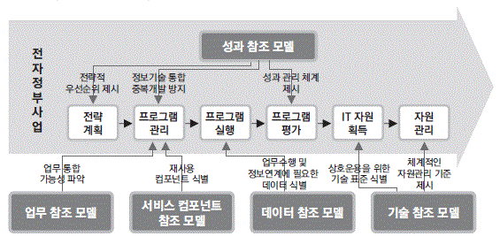

  * [그림 1-1-9] 범정부 EA 참조 모델 개념 구조

  * 성과 참조 모델 : 정보화 성과의 측정을 위한 항목과 지표 및 방법을 제시
  * 업무 참조 모델 : 업무아키텍처의 기준이 되며, 아키텍처 대상 기관의 사업 또는 업무 등을 전체적으로 분류하고 정의하는 것
  * 서비스 참조 모델 : 응용아키텍처의 기준이 되며, 응용 서비스의 기능을 분류하고 정의
  * 데이터 참조 모델 : 데이터아키텍처의 기준이 되며, 기관 간에 교환되는 주요 데이터 요소를 분석하여 이를 정의하고 표준화
  * 기술 참조 모델 : 기술아키텍처의 기준이 되며, 정보기술을 분류 및 식별

[그림 1-1-9] 범정부 EA 참조 모델 개념 구조

범정부 참조 모델은 전사적 아키텍처의 일관성, 재사용성, 상호 운용성 등을 확보하기 위하여 전사 적 아키텍처의 구성에 필요한 정보화 구성 요소의 표준화된 분류 체계와 형식을 정의한 것으로서, 정 부는 공공 기관에서 공동으로 활용할 수 있는 전사적 아키텍처의 참조 모델을 개발하여 보급하고 있 다. 범정부 전사아키텍처 추진의 특징은 일반 기업의 전사아키텍처 프로젝트와 달리 범정부의 정보 화 사업을 체계적으로 추진할 수 있는 참조 모델과 지침을 만들어서 보급하는 데 역점을 두고 있다는 점이다.

참조 모델은 미 연방정부 전사아키텍처에서 처음 제시된 개념으로, 미국의 예산관리국은 2002년 부터 정부 기관 간의 업무 프로세스를 단순화하고 통합하기 위해 연방정부의 아키텍처 정보화(FEA, Federal Enterprise Architecture) 개발을 시작했고, 미 연방정부 전체 최적화 관점에서 각 기관 의 전사아키텍처 구축을 위한‘기준’을 제시하기 위해 아키텍처 영역별로 참조 모델을 정의했다. 여 기서도 역시 성과 참조 모델, 업무 참조 모델, 데이터 참조 모델, 서비스 요소 참조 모델, 기술 참조 모델 등을 정의하였다.

참조 모델 중 가장 잘 활용되고 있는 것이 기술 참조 모델이라고 할 수 있는데, [표 1-1-4]는 대표 적인 기술 참조 모델을 비교하였다.

[표 1-1-4] 기술 참조 모델 비교

| 모델 | 특징 |
|----|----|
| 미연방 TRM |◼ 프레임워크에서 업무, 서비스, 데이터와의 연관성이 높음 ◼  TRM 구조가 내부와 외부의 3계층 구조로 되어 있어, 대내외 연계 설명이 용이 ◼  최신 기술 및 메인프레임의 기술 체계를 폭넓게 수용 ◼  지방 주정부 간의 연동을 고려한 접근으로 내부 IT 서비스를 위한 참조 모델로 활용 하기에는 다소 어려움이 있음 |
| 오픈그룹 TRM |◼ 애플리케이션 이식성 지원을 위해 필요한 기반 플랫폼의 구조와 서비스에 중점 ◼  상호운용 가능한 기술 환경을 구축하기 위해 애플리케이션-통신 기반과의 인터페이 스를 중시 ◼  애플리케이션에 대한 상세한 분류 체계를 제공 ◼  표준 위주의 이론적 접근으로 플랫폼, 네트워크, 통신 기반에 대해서는 상세한 서비 스 분류가 정의되지 않음 |
| 가트너 TRM |◼ 데스크톱 애플리케이션, 엔터프라이즈 애플리케이션 구분 ◼  실용적인 분류 체계를 제공하고 있으나 상세 분류 기준 미흡 |
| 정보화진흥원 TRM |◼ 업무 참조 모델, 서비스 참조 모델, 데이터 참조 모델 등과 함께 범정부 참조 모델 중 하나로 상호 연계성을 기대 ◼  컴포넌트 기반 아키텍처 및 서비스 기반 아키텍처를 지향 ◼  시스템 및 서비스의 상호운용성을 보장 ◼  국내의 정보화 환경을 고려하여 유망하고 안정된 기술 선정 |

기술 참조 모델의 선진 사례는 기본적인 분류의 기준만을 제공한다. 선진 사례가 어떤 것은 너무 범용적이고, 어떤 것은 정부, 국방 등 특정 영역에 의존적이기 때문에 자사 혹은 해당 산업의 기술적 특성을 반영하지 못할 수 있다는 점을 고려해야 한다.

### 다. 참조 모델 구축 방법

참조 모델은 두 가지 방법으로 구축된다. 하나는 공통적인 특성을 추출하여 그 산업군에 맞게 범용 적으로 만드는 것이고, 또 하나는 복잡하고 대표적인 기업을 선정하여 그 기업의 아키텍처를 표본으 로 삼아 비슷한 타 기업에서 재활용하게 만드는 것이다. 먼저 공통적인 특징을 추출하여 만들어진 참 조 모델은 요소 간 경계가 불명확하고 하위 수준의 정의가 명확하지 않은 데 비해 이해하기 쉽고 많 은 산출물이 필요하지 않은 장점이 있다. 대표적인 기업의 아키텍처를 재활용하는 방향은 각 산출물 의 관계가 정확하고 하위 수준까지??상 대부분 공개 가 되지 않는다는 단점이 존재한다.

## 2. 참조 모델 사례

참조 모델에 대한 이해를 높이기 위해 범정부의 업무 참조 모델, 서비스 참조 모델, 기술 참조 모델, 데이터 참조 모델, 성과 참조 모델을 소개한다.

### 가. 업무 참조 모델

업무 참조 모델은 특정 기관의 독립적인 업무 기능을 중심으로 정의한 참조 모델이다. 업무 참조 모 델은 조직과 무관한 기능 위주의 접근이며, 다른 아키텍처를 정의하는 기준으로 활용될 수 있다.

업무 참조 모델은 몇 개의 업무 영역으로 구분된다. 각 업무 영역은 여러 개의 업무 단위로 구분되 고, 각 업무 단위는 세부 업무로 구성된다. 업무 참조 모델에 정의된 업무 단위는 특정 기관에 의해 수행되는 것이라기보다는 기관이 어떤 목적으로 어떤 내용의 일을 수행하든 그 업무는 여기에 정의 된 업무 단위로 묘사될 수 있다. 이는 업무 분석을 위한 공통 기준으로 활용할 수 있다. 서로 다른 기 관들이 유사한 업무를 수행하고 있는지를 파악할 수 있어 유사 업무를 지원하는 시스템을 개발할 경 우에 기관이 공동으로 활용할 수 있다. 업무 참조 모델은 다른 기관이 수행하는 프로젝트 중에서 비 슷한 내용을 검색하여 그 내용을 참고할 수 있다.

정부의 업무 참조 모델은 정책 분야, 정책 영역, 대기능, 중기능, 소기능 등으로 분류하고 있는데, 일반 기업의 업무 참조 모델은 흔히 사업 영역, 업무 영역, 업무 기능 등으로 분류하고 있다.

  * [그림 1-1-10] 범정부 업무 참조 모델 체계 예

### 나. 서비스 참조 모델

서비스 참조 모델은 업무 수행과 목표 달성을 지원하는 서비스 요소를 분류하기 위한 기능 중심의 평 가 지향적 참조 모델이다. 공공 부문의 애플리케이션 서비스에 대한 식별을 통하여 업무와 서비스의 연 계 및 재사용을 촉진하고 중복 개발을 방지하기 위한 것으로, 업무 및 조직에 독립적인 표준 서비스 분 류 체계이다. 기관들은 이를 통해 범정부 차원의 업무 및 응용 서비스 요소를 발견할 수 있다. 서비스 참조 모델을 구축하는 목적은 응용 서비스의 재활용을 촉진하기 위한 서비스 분류 체계를 제공하며, 정 부 기관 업무 지원 컴포넌트에 대한 단일화되고 통합된 분류 체계를 제공하기 위함이다. 또한 업계와 정부 간의 컴포넌트 개발, 축적, 유통의 활성화를 촉진하며, 복잡, 다양한 정부 부처 응용 서비스를 용 이하게 식별할 수 있도록 하기 위한 것이다.

서비스 참조 모델은 여러 개의 서비스 영역으로 구분된다. 각 서비스 영역은 여러 개의 서비스 유 형으로 구성되며, 서비스 유형은 서비스 컴포넌트로 분류된다.

  * [그림 1-1-11] 범정부 서비스 참조 모델 예

### 다. 기술 참조 모델

기술 참조 모델은 업무와 서비스 구성 요소의 전달과 교환, 구축을 지원해 주는 표준, 명세, 기술 요소를 기술하기 위한 것이다. 업무를 지원하는 응용 기능을 구현하는 데 필요한 정보 기술 및 표준들을 분류하고 정의한 체계로서, 기업의 정보화 추진을 위한 전체 정보 기술을 식별하고 정의하여 관 련된 기술 표준과 동향을 관리하여, 공통의 정보 기술 기반을 수립하고 기업의 정보 기술을 표준화할 수 있도록 한다. 각 기업은 이를 통하여 기술 및 응용 서비스의 재사용을 제고시키고, 업무 및 응용 서비스의 안전한 교환 및 전달을 위한 기반 환경을 구축하며, 정보 기술 간의 상호 운용성 확보를 지 원하여 정보 기술 성능과 투자의 최적화를 추구하도록 지원한다. 기술 참조 모델은 몇 개의 핵심 서 비스 영역으로 구성된다. 핵심 서비스 영역은 다시 하위 수준의 서비스 범주나 기술 표준으로 구성된 다. 기술 참조 모델은 서비스 컴포넌트와 연관을 가지며, 정보시스템 간 상호운용성 증대를 위한 기 술 표준을 강조한 구조를 갖고 있다.

기술 참조 모델은 특성상 다양한 산업군 및 기업에 바로 적용할 수 있기 때문에 구축하기 용이하고 기대 효과가 커서 가장 먼저 적용 가능한 영역이다. 기술 참조 모델의 수립은 시스템 구축 시 사용할 기술에 대한 표준 프로파일을 분류하는 데 활용 가능하다. 시스템 관리 시 정보 자산을 분류하는 데 활용 가능하고, 시스템 통합 시 정보시스템 간의 유사성을 판단하는 기준 항목으로 활용 가능하다.

  * [그림 1-1-12] 범정부 기술 참조 모델 예

### 라. 데이터 참조 모델

  * [그림 1-1-13] 범정부 DRM 프레임워크와 개별기관 데이터아키텍처의 관계

데이터 참조 모델은 기관 간의 공통 정보 파악과 활용을 지원하기 위한 모델이다. 기관 간의 정보 공유 및 데이터의 표준화, 재사용을 지원하기 위한 범정부 데이터 분류 및 데이터 표준화와 관리를 위한 기준과 체계를 정의한 것이다.

데이터 참조 모델 프레임워크는 데이터의 표준화, 참조, 재사용을 위하여 필요한 구성 요소와 구성 요소 간의 관계를 정의한 것으로서, 범정부 데이터 모델, 데이터 분류, 데이터 구조, 데이터 교환, 데 이터 관리의 5개 요소로 구성된다.

* 범정부 데이터 모델

범정부에서 구축 및 활용하고 있는 데이터를 식별하고 데이터 영역 간의 관계를 도식화한 것으로, 개별 기관은 범정부 데이터 모델을 참조함으로써 범정부에서 구축 및 운영되고 있는 데이터에 어 떤 것이 있는지를 확인할 수 있다.

* 데이터 분류

데이터에 대한 분류 기준을 정의한 것으로, 범정부 데이터 모델의 데이터들은 데이터 분류에 따라 그룹핑되고, 데이터 구조의 데이터 요소는 데이터 분류 체계에 매핑된다. 데이터 분류 체계를 활용 함으로써 좀 더 용이한 데이터 관리 및 검색이 가능해진다.

* 데이터 구조

범위 내의 모든 데이터 요소와 요소의 소유주, 표준화 항목 정의, 요소 간 관계 및 정보를 저장한 다. 구축 및 활용하는 데이터 요소에 대한 표준화 항목과 가이드를 제시하고, 궁극적으로는 주요한 표준 데이터요소를 등록하여 이를 공유 및 재사용할 수 있도록 한다.

* 데이터 교환

데이터 요소의 교환을 위하여 교환 대상 정의 및 메시지 구조, 메시지 방식을 제시하고 교환 내역 을 관리할 수 있도록 한다. 데이터 교환에서 정의한 데이터 교환 패키지를 통해서 데이터 요소를 참조/재사용할 수 있다.

* 데이터 관리

데이터 품질, 표준화, 보안 등의 유지를 위한 데이터 관리 정책 및 규칙, 프로세스, 조직 구조를 정 의한다.

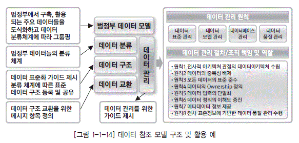

  * [그림 1-1-14] 데이터 참조 모델 구조 및 활용 예

### 마. 성과 참조 모델

성과 참조 모델은 정보화 성과 관리를 위한 구성 요소와 관계를 정의한 것으로, 정보화 성과 제고 및 정보화 사업 품질 향상을 위한 기본 틀을 제공한다. 성과 참조 모델의 도입을 통하여 정보화 사업 의 성과 정보 생성을 지원하여 의사결정을 향상시킬 수 있으며, 정보화 사업의 입력, 과정, 출력, 최 종 성과 간의 인과 관계를 명확히 하여 계층별 성과의 연계를 증진시킨다. 또한 정보화 사업의 성과 를 가시화, 측정, 통제, 관리함으로써 정보화 사업의 개선 가능성을 파악하고 궁극적으로 성과를 증 진시킬 수 있다.

성과 참조 모델은 평가 분류 체계, 표준 가시 경로, 성과 관리 표준 양식으로 구성된다. 평가 분류 체계는 표준화된 평가 지표 개발 및 성과 관리를 위한 기본 틀(분류 체계 및 지표 사례)로서, 평가 영 역, 평가 항목, 평가 그룹, 평가 지표로 구분된다. 표준 가시 경로란 평가 그룹 및 평가 지표 간 관계 를 도식화한 것으로, 정보화 사업의 IT 성과가 서비스 품질, 고객 만족 등의 업무 성과에 기여하는 과정을 파악할 수 있도록 한다. 성과 관리 표준 양식은 공공 기관에서 성과 참조 모델을 활용하여 평 가 및 성과 관리를 하기 위한 표준 양식을 의미한다.

  * [그림 1-1-15] 범정부 성과 참조 모델 체계 예

## 3. 참조 모델 활용

참조 모델은 다양한 용도로 활용될 수 있으며, 용도에 따라 효과도 달라진다. 참조 모델은 정부기 관과 같이 중앙 부처가 산하기관에 참조 모델을 적용하거나, 기업군의 성격을 가지는 기업의 지주회 사나 계열사가 하위 기업에 적용하는 것을 제외하고는 일반 기업이 참조 모델을 업무에 적용하는 것 은 아직 일반화되어 있지 않다.

그러나 기술 참조 모델의 경우, 기업 전체의 기술 환경을 이해하는 논리적인 틀로 받아들여 기술 아키텍처의 현황 진단과 목표 아키텍처를 정의하는 작업의 분류 체계로 잘 활용되고 있다. 참조 모델 별로 활용 방안과 기대 효과는 [표 1-1-5]와 같다.

[표 1-1-5] 참조 모델의 활용 방안 및 기대 효과

| 모델 | 활용방안 | 기대효과 |
|----|----|----|
| 업무 참조 모델 | ◼업무 개선의 대상이 되는 관련 업무를 업무 참조 모델을 참조하여 파악 ◼  개별 기관의 비즈니스 아키텍처를 업무 참조 모델을 참조하여 정의|◼관련 기관 간 업무 흐름 촉진 ◼  업무 프로세스 혁신을 통한 업무 처리 생산성 제고 ◼  비즈니스 성과 측정 용이 |
| 데이터 참조 모델 | ◼개선 대상이 되는 관련 데이터를 데이터 참조 모델을 참조하여 파악 ◼  개별 기관의 데이터아키텍처를 데이터 참조 모델을 참조하여 정의|◼정보의 상호운용성과 교환 촉진 ◼  정부나 기업 또는 산업 차원의 통합된 데이터 활용 ◼  데이터 중복 배제 및 재사용 ◼  데이터에 대한 표준화된 정의 |
| 서비스 참조 모델 | ◼개선 대상이 되는 관련 애플리케이션을 서비스 참조 모델을 참조하여 파악 ◼  개별 기관의 애플리케이션 아키텍처를 서비스 참조 모델을 참조하여 정의|◼시스템 간 상호운용성 향상 ◼  신뢰성 있는 시스템 구축 가능 ◼  변화에 신속한 대응 가능 ◼  시스템 개발 생산성, 품질 향상 기대 |
| 기술 참조 모델 | ◼기술 참조 모델을 참조하여 개선 대상이 되는 관련 기술 인프라를 파악 ◼  상위 기술 참조 모델을 참조하여 개별 기관의 기술 아키텍처나 기술 참조 모델 을 정의|◼시스템 간 상호운용성 향상 ◼  이식성 향상 ◼  시스템 확장성 향상 ◼  표준화 따른 벤더 독립성 ◼  재활용과 리소스 공유 |
| 성과 참조 모델 | ◼정보화 성과 평가를 위한 평가 체계 및 항목을 성과 참조 모델을 참조하여 파악 ◼  개별 기관의 성과 평가 체계를 성과 참 조 모델을 참조하여 정의|◼체계적인 정보화 성과 측정 및 관리 ◼  정보화 사업의 중복 투자 최소화 ◼  성과 기반의 예산 편성 지원 ◼  IT 자원의 효율적 관리 |

기업의 데이터아키텍처 담당자는 데이터아키텍처를 정의할 때 전사아키텍처와의 통합성 및 연계 성은 물론 상위 기관 또는 산업별 데이터 참조 모델을 참조해야만 정보의 상호운용성과 교환을 촉진 할 수 있고, 데이터 중복 배제 및 재사용 증대 등의 데이터아키텍처 구축 효과를 얻을 수 있다.

## 1. 전사아키텍처 프로세스 개요

전사아키텍처 프로세스는 전사아키텍처를 구축하고 관리하는 전체 절차에 관한 것으로 작업의 단계와 공정, 작업내용 등을 정의하는 것이다. 전사아키텍처 프로세스는 일반화되어 있는 방법론이 있지만, 전사아키텍처를 도입하고자 하는 기업의 목적에 맞게 프로세스를 조정할 수 있다.

전사아키텍처 프로세스는 전사아키텍처 프레임워크 구성 요소이기도 하며, 전사아키텍처 프레임워 크 내의 다른 구성 요소를 정의하기 위한 모든 절차와 작업을 포함한다. 이 절에서는 전사아키텍처 프 로세스의 전반적인 체계를 살펴본다.

## 2. 전사아키텍처 프로세스 구성

전사아키텍처 프로세스는 전사아키텍처 비젼 수립, 전사아키텍처 구축, 전사아키텍처 관리, 전사아키텍처 활용 단계로 구분할 수 있다.

  * [그림 1-1-14] 전사아키텍처 프로세스 구성 체계

전사아키텍처 비전 수립 단계에서는 기업의 전사아키텍처 환경을 분석하고, 이를 바탕으로 기업이 추구해야 할 전사아키텍처의 방향을 수립한다. 전사아키텍처 구축 단계에서는 전사아키텍처 정보를 어떻게 구성한 것인가를 정의하고, 이를 바탕으로 현행의 아키텍처와 목포 아키텍처를 구축한다. 전사아키텍처 관리 정의 단계에서는 전사아키텍처를 효과적으로 관리 및 활용하기 위한 관리 체계를 정립하고, 관리 시스템을 구축한다. 전사아키텍처 활용 정의 단계에서는 목표 아키텍처 달성을 위한 중장기 계획을 수립하고, 전사아키텍처 정보를 전반적인 IT 관리 프로세스에 활용하도록 체계를 정의한다.

[표 1-1-6] 전사아키텍처 프로세스 단계 및 공정

| 단계 | 공정 | 내용 |
|----|----|----|
| EA 비전 수립 | EA 방향 수립|◼내외부 EA 환경 분석 ◼  기업의 EA 목적 및 방향 정의 ◼  기업의 EA 프레임워크 정의 |
| EA 구축 | EA 정보 구성 정의|◼아키텍처 매트릭스 정의 ◼  EA 정보 구성 요소 정의 ◼  EA 참조 모델 정의 ◼  EA 원칙 수립 |
|| EA 정보 구축|◼EA 자료 수집 ◼  현행 아키텍처 정보 구축 ◼  목표 아키텍처 정보 구축 |
| EA 관리 정의 | EA 관리 체계 구축|◼EA 정보를 운영 및 활용하기 위한 조직 및 프로세스 정의 ◼  기업 내 EA 홍보 및 내부 추진 체계에 대한 교육 수행 |
|| EA 관리 시스템 구축|◼EA 정보를 관리하기 위한 도구 선정 ◼  EA 정보를 관리하는 시스템 구축 |
| EA 활용 정의 | EA 이행 계획|◼목표 아키텍처를 달성하기 위한 중장기적인 계획 수립 |
|| EA 정보 활용|◼EA 정보를 적용하여 IT 관련 업무를 수행함 |

전사아키텍처 구축시에는 단계별로 보고회 및 워크샵 형태의 행사를 통해 이해관계자의 지속적인 참여를 유도한다.

----
[Tip]
----

 **전사아키텍처 프로세스 :**
ITA 는 정보기술아키텍처를 의미한다. 1996년 미국 정보기술관리혁신법에서 ITA(Information Technology Architecture)라는 용어를 사용했으나, 2000년 OBM A-130 회람에서 아키텍처 관련 이러한 개념을 전사아키텍처(Enterprise Architecture)라 명명하였다.

전사아키텍처 프로세스는 전사아키텍처에 대한 관리 프로세스 부문과 전사아키텍처를 구축하는 방법론에 해당하는 부분 으로 구분할 수 있다. 이 과목의 1장 4절은 전사아키텍처 전체 프로세스에 해당하며, 2장은 전사아키텍처 구축 방법론과 관련된 프로세스이며, 3장은 전사아키텍처 관리 프로세스와 관련되어 있다고 할 수 있다.

----

* 제1절 전사아키텍처 정의
  * 전사아키텍처는 기업의 경영 목표를 지원하기 위해 IT 인프라가 어떻게 구성되고 작동되어야 하는가를 체계화하는 것으로, 복잡한 기업의 모습을 다양한 관점에서 표현하여 정보를 구축하고 활용하는 것이다. 전사아키텍처의 목적은 IT 투자 대비 효과를 최대화하고, 기업의 목적을 가장 잘 달성할 수 있는 방식으로 IT 인프라를 구성하는 것이다.
  * 전사아키텍처는 최근 세계적으로 정부 기관과 민간 기업의 IT 혁신을 위한 주된 관심사이다. 데이터아키텍처 전문가는 기업이 필요로 하는 데이터아키텍처를 정의하기 위해서 이러한 전사아키텍처의 개념을 이해하고 활용할 수 있어야 한다.

* 제2절 전사아키텍처 프레임워크
  * 전사아키텍처 프레임워크는 전사아키텍처를 어떻게 표현하고 운영할 것인가에 대한 전체적인 사고의 틀로서, 전사아키텍처 프로젝트 수행 시 이해 당사자 간의 의사소통 수단이 된다.
  * 전사아키텍처 프레임워크에는 많은 참조 모델이 있다. 이 책에서는 전사아키텍처 방향과 원칙, 아키텍처 매트릭스를 정의하는 전사아키텍처 정책 영역, 전사아키텍처의 구체적인 모습을 표현하는 현행 및 목표 아키텍처, 이행 계획을 포함하는 전사아키텍처 정보 영역, 구축된 전사아키텍처를 어떻게 관리하고 활용할 것인가를 정의하는 전사아키텍처 관리 영역으로 구분하였다. 아키텍처 영역은 흔히 비즈니스, 데이터, 애플리케이션, 기술아키텍처 등으로 구분된다.

* 제3절 전사아키텍처 참조 모델
  * 전사아키텍처 참조 모델에는 국방과 공공 참조 모델이 활성화되어 있는데, 업무 참조 모델, 데이터 참조 모델, 서비스 참조 모델, 기술 참조 모델, 성과 참조 모델 등으로 구성된다.
  * 전사아키텍처 수립 담당자는 기업의 아키텍처를 정의할 때 상위 기관 또는 산업별 전사아키텍처 참조 모델을 참조해야 상호운용성을 촉진할 수 있고 중복을 배제하고 재사용을 증대시킬 수 있는 아키텍처를 정의할 수 있다.

* 제4절 전사아키텍처 프로세스
  * 전사아키텍처 프로세스는 전사아키텍처를 구축하고 관리하는 전체 절차에 관한 것으로 작업의 단계와 공정, 작업 내용 등을 포함한다. 전사아키텍처 프로세스는 일반적인 방법론이 있지만, 기업의 전사아키텍처 도입 목적에 맞게 프로세스를 조정할 수 있다.
  * 전사아키텍처 프로세스는 전사아키텍처 비전 수립, 전사아키텍처 구축, 전사아키텍처 관리, 전사 아키텍처 활용 단계로 구분된다. 전사아키텍처 비전 수립에서는 기업의 전사아키텍처 환경을 분석하여 기업이 추구해야 할 전사아키텍처 방향을 수립한다. 전사아키텍처 구축에서는 전사아키텍처 정보 구성을 정의하고, 현행과 목표 아키텍처 정보를 구축한다. 전사아키텍처 관리에서는 전사 아키텍처 정보를 관리하고 활용하기 위한 체계와 시스템을 구축하며, 전사아키텍처 활용에서 목표 아키텍처 달성을 위한 이행 계획을 수립하고 일상적인 IT 관리 프로세스에 전사아키텍처 정보를 활용한다.

문제 1. 아키텍처의 핵심 구성요소로 거리가 가장 먼 것은?
① 원칙(Rule)
② 모델(Model)
③ 사람(Human)
④ 계획(Plan)

문제 2. 전사아키텍처 프레임워크에 대한 내용 중 가장 맞지 않은 것은?
① 모든 전사아키텍처 프레임워크는 전사아키텍처 정책, 전사아키텍처 정보, 전사아키텍처 관리 등의 3가지 영역으로 구성된다.
② 전사아키텍처를 수립하기 위해서는 우선 전사아키텍처를 어떻게 표현하고 운영할 것인가에 대한 전체적인 사고의 틀인 전사아키텍처 프레임워크를 정립해야 한다.
③ 전사아키텍처 프레임워크는 기업의 전사아키텍처 도입 목적에 따라 조정될 수 있다.
④ 아키텍처 도메인이란 아키텍처 영역을 구분한 것이며, 아키텍처 매트릭스에서 뷰로 아키텍처를 구분한 것이라고 할 수 있다.

문제 3. 전사아키텍처 참조 모델에 대한 내용 중 가장 적절치 않은 것은?
① 참조 모델은 기관이나 기업의 전사 아키텍처 수립 시 참조하는 추상화된 모델이다. 
② 참조 모델은 추상화된 아키텍처와 구성요소 간의 인터페이스를 제공한다. 
③ 범정부 참조 모델에는 업무 참조 모델, 데이터 참조 모델, 서비스 참조 모델, 기술 참조 모델, 성과 참조 모델 등이 있다. 
④ 참조 모델은 정부기관과 같이 중앙부처가 산하기관에 참조 모델을 적용하는 것으로 민간 기업의 경우에는 해당 사항이 없다.

문제 4. 데이터 참조 모델의 활용 효과와 가장 거리가 먼 것은?
① 정보의 상호운용성과 교환 촉진
② 정부나 기업군 또는 산업 차원의 통합된 데이터 활용
③ 데이터 조회 성능의 개선
④ 데이터 중복 배제 및 재사용 증대

문제 5. 전사아키텍처 프로세스의 공정과 수행 내용의 연결 중 가장 잘못된 것은?
① 전사아키텍처 정보 구성 정의 - 아키텍처 매트릭스 정의 
② 전사아키텍처 정보 구축 - 현행 및 목표 아키텍처 정보 구축
③ 전사아키텍처 관리 체계 구축 - 전사아키텍처 정보를 운영 및 활용하기 위한 조직 및 프로세스 정의 
④ 전사아키텍처 이행 계획 전사아키텍처 프레임워크 정의

## 1. 전사아키텍처 방향 수립 개요

전사아키텍처 방향 수립은 전사아키텍처를 구축하는데 있어 어떠한 목적을 가지고 기업에게 어떠한 목표 이미지를 지향할 것인가, 이를 달성하기 위한 프레임워크는 어떠해야 하는가를 정의하는 것이다. 초기에 방향성 정립을 통하여 다수의 이해관계자에게 공동의 목표와 목적을 제공함으로써 추진 과정에서 발생할 수 있는 의견충돌을 사전에 방지할 수 있다. 이견 발생시 정의된 목표와 지향점을 상기하며 타협의 여지를 쉽게 찾을 수 있다.

전사아키텍처 방향 수립은 아키텍처가 경영 환경과 경영 전략에 능동적으로 대응하며 발전하기 위하여 전사아키텍처 변화 동인에 대한 분석 작업을 수행하는 과정이다. 비즈니스 환경 변화 요인을 아키텍처 변화 요인의 시사점으로 도출하여 반영하는 것이다.

전사아키텍처 방향 수립은 전사아키텍처 환경 분석, 전사아키텍처 구축 방향 정의, 전사아키텍처 프레임워크 정의 등으로 구성된다.

## 2. 전사아키텍처 환경 분석

전사아키텍처 환경 분석은 기업의 외부 환경과 내부 환경을 분석하고, 관련된 이해관계자로부터 전사아키텍처 수립을 위한 요건을 도출하는 것이다. 전사아키텍처 환경 분석은 기업과 관련된 고객, 외부 환경, 경쟁자, 기업의 내부 현황 등 전사아키텍처 구축에 관련될 수 있는 환경 요인을 분석하는 것이다. 또한 여러 계층의 사용자들의 기대사항을 도출하여 전사아키텍처 구축을 위한 요건으로 정리한다. 이밖에 현행 IT 현황을 파악하고, 문제점이 무엇이고, 개선되어야 할 사항이 무엇인지 정리한다.

전사의 범위를 명확히 설정하는 것도 이 단계에 포함된다.

* 전사아키텍처 환경 분석 수행 과제
  * 비즈니스 내/외부 환경 분석
  * IT 내/외부 환경 분석
  * 전사 범위 정의

  * [그림 1-2-1] 전사아키텍처 환경 분석 작업

## 3. 전사아키텍처 구축 방향 정의

### 가. 목적 및 범위 정의

전사아키텍처 목적 및 범위 정의는 전사아키텍처의 일반적 목적과 전사아키텍처 환경 분석 결과를 기반으로 기업의 전사아키텍처 구축 목적을 정의하며, 기업의 전사아키텍처에 대한 이해와 관리 역량을 고려하여 구축 범위를 정의하는 것이다. 기업의 전사아키텍처가 지향해야 하는 가치, 도입 목적의근거, 목적 달성시 추구하는 효과 등을 정의하는 것을 포함한다.

전사아키텍처 목적의 예를 들면 다음과 같다.

  * 상호운용성 증대

  * 정보화 투자 의사결정 체계 구축

  * 비즈니스 변화에 대한 신속한 대응체계 구축

  * 전사적 정보화 표준 정립

  * 고객 지향의 정보화 체계 구축

전사아키텍처 구축 대상이 되는 전사의 범위와 기업의 현실적 제약 사항을 반영한 아키텍처의 대 상 범위를 정의한다. 전사아키텍처 대상 범위를 정의하기 위해서는 기업의 미션과 업무 범위를 우선 확인하다. 이후 이에 필요한 정보화 영역을 식별하고, 해당 업무에 어느 정도 지원되고 있는지를 분 석한다. 이러한 분석을 바탕으로 전사아키텍처 대상 영역을 정의한다.

### 나. 전사아키텍처 비전 수립

전사아키텍처 비전은 기업이 전사아키텍처를 통해 실현하고자 하는 미래의 모습과 이를 확보하기 위해 기업이 공유해야 할 가치를 포함한다. 전사아키텍처 비전은 전사아키텍처 도입과 관련한 다양 한 이해 관계자에게 명확한 도입 방향성을 제공하여 전사아키텍처 도입의 궁극적 목표를 달성하도록 한다. 기업의 목표에 전사아키텍처가 제공해야 할 가치를 정확히 일치시킴으로써 기업의 방향과 정 보화 방향 사이의 연결 고리를 구축할 수 있게 된다.

전사아키텍처 비전의 구성 요소는 다음과 같다.

  *  **핵심목표** : 전사아키텍처 도입을 통하여 궁극적으로 달성하고자 하는 기업의 목표 또는 실현하고자 하는 모습

  *  **핵심가치** : 전사아키텍처의 핵심 목표 달성을 위해 구성원들이 추구하거나 지켜야 하는 신념 다음은 전사아키텍처 비전에 대한 사례이다.
  
  * 전사아키텍처 비전에 대한 사례

[표 1-2-1] 전사아키텍처 비전, 핵심 목적 및 가치

| 전사아키텍처 비전 | 핵심 목적 | 핵심 가치 |
|----|----|----|
|고객과 성과를 지향하는 업무 중심 전자 정부 통합 관리 체계 구현|◼ 행정 서비스에 대한 국민 만족 ◼  고객 중심 ◼  성과 지향 ◼  업무 중심|◼ 업무와 정보 기술 연계 노력 ◼  정보화 비전 및 설계도 ◼  변화 대응 체계 구축 ◼  통합 관리 체계 구축 ◼  정보 자원 표준 및 지식 체계 구축 |

전사아키텍처 비전을 수립할 때에는 관련 이해 관계자가 명확하게 이해할 수 있고 즉각적으로 비전 의 의미를 포착할 수 있도록 기업에서 익숙한 용어로 정의하여야 하며, 모든 전사아키텍처 이해 관계 자의 합의와 홍보를 바탕으로 수립하여야 한다. 전사아키텍처 비전은 전사아키텍처의 목적, 원칙, 프 레임워크의 방향성에 영향을 주는 가장 중요한 방향성으로, 각 아키텍처 영역은 전사아키텍처 비전과 방향성을 일치시켜야 하며, 조직 내에서 직접적으로 활용할 수 있도록 목표와도 연계되어야 한다.

## 4. 전사아키텍처 프레임워크 정의

전사아키텍처 수립을 위해서는 먼저 전사아키텍처 프레임워크가 정립되어야 한다. 여러 선진 프레 임워크가 이미 나와 있고 정부에서도 가이드를 제시하고 있어 기업은 이를 참조할 수 있다. 하지만 무조건적인 적용보다는 기업의 특성에 따라 적합한 형태로 정의할 필요가 있다.

흔히 전사아키텍처 프로젝트를 기획하는 단계에서 전사아키텍처 프레임워크가 어느 정도 도출되 기도 한다. 전사아키텍처 프레임워크의 구성 요소 중 아키텍처 매트릭스는 전사아키텍처 정보 구성 단계에서 별도로 정의한다. 따라서 이 단계에서의 전사아키텍처 프레임워크 정의는 기업의 특별한 변경 요구가 있을 경우 반영?들이 공감대를 형성하고 확인하는 과정이라고 할 수 있다. (전사아키텍처 프레임워크에 대한 자세한 사항은 전사아키텍처의 이해의 전사아키텍처 프레임워크 참고)

  * [그림 1-2-2] 공공 부문 전사아키텍처 프레임워크

[표 1-2-2] 공공 부문 전사아키텍처 프레임워크 구성 요소 설명

| 구분 | 구성요소 | 설 명 |
|----|----|----|
| 방향/지침 | 정보기술 정책|◼ 기업의 기본적인 정책에 부합하도록 정보 기술을 도입하고 적용하기 위한 시스템, 아키텍처, 도구, 제품 등에 독립적인 일관된 목표와 방향을 제시 |
| | 전사아키텍처 전략|◼ 기업의 기존 및 신규 도출될 정보 기술 전략과 전사적인 비전, 목적이 정렬된 모습을 반영 ◼  전사아키텍처 전략은 비전과 목적을 포함함으로 아키텍처 비전 수립에서 작성 |
| | 아키텍처 원칙|◼ 원칙은 전사아키텍처 목표를 달성하기 위한 투자 및 의사결정에 객관적 기준을 제시 |
| | 요구 사항|◼ 전사아키텍처 전략을 충족시키기 위한 전사적 요구 조건을 의미 ◼  요구 사항은 전사적 관점에서 작성되어야 함 |
| 전사아키텍처 활동 | 아키텍처 모델|◼ 전사의 모든 자원을 관점과 시각으로 분류한 아키텍처 모델을 정의 ◼  아키텍처 모델은 전사의 모든 자원을 관점과 시각으로 분류한 매트릭스로 표현됨 |
| | 생명주기|◼ 전사아키텍처를 계획, 개발, 적용, 유지 보수, 통제, 감독하기 위한 일련의 프로세스로 구성 ◼  계획 : 아키텍처 도입을 위하여 실무자들을 지정하고 EA의 관리 통 제 구조를 구성하며, 개발을 위한 프레임워크를 선정하고 접근방법 정의 ◼  개발 : 아키텍처 목적과 선택된 아키텍처 모델에 기초해 실제 아키텍 처를 구축하는 단계이며, 현행, 목표, 이행 계획 수립으로 이루어짐 ◼  적용 : 시스템 개발/획득을 위한 프로세스와 정보 기술에 대한 투자 여부를 결정하고 통제하는 정보 기술 투자 프로세스를 포함 ◼  유지 보수 : 정기적으로 조직 내외부의 상황을 반영하여 지속적으로 변화하는 내용을 반영하는 활동과 개선 작업을 수행함 ◼  통제와 감독 : 아키텍처 개발과 이행, 유지 보수 활동을 보증하고 문 제가 있는 환경인 경우, 이를 해결하기 위해서 지속적으로 통제와 감독을 수행 |
| | 지원 도구|◼ 지원 도구는 생명주기의 활동을 체계적, 효율적으로 지원하는 기준, 방법, 도구 등을 의미 ◼  참조 모형, 자본 투자 연계 절차, 성숙 모델, EA 관리 시스템 등으 로 구성 |
| 산출물 | 아키텍처 산출물|◼ EA 활동의 결과에 따라 개발된 산출물로서, EA 목적 및 활용을 참 조하고, 시각 및 관점별로 업무 및 IT 정보를 활용할 수 있도록 필요 한 산출물을 정의 ◼  범정부 EA 산출물 메타 모델 정의서에서 제시하고 있는 필수 산출 물을 반드시 준용하여 정의·행정 서비스에 대한 국민 만족 |

## 1. 전사아키텍처 정보 구성 개요

전사아키텍처 정보는 기업을 잘 이해하기 위해 필요한 업무와 정보기술에 대한 정보로서 활용할만한 가치가 있고 관리가 용이한 정보라고 정의할 수 있다. 또한 전사아키텍처 정보는 업무와 정보기술의 구성요소와 구성요소 간의 관계를 포함한다.

전사아키텍처 정보는 가능한 변화하지 않은 구성요소를 도출하여 정의하는 것이 이상적이다. 전사아키텍처 정보는 관리비용 대비 효과를 고려해야 한다. 궁극적으로 전사아키텍처 정보를 활용하여 얻을 수 있는 이익보다 관리하는 데 비용이 더 많이 소요된다면 전사아키텍처 정보로 관리하는 의미가 없다고 할 수 있다. 전사아키텍처 정보의 각 구성요소가 현실적으로 관리가 가능한지는 기업의 상황을 판단하여 관리 가능한 정보를 식별한 후 그 정보를 전사아키텍처 정보로 구축하여야 한다.

전사아키텍처 정보를 표현하기 위해서는 우선 전사아키텍처 산출물과 이를 구성하는 요소를 분류하는 것이 필요하다. 흔히 매트릭스 형태로 작성하는 데 이를 아키텍처 매트릭스라고 한다. 이는 기업의 업무와 정보기술을 보다 통합적으로 볼 수 있고, 전체를 이해할 수 있게 한다.

## 2. 아키텍처 매트릭스 정의

### 가. 아키텍처 매트릭스 개념

아키텍처 매트릭스는 전사아키텍처 프레임워크의 핵심 구성요소로 전사를 설명하는 모델과 원칙정보를 통일된 시각으로 볼 수 있는 논리적 틀이다. 전사아키텍처 프레임워크가 전사아키텍처 계획, 실행, 운영에 필요한 모든 구성요소와 구성요소간의 관계를 포함하는 것이라면, 매트릭스는 협의의 프레임워크로 아키텍처 도메인의 산출물을 식별하고 정의하기 위한 논리적 체계를 정의하는 것이다.

### 나. 아키텍처 매트릭스 구성

아키텍처 매트릭스는 일반적으로 의사결정 유형(관점)과 아키텍처 정보 유형(뷰)의 두 축을 기준으로 2차원의 매트릭스 형태를 띠고 있다. 아키텍처 정보의 활용 방안을 토대로 의사결정 유형과, 아키텍처 정보 유형으로 구분하여 각 항목에 필요한 산출물을 도출하여 아키텍처 매트릭스를 정의한다.

의사결정 유형은 조직의 의사결정 구조와 시스템의 생명주기와 관련된 이해관계자를 파악하여 각 조직 사이의 이해 관점을 정의한다. 아키텍처정보 유형은 정보시스템을 이해하기 위해서 필요한 정보를 유사한 것끼리 그룹화하고, 기업의 환경에 맞도록 추상화의 레벨을 맞추는 것을 의미한다.

* 의사결정 유형

의사결정 유형은 조직의 의사결정 유형을 계층적으로 구분한 것으로, 조직이 수행하는 업무의 의사결정 특성에 따라 단계를 정의한다. 업무와 IT 조직의 이해관계자를 식별하고, 이를 바탕으로 정보화 의사결정 계층의 구조를 분석하여 의사결정 유형을 정의한다. 전사아키텍처를 구축하는 목적에 따라 3~5단계로 나눌 수 있는데, 이는 전사아키텍처 정보의 관리 수준과 범위에 영향을 준다.

의사결정 단계가 많을수록 보다 상세한 전사아키텍처 정보가 관리되며 이는 전사아키텍처 정보 구축과 관리의 비용에도 영향을 준다.

  * [그림 1-2-3] 아키텍처 매트릭스 구성 정의 예

* 아키텍처 정보 유형

아키텍처 정보 유형은 특성이 비슷한 아키텍처 정보를 그룹화 한 것으로, 기업이 관리하는 모든 아키텍처 정보를 수집하여 분류한다. 아키텍처정보 유형에는 업무 영역과 정보기술 영역으로 구분한다. 업무 영역은 조직, 사업 영역, 업무 기능, 업무 프로세스 등을 포함하고 정보기술 영역은 데이터, 애플리케이션, 기술 인프라 등을 포함한다. 흔히 업무, 데이터, 애플리케이션, 기술로 나눈다.

의사결정 유형의 구성요소는 기업의 정보화 관련 의사결정 계층 구조를 업무 분장이나 전결 규정, 면담 등을 통하여 파악하고, 의사결정 범위, 주기, 간격에 따라서 각 이해관계자별로 계층 구조를 정의한다. 아키텍처 정보 유형의 구성요소는 선진 사례의 뷰 구성을 바탕으로 기업의 정보 관리 요건을 반영하여 조직간 조정과 합의를 거쳐 결정한다.

  * [그림 1-2-4] 관점(Persective) / 뷰(View) 도출 절차

아키텍처 매트릭스 정의시 선진 사례의 무조건적인 도입보다는 선진 사례에서 프레임워크를 참조하되, 기업의 현황을 고려하여 기업의 전사아키텍처 목표 달성에 필요한 구조로 아키텍처 매트릭스를 정의하는 것이 바람직하다.

### 다. 산출물 정의

의사결정 유형과 아키텍처정보 유형으로 구성된 매트릭스의 각 셀에 필요한 산출물을 정의한다. 산출물의 정의는 어떤 방법론을 사용하는가와 기업의 업무 특성이나 문화에 의하여 좌우된다. [표 1-2-1]과 [표 1-2-2]은 정보통신부와 전산원에서 발표한 아키텍처 매트릭스와 표준 산출물 예이다. 이 예는 하나의 가이드일 뿐 기업이 반드시 따라야 하는 것은 아니다.

[표 1-2-3] 공공 부문 아키텍처 매트릭스 예(공통, 보안 부분 제외)

| 뷰(View)/관점(Perspective) | 업무 | 데이터 | 응용 | 기술 |
|----|----|----|----|----|
| 계획자 | ◼ 조직 구성도/정의서 ◼  업무 구성도/정의서|◼ 데이터 구성도/정의서|◼ 응용 시스템 구성도/정의서|◼ 표준 프로파일 ◼  기반 구조 구성도/정의서 ◼  기술 자원 목록 |
| 책임자 | ◼ 업무 관계도/기술서 ◼  업무 기능 분할도/기술서|◼ 개념 데이터 관계도/기술서  ◼ 데이터 교환 기술서|◼ 응용 시스템 관계도/기술서 ◼ 응용 기능 분할도/기술서|◼ 기반 구조 관계도/ 기술서 |
| 설계자 | ◼ 업무 절차 설계서|◼ 논리 데이터 설계서 ◼  데이터 교환 설계서|◼ 응용 기능 설계서 ◼  응용 분산 시스템 설계서|◼ 기반 구조 설계서 ◼  시스템 성능 설계서 |
| 개발자 | ◼ 업무 메뉴얼|◼ 물리 데이터 모델|◼ 응용 프로그램 목록|◼ 제품 목록 |

[표 1-2-4] 공공 부문 아키텍처 산출물 예(공통, 보안 부분 제외)

| 관점 | 산출물명 | 설명 |
|----|----|----|
| 업무 | 조직 구성도/정의서|기업의 조직 또는 조직의 유형, 역할 간의 관계를 표현한 것으로 관련된 이해 당사자의 관계와 상위 조직과 하위 조직 간의 관계를 식별함 |
| 업무 | 업무 구성도/정의서|기업 비즈니스 아키텍처의 개념적 모습을 도형으로 묘사한 산출물. 기업의 업무 기능을 사용자가 이해하기 쉽게 도식화하여 표현함으로써 비즈니스 아키텍처에 대한 이해와 이해 당사자 간의 대화 수단으로 활용 |
| 업무 | 업무 관계도/기술서|업무 기능 간에 의존 관계를 도식화하여 표현. 업무 기능 간의 정보 흐름을 추적할 수 있음 |
| 업무 | 업무 기능 분할도/ 기술서|조직의 업무 기능을 계층 구조로 분류하여 표현한 것으로, 업무 기능을 식별하여 그 구조와 업무의 활동 내용을 기술함 |
| 업무 | 업무 절차 설계서|업무 활동의 흐름을 기술한 산출물로, 각 업무 활동이 어떤 역할과 이벤트에 의하여 수행되고, 어떠한 정보를 주고받는지 등을 기술함 |
| 업무 | 업무 매뉴얼|업무 기능과 업무 활동별로 세부 내역을 설명한 매뉴얼 정보 또는 그 목록 |
| 응용 | 응용 시스템 구성도 /정의서|기업의 응용 시스템을 상위 수준에서 분류하고 표현함으로써 전체적으로 응용 시스템의 구조를 파악할 수 있는 산출물 |
| 응용 | 응용 시스템 관계도 /기술서|응용 시스템 상호 간의 연계성을 표현한 것으로 응용 시스템 상호 간의 데이터 흐름을 파악할 수 있음 |
| 응용 | 응용 기능 분할도/ 기술서|응용 시스템의 기능을 계층적으로 표현한 것으로, 응용 기능의 업무 연관성과 재사용성을 파악하도록 함 |
| 응용 | 응용 기능 설계서|응용 시스템의 기능을 정의하고 응용 기능 간의 상세 구조와 데이터 흐름을 표현한 것으로, 기능 간의 완전성 확인 가능 |
| 응용 | 응용 분산 시스템 설계서|시스템의 분산 계층을 정의하고 분산 자원을 계층별로 할당하여 표현한 산출물 |
| 응용 | 응용 프로그램 목록|응용 시스템에 정의된 응용 기능을 제공하는 프로그램의 정보 또는 목록. 시스템 개발 비용 산정을 위한 기반 자료로 활용됨 |
| 데이터 | 데이터 구성도/ 정의서|기업의 전체 데이터를 상위 수준에서 표현한 것으로 데이터베이스 구성현황을 한눈에파악할수있도록함‘( 개괄데이터모델’과유사함) |
| 데이터 | 개념 데이터 관계도 /기술서|업무 수행을 위해서 필요한 데이터의 구조를 개념적 수준에서 표현 한 것. 주제 영역 또는 중요 엔터티 수준의 데이터 관계도. 업무 수행 에 필요한 데이터를 통합적으로 파악할 수 있음‘( 개념 데이터 모델’ 과 유사함) |
| 데이터 | 데이터 교환 기술서|업무 기능 간에 교환되는 데이터 교환 요구 사항을 식별하여 표현한 것 |
| 데이터 | 논리 데이터 설계서|업무를 수행하기 위해서 필요한 데이터의 구조를 논리적 수준에서 충분히 표현한 것으로, 데이터 유형(엔터티 타입), 식별자, 속성, 관계, 데이터 업무 규칙 등을 포함 |
| 데이터 | 데이터 교환 설계서|응용 기능 간의 데이터 교환의 요건을 식별하여 이를 상세화하며 표현한 산출물 |
| 데이터 | 물리 데이터 모델|업무 기능 또는 응용 시스템에 의하여 사용될 데이터를 실제 데이터 베이스로 구축하기 위해 필요한 물리적 특성을 정의한 모델. DBMS의 특성이나 거래 특성, 성능 요건 등을 고려한 설계가 됨 |
| 기술 | 표준 프로파일|기술 참조 모델에서 정의한 기술 요소별로 아키텍처 구현에 적용되어야 하는 표준과 규칙, 제품 평가 기능 등을 기술한 자료 |
| 기술 | 기반 구조 구성도/ 정의서|기업의 기반 기술 구조에 대하여 상위 수준에서 그래픽하게 표현한 것으로 기반 기술 아키텍처를 한눈에 파악할 수 있도록 함 |
| 기술 | 기술 자원 목록|기업의 기술 자원에 대해 전체적으로 현황을 파악할 수 있도록 작성된 현 시스템에 대한 현황서 |
| 기술 | 기반 구조 관계도/ 기술서|애플리케이션 또는 기술 서비스별 시스템 구성을 표현한 것으로, 시스템 간의 연결 관계 및 시스템 사양을 표현 |
| 기술 | 기반 구조 설계서|시스템의 지리적 분포를 조망할 수 있는 산출물. 하드웨어, 소프트웨어, 네트워크 등이 표현 대상 |
| 기술 | 시스템 성능 설계서|시스템에 요구되는 성능 요건을 충족시키기 위해 어떤 특성이 가장 핵심적인지를 식별하여 표현 |
| 기술 | 제품 목록|정의된 기술 서비스와 표준을 지원하는 제품에 대한 정보 또는 목록 |

* 매트릭스 셀 정의 내역
  * 현행 산출물 분석
  * 목표 산출물 정의
  * 산출물간 연관성 정의
  * 산출물 표현 방법 및 세부 구성 정의

### 라. 전사아키텍처 정보 구성 요소 정의

  * 전사아키텍처 정보 구성요소 식별

전사아키텍처 정보를 공유정보로 구축하기 위해서는 전사아키텍처 산출물에 포함된 정보를 중복이 없고 상호관계가 유기적으로 연결되도록 구성요소를 정의해야 한다. 전사아키텍처 정보가 문서 형태로만 관리될 경우에는 이러한 작업이 필요 없지만, 전사아키텍처 정보가 데이터베이스 형태로 구축되어 지속적으로 갱신되기 위해서는 전사아키텍처 산출물을 구성요소 단위로 분류하고 구성요소 간의 관계를 명확히 할 필요가 있다.

  * [그림 1-2-5] 전사아키텍처 정보 구성 요소 식별 예

[그림 1-2-3]과 같이 식별된 구성 요소는 산출물의 종류와는 다른 형태를 보인다. 전사아키텍처 구성 요소는 전사아키텍처 정보를 구성하는 기초 단위라고 할 수 있으며, 산출물은 여러 개의 전사아키텍처 정보 구성 요소로부터 도출된 복합적인 정보라 할 수 있다.

  * 전사아키텍처 정보 구성요소 연관관계

전사아키텍처 정보 구성요소 간에는 많은 연관관계가 있다. 이러한 구성요소 간 연관관계를 통해 특정 업무를 지원하는 시스템이 무엇인지, 특정 시스템이 어떤 시스템과 연계되어 있는지를 알 수 있다. 또한 특정 시스템이 사용하는 데용되고 있?? 관리하면, 구성요소 간의 관계를 분석할 수 있기 때문에 특정 업무의 변화가 있었을 때 영향 받는 시스템, 데이터, 서버 등을 파악할 수 있다. 또한, 시스템 장애 발생시 연계된 시스템을 파악하여 장애 원인을 보다 쉽게 찾아낼 수 있다. 이를 통해 다양한 연관관계 매트릭스를 정의할 수 있으며, 필요한 보고서와 분석 자료를 생성할 수 있다.

연관관계가 많을수록 전사아키텍처 정보의 활용가치는 높아진다. 그렇지만, 전사아키텍처 정보의 유지관리 비용을 감안하여 현실적인 수준에서 연관관계 정보를 관리하는 것이 바람직하다.

### 마. 아키텍처 매트릭스 정의 시 고려 사항

첫째, 아키텍처 매트릭스에 정의되는 산출물은 업무와 IT, 관리자와 실무자 사이의 중요한 커뮤니케이션 툴이다. 매트릭스를 정의할 때는 일반적인 아키텍처 개념을 포함하면서 조직 내 모든 계층의 사람이 매트릭스에 포함되는 산출물이 범위와 목적에 적합하게 정의되었음을 확신할 수 있어야 한다.

둘째, 조직적, 정치적, 지리적 특성, 조직의 편견 등 다양한 조직 문화와 의사결정 구조가 반영되어야 한다. 같은 아키텍처 정보라고 하더라도 기업의 조직문화, 의사결정에 따라 산출물이 정의되는 셀이 틀려질 수 있음으로, 기업의 조직문화와 의사결정 구조를 고려해서 추상화를 해야 한다.

셋째, 아키텍처 매트릭스는 실제 시스템과 아키텍처 개발 표준에 대한 준수성을 높이고 조직별로 통일된 접근이 가능하도록 정의되어야 한다. 이는 IT 조직의 성숙도를 충분히 고려해야 한다. 매트릭스는 추상화의 수준이 포함된 구조이기 때문에 서로 다른 개발 환경과 요건을 반영하는 동시에 통일성과 일관성을 유지할 수 있도록 되어야 한다.

넷째, 각 아키텍처 도메인은 상호 간에 연계성을 가져야 한다. 비즈니스 아키텍처에서 정의된 산출물은 상호연관성을 가지며 데이터-애플리케이션-기술 아키텍처에 반영되고, 전사 차원에서 통합적인 아키텍처 관리가 이루어지도록 한다.

## 3. 참조 모델 정의

참조 모델 정의 작업에서는 기업의 기준 모델로 정의할 참조 모델의 체계와 구조를 정의하고 컨텐 츠를 구축한다.

이 공정은 다수 전사(Enterprise)를 가지고 있는 기업은 참조 모델을 정의하고, 개별 기업은 정의 된 참조 모델을 확인하는 과정이라고 할 수 있다. 즉, 이 단계에서 정부나 지주회사 또는 다수의 전사 를 가지고 있는 기관은 하위 전사나 소속 기업에서 참고할 참조 모델을 정의하게 되며, 개별 기업은 이러한 참조 모델을 참고하여 전사아키텍처 구성 요소의 타당성을 확인하게 된다.

참조 모델은 업무와 정보기술에 대한 체계적인 분류와 표준화를 통하여 정보화의 통합성, 중복 개 발 방지, 공유 정보의 발견, 상호운용성 향상 등의 목적으로 설계되어 있기 때문에, 개별 기업은 상 위기관이나 산업별 참조 모델을 참고하여 아키텍처 정보 구성 요소를 정의하는 것이 바람직하다.

참조 모델 정의는 기업이 속한 산업이나 가치 사슬 네트워크에 따라 그 범위가 달라질 수 있다. 기 업의 미션과 비전, 서비스의 특성, 기업 간 이해 관계 등을 고려해야 한다. 기술 참조 모델의 경우 개 별 기업도 기술 환경 변화에 대응하고 기술 요소 간 상호운용성을 고려하여 전사아키텍처 구축 시 정 의하여 활용하는 것이 바람직하다. 참조 모델에 대한 설명은 본 강좌의 3차 강의를 참고 바란다.

## 4. 전사아키텍처 원칙 수립

전사아키텍처 비전 달성을 위해 구성원들이 공통적으로 지켜야 하는 규범을 정의하는 것이다. 전사아키텍처 원칙은 전사아키텍처 목표 달성을 위한 의사결정의 객관적 기준을 제시하여 줌으로써, 의사결정을 효과적으로 지원해 주고 업무 협조와 조정을 위한 의사소통 과정의 투명성을 제공한다.

이는 비즈니스 전략과 정보화 전략의 연결성을 강화하는 것이고, 구성원들의 개별적인 의사결정이 조직의목표에 쉽게 정렬될 수 있도록 한다.

[그림 1-2-6] 전사아키텍처 원칙 구성도 예

전사아키텍처 원칙의 구성 요소는 다음과 같다.

  *  **원칙 :** 원칙의 내용을 간략하게 기술

  *  **의미 :** 원칙이 가지는 의미를 설명

  *  **근거 :** 원칙으로 채택된 원인 또는 배경

  *  **기대효과 :** 원칙이 전사아키텍처 수립에 미치는 영향 또는 준수시의 기대효과

전사아키텍처 원칙은 전사아키텍처 전체에 적용되는 기본 원칙과 아키텍처별 원칙으로 구분할 수 있다. 기본 원칙은 전사아키텍처를 추진하는 전사적 차원의 대원칙을 의미하고 개별 아키텍처별 원칙의 근거가 된다.

전사아키텍처 기본원칙은 전사아키텍처 방향 수립 단계에서 정의될 수 있고, 아키텍처별 원칙은 전사아키텍처 정보 구성 정의 단계가 수행되어 아키텍처 매트릭스가 결정된 후 아키텍처 도메인별로 정의될 수 있다.

[표 1-2-5] 전사아키텍처 기본 원칙 예

| 원칙 | 의미 |
|----|----|
| 업무 지향|기업의 정보화는 업무 개선과 상품 및 서비스 품질 개선에 기여할 수 있는 방향으로 추진되어야 한다. |
| 성과 지향|기업의 정보화는 객관적인 성과 지표에 의해 관리되고 평가되어야 한다. |
| 고객 지향|기업의 정보화는 고객의 만족도를 개선하는 방향으로 추진되어야 한다. |
| 상호운용|기업의 정보화는 전사아키텍처에 정의된 원칙과 아키텍처를 준수하여 시스템 간의 연계성과 운영의 지속성을 확보할 수 있는 방향으로 추진되어야 한다. |

아키텍처 원칙은 전사아키텍처 기본원칙을 기반으로 비즈니스 아키텍처, 데이터아키텍처, 애플리케이션 아키텍처, 기술 아키텍처 등의 아키텍처 도메인별로 원칙을 정의한다. 아키텍처 원칙은 각 아키텍처 정보를 정의하고 관리하는 기준이 되는 원칙으로, 각 아키텍처 정보 구축 시 준수되어야 한다.

[표 1-2-6] 아키텍처 원칙 예

| 아키텍처 | 원칙 | 의미 |
|----|----|----|
|비즈니스|범위의 완전성|기업이 수행하는 모든 업무 기능을 누락하지 않고 중복 없이 파악하여 정의한다. |
|데이터|데이터 표준 준수|정의된 표준에 따라 생성·수정·활용되도록 한다. |
||아키텍처 모델 관리|전사 차원의 아키텍처 데이터 모델을 관리하여 전사적 데이터 통합성을 유지한다. |
|애플리케이션|지원 기능 유일성|응용 시스템의 기능은 유일해야 한다. |
|기술|기술의 표준화|모든 기술 아키텍처 설계 및 도입 시에는 정의된 TRM/SP를 반드시 준수한다. |
||운영의 안정성|시스템의 장애에 대한 대응 체계 구축으로 시스템의 안정성, 연속성을 보장한다. |

  * [그림 1-2-7] 데이터아키텍처 원칙 수립 예

전사아키텍처 원칙을 수립할 때에는 다음과 같은 사항을 고려하도록 한다.

  * 원칙의 의도가 명확하게 제시되어 원칙 적용 시 혼돈의 발생을 최소화할 수 있어야 한다.

  * 아키텍처 및 계획 수립과 관련된 의사결정을 효율적으로 할 수 있도록 가이드할 수 있어야 한다.

  * 중대한 정보 기술 관련 의사결정 시 규범으로써 활용될 수 있어야 한다.

  * 전사아키텍처 조직의 모든 정보 관리 및 기술과 관련된 의사결정은 전사아키텍처 원칙을 기반으 로 수행하여야 한다.

  * 원칙 간에 서로 상반되는 지향점을 갖지 않도록 원칙 수립 시 사용되는 용어는 주의하여 선택하여 야 한다.

## 1. 전사아키텍처 정보 구축 준비

### 가. 자료 수집

아키텍처 정보를 구축하기 위해서는 우선 기존에 작성된 자료를 수집해야 한다. 수집해야 할 자료는 정의된 아키텍처 매트릭스에 따라 달라진다.

업무에 관련된 것은 기업에서 관리하는 업무 지침서나 규정 등을 참조하고, 데이터나 애플리케이션에 관련된 것은 정보시스템 구축 시 작성한 산출물이나 완료보고서 등을 참조하고, 기술 인프라에 관한 것은 시스템 도입 관련 문서들과 운영 매뉴얼 등을 참조한다. 필요한 자료가 정의된 산출물의 형식 그대로 존재하지 않을 경우가 있는데 이런 경우에 유사한 산출물을 활용하거나 필요 시 생성 또는 보완 작업을 수행할 수 있다.

### 나. 전사아키텍처 정보 구축 방식

전사아키텍처 정보를 구축하는 방법에는 상향식과 하향식이 있다. 상향식 구축 방법은 최하위에 있는 구성요소를 조사 분석하여 구성요소들의 공통점을 파악하여 공통적인 구성요소들을 모아 상위 구성요소를 정의해 나가는 방식이다. 상향식 방식은 조직의 모든 업무가 포함되는 것을 보장할 수 있는 장점이 있는 반면, 상위 업무 기능 분류의 수준이 서로 다르게 나타날 수 있는 단점이 있다. 하향식 구축 방법은 최상위의 구성요소로부터 시작하여 분류 기준에 따라 하위 구성요소를 도출해 내는 방식이다. 하향식 방식은 일반적인 분류 기준이나 목적에 따른 분류 기준을 따르기 때문이 관점이 명확한 장점이 있다. 그러나 일부 업무가 누락될 가능성이 있으며 어디에도 포함되지 않는 구성요소가 발생할 수 있다는 것이 단점이다.

## 2. 현행 아키텍처 정보 구축

현행 아키텍처 정보의 구축은 현재 업무나 정보시스템에 대하여 기존의 자료를 분석하여 전사아키텍처 정보를 구축하는 것을 말한다. 상위 수준의 업무 기능과 시스템에 대한 분류를 우선 수행한 후 그 기준에 따라 나머지 전사아키텍처 정보를 구축하는 것이 효율적이다. 상위 수준의 분류 기준의 정리되면 나머지 정보 구축은 병렬적으로 수행해도 된다.

현행 아키텍처는 아키텍처 매트릭스의 전범위에 걸쳐 수행하는 것이 바람직하며 각 셀에서 정의하고 있는 산출물을 기준으로 현재 관리되고 있는 모델 및 문서를 정리 및 보완하여 현행화 하는 작업을 수행한다.

현행 비즈니스 아키텍처 정보 구축은 기업의 비전, 경영 목표, 조직 구조 등을 파악하여 정의하는 것에서 시작된다. 다음으로 업무 기능을 정의하는데, 하향식 방식(Top-Down Approach)으로는 가치 사슬분석을 통하여 최상위 업무 기능을 도출하고, 각 업무 기능을 점점 더 세분화하는 방식으 로 진행한다. 상향식 방식(Botton-up Approach)으로는 기업이 현재 수행하고 있는 단위 업무를 조사하고, 단위 업무를 유사성 기준으로 묶어 상위 업무기능을 도출하는 방식으로 업무 기능을 도출 한다. 도출된 업무 기능은 기업의 비전이나 조직 구조와 연계성을 파악한다. 향후 애플리케이션이나 데이터 등과의 연관 관계를 파악하여 상호 검증을 수행 한다.

업무 프로세스 정의도 마찬가지 방식으로 진행한다.

* 현행 비즈니스 아키텍처 정의 내역
  * 전사 사업모델 분석
  * 조직 모델 분석
  * 업무 기능 모델 정의
  * 프로세스 모델 정의
  * 업무 매뉴얼 파악

### 나. 현행 애플리케이션 아키텍처 정보 구축

현행 애플리케이션 아키텍처 정보 구축은 업무 기능 분류를 기반으로 전사 애플리케이션을 분류하 고, 연관 관계를 분석하는 것에서 시작된다. 애플리케이션의 구조와 서비스, 응용 기능 등을 도출한 다. 도출된 애플리케이션과 데이터, 애플리케이션 서비스와 데이터의 연관 관계를 분석하고 조직이 나 업무 기능 등의 다른 구성 요소와의 연관 관계를 분석하여 상호 간의 정합성을 검증한다.

애플리케이션 영역이나 구성요소는 서비스 참조 모델을 참조하여 연관된 서비스 영역과의 연결성을 확인한다.

* 현행 애플리케이션 아키텍처 정의 내역
  * 전사 애플리케이션 영역 식별
  * 애플리케이션 모델 정의
  * 컴포넌트 모델 정의
  * 프로그램 목록 파악
  * 애플리케이션 원칙, 표준 파악

### 다. 현행 데이터아키텍처 정보 구축

현행 데이터아키텍처 정보 구축은, 하향식의 경우 기업의 업무 수행을 위해 필요한 데이터 요건을 식별하여 데이터 모델로 표현한다. 상향식은 각 시스템에서 사용하는 데이터 정보를 분석하여 데이터 모델로 정렬하여 표현한다. 계획자 수준의 상위 정보만을 구축할 경우는 하향식 방식이 적합하며, 실무자 수준의 정보를 구축할 경우에는 상향식 방식이 더 적합하다고 할 수 있다.

하향식의 경우 의사결정이나 현황 파악의 정보 요건을 바탕으로 필요 데이터를 도출하고 정보 요건을 상세화하면서 세부 데이터 모델을 정의한다. 상향식의 경우 운영 중인 데이터베이스의 물리 테이블에 대응되는 논리 개체를 정의하고, 논리 개체 간의 관계를 정의하는 방식으로 정보를 구축하며, 논리 개체를 주제별로 묶어 개념 개체로 정의하고 그 관계를 정의한다. 데이터아키텍처 정보가 구축되면 업무 기능과 애플리케이션과의 연계성 분석을 통하여 정확성을 검증한다.

* 현행 데이터아키텍처 정의 내역
  * 전사 데이터 영역 식별
  * 개념 데이터 모델 정의
  * 논리 데이터 모델 정의
  * 물리 데이터 모델 정의
  * 데이터베이스 객체 파악
  * 데이터 원칙, 표준, 관리 프로세스 파악

### 라. 현행 기술아키텍처 정보 구축

현행 기술 아키텍처 정보 구축은 기업의 전산 장비, 시스템 소프트웨어, 네트워크 등 기술 인프라의 구성을 체계적으로 분류하여 표현하는 것이다. 먼저 전사의 기술 인프라의 영역을 분류하고, 영역별로 구성요소를 도출하고 구성요소 간의 관계를 식별하여 표현한다. 기술 아키텍처 정보 구축 시 기술 참조 모델을 사전에 정의하여 참조하면 전체적인 일관성을 확보할 수 있다.

* 현행 기술 아키텍처 정의 내역
  * 전사 기술영역 식별
  * 기술 참조 모델 정의
  * 기술 표준 분석
  * 기술 아키텍처 요소 식별
  * 기술자원 목록, 제품 목록 파악

## 3. 목표 아키텍처 정보 구축

목표 아키텍처 구축은 현행 아키텍처에 대한 문제점과 개선 사항을 도출하고, 이를 목표 아키텍처 에 반영하는 방식으로 진행한다. 아키텍처 간의 정의 순서는 비즈니스아키텍처를 먼저 정의하고 이 를 효율적으로 지원하는 아키텍처를 정의하는 것이 바람직하다.

목표 아키텍처의 구축 범위는 전사아키텍처 구축의 목적에 따라 다르지만, 일반적으로 초기 전사 아키텍처 수립 시에는 현행 아키텍처와 달리 아키텍처 매트릭스의 개념적 수준까지 정의한다. 개념 적 수준 이하의 산출물 작업은 실제 시스템 구축 단계에서 수행하는 것이 일반적인 접근이다. 이는 전사아키텍처?? 아키텍처에 대한 비즈니스와 기술 환 경 변화에 대한 유연성을 확보하기 위한 의미도 있다.

현행 추가 업무와 개선 요구 사항을 목표 비즈니스아키텍처에 반영한다. 사전에 업무 프로세스 재 설계(BPR, Business Process Reengineering)와 같은 작업이 이루어진 경우에 해당 작업의 결과 를 목표 비즈니스아키텍처에 반영한다. 업무 참조 모델과 연계성을 파악하여 관계를 확인한다.

목표 비즈니스아키텍처의 수준에 따라 데이터 및 애플리케이션아키텍처 수준이 결정되기 때문에 비즈니스아키텍처 정의는 중요한 의미를 가지고 있다. 특히, 목표 비즈니스아키텍처는 기업의 미래 비전을 달성하기 위한 모습을 정의하는 것을 포함해 다른 아키텍처의 적합성을 판단하는 중요한 기 준이 된다.

* 목표 비즈니스 아키텍처 정의 내역
  * 전사 사업 모델 정의
  * 조직 모델 정의
  * 업무 기능 모델 정의
  * 프로세스 모델 정의
  * 업무 매뉴얼 정보 구축

### 나. 목표 애플리케이션아키텍처 정보 구축

목표 애플리케이션 아키텍처 정보는 목표 비즈니스 아키텍처를 지원하는 전사 애플리케이션의 구조를 정의하는 것이라고 할 수 있다. 일반적으로 목표 업무의 개선요구나 추가적인 애플리케이션 구축 요구와 애플리케이션 자체의 개선요구를 아키텍처에 반영하는 방식으로 진행한다. 도출된 애플리케이션 아키텍처 정보는 관련 비즈니스 아키텍처나 데이터아키텍처와 연관관계를 비교하여 검증한다. 또한 목표 애플리케이션 아키텍처 정의 시 서비스 참조 모델과의 연계성을 파악하여 상위 기업이나 유관 기업과의 인터페이스를 제고할 수 있도록 한다.

* 목표 애플리케이션 아키텍처 정의 내역
  * 전사 애플리케이션 영역 모델 정의
  * 애플리케이션 모델 정의
  * 컴포넌트 모델 정의
  * 프로그램 목록 정보 구축

### 다. 목표 데이터아키텍처 정보 구축

목표 데이터아키텍처 정보는 목표 비즈니스 아키텍처를 지원하는 데이터를 식별하여 모델로 표현하는 것이라고 할 수 있다. 일반적으로 목표 업무의 개선요구나 추가적인 데이터 요구, 데이터 자체의 개선요구를 데이터아키텍처에 반영하는 방식으로 진행한다. 도출된 데이터아키텍처 정보는 관련 비즈니스 아키텍처나 애플리케이션 아키텍처와 연관관계를 비교하여 검증한다. 또한 목표 데이터아키텍처 정의시 데이터 참조 모델과의 연계성을 파악하여 상위 기업이나 유관 기업과의 데이터 인터페이스를 제고할 수 있도록 한다.

* 목표 데이터아키텍처 정의 내역
  * 전사 데이터 영역 모델 정의
  * 개념 데이터 모델 정의
  * 논리 데이터 모델 정의
  * 물리 데이터 모델 정의
  * 데이터베이스 개체 정보 구축
  * 데이터 원칙, 표준, 관리 프로세스 정의

### 라. 목표 기술아키텍처 정보 구축

목표 기술 아키텍처 정보 구축은 목표 애플리케이션 아키텍처와 데이터아키텍처를 잘 지원할 수 있는 기술 아키텍처를 정의하는 것이라고 할 수 있다. 최근의 기술 추이와 기업의 특성을 고려한 기술술 아키텍처를 정립한다. 목표 기술 아키텍처는 기술 참조 모델과 연계하여 전체 기술 인프라의 상호운용성을 제고할 있도록 해야 하는데, 일반적으로 기술 아키텍처를 기술 참조 모델을 바탕으로 기술 구성요소와 기술 분야를 상세화하는 방식으로 진행하는 것이 바람직하다.

표준 프로파일은 조직의 수준에 따라 선택되어야 하는 표준의 기준 및 수량, 깊이가 다르다. 그렇지만 동일 기업 내에 이용되는 표준은 그 기업의 표준 프로파일과 일관성을 가져야 한다. 대상이 되는 표준을 선정할 때 개방형 시스템의 구현과 국제 표준을 항상 고려해야 한다. 그렇지만, 표준 프로파일의 구성이 구체적인 개방 시스템 환경을 정의하거나 보장하는 것은 아니므로 기업에서는 표준 및 공통기술을 위한 개방형 시스템 구축에 필요한 기준을 추가로 정의해야 한다. 표준 프로파일은 기업이 관리 가능한 수준으로 구성하는 게 바람직하며, 기술의 발전 및 환경, 기업의 비전이나 업무 등에 따라 계속 갱신해야 한다.

* 목표 기술 아키텍처 정의 내역
  * 전사 기술 영역 모델 정의
  * 기술 참조 모델 정의
  * 표준 프로파일 정의
  * 기술 아키텍처 모델 정의
  * 기술자원 목록, 제품 목록 정보 구축

* 제1절 전사아키텍처 방향 수립
  * 전사아키텍처 방향 수립은 전사아키텍처를 구축하는 목적과 목표 이미지를 정립하는 것으로, 다수의 이해 관계자가 이를 공유함으로써 전사아키텍처 추진 과정에서 발생할 수 있는 의견 충돌을 사전에 방지할 수 있다.
  * 전사아키텍처 방향 수립은 기업의 환경 분석을 바탕으로 전사아키텍처의 목적과 범위를 정하고 궁극적으로 달성하고자 하는 비전을 수립하는 것이다. 그리고 이를 달성하기 위한 기본 원칙과 아키텍처별 원칙을 정의하는 것도 포함한다.

* 제2절 전사아키텍처 정보 구성 정의
  * 전사아키텍처 정보는 기업을 잘 이해하기 위해 필요한 업무와 정보기술에 대한 정보로서 활용할만한 가치가 있고 관리가 용이한 정보라고 할 수 있다. 아키텍처 매트릭스는 기업이 전사아키텍처 정보로 관리할 산출물의 수준을 정의한 틀이다.
  * 아키텍처 매트릭스는 일반적으로 의사결정 유형(관점)과 아키텍처 정보 유형(뷰)의 두 축을 기준으로 2차원의 매트릭스 형태를 띠고 있다. 두 축이 만나는 각 셀에 기업이 관리하고자 하는 전사 아키텍처 산출물이 정의된다.
  * 의사결정 유형은 조직의 의사결정 계층을 구분한 것으로, 정보의 상세화 정도를 나타낸다. 아키텍처 정보 유형은 특성이 비슷한 아키텍처 정보를 그룹화한 것으로 기업의 모든 전사아키텍처 정보를 도메인으로 구분한 것이다..

* 제3절 전사아키텍처 정보 구축
  * 아키텍처 정보를 구축하기 위해서는 우선 기존에 작성된 자료를 수집해야 한다. 수집해야 할 자료는 정의된 아키텍처 매트릭스에 따라 다르다. 전사아키텍처 정보를 구축하는 방법에는 상향식과 하향식이 있으며, 장단점을 파악하여 기업의 상황에 맞는 방식을 선택하는 것이 바람직하다.
  * 현행 아키텍처 정보의 구축은 현재의 업무나 정보시스템에 대하여 기존의 자료를 분석하여 전사 아키텍처 정보를 구축하는 것을 말한다. 일반적으로 상위 수준의 업무 기능과 시스템에 대한 분류 체계를 정의한 후 나머지 하위의 정보 구축은 병렬적으로 수행한다.
  * 목표 아키텍처 구축은 현행 아키텍처에 대한 문제점과 개선 사항을 도출하고, 이를 목표 아키텍처에 반영하는 방식으로 진행한다. 일반적으로 비즈니스아키텍처를 먼저 정의하고, 이를 효율적으로 지원하는 정보기술아키텍처를 정의한다. 목표 아키텍처의 구축 범위는 전사아키텍처 구축의 목적에 따라 다르지만 초기 전사아기텍처 수립 시 현행 아키텍처와는 달리 개념적 수준까지 정의하고, 개념적 수준 이하의 산출물 작업은 실제 시스템 구축 단계에서 수행하는 것이 일반적이다.

문제 1. 전사아키텍처 환경 분석 시 수행하는 작업과 가장 거리가 먼 것은?
① 비즈니스 내/외부 환경 분석
② IT 내/외부 환경 분석
③ 아키텍처 매트릭스 정의
④ 전사(Enterprise) 범위 정의

문제 2. 아키텍처 매트릭스에 대한 설명 중 가장 맞는 것은?
① 의사결정 유형은 정보의 상세화 정도와 연관성이 있고, 아키텍처 정보 유형은 아키텍처도메인과 연관성이 있다. 
② 아키텍처 매트릭스는 가능한 선진 사례를 그대로 도입하는 것이 바람직하다. 
③ 아키텍처 매트릭스에 정의된 산출물은 방법론에 따라 차이가 없어야 한다. 
④ 기업은 정부가 정의한 아키텍처 매트릭스를 준용해야 한다.

문제 3. 전사아키텍처 정보 구성 정의 시의 참조 모델 관련 설명 중 가장 적합하지 않은 것은?
① 복수 전사(Enterprise)를 가지고 있는 기업은 이 공정에서 참조 모델을 정의하고, 개별기업은 정의된 참조 모델을 확인하면 된다. 
② 개별 기업은 상위 기관이나 산업별 참조 모델을 참고하여 아키텍처 정보 구성 요소를 정의하는 것이 바람직하다. 
③ 참조 모델 정의는 기업이 속한 산업이나 가치 사슬 네트워크에 상관없이 그 범위가 일정하다. 
④ 기술 참조 모델은 개별 기업에서도 기술 환경 변화에 대응하고 기술 요소 간 상호운용성을 고려해 전사아키텍처 구축 시 정의 및 활용하는 것은 일반적이다.

문제 4. 데이터아키텍처 정보 구축의 대상으로 가장 거리가 먼 것은?
① 일반적인 DBMS 제품 목록
② 데이터베이스 개체 정보
③ 논리 데이터 모델 정의 
④ 개념 데이터 모델 정의

문제 5. 비즈니스 아키텍처 정보 구축의 대상으로 가장 거리가 먼 것은?
① 조직 모델 정의 
② 전사 주제영역 모델
③ 업무 매뉴얼 정보
④ 업무 기능 모델

## 1. 전사아키텍처 관리 체계 개요

### 가. 전사아키텍처 관리 체계 개념

전사아키텍처를 도입함에 있어 아키텍처 정보를 정확하게 구축하는 것도 중요하지만, 더 중요한 것은 그러한 전사아키텍처 정보를 관리하고 활용할 수 있는 체계를 정립하는 것이다. 전사아키텍처 관리 체계는 전사아키텍처를 유지 관리하기 위한 조직과 프로세스 측면의 기반을 구축하는 것을 의미한다. IT 기획에서 서비스 제공에 이르는 모든 과정에서 전사아키텍처 정보를 활용하여 의사결정이 이루어짐으로서 일관성과 합리성이 증대되는 것을 목적으로 한다. 최근 이런 전사아키텍처 관리 체계의 중요성에 대한 인식이 높아지고 있다.

전사아키텍처 관리 체계는 전사아키텍처 관리 조직, 전사아키텍처 관리 프로세스, 전사아키텍처 관리 인력을 포함한다.

* IT 관리 체계와 전사아키텍처 관리 체계

IT 관리 체계는‘IT 거버넌스’라고도 한다. 이는 IT 관리의 효율성과 효과성을 증대하기 위한 IT전반에 관한 관리 체계를 정립하는 것을 말한다. 전사아키텍처 관리 체계는‘EA 거버넌스’라고도 하는데, 전사아키텍처를 유지하고 지속적으로 개선하기 위해 제도적 기반을 구축하는 것을 의미한다. 전사아키텍처 관리 체계는 IT 관리 체계의 틀 속에서 통합되어야 한다.

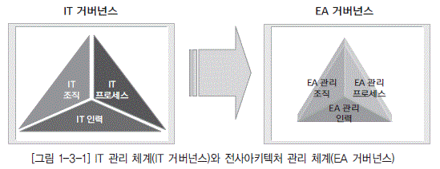

  * [그림 1-3-1] IT 관리 체계(IT 거버넌스)와 전사아키텍처 관리 체계(EA 거버넌스)

----
[Tip]
----

 **전사아키텍처 관리 체계와 EA 거버넌스 : :**
전사아키텍처 관리 체계를 최근에 EA 거버넌스라는 용어로 자주 사용한다. 이 책에서는 동일한 의미로 본다. 마찬가지로 IT 관리 체계와 IT 거버넌스도 같은 의미로 본다

----

### 나. 전사아키텍처 관리 체계 구축 방향

전사아키텍처 구축의 효과를 높이기 위해서는 전사아키텍처 간의 통합성과 전사아키텍처 내의 통합성이 확보되어야 한다. 전사아키텍처 간의 통합성이란 복수 기관 간에 통합적으로 전사아키텍처가 구축되는 것을 의미한다. 또 전사아키텍처 내의 통합성이란 단일 기업 내에서 전사아키텍처 영역 간에 통합적으로 전사아키텍처가 구축되는 것을 의미한다.

전사아키텍처 관리 체계 정착을 위해서는 장기적인 접근이 필요하며 단기 효과보다는 장기간의 효과를 중시해야 한다. 또한 전사아키텍처 수립의 효과는 IT 관련 조직만의 노력으로 달성될 수 없으며 전사적인 추진 체계가 되어야 한다. 현업 부서도 전사아키텍처를 이해하고 비즈니스 아키텍처에 대한 정보를 활용하고 IT 혁신에 대한 적극적인 의견 제시와 협조가 필요하다.

효과적인 전사아키텍처 관리관체계를 구축하기 위해서는 다음을 고려해야 한다.

* 정의된 전사아키텍처 조직 체계, 프로세스 체계 등을 문서화하여 전 조직이 준수할 수 있도록 제도화한다.

* 전사아키텍처 관련 제반 이해당사자의 전사아키텍처 인지도 향상 및 업무 수행시 전사아키텍처정보 활용도 증진을 위한 적절한 교육 프로그램을 제공한다.

* 목표 아키텍처로의 전환, 정보자원 관리의 혁신 등 전사아키텍처 도입에 따른 변화 관리를 위한 종합적인 프로그램을 운영한다.

* 전사아키텍처 관리 체계를 주기적으로 점검하여 개선점을 도출하여 반영할 수 있는 제도적 장치를 마련한다.

* 전사아키텍처 관리 시스템을 활용도와 만족도를 주기적으로 점검하여 시스템의 품질을 지속적으로 개선해 나간다.

## 2. 전사아키텍처 관리 조직 체계

### 가. 전사아키텍처 관리 조직 개요

전사아키텍처 관리 조직 체계는 전사아키텍처 관리를 위해 필요한 직무와 직무간의 관계, 업무 분장을 정립하는 것이다. 전사아키텍처 조직은 기업 전체 또는 정보관리 전체 조직과 일관성을 확보해야 한다. 전사아키텍처 관리 조직 체계는 계획자 수준에서 실무자 수준까지 다양한 시각에서 책임과역할이 정의되어야 한다.

전사아키텍처 관리 조직의 직무 예로는 다음을 들 수 있다.

  *  **전사아키텍처 담당 임원 :** 전사아키텍처 수립에 대한 투자 의사결정, 전사아키텍처의 주요 추진 과정에 대한 승인, 전사적 지원의 확보

  *  **전사아키텍처 아키텍트 :** 전사아키텍처에 대한 전체적 원칙 및 방향 정의, 전사아키텍처 관리의 총괄, 영역간의 조정

  *  **전사아키텍처 영역별 담당자 :** 비즈니스 아키텍처, 데이터아키텍처, 애플리케이션 아키텍처, 기술아키텍처 등의 전사아키텍처 영역별 원칙과 정보를 관리하는 담당자

  *  **전사아키텍처 관리시스템 관리자 :** 전사아키텍처 관리 시스템의 구축 및 운영을 담당

  *  **전사아키텍처 추진 위원회 :** 전사아키텍처 수립 및 적용에 대한 전사적인 중요 의사결정에 대한 승인 또는 자문을 수행하는 그룹

### 나. 전사아키텍처 관리 조직의 정의

구축된 전사아키텍처 정보를 담당하는 전담 조직이 없다면 전사아키텍처 정보는 하나의 문서에 불과하게 된다. 전사아키텍처 정보는 상호연관성을 유지하며 지속적으로 관리가 되어야 한다. 이를 위해서는 기업의 상황에 맞게 전사아키텍처를 담당하는 조직을 정의할 필요가 있다. 전사아키텍처 전담 조직은 선진 사례를 참고하고, 정보 관리 전체 조직과 전사아키텍처 관리 조직의 문제점을 파악 해 개선 방향을 도출하여 이를 기반으로 전사아키텍처 조직을 정의한다. [그림 1-3-2]는 전사아키텍 처 조직 구성의 예를 보여주고 있다.

[그림 1-3-2]에서 제시된 전사아키텍처 조직의 공통된 특징은 전사아키텍처 정보를 관리하기 위 한 위원회 및 전담 조직을 아키텍처 영역별로 정의하고 있다. 전사아키텍처와 관련된 이슈를 해당 팀 안에서만 아니라 공론화된 회의를 통해 관련 문제를 해결해 나갈 것을 정의하고 있다.

  * [그림 1-3-2] 전사아키텍처 관리 조직 구성 예

전사아키텍처 관리 조직 정의 시 다음과 같은 것을 고려한다.

* IT 조직의 규모
  * 전사아키텍처 관리 조직을 별도 조직으로 구성할 수 없는 중소 규모의 IT 조직은 전사아키텍처 관리 운영위원회(또는 TFT) 중심으로 전사아키텍처 관리 조직을 정의하고 전사아키텍처 전담 인력을 양성한다.
  * 전사아키텍처 관리 조직을 별도 조직으로 구성할 수 있는 대규모의 IT 조직은 전사아키텍처 관리 전담 조직을 신설하고, 전사아키텍처 관리 운영위원회를 통해 전사적으로 의사결정을 공유할 수 있는 조직 체계를 정의한다.

* 전사아키텍처 구축의 목적
  * 전사아키텍처 구축 목적이 순수하게 아키텍처 관리와 IT 표준화 등을 위한 것이면 전사 아키텍처와 IT 표준을 통합 관리할 수 있는 전사아키텍처 관리 조직을 정의한다.
  * 전사아키텍처 구축 목적이 신시스템 구축을 위한 계획 수립이면, 프로젝트 기간 중 전사아키텍처 정보를 관리할 수 있는 조직이 필요하다. 전사아키텍처 정보 중심으로 프로젝트를 관리할 수 있는 PMO(Project Management Office)와 전사아키텍처 관리 전담 조직을 정의한다.

* IT 조직과 현업과의 관계
  * 현업과 IT 조직간의 의사소통 문제가 있을 경우 현업의 요건을 종합적으로 관리하는 조직을 추가로 정의한다.

## 3. 전사아키텍처 관리 프로세스

전사아키텍처 관리 프로세스는 전사아키텍처를 관리하기 위한 활동을 정의하는 것이다. 전사아키 텍처 관리 프로세스는 전사아키텍처 관리와 관련된 모든 활동을 포함하고, 전체 정보관리 업무 체계 와 일관성이 확보되어야 한다. 전사아키텍처 관리 프로세스는 전사아키텍처 관리를 수행하는 세부 업무를 분류하고 내용을 정의하는 것은 물론 전사아키텍처 관리를 위해 준수해야 할 규정이나 구체 적이고 표준화된 수행 절차 또는 문서 양식을 정의하는 것을 포함한다.

예를 들면 전사아키텍처 관리 프로세스는 전사아키텍처 기획, 전사아키텍처 변경관리, 전사아키텍처 준수통제, 전사아키텍처 활용지원, 전사아키텍처 관리 시스템 관리, 전사아키텍처 평가 등으로 구분할 수 있다.

* 전사아키텍처 기획

전사아키텍처 관리의 방향과 전사아키텍처를 효과적으로 적용 및 활용하기 위한 계획을 수립하는 등의 전사아키텍처 추진의 기획 관련 제반 활동

* 전사아키텍처 변경 관리

영역별 전사아키텍처 정보의 변경에 대한 검토, 승인, 변경 이행 등 전사아키텍처 정보의 최신성과 품질을 확보하기 위한 제반 활동

* 전사아키텍처 준수 통제

각 정보관리 부문이나 관련 현업 부서에서 전사아키텍처 정보를 참조하고 준수하는지 점검하고 지원하는 등의 전사아키텍처 준수도 제고를 위한 제반 활동

* 전사아키텍처 활용 지원

각 정보관리 부문이나 관련 현업 부서에서 전사아키텍처 정보를 잘 활용하도록 전사아키텍처 정보의 공지, 홍보, 교육, 활용사례 전파 등 전사아키텍처 활용도를 제고하기 위한 제반 활동

* 전사아키텍처 관리 시스템 관리

전사아키텍처 관리 및 활용의 효율성 제고를 위한 정보관리 시스템을 구축하고 운영하는 제반 활동

  * [그림 1-3-3] 전사아키텍처 고나리 프로세스의 흐름 예

* 전사아키텍처 평가

전사아키텍처 관리 및 활용 수준의 제고를 위해 전사아키텍처 평가 모형을 정의하고 주기적으로 평가하여 개선의 기회를 식별하는 제반 활동

### 나. 전사아키텍처 관리 프로세스 구성

전사아키텍처 관리를 위한 프로세스는 일반적으로 전사아키텍처 구축 후 이를 활용하고 통제한다. 비즈니스 환경이나 기술환경의 변화와 전사아키텍처 활용 상태를 평가하여 필요한 변경조치를 취하며 이것이 다시 전사아키텍처 정보로 구축되어 전사적으로 적용되는 흐름을 갖는다.

전사아키텍처 관리 프로세스의 정의는 전사아키텍처 구축을 통해 모든 활동의 중심이 전사아키텍처 중심으로 수행될 수 있도록 하여야 한다. 만약에 기존의 IT 프로세스에 전사아키텍처 변경 및 관리 프로세스만을 신규로 추가하여 정의할 경우에는 기존의 IT 프로세스에 따라로세스가 제대로 수행되지 않을 가능성이 많다. 전사아키텍처 관련 프로세스가 제대로 수행하지 않을 경우에는 전사아키텍처 정보의 최신성이 유지될 수 없게 된다. 전사아키텍처 원칙이 IT 프로세스 활동에 적용되지 않아 전사아키텍처 정보의 완전성을 유지할 수 없는 문제가 발생할 수 있다.

따라서 IT 프로세스 수립-활용/통제-평가-변경 등의 흐름을 전사아키텍처 관점에서 식별하여 전 사아키텍처 정보 중심으로 설계하면 전사아키텍처 정보의 완전성을 유지할 수 있다. 전사아키텍처 정보의 변경을 개발 및 운영 프로세스에서 식별하여 전사아키텍처 정보 변경이 바로 이어질 수 있도 록 하여 전사아키텍처 정보의 최신성을 유지할 수 있어야 한다.

  * [그림 1-3-4] 생명주기 관점의 관리 프로세스 예

## 4. 전사아키텍처 관리 인력

### 가. 전사아키텍처 관리 인력 개요

전사아키텍처 관리 인력은 전사아키텍처 관리를 담당하는 직무별 역량을 정의하고 이를 확보하기 위한 방안을 정의하는 것이다. 전사아키텍처 관리를 위해 필요한 역량 요소를 분류하고, 역량 요소를 직무별로 할당하고, 이러한 역량 요소를 확보하기 위한 교육 계획을 수립하고 역량 수준을 평가할 수 있는 체계를 포함한다. 전사아키텍처가 제대로 정착되고 성과를 발휘하기 위해서는 관련 인원들의 역량 확보가 매우 중요하다. 전사아키텍처 역량 강화를 위한 교육 프로그램은 구성원의 특성에 맞게 직무별로 맞춤식 교육이 제공될 수 있도록 해야 한다.

전사아키텍처 역량 요소는 리더십 역량, 기술적 역량, 활용 역량으로 구분될 수 있다. 전사아키텍처 리더십 역량은 전사아키텍처의 사상과 가치가 기업에 어떤 의미가 있는지를 정확히 파악하고, 기업이 전사아키텍처를 효율적으로 도입하고 효과적으로 활용할 수 있도록 전사아키텍처에 대한 전사적 공감대를 형성하고 내재화를 위한 변화관리를 제대로 이끌 수 있는 관리 능력이다. 전사아키텍처 기술적 역량은 전사아키텍처의 구축 및 관리에 대한 절차와 방법론을 이해하고 있고, 전사아키텍처 정보를 정의할 수 있고, 전사아키텍처 관리 시스템을 구축할 수 있는 기술적 능력이다. 전사아키텍처 활용 역량은 전사아키텍처 정보를 활용하여 정보관리 업무와 현업의 업무활동의 효율성과 효과성을 증대할 수 있는 실용적 능력이다. 이러한 능력은 실질적으로 전사아키텍처 투자에 대한 성과와 직접적으로 연관되어 있다고 할 수 있다.

### 나. 전사아키텍처 전문가 육성

전사아키텍처 구축 완료 후 이를 관리하기 위한 조직 정의만으로 전사아키텍처 정보를 지속적으로 발전시킬 수 없다. 전사아키텍처 정보를 지속적으로 발전시킬 수 있는 아키텍처 영역별 아키텍트가 조직 내부에 있어야 한다.

전사아키텍처 구축 프로젝트가 완료된 이후에 프로젝트에 참여한 내부 인력 중심으로 관리 조직을 구성할 수도 있다. 하지만, 전사아키텍처 구축 프로젝트에 참여한 인력을 아키텍처 영역별 아키텍트로 발령만 내면 완료되는 것은 아니다. 이들이 진정한 각 영역별 아키텍트로 성장하기 위해서는 전사아키텍처 관리 직무에서 필요한 기술 수준을 정의해야 한다. 이와함께 부족한 기술이 있을 경우 교육을 통해 관련 기술을 쌓아 나갈 수 있도록 관리를 해야 한다.

  * [그림 1-3-5] 전사아키텍처 관리를 위한 직무 구성 예

현재 내부 아키텍트가 보유하고 있는 기술 수준을 평가하여 내부 아키텍트가 전사아키텍처 정보를 원활하게 관리할 수 있는 기술 수준으로 도달 할 수 있도록 인력 양성 계획을 수립해야 한다. 인력 양성 계획은 각 아키텍트에게 경력 개발 경로를 제시하고 교육 및 평가 과정을 통해 상위의 관련 직무로 성장 할 수 있도록 한다.

## 1. 전사아키텍처 관리 시스템 개요

전사아키텍처 관리 시스템은 전사아키텍처 정보를 구축하여 관리하고 활용하는 모든 전사아키텍 처 업무 프로세스에 대한 효율성 제고를 지원하기 위한 정보 시스템이다. 전사아키텍처 관리 시스템 은 모델링 도구를 포함하는 정보 정의 도구 영역과 전사아키텍처 리포지터리(Repository)와 전사아 키텍처 포털로 구성된 정보 관리 영역, 전사아키텍처 정보 활용 영역으로 구분할 수 있다.

전사아키텍처 모델링 도구는 전사아키텍처 정보를 도식화하여 표현할 수 있는 모델링 도구를 말한 다. 아키텍처별로 개별 모델링 도구일 수도 있고 통합된 모델링 도구가 될 수도 있다. 전사아키텍처 리포지터리는 전사아키텍처 정보를 저장하기 위한 데이터베이스와 전사아키텍처 정보 데이터 관리 를 포함한다. 전사아키텍처 포털은 전사아키텍처 정보를 다양한 사용자가 쉽게 접근할 수 있도록 유 저 인터페이스를 제공하고 있다. 경우에 따라서는 전사아키텍처 정보를 전문적으로 분석하여 활용하 는 도구가 포함된다.

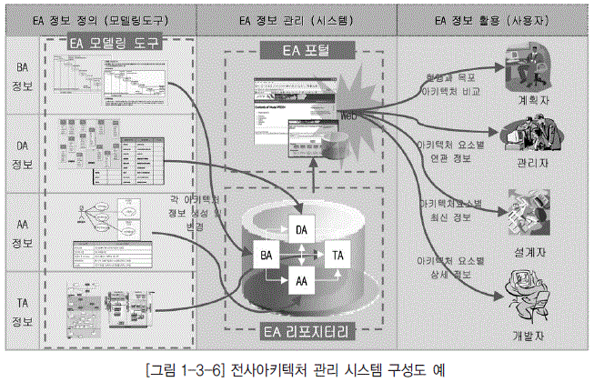

  * [그림 1-3-6] 전사아키텍처 관리 시스템 구성도 예" border="0

## 2. 전사아키텍처 정보 정의 도구

전사아키텍처 모델링 도구는 업무, 데이터, 애플리케이션, 기술아키텍처 정보를 도식화하여 표현 할 수 있는 모델링 도구를 말한다. 전용 전사아키텍처 모델링 도구일 수도 있고, 범용 데이터 모델링 도구나 애플리케이션 모델링 도구일 수도 있다. 전사아키텍처 정보를 모델링 도구로 사용하여 등록 하는 이유는 전사아키텍처 정보의 활용도를 높이기 위한 것인데, 경우에 따라서는 일반 문서화 도구 를 사용할 수도 있다. 전사아키텍처 정보가 각 관점과 뷰 간에 관계 정보까지 관리되어 상호운용성과 통합성 효과를 발휘하기 위해서는 전사아키텍처 모델링 도구가 사용되는 것이 바람직하다고 할 수 있다.

모델링 도구는 각종 다이어그램의 표현은 물론 프레임워크의 생성과 각 개체 간의 관계를 표현할 수 있는 기능을 제공해야 한다. 나아가 모델링 정보에 대한 질의와 보고서 생성 기능, 전사아키텍처 포털로 정보를 인터페이스할 수 있는 기능도 제공해야 한다.

## 3. 전사아키텍처 정보 관리 시스템

전사아키텍처 정보 관리 시스템은 아키텍처 정보를 저장하는 리포지터리와 전사아키텍처 정보를 사용자에게 배포하는 포털, 전사아키텍처 정보를 전문적으로 분석할 수 있는 추가적인 도구로 구성 된다.

  * [그림 1-3-7] 전사아키텍처 정보 관리 시스템 예" border="0

전사아키텍처 정보 관리 시스템은 전사아키텍처 정보에 대한 버전 관리, 전사아키텍처 정보의 현 행과 목표의 비교, 아키텍처 매트릭스나 참조 모델과의 연계, 전사아키텍처 사용자의 권한 관리, 전 사아키텍처 정보에 대한 활용 통계, 분석 및 의사결정 지원 기능 등을 포함한다. 전사아키텍처 정보 관리 시스템은 패키지 형태로 도입하여 커스터마이징을 하는 방법과 자체 시스템을 구축하는 방법이 있다. 장단점은 일반적인 패키지 도입과 자체 개발의 차이 관점에서 보면 된다.

전사아키텍처 관리 시스템은 유지 관리 효율성을 극대화하고 정보의 공유와 변경 관리를 수행하는 데 있어 편리한 정보 접근성을 제공한다. 그리고 전사아키텍처 관리 시스템 활용을 통하여 각 업무를 수행하는 사용자들에게 정보를 제공하여 업무와 IT의 연관 관계 분석 및 차이 분석을 쉽게 수행할 수 있게 한다. 또한 아키텍처 매트릭스 기반의 정보 제공으로 IT 담당자 간의 일관되고 일원화된 의사 소통을 가능하게 한다. 결국 전사아키텍처 관리 시스템은 전사아키텍처 구축의 목적인 IT 투자의 중 복성 제거 및 IT 자원의 재활용성을 극대화할 수 있게 한다.

전사아키텍처 정보 관리 시스템의 도입 효과는 다음과 같다.

* 첫째, 아키텍처 정보를 공유할 수 있어 해당 조직의 각 아키텍처 요소에 대해 이해 관계자들이 정 확하게 파악할 수 있다. 아키텍처별 최신 정보를 아키텍처 담당자의 관점에 맞게 정보를 제공할 수 있게 된다. 동시에 다수의 사용자에게 동일한 정보를 제공할 수 있고, 전사아키텍처 관리 시스템의 다양한 조회 기능을 통해 좀 더 빠르게 아키텍처 정보에 접근할 수 있다.

* 둘째, 의사소통 도구로 전사아키텍처 관리 시스템을 활용할 수 있다. 현업과 IT가 공유할 수 있는 모델을 전사아키텍처 관리 시스템을 통해 제공함으로써 현업과의 의사소통 시 오류를 줄일 수 있 다. 또한 아키텍처별 요소 간의 연관 관계를 파악하여 관련 업무 조직과 사전에 협의하여 문제를 사전에 인식함으로써 현업의 만족도를 높일 수 있게 된다.

* 셋째, 전사아키텍처 관리 시스템을 의사결정 도구로 활용할 수 있다. 업무와 IT 서비스 간의 차이 분석을 전사아키텍처 관리 시스템을 이용하여 할 수 있고, 현행 아키텍처와 목표 아키텍처 간의 차 이 분석을 손쉽게 할 수 있어, 시스템 개선과 관련해 좀 더 빠른 의사결정을 할 수 있게 된다.

## 1. 전사아키텍처 활용 개요

기업의 신규 IT 투자는 계속되고 있고, 기존 시스템의 유지보수 비용은 계속 증가하고 있다. 전사적인 아키텍처와 원칙이 없이 단위 업무 위주의 근시안적인 IT 투자가 계속될 경우 시스템은 중복개발 되고, 시스템간의 상호운용성이 떨어지게 된다. 이로 인하여 재구축과 재투자가 반복되고, 비즈니스와 정보기술의 변화에 제대로 대응할 수 없게 된다. 이러한 문제를 해결하기 위해서는 전사아키텍처를 구축하고 이를 적극적으로 활용할 수 있어야 한다.

전사아키텍처의 활용이 활성화 되기 위해서는 실제 전사아키텍처 정보가 IT 관리 업무에 실질적으로 활용될 수 있도록 해야 한다. 구축된 전사아키텍처 정보를 바탕으로 목표 아키텍처를 달성하기 위한 이행계획을 수립하고, 효율적인 IT 투자에 대한 의사결정과 IT 자원에 대한 관리가 수행되어야 한다.

전사아키텍처의 활용 영역은 크게 2개로 구분할 수 있다.

  * 목표 아키텍처 이행 계획

전사아키텍처 수립 후 목표 아키텍처를 달성하기 위한 이행계획을 수립하고 그에 따라서 프로젝트를 추진하는 것이다. 주로 새로운 시스템 추진을 목적으로 전사아키텍처를 수립하는 경우에 해당한다.

  * 전사아키텍처 정보 상시 활용

전사아키텍처 정보를 활용하여 일상의 IT 업무를 지원하는 것이다. 전사 아키텍처 정립을 통해 기업의 전반적인 IT 관리 수준을 증대하고자 하는 경우에 해당한다.

## 2. 목표 아키텍처 이행 계획

목표 아키텍처 이행 계획은 현행 아키텍처에서 목표 아키텍처로의 이행을 위한 전략을 수립하고 구체적인 이행 계획을 수립하는 것이다. 현행 아키텍처와 목표 아키텍처의 차이 분석을 통하여 프로젝트를 정의한다. 정의된 프로젝트들 간의 유사성과 상호연관성을 고려하여 우선 순위를 결정하고 이를 위한 이행전략과 세부 이행계획을 수립한다. 이를 성공적으로 추진하기 위한 변화관리 계획의 수립도 필요하다. 세부 이행 계획에는 필요 인력과 자원에 대한 리소스 계획과 추진 일정, 비용 계획 등이 포함된다.

목표 아키텍처 이행계획의 주요 활동 및 작업은 다음과 같다.

* 아키텍처 차이(Gap) 분석
  * 목표 및 현행 아키텍처 검토
  * 차이분석
  
* 프로젝트 정의
  * 프로젝트 목록 정의
  * 개별 프로젝트 별 필요 리소스 정의
  * 프로젝트 우선 순위 및 연관성 분석
  
* 이행 전략 수립
  * 프로젝트 이행에 필요한 단계별 이행 전략 대안 수립
  * 이행 전략 별 타당성 분석 및 대안 확정

* 이행 전략 수립
  * 프로젝트 별 추진 방법 정의
  * 프로젝트 별 상세 일정계획 수립

* 변화관리 계획 수립
  * 변화관리 대상 및 변화 요인 식별
  * 변화관리 계획 수립
  * 변화관리 교육 계획 및 자료 작성

## 3. 전사아키텍처 정보 상시 활용

전사아키텍처 정보 상시 활용은 기업이 전사아키텍처 정보를 구축하여 IT 업무 전반에 일상적으로 활용하는 것이다. 이를 위해서는 전사아키텍처 정보의 지속적인 개선 체계와 전사아키텍처 관리 시스템의 구축이 선행되어야 한다.

구축된 전사아키텍처 정보를 잘 활용하기 위해서는 적용 영역을 적극적으로 발굴하고, 업무 적용을 점점 확산해 나가야 한다. 전사아키텍처 정보는 IT 관리 생명주기에 해당하는 IT 기획 관리, IT구축 관리, IT 운영 및 통제 등 활동 전반에 활용된다.

[표 1-3-1] 전사아키텍처 정보 활용 영역 예

| 활용 유형 | 내용 |
|----|----|
| IT 기획 관리|◼ 업무 프로세스 혁신 : 비즈니스 변화와 정보기술 변화에 따르는 영향을 분석하여 대응하고, 조직 간의 업무 수행 범위 및 중복성 확인으로 업무 프로세스 개선 가능   ◼  정보화 계획 수립 : 정보화 전략 계획 수립 시에 활용할 수 있으며, 중복을 배제 한 효과적인 시스템 투자 계획 수립에 활용 |
| IT 구축 관리|◼ 프로젝트 계획 : 정보시스템 구축을 위한 구체적인 프로젝트 계획 수립 및 제안 요청서 작성 시 활용   ◼  시스템 개발 : 기존 시스템 개선 및 신규 시스템 개발을 위한 기준 및 참조 정보 를 제공하며, 시스템 간 연계성 및 재사용 대상을 식별할 수 있음 |
| IT 운영 및 통제|◼ 시스템 운영 : 시스템 장애 시에 전체 모습을 쉽게 파악할 수 있어 문제점을 신속 하게 찾아 낼 수 있으며, 시스템의 변경 시에 영향도를 파악할 수 있어 위험을 최 소화할 수 있음   ◼  IT 통제 : 도입되는 시스템이 전사 표준을 준수하는지를 통제함으로써 상호운용 성, 유지 보수 편리성 등을 확보함 |

### 가. IT 기획 관리

IT 기획 관리 활용은 중장기 정보화 계획, 단기 정보화 계획 수립 시 전사아키텍처 정보를 바탕으로 기업의 업무와 전략적 방향에 맞는 목표 시스템을 정의하고 추진계획을 수립한다. 이러한 추진 계획들은 전사아키텍처 정보를 기준으로 타당성이 검증되어야 하고 승인되어야 한다. 기업의 IT 추진방향에 맞는 IT 기획을 하기 위해서는 전사의 업무와 IT 아키텍처에 대한 이해가 필요하다. 전사아키텍처 정보는 이러한 정보 요구에 활용할 수 있다.

전사아키텍처 정보는 IT 투자에 대한 포트폴리오 관리에도 활용될 수 있다. IT 포트폴리오 관리란 기업의 비즈니스 전략, 정보기술의 변화, IT 투자 여력 등을 고려하여 기업의 사업 영역, 정보시스템 영역, 정보시스템 생명주기별로 적정한 투자가 이루어 질 수 있도록 IT 투자를 총체적으로 관리하는 것을 의미한다. 이 또한 전사아키텍처의 정보가 필요한 영역이다. 업종의 통합, 대형화, 세계화가 계속 진전되고 전사의 형태 있어 IT 투자도 변화에 대비하면서 적정한 투자가 이루어질 수 있도록 관리되어야 한다. 최근에 기업의 정보 자원이 효율적으로 배분하기 위한 IT 포트폴리오 관리의 필요성이 증대되고 있다.

### 나. IT 구축 관리

IT 구축 관리 활용은 시스템 분석, 설계, 구축, 이행 등의 모든 시스템 구축 생명주기 동안에 전사 아키텍처 정보를 바탕으로 범위를 정의하고, 애플리케이션 시스템을 설계하며, 데이터아키텍처를 정 의하고, 기술 체계를 선정하는 것을 말한다. 시스템 구축 과정에서 전사아키텍처 정보로 관리되고 있 는 원칙이나 표준, 아키텍처, 참조 모델 등이 참조되어 시스템의 중복을 배제하고 재사용성을 높이며 시스템의 통합성을 제고하고 IT 비용을 절약할 수 있게 된다.

한편, 기업 내 여러 개의 프로젝트가 항상 진행 중이므로 프로젝트 관리 능력이 중요하게 되었다. 정보시스템의 통합성이 중요하게 되었고 다양한 선진 기술이 적용됨에 따라 프로젝트 관리의 난이도 가 높아졌다. 따라서 전문적이고 독립적인 프로젝트 관리 기능이 필요하다. 이러한 기능이 수행되기 위해서는 먼저 관리의 기준이 정의되어야 하는데, 이러한 기준이 바로 전사아키텍처 정보라고 할 수 있다. 전사아키텍처 정보 대부분은 직접적으로 이러한 프로젝트 관리의 기준이 되며, 프로젝트의 변 화 관리 측면에서도 큰 활용성을 제공할 것이다. 시스템 구축이 완료되면 변경 사항을 전사아키텍처 정보에 반영하는 것도 매우 중요하다.

### 다. IT 운영 및 통제

IT 운영 및 통제 활용은 전사아키텍처의 현행 아키텍처 정보를 바탕으로 시스템을 운영하고, 사용 자의 개선 또는 추가 요구 발생 시 전사아키텍처 정보를 바탕으로 수용 또는 적용 방안을 결정하여 시스템 변경에 반영하는 것이다. 시스템 운영 시 성능 문제나 장애 발생 시 신속한 파악과 해결에 전 사아키텍처 정보는 매우 유용한 정보가 될 수 있다.

전

사아키텍처 정보는 시스템의 도입 및 폐기의 근거 자료가 될 수 있으며, 운영상에 발생하는 이슈 의 경중을 가릴 수 있는 정보로도 활용할 수 있다. IT 서비스의 품질 지표가 아키텍처 프로세스와 연 관되어 IT 업무에 대한 주기적인 평가와 보완이 이루어지고, 피드백이나 실행을 통해 도출된 보완 내용이 정보 전략이나 예산 프로세스에 제공될 수 있다.

## 4. 전사아키텍처 효과적 활용 방안

전사아키텍처 도입 초기에는 일반적인 기대 효과를 중심으로 활용되지만, 시간이 지나면 다양한 요구가 발생할 수 있다. 이에 따라 경우에 따라서는 프레임워크나 아키텍처 매트릭스의 변경이 발생할 수 있다. 전사아키텍처 구축 후 활용이 지속되고 기업의 전사아키텍처 성숙도가 높아지면, 요구 수준도 높아지며, 경우에 따라서는 전반적인 개선이 필요할 수도 있다.

전사아키텍처 정보가 좀 더 효과적으로 활용되기 위해서는 다음과 같은 사항이 고려되어야 한다.

* 전사아키텍처 정보 자체의 품질이 보장되어야 한다. 현행 및 목표 시스템의 상황이 아키텍처 정보 에 항상 최신의 상태로 정확히 반영되어야 한다.

* 전사아키텍처 정보를 관리하고 적용을 통제할 수 있는 전담 조직이 구성·운영되어야 한다. 이 조 직은 전사아키텍처 정보에 품질과 활용도 제고를 책임지며, 필요시 전사아키텍처 정보의 근거 자료 를 제시할 수 있어야 한다.

* 전사아키텍처 정보를 전사적으로 공유하고 활용할 수 있는 절차와 시스템이 필요하다.

전사아키텍처의 도입은 정보화에 대한 일시적이고 단편적인 개선이 아니라 좀 더 정확한 정보를 바 탕으로 통합되고 일관성 있게 정보화를 계획, 실행, 검증 및 평가하는 체계를 갖추는 것이다.

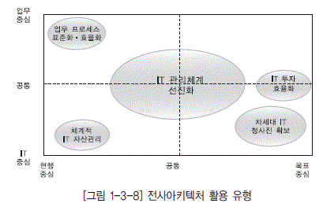

  * [그림 1-3-8] 전사아키텍처 활용 유형

전사아키텍처 구축은 일정 기간의 프로젝트를 통해 수행되지만 중요한 것은 전사아키텍처 정보가 활용되어야 한다는 사실이다. 기업의 모든 자원을 효과적으로 활용하고 투자에 대한 적절한 활동을 수행하기 위해서는 전사아키텍처가 정확한 기준 정보로서 제공되어야 한다. 이를 위해서는 활용 목 적에 따라 정확하게 각 아키텍처 도메인을 정의해야 하고, 정의된 전사아키텍처를 유지하기 위해 더 많은 노력을 해야 한다.

이와 같이 전사아키텍처에 대한 지속적인 관리 및 평가 활동을 통해 기업들은 궁극적인 IT 혁신을 달성할 수 있다.

## 5. 전사 아키텍처와 데이터아키텍처 전문가 영역

### 가. 전사아키텍처와 데이터아키텍처 프레임워크

데이터아키텍처 전문가의 영역은 데이터아키텍처 전반에 관한 것으로, 광의의 데이터아키텍처 영역과 일치한다고 할 수 있다. 광의의 데이터아키텍처 영역은 데이터아키텍처 원칙, 데이터아키텍처정보, 데이터아키텍처관리 등을 포함한다. [그림 1-3-7]는 전사아키텍처 프레임워크를 참조한 광의의 데이터아키텍처 프레임워크의 예이다.

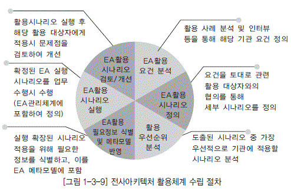

  * [그림 1-3-9] 전사아키텍처 활용체계 수립 절차

데이터아키텍처 전문가(DAP, Data Architecture Professional)는 데이터아키텍처를 정의하는데 있어 기업에서 정의한 전사아키텍처 정보와 항상 연계하여 생각해야 한다. 전사아키텍처에서 정의된 원칙과 정보, 관리 체계를 준수해야 하며 데이터아키텍처 분야에서 더욱 구체화하고 그것을 관리할 수 있어야 한다. 또한 데이터 부문에서 발생하는 변경사항이 전사아키텍처 정보에 잘 반영될 수 있도록 항상 관심을 가져야 한다.

데이터아키텍처 담당자는 전사아키텍처 프레임워크를 바탕으로 데이터아키텍처 프레임워크를 상세화하고 구체화할 임무를 가지고 있다. 데이터아키텍처 정책의 데이터아키텍처 매트릭스, 데이터아키텍처 비전, 데이터아키텍처 원칙 및 표준을 더욱 구체화하고 그 내용을 정의할 수 있어야 한다. 데이터아키텍처 정보의 데이터 구조, 데이터 흐름, 데이터 활용, DB 관리, 데이터 품질 등도 데이터 관리자의 업무 프로세스와 연계하여 구체화하고 그 내용을 정의할 수 있어야 한다. 데이터아키텍처 관리의 관리 체계, 메타 데이터 관리 시스템, 평가 부문도 데이터의 효율적 관리와 효과적 활용을 위해서 잘 이해하고 있어야 할 영역이다.

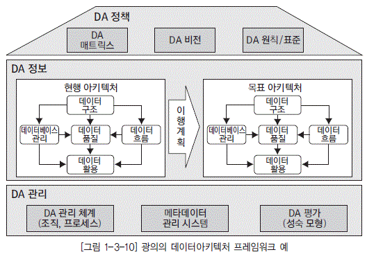

  * [그림 1-3-10] 광의의 데이터아키텍처 프레임워크 예

### 나. 전사아키텍처와 데이터아키텍처

기업의 데이터아키텍처가 진정 의미 있기 위해서는 전사 아키텍처와 통합이 이루어져야 한다. 통합의 유형에는 3가지가 있다. 전사아키텍처 전체와 범위가 일치되어야 하고, 타 아키텍처 영역와 연계가 잘 되어야 하고, 상위 아키텍처와 하위 아키텍처가 잘 연계되어야 한다.

  * [표 1-3-2] 전사아키텍처와 데이터아키텍처의 통합성 예

전사아키텍처 관련 데이터아키텍처가 이루어야 할 3가지의 통합성은 다음과 같다.

* 범위 통합

전사아키텍처 범위 전체에 대한 각 모델 내의 불일치성을 제거하는 것이다. 중복개발의 반대 개념이며, IT 투자의 효율성을 제고하는 원천이 된다.

* 수평 통합

관련된 타 영역과의 불일치성을 제거하는 것이다. 운영의 조화와 관련되어 있고 IT 투자의 효과성을 제고하는 원천이 된다.

* 수직 통합

계획자, 책임자, 설계자, 개발자간의 불일치성을 제거하는 것이다. 요구 사항에 대한 일치, 정렬(Alignment) 개념과 관련되어 있고 IT 투자의 품질 을 제고하는 원천이 된다.

* 제1절 전사아키텍처 관리 체계
  * 전사아키텍처를 도입할 때 아키텍처 정보를 정확하게 구축하는 것도 중요하지만, 더 중요한 것은정보를 관리하고 활용할 수 있는 체계를 정립하는 것이다. 전사아키텍처 관리 체계는 전사아키텍처를 유지 관리하는 조직과 프로세스 측면의 기반을 구축하는 것을 포함한다.
  * 전사아키텍처 관리 조직 체계는 관리를 위해 필요한 직무와 직무 간의 관계, 업무 분장을 정립하는 것이다. 전사아키텍처 관리 프로세스 체계는 전사아키텍처를 수립하고 관리하기 위한 활동을정의하는 것이다. 전사아키텍처 인력 관리 체계는 전사아키텍처 관리를 담당하는 직무별 역량을정의하고 이를 확보하기 위한 방안을 정의하는 것이다.
  * 전사아키텍처 관리 체계 정착을 위해서는 장기적인 접근이 필요하다. 전사아키텍처 수립 효과는IT 관련 조직만의 노력으로 달성될 수 없으며 전사적인 추진 체게가 구축되어야 한다.

* 제2절 전사아키텍처 관리 시스템
  * 전사아키텍처 관리 시스템은 전사아키텍처 정보를 구축, 관리, 활용하는 모든 업무 프로세스를 효과적으로 지원하기 위한 시스템을 말한다.
  * 전사아키텍처 관리시스템은 전사아키텍처 정보를 생산하는 모델링 도구 영역, 정보를 저장 관리하는 전사아키텍처 리포지터리, 정보를 활용하는 전사아키텍처 포털, 전사아키텍처 정보 활용 영역으로 구분할 수 있다.

* 제3절 전사아키텍처 활용
  * 전사아키텍처가 활성화되기 위해서는 실제 IT 관리 업무에 실질적인 도움을 줄 수 있어야 한다.이를 위해서는 구축된 전사아키텍처 정보를 바탕으로 IT 투자에 대한 의사결정이 이루어지고, 전사의 모든 IT 자원의 관리가 이를 기준으로 이루어질 수 있도록 전사아키텍처 활용을 활성화하려는 적극적인 노력이 필요하다.
  * 전사아키텍처의 활용 영역은 크게 2개로 구분할 수 있다. 전사아키텍처 수립 후 목표 아키텍처를달성하기 위한 이행 계획을 수립하고 그에 따라서 프로젝트를 추진하는 기준으로 삼는 것과 전사아키텍처 정보를 활용하여 일상의 IT 업무를 지원하는 것이다.
  * 데이터아키텍처 전문가는 기업에서 정의한 전사아키텍처 정보와 항상 연계하여 생각하고, 전사아키텍처에서 정의된 원칙을 준수하고 전사아키텍처를 기준으로 데이터아키텍처를 구체화하고 관리할 수 있어야 한다. 또한 데이터 부문에서 발생하는 변경 사항이 전사아키텍처 정보에 잘 반영되도록 해야 한다.

문제 1. 전사아키텍처 관리 체계 구축에 대한 설명으로 가장 적절치 않은 것은?
① 전사아키텍처 관리 체계는 전사아키텍처를 유지 관리하기 위한 조직과 프로세스 측면의 기반을 구축하는 것이다. 
② 전사아키텍처 관리 체계는 '전사아키텍처 거버넌스' 라고도 한다.
③ 전사아키텍처 관리 체계는 IT 관리 체계를 포괄하는 더 큰 개념이다. 
④ 전사아키텍처 관리 체계 정착을 위해서는 현업부서도 전사아키텍처를 이해하고 전사아키텍처 정보를 활용하며, IT 혁신에 대한 적극적인 의견을 제시할 필요가 있다.

문제 2. 구축된 전사아키텍처 정보를 효과적으로 활용하기 위해서 고려되어야 할 사항 중 가장 관계가 먼 것은?
① 전사아키텍처 관리 조직과 프로세스, 직무를 정립한다. 
② 전사아키텍처 참조 모델을 열심히 찾아 본다. 
③ 전사아키텍처 관리 시스템을 구축하여 적극 활용한다. 
④ 전사아키텍처 활용에 대하여 구체적인 범위와 활용의 예를 정립한다.

문제 3. 전사아키텍처 관리 시스템에 대한 설명 중 가장 적절치 않은 것은?
① 전사아키텍처 관리 시스템을 의사소통 도구나 의사결정 도구로 활용하는 것은 적절치 않다. 
② 전사아키텍처 관리 시스템은 전사아키텍처 정보를 구축하고, 관리하고, 활용하는 모든 전사아키텍처 업무 프로세스를 효과적으로 지원하기 위한 시스템이다. 
③ 전사아키텍처 관리 시스템은 전사아키텍처 모델링 도구, 전사아키텍처 리포지터리, 전사 아키텍처 포털 등으로 구성된다. 
④ 전사아키텍처 관리 시스템 활용을 통하여 업무와 IT의 연관 관계 분석 및 차이 분석을 수행할 수 있다.

문제 4. 전사아키텍처 이행 계획의 핵심 작업 내용과 가장 거리가 먼 것은?
① 아키텍처 차이 분석
② 프로젝트 정의
③ 이행 전략 수립
④ 전사아키텍처 관리 시스템의 발주

문제 5. 전사아키텍처 활용의 영역을 구분한 것 중 가장 부적절한 것은?
① IT 기획 관리 - IT 구축 관리 - IT 운영 및 통게 활용
② 아키텍처 이행 계획 - 일상적 IT 업무 활용 
③ IT 비용 산정 - IT 수익 산정 활용
④ 비즈니스 사용자의 활용 IT 사용자의 활용

## 1. 정의

정보 요구 사항이란 사용자가 일상적으로 수행하는 업무의 개선 사항이나 신규 개발 사항으로 시 스템을 통해 기능상의 목적을 달성하기 위해 요청하는 내용이다. 이러한 정보 요구 사항들은 현행 시 스템 분석, 사용자 요구 사항 수집, 제안 요청서, 사업 수행 계획서 등을 이용하여 수집 가능하다. 사용자의 정보 요구 사항을 정해진 일정과 비용 범위 내에서 사용자가 원하는 시스템으로 개발하기 까지는 많은 어려움이 존재한다.

현실적인 개발 환경에서 프로젝트의 성공을 위해서는 불완전하고 애매모호하게 정의된 정보 요구 사항, 현실성을 배제한 이상적인 정보 요구 사항, 특정 사용자만을 위한 정보 요구 사항들은 프로젝 트 초기 단계부터 정확한 요건 분석이 이루어져야 한다. 잘못 분석되고 설계된 정보로 시스템을 개발 한다면 사용자 요구 사항을 만족하지 못하는 시스템이 되고, 이는 사용자가 사용하지 않기 때문에 처 음부터 다시 설계하고 개발해야 하는 위험과 추가적인 비용을 지불하게 된다.

Standish Group 조사 결과에 의하면 사용자 정보 요구 사항에 대한 중요성을 확인할 수 있다. 일 반적으로 성공했다고 이야기하는 프로젝트와 실패했다고 이야기하는 프로젝트 모두 사용자 정보 요 구 사항에 대한 철저한 분석 및 변화 관리가 주요한 요인으로 작용했다. 전체 프로젝트의 29%만이 계획된 예산 내에서 납기를 준수하고, 원하는 기능과 요구 사항을 달성했다. 프로젝트의 18%는 프로 젝트 완료 전에 또는 사용자들이 사용해 보기도 전에 취소되는 경우이고, 53%의 프로젝트는 표면상 으로는 성공하였으나 내면적인 부분을 살펴보면 납기가 지연되거나 예산이 늘어나거나 기능 및 품질 에 문제가 있어 실질적인 성공으로 보기 어렵다.

  * [그림 2-1-1] 프로젝트 결과 예(2004 Standish Group Report)

[그림 2-1-1]의 3가지 사례를 초래한 각 프로젝트의 원인을 다시 한 번 살펴보면 공통적으로 사용 자의 정보 요구 사항에 대한 중요도를 알 수 있다. 따라서 현업 사용자들이 이야기하는 정보 요구 사 항을 IT 업무 담당자들은 처음부터 철저하게 이해하고, 무슨 내용이며 어떤 기능들을 요구하는지 정 확하게 분석하기 위해 많은 시간과 노력을 집중해야 한다.

  * [그림 2-1-2] 사용자 요구 사항의 중요성(2004 Standish Group Report)

더욱 구체화되고 다양화되는 사용자 정보 요구 사항과 복잡해진 정보시스템의 현행을 정확하게 분 석하고 이해할 수 있는 능력이 데이터아키텍처 전문가에게 필요하다.

## 2. 정보 요구 사항 생명주기 모형(Life Cycle)

정보 요구 사항의 생명주기 모형은 [그림 2-1-3]과 같이 정보 요구 사항 수집, 정보 요구 사항 분 석 및 정의, 정보 요구 사항 상세화, 정보 요구 사항 검증으로 구성된다. 생명주기 모형을 반복적으 로 수행하여 사용자 정보 요구 사항이 정보시스템에 누락 없이 반영되어야 한다.

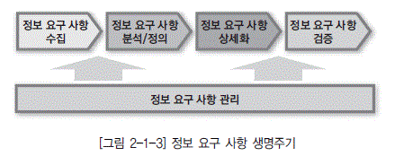

  * [그림 2-1-3] 정보 요구 사항 생명주기

### 가. 정보 요구 사항 수집

사용자의 정보 요구 사항을 수집하는 단계로서 사용자 인터뷰, 설문서, 워크숍, 현행 시스템 분석 등을 통해 수집한다.

### 나. 정보 요구 사항 분석 및 정의

사용자로부터 수집된 정보 요구 사항을 정리하고 방법론에서 제시하는 다양한 기법을 이용하여 분석해서 정보 요구 사항을 정의하는 단계이다.

### 다. 정보 요구 사항 상세화

확정된 정보 요구 사항의 개별 사항에 대하여 세밀하게 분석하고 기록하는 단계이다.향후 사용자 의 정보 요구 사항이 정보시스템에 정확하게 반영될 수 있도록 상세하게 작성한다.

### 라. 정보 요구 사항 검증

사용자의 정보 요구 사항을 비즈니스 관점, 조직 관점, 애플리케이션 관점과 상관분석을 통해 누락 없이 반영되었는지를 검증하는 단계이다.

## 3. 정보 요구 사항 유형

사용자의 정보 요구 사항을 유형별로 4가지로 나누어 보면 기능 개선 요건, 성능 개선 요건, 외부 인 터페이스 요건, 보안 개선 요건 등으로 구분할 수 있으며, 신규 업무에 대한 추가 및 기존 업무에 대한 개선 사항이 대부분의 요구 사항으로 도출되는 점을 감안할 때 기능 개선 및 성능 개선 요건이 많은 비 중을 차지한다. 각각의 종류별 정의, 관리 기준, 관리 방법 측면에서 정리해 보면 [표 3-1-1] 과 같다.

[표 2-1-1] 정보 요구 사항 유형

| 유형 | 구분 | | 설명 |
|----|----|----|----|
|외부 인터페이스 요건 | 정의||시스템의 모든 입·출에 관한 요건으로서 대외기관으로부터 수신 및 대외기관으로 송신하는 입출력 방식이 추가 및 변경되었을 경우와 각종 제도 및 기준 등이 변경되었을 경우에 발생하는 요건이다. |
||관리 기준 | 중복성 | 기존에 동일한 형태의 인터페이스가 존재하는지 체크한다. |
||| 표준 준수도 | 인터페이스와 관련된 국제 표준 및 국가 표준이 존재할 경우, 그에 적합한 형태로 제공해야 한다. |
|| 관리 방법||항목 이름, 목적 설명, 입력의 원천 및 출력의 방향, 유효 범위, 시간, 다른 입/출력과의 관계, 데이터 포맷, 최종 메시지 등이 포함되어 관리되어야 한다. |
|기능 개선 요건 | 정의||시스템에서 입력을 받아들여 처리하고 출력을 만들어 내는 주요 활동 및 프로세스에 대한 요건이다. |
||관리 기준 | 불가 변성 | 기능 개선 요건이 향후에 재변경되지 않도록 근본적인 개선 방안을 요청해야 한다. |
||| 범용성 | 많은 사용자가 편리하게 사용할 수 있는 요건을 우선적으로 요청해야 한다. |
|| 관리 방법||입력에 대한 유효 체크, 정확한 처리 순서, 비정상 상태에 대한 반응(오버플로우, 통신 장비, 에러 처리), 매개변수의 기능, 출력과 입력의 관계, 입출력 순서, 입력을 출력으로 변환하는 공식 등이 포함되어 관리되어야 한다. |
|성능 개선 요건 | 정의||사용자가 원하는 성능 개선 사항으로는 동시 사용자 수, 처리하는 정보의 양과 종류, 트랜잭션 소요 시한 등이 있다. |
||관리 기준 | 실현 가능성 | 해당 성능 개선 요구 사항이 현행 기술 수준과 서비스 특성을 고려할 때 구현 가능한 요건인지를 확인한 후 제시되어야 한다. |
||| 측정 가능성 | 측정이 불가능한 모호한 형태로 요건이 제시되면 안 된다. |
|| 관리 방법||각 기관의 서비스 특성을 고려하여 정적, 동적 기준을 마련하고 해당 기준에 맞게 서비스되고 있는지를 모니터링 작업을 통해 항시 관리해야 한다. |
|보안 개선 요건 | 정의||중요 데이터에 대한 훼손, 변조, 도난, 유출에 대한 물리적 접근 통제(제한구역, 통제구역 등) 및 사용 통제(인증, 암호화, 방화벽 등)에 대한 요건을 말한다. |
||관리 기준 | 불가 변성 | 보안 개선 요건이 향후에 재변경되지 않도록 근본적인 개선 방안을 요청해야 한다. |
||| 실현 가능성 | 해당 보안 개선 요구 사항이 현행 기술 수준과 서비스 특성을 고려할 때 구현 가능한 요건인지를 확인한 후 제시되어야 한다. |
|| 관리 방법||가장 먼저 보안 관리가 필요한 정보에 대한 등급 관리가 필요하며, 해당 등급별로 접근 가능한 이용자 등급 관리가 필요하며 접근 방식에 있어서의 접근 통제 기준 및 사용 통제 기준이 제시되어야 한다. 해당 기준에 따라 모니터 작업을 통해 안정적인 서비스가 제공될 수 있도록 관리해야 한다. |

## 1. 정의 및 관리 목적

* 정보 요구 사항을 비롯하여 관련 애플리케이션 및 시스템 전반에 걸친 사용자의 요구를 수집하고 분류하여 반영하는 작업 절차를 말한다. 정보 요구 사항을 종합적으로 검토, 확인함으로써 요건에 맞는 정보시스템을 개발하여 사용자의 만족도를 높인다.

* 정보 요구 사항 관리는 데이터, 애플리케이션, 비즈니스 등의 요구 사항을 전부 포함하는 통합 관리 프로세스를 정립해야 한다.

## 2. 정보 요구 사항 관리 프로세스

### 가. 업무흐름 프로세스

사용자로부터 정보 요구 사항을 접수하고, 반영 여부를 결정하여 통보하고, 최종적으로 시스템 개 발로 완료되는 전체적인 업무 흐름 프로세스는 [그림 2-1-4]와 같다.

  * [그림 2-1-4] 정보 요구 사항 업무 흐름 프로세스

* 요구 사항 발송

사용자가 정보시스템을 활용하면서 발생하는 불편 사항이나 신규 개발 사항 등의 요건을 정보 요 구 사항 정의서 양식에 기록하여 정보시스템 담당자에게 발송한다. 정보 요구 사항 정의서는 [그림 2-1-5]와 같이 구성할 수 있다.

* 요구 사항 수렴

사용자로부터 접수한 정보 요구 사항 정의서를 수집하여 규칙에 맞게 정확하게 정의했는지 확인하 고, 해당 요건을 검토할 처리 담당자를 지정하여 이송한다.

* 요구 사항 검토

요청된 정보 요구 사항과 관련된 자료 및 작성 기준, 구성요소, 원칙 등을 확인해서 반영 여부를 판단한다. 반영이 가능한 경우는 개발 물량, 협조 담당자, 관련자 등의 영향도 분석을 한다. 반영이 불가능한 경우는 미반영 사유와 함께 요건을 발송한 담당자에게 재전달하여 결과를 알 수 있게 한다.

* 영향도 분석

요청된 내역을 토대로 신규 개발 및 변경에 따른 영향이 얼마나 되며, 이로 인해 영향을 받는 설계서, 기존 애플리케이션, 데이터베이스 등을 파악해서 영향도 분석을 마무리한다.

* 공식화

영향도 분석 후 관련되는 담당자를 소집하여 의견을 공유하고, 담당자들과의 협의를 통해 반영 유형을 결정한다. 반영 유형은 규모 및 기간, 시급성에 따라 결정되며 처리 방법은 신규 시스템 개발 또는 기존 시스템 변경에 의해 발생한다.

* 반영 작업 계획 수립

영향 분석 결과를 근거로 업무 영역 및 관련 담당자들과의 미팅 후 반영 계획을 수립한다. 작업 일정 계획에는 표준과 설계서 변경, 데이터베이스 및 애플리케이션 수정, 테스트, 이관 등의 작업이 명시되어야 한다.

  * [그림 2-1-5] 정보 요구 사항 정의서 예

### 나. 수행 조직 및 수행 업무

사용자 정보 요구 사항을 반영하기 위해 필요한 역할별 담당 업무는 [표 3-1-2]과 같다.

[표 2-1-2] 역할별 담당 업무

| 역할 | 담당업무 |
|----|----|
| 사용자 | ◼ 정보 요구 사항 정의 및 상세화 ◼  정보 요구 사항 변경 요청 ◼  정보 요구 사항 반영을 위한 미팅 ◼  정보 요구 사항 반영 여부 확인 ◼  미결 사항에 대한 의사결정 실시 |
| 담당자 | ◼ 사용자 정보 요구 사항 접수 ◼  사용자 정보 요구사항에 대한 기본적인 검토 ◼  반영 여부 결정을 위한 사용자와 1차 미팅 ◼  접수 요건에 대한 처리 방식 및 처리 기한 결정 ◼  관련 부서별 담당자 수집 및 요건 협의 주도 ◼  사용자 정보 요구 사항 반영 ◼  테스트 및 검증 ◼  사용자 반영 결과 통보 |
| 데이터 아키텍처 전문가 | ◼ 사용자 정보 요구 사항에 대한 표준/데이터베이스/애플리케이션 차원에 대한 영향도 분석 및 보고 ◼  접수된 요구 사항에 대한 표준 준수 여부 체크 ◼  영향도 분석을 통한 수정 및 변경 계획 수립 ◼  표준 제시 및 준수 여부 검토 |

* 제1절 정보 요구 사항
  * 사용자의 정보 요구 사항이란 사용자가 일반적으로 수행하는 과정에서 정보시스템 개발의 필요성에 의해 수집되고 요약된 요청 사항이다.
  * 정보 요구 사항은 요구 사항 수집, 요구 사항 분석 및 정의, 요구 사항 상세화, 요구 사항 검증의 단계로 진행된다.
  * 사용자의 정보 요구 사항을 유형별로 분류하면 인터페이스 요건, 기능 개선 요건, 성능 개선 요건, 보안 개선 요건의 4가지로 분류할 수 있다.

* 제2절 정보 요구 사항 관리
  * 정보 요구 사항은 통합적인 관점에서 관리되어야 하며, 데이터나 애플리케이션 한쪽만 반영된 요구 사항 관리는 적절하지 못하다.
  * 정보 요구 사항을 관리하기 위한 프로세스는 6개의 주요 모듈로 이루어져 있다(요구 사항 발송, 요구 사항 수렴, 요구 사항 검토, 영향도 분석, 공식화, 반영 작업 계획 수립).
  * 사용자 정보 요구 사항을 반영하기 위해 사용자는 요청 사항 중 미결 사항이 있는 경우 담당자와 확인을 통해 확정해야 한다.
  * 데이터아키텍처 전문가는 전체적인 표준 및 애플리케이션에 대한 영향도 분석을 한다.

문제 1. K대리는 그 동안 현장에서 영업을 하면서 불편했던 업무적인 보완사항과 신규 개발사항들을 이번 프로젝트를 통해서 시스템에 적용하고자 한다. 다음 중 이러한 상황에서프로젝트 팀에게 전달해야 문서로 적합한 것은?
① 정보 분석서
② 정보 요구 사항
③ 정보 목록
④ 정보 항목 분류표

문제 2. K대리는 전사 자원관리 프로젝트를 위해 사내 부서들과 사전 협의를 통해 분석 단계의 주요 소스로 사용될 사용자 및 시스템 관점의 정보 요구 사항들을 수집하고 있다.다음 중 현 단계의 문서로 부적합한 것은?
① 현행 시스템 분석서
② 현행 사용자 요구 사항 정리문서
③ 현행 업무처리 매뉴얼
④ 현행 시스템 개선과제 및 문제점 정리문서

문제 3. A기업은 재무정보시스템 구축 프로젝트의 분석단계에서 사용자의 정보 요구 사항을수집 및 정리하는 작업을 진행 중이다. 수집된 정보 요구 사항을 정리하는 과정에서정보 요구 사항의 유형을 외부 인터페이스, 기능, 성능, 보안 등의 개선요건으로 구분하였다. 다음 중 정보 요구 사항 유형에 대한 관리기준으로 부적절한 것은?
① 외부 인터페이스 : 기존과 동일한 형태의 인터페이스 존재 여부
② 보안 개선 : 측정이 불가능한 형태 판단 여부
③ 기능 개선 : 많은 사용자가 편리하게 사용할 수 있는 요건의 우선 적용 여부
④ 성능 개선: 현행 기술 수준과 서비스 특성을 고려한 구현 가능 여부

문제 4. 기획부서로부터 '월별 영업점 상품 실적' 화면에 대한 수정·보완 의뢰서를 접수하였다. 다음 중 이를 반영하기 위해서는 어떤 영향을 미치는지 전체적인 영향도 분석 및조사를 실시하기에 가장 적합한 사람은?
① 요구 사항을 요청한 사람
② 전사 관점의 데이터아키텍처 담당자
③ 요구 사항을 개발하는 담당자
④ 담당 부서의 관리자

문제 5. A기업의 H대리는 회계팀 P과장으로부터 현행 시스템의 불편사항을 해결해달라는 요건을 접수받았다. P과장의 불편사항 중 하나는 매일아침 당일의 B/S(재무제표) 실적을 조회하는데, 동시 사용자 수가 많아서 처리시간이 과다하게 소요되어 불편하다는것이었다. 다음 중 접수받은 요건을 분류하여 담당자에게 할당하려고 할 때, 분류 유형으로 적합한 것은?
① 보안 개선 요건
② 성능 개선 요건
③ 기능 개선 요건
④ 외부 인터페이스 개선 요건

## 1. 정보 요구 사항 수집 형태

* 사용자 정보 요구 사항을 파악하기 위한 방법은 다양하다. 사용자와의 인터뷰를 통한 직접적인 수 집도 가능하지만 현업 사용자가 업무에 대한 기준이나 절차를 알아보기 위해 사용하는 업무 매뉴 얼을 통해서도 요구 사항을 도출할 수 있으며, 정보시스템을 사용하기 위한 전산 처리 매뉴얼, 기 존 정보시스템의 산출물 등 다양한 형태의 자료로부터 현행 정보시스템 및 사용자 요구에 대한 정 보를 수집할 수 있다.

* 사용자 정보 요구 사항 수집을 위한 다양한 소스 형태
  * 관련 문서 수집
  * 사용자 면담을 통한 수집
  * 워크샵을 통한 수집
  * 현행 업무 처리 매뉴얼을 통한 수집
  * 현행 정보시스템 관련 산출물을 통한 수집

## 2. 관련 문서 수집

관련 문서에는 업종에 대한 이해에 도움이 되는 자료, 기업에 대한 전체적인 상황 이해시 도움이 되는 자료, 사용자가 업무 처리를 위해 참고로 하는 상세한 업무 매뉴얼, 업무 처리시 활용하는 정보 처리 매뉴얼, 정보시스템으로부터 산출되는 보고서 및 각종 장표, 처리 화면 등이 포함되며 본 자료 를 수집하고 체계적으로 분석해서 정리함으로써 사용자 정보 요구 사항을 파악한다.

### 가. 문서수집 목적

구현 시스템의 대상과 범위를 좀더 명확하게 정의하고 기업과 업종에 대해 잘 이해하기 위하여 업종, 경영 전략, 정보시스템 등에 대한 과거 실적 자료 및 향후 계획 등의 자료를 수집한다.

### 나. 문서 수집 자료

정보 요구 사항에 도움이 되는 자료의 종류 중 대표적인 자료는 다음과 같다.

  * 경영 계획에 대한 자료

예) 중장기 경영 전략, 향후 3년에 대한 경영 계획서

  * 정보시스템에 대한 자료

예) 현행 발행 보고서, 전산 처리 의뢰서

  * 과거 수행한 컨설팅 보고서

  * 전산처리 업무 매뉴얼

  * 현업부서 업무 자료

예) 실무 교육 자료

### 다. 문서수집 원칙

  * 문서는 기존에 보유하고 있는 문서를 변형하지 않고 수집하고, 정보시스템에 대한 자료는 별도의 정리 양식을 이용하여 작성한다.

  * 수집된 문서를 바탕으로 경영 및 정보시스템 현황에 대한 요약표를 작성하여 그 내용을 숙지한다.

  * 수집된 문서들은 계획 수립 기간, 문서 관리자를 지정하여 운영한다.

  * 유형별 문서를 향후 활용을 위하여 문서 분류 방식을 결정한 후에 일정한 장소에 보관한다.

  * 수집된 문서는 통상 대외비의 성격이 강하므로 개인별로 보관하는 것을 통제하고 문서 보안 관리에 주의한다.

## 3. 사용자 면담

면담은 분석가가 특정 관점에서의 업무 요건이나 업무 절차를 조사하기 위하여 일반적으로 한 명 (혹은 두 명)의 실무자와 대면하여 질의와 응답을 통해 정보를 수집하는 방법이다. 특히 프로세스와 프로시저에 대한 이해를 얻기 위한 준비 단계 또는 워크숍 진행을 돕기 위한 준비 단계에 유용하다. 실무자와의 개별적인 면담은 워크숍보다 훨씬 융통성이 있으며 진행 측면에 있어서도 유연한 진행이 가능하다. 또한 전체 프로젝트의 범위를 커버하는 측면에 있어서도 면담이 워크숍보다 뛰어나다. 참여자에게 적은 시간을 할당함으로써 일정 수립이 용이하여 누락된 부분이 발견되었을 때 추가적인 면담의 계획 및 준비가 쉽게 이루어질 수 있다.

### 가. 사용자 면담 진행

사용자로부터 중요한 업무 내용을 수집하며 사용자들로 하여금 시스템 개발에 대한 관심과 신임을 고조시키고, 시스템 개발에 필요한 분야의 전문가와 대화를 통해서 필요한 정보를 수집하기 위해 면담을 진행한다.

  * [그림 2-2-1] 면담 절차

#### 1) 계획 및 준비

* 가) 면담 주제 선정
  * 면담 주제는 수행 대상 작업과 면담 대상자의 책임 수준에 따라 결정한다. 면담 대상자 및 대상 작업별로 면담 주제에 따라 면담 요지를 작성한다. 면담 요지를 통하여 면담 대상자는 적절한 답변을 미리 준비할 수 있다. 상상에 의한 답변을 최소화할 수 있으며, 면담 시간도 절약할 수 있다.
  * 질문 항목은 면담을 통해 얻고자 하는 것이 무엇인지를 명확히 선정하며, 면담 대상자가 이해하기 쉽고 질문 항목에 따라 자유로운 의사개진을 할 수 있도록 구성한다. 면담 요지는 면담 개시 1주일 전에 미리 면담 대상자에게 배포하여 면담 대상자가 답변 내용이나 관련 자료 등을 미리 준비할 수 있도록 한다.현업 부서용 면담 요지는 다음과 같은 내용을 포함하도록 한다.
  * 면담의 취지, 목적, 수행 방법, 시간 등
  * 프로젝트의 개요: 목표, 범위, 기간, 조직
  * 업무의 향후 수행 방향에 대한 의견
  * 면담 대상자가 소속된 부서의 업무 현황 및 개선 요구 사항
  * 현재 사용하는 정보시스템에 관한 의견
  * 프로젝트에 관한 의견 : 요구 사항, 프로젝트 참여 방안 등
 전산 부서용 면담 요지는 다음과 같은 내용을 포함하도록 한다.
  * 면담의 취지, 목적, 수행 방법, 시간 등
  * 프로젝트의 개요 : 목표, 범위, 기간, 조직
  * 기획 분야 현황 및 계획 : 전산 부서 조직 및 인력, 연혁, 계획, 문제점, 과제 등
  * 시스템 분야 현황 및 계획 : 조직 및 인력, 시스템 구성, 네트워크 구성, 시스템 운영 절차, 향후 계획, 문제점 및 과제 등
  * 애플리케이션 분야 현황 및 계획 : 조직 및 인력, 애플리케이션 구성, 데이터베이스 구성, 진행 중인 개발 업무, 개발 및 유지보수 계획, 문제점 및 과제 등

* 나) 면담 진행 팀 구성
  * 각 면담 진행 팀은 2명 이상의 프로젝트팀 구성원으로 구성한다. 한 명은 면담자로서 면담을 주도적으로 진행하고, 다른 한 명은 기록자로서 면담 내용을 대상자가 말한 그대로 상세하게 기록한다. 필요한 경우 관찰자가 면담에 참여할 수도 있다.

[표 2-2-1] 면담자별 역할

| 모델 | 활용 방안 |
|----|----|
| 면담자|◼ 면담을 진행한다. ◼  면담의 취지를 설명하고 면담 대상자에게 질문한다. |
| 기록자|◼ 면담 대상자의 답변 내용을 기록한다. (내용을 요약하지 말고 표현 그대로를 기록해야 한다) ◼  면담 대상자의 답변 내용을 충분히 이해하고 기록하기 위하여 면담 대상 업무에 대한 사전 지식이 있어야 한다. ◼  면담 종료 시에 기록 내용 중 주요 사항(수치, 업무 분장 및 책임소재 조직 등에 대한 내용)을 확인한다. |
| 관찰자|◼ 면담이 수행 의도대로 진행되고 있는가를 관찰한다. ◼  면담이 주제의 범위를 벗어나는 경우, 주의를 환기시킨다. ◼  면담자가 놓치는 부분에 대하여 보충 질문을 한다. ◼  최종적으로 면담의 종료에 대해 판단한다. |

면담 진행팀은 면담 대상자에 대한 사전 준비에서 면담 수행, 정리, 분석까지의 작업을 공동으로 수행한다. 면담 진행 요원들이 업무 영역 분석에 대한 면담 경험이 없는 경우에는 실제 면담 수행전에 사전 교육이 필요하다. 이 활동을 통하여 면담자가 찾아야 하는 정보와 면담 대상자를 대하는 방법, 결과를 기록하는 공통 유형 등을 개발하는 데에 도움을 준다.

* 다) 면담 대상자 선정
  * 수행 작업에 따라 면담 대상을 선정한다. 면담 대상자는 업무에 대한 명확한 이해를 가능하게 해줄 수 있는 사람을 선정해야 한다.
  * 적절한 대상을 선택하기 위하여 전체 조직 구성도와 프로젝트 범위를 검토하고, 프로젝트 후원자나 사용자측으로부터 추천을 받는 것이 좋다. 선정된 대상자의 전문 분야와 책임 분야에는 프로젝트의 범위가 포함되어 있어야 한다.
  * 여러 명의 사용자나 조직들이 유사한 업무를 수행하고 있는 경우에는 차이점 파악을 위하여 해당 업무에 대하여 적어도 두 명 이상의 면담 대상자를 선정한다. 동일한 업무를 수행하더라도 정보화에 대한 의견은 다를 수 있기 때문이다.

* 라) 면담 일정 수립
  * 면담 실시가 공표되고 프로젝트 후원자의 지원을 얻은 후 선정된 면담 대상자들에게 프로젝트의 목적과 범위를 통보하고 사용 가능한 관련 문서 자료를 요청한다.
  * 면담은 초기 단계에서 일정(전체 일정)이 정해져 있어야 하며, 면담 개시 최소 1주일 전에 면담 대상자별로 세부 일정을 확정한다. 또한 가능하면 하향식(상위 관리자나 경영층으로부터 현장 실무자 순)으로 일정을 수립한다.
  * 면담 시간은 1.5시간(상위 관리자)에서 3시간(실무자)을 초과하지 않도록 하며, 필요시 집단 면담을 수행할 수도 있다. 또한 하루에 3회 이상의 면담은 진행하지 않는다. 세부일정 수립시에는 담당 면담 진행팀도 함께 참여한다.

* 마) 면담 준비
  * 면담 수행 전에 모든 이용 가능한 자료를 활용하여 면담 대상자가 담당하는 업무 활동을 검토하는 것이 중요하다. 또한 면담 대상자의 신상명세, 경력, 개인적 성향 등도 파악하고, 면담 대상자의 역할, 기능, 경력 등에 대해서도 알아두어야 한다.
  * 면담 대상자의 업무에 대한 태도나 해당 업무 종사 기간, 경험 등을 알아두는 것도 좋다. 면담 시나리오를 준비한다. 면담 시나리오에는 면담 대상자에게 설명할 프로젝트의 목적과 범위, 면담자 소개, 면담 진행 요령, 면담 종료시 수칙 등을 미리 작성하여 실제 면담 진행시 활용할 수 있도록 한다. 이 면담 시나리오는 면담 대상자에게 배포하지는 않는다.
  * 도표를 이용할 경우 면담의 효율성을 높일 수 있다. 면담 수행 전에 상세한 면담 주제목록을 중간 관리자와 실무 관리자에게 배포하여 면담 진행자들을 미리 소개하고, 사용 가능한 관련 문서 자료도 함께 요청한다. 면담 진행순서를 준비한다. 이는 면담 규모와는 상관없이 필수적이다.
  * 면담 수행 직전 30분 동안에는 수행될 면담에 관한 최종 준비 상황을 확인한다. 면담 장소는 별도의 프로젝트 면담 장소와 같이 업무나 기타 요인으로부터의 방해를 피할 수 있는 장소가 좋다.

#### 2) 면담

면담은 면담 시작과 면담 주제 토의로 구성된다.

* 가) 면담 시작
  * 면담 시작 30분 전에 다른 면담 진행팀과 함께 필요한 정보 요구와 진행 순서를 점검하고, 면담 진행팀원들 각자의 역할을 확인한다.
  * 면담은 정시에 시작하도록 한다. 면담이 시작되면 면담자는 면담 대상자에게 면담 진행팀을 소개하고, 프로젝트의 목적, 범위, 일정 등을 먼저 설명한 후 면담의 목적과 주요 질문 및 진행 방식, 예정 시간, 면담 진행팀원들의 역할을 설명한다. 또한 질문에 대하여 현상, 계획, 바람직한 상황 등을 구분하여 대답해 줄 것을 당부하고, 필요한 경우 면담 주제나 질문사항을 수정한다.
  * 면담은 복수의 팀에서 수행될 수 있으므로 면담 진행팀들 간의 수행 방식을 통일하기 위하여 모든 절차가 면담 지침에 세세한 문구까지 모두 반영되어 있어야 한다.

* 나) 면담 주제 토의
  * 면담자는 준비된 면담 요지에 따라 면담을 진행하고 면담 내용은 모두 면담 기록지에 기록한다.
  * 질문 시에는 개방적 질문을 사용하며 면담 주제나 질문지의 순서와 범위를 벗어나지 않도록 노력하고 대화의 흐름이 끊기지 않도록 주의한다.
  * 기록자는 토의된 내용을 가능한 한 모두 기록한다. 추가적인 내용의 기록을 위하여 충분한 여백을 두고 논의한 말을 그대로 기록한다. 토의된 내용이 여담일지라도 중요한 정보일 경우가 있으므로 반드시 기록한다.
  * 모든 면담 결과의 후속 분석 작업을 위한 공통의 기준으로 사용될 수 있는 표준 기록 양식이 있어야 한다. 면담에서 제기되는 이슈는 면담자와 기록자 모두 기록한다.
  * 토의가 진행되는 동안 면담 대상자의 주요 책임 업무를 명확히 정의하고 면담 대상자의 각 업무가 시간과 같은 논리적인 순서에 따라 진행되는지를 확인한다.

#### 3) 면담 결과 분석

잘 정리된 면담 결과 모음은 후속 업무 분석 작업의 수행에 중요한 기반이 된다. 따라서 결과를 정리할 때에는 간결하면서도 수집된 정보를 빠뜨리지 않도록 주의하여 작성한다.

* 면담 진행팀은 기록된 내용과 면담 중의 응답에 대한 개인적 의견을 고려하여 면담 결과를 정리 한다. 면담 결과의 정리는 면담이 종료된 직후 면담 진행팀 전원이 참석하여 주요 이슈를 정리하는 것이 바람직하다.

* 기존의 업무 모델을 틀로서 사용할 수 있으나 현재 업무와의 사이에 발생하는 차이점에 주의하고, 가능하면 면담 대상자의 업무 용어를 사용한다. 분석 결과의 정리를 위한 별도의 양식은 정해져 있지 않으나 면담 대상자가 수행하는 업무 활동과 각 업무 활동의 수행 목적, 생성 정보, 필요 정보 등을 구분하여 정리하는 것이 좋다.

* 의문 사항이나 추가 사항이 있으면 즉시 면담 대상자에게 확인을 하고, 필요한 경우에 추가 면담을 실시할 수도 있다. 분석된 면담 결과 중 중요도가 큰 사안에 대해서는 별도의 시간을 할애하프로젝트 팀원이 상세하게 분석하도록 한다.

#### 4) 분석 결과 피드백

분석, 정리한 면담 내용에 대하여 면담 대상자로부터 확인을 받는다.

* 별도의 정리 내용이 없거나, 필요한 경우 면담 기록지 내용 전체에 대하여 확인을 받을 수도 있다. 간혹 면담 대상자가 면담 결과에 대하여 상반된 의견을 제시하는 경우가 있으므로 본인에게 승인을 받는 것은 매우 중요하다.

* 또한 이 과정에서 면담 대상자는 정리된 내용에 대한 수정 사항을 제시할 수도 있다. 기록 내용에 대해서는 면담 대상자의 의견을 기입해 두는 것이 좋다.

* 일정상 개인별로 결과에 대한 피드백이 곤란한 경우에는 현업실무자 전원을 대상으로 워크숍을 진행할 수도 있다. 이 경우에는 부서 간의 이해관계에 따라 이견이 발생할 수도 있으므로, 민감한 사안에 대해서는 사전 조정 작업이 필요하다.

### 나. 면담 수행 시 고려 사항

* 면담 시간 준수

면담 시간이 초과되지 않도록 하며 면담 시작 전에 예상 시간을 확인하고, 면담 종료 10분 전에 얼마나 많은 내용을 진행했는지 확인하고, 추가적인 시간이 요구되는 경우 향후의 추가 면담 일정을 문의한다.

* 비밀보장

일반적으로 계획 단계나 분석 단계의 면담에서는 업무에 관한 기밀사항이 없다. 그러나 면담 대상자가 원하는 사항에 대해서는 비밀보장을 약속한다. 면담을 시작할 때 면담 대상자에게 외부에 누출되거나 특정인에게 알려지면 안 되는 사항들을 지적해 줄 것을 요청한다.

* 기대수준 설정

어떤 면담 대상자는 현재 프로젝트가 종료되면 새로운 정보시스템이 개발되는 것처럼 생각하는 경우도 있다. 현재 프로젝트의 관심은 기존의 요구 또는 잠재적인 요구의 파악에 있으며, 시스템의 설계는 후속적으로 이루어질 것이라는 것을 주지시킨다.

* 면담 범위 준수

면담 진행 중에 면담 대상자의 업무 범위 밖의 안건을 토의할 수도 있다. 토의가 다른 업무 범위를 다룰 경우에는 면담 주제로 돌아가기에 앞서 토의 사항을 명확히 한 후 향후 해당 업무 부서와의 면담시에 확인하도록 한다.

* 적절한 대상자 선정

때때로 면담 진행 중에 면담 대상자가 잘못 선정되었다고 판단될 경우가 있다(해당 업무 범위 밖의 업무를 담당하거나 상세한 지식이 없는 경우). 이러한 경우에는 정중한 사과와 함께 면담을 종료하고 더 이상의 시간을 낭비하지 말아야 한다. 면담에 적절한 사람을 결정한 후 면담을 종료한다.

* 응답 유도

가장 힘든 상황은 응답자가 대답하지 않거나 협조하지 않는 경우일 것이다. 면담자는 재빨리 잘못된 부분을 지적하고 개방적인 질문으로 응답을 유도한다. (예:업무 수행시 가장 큰 문제점은 무엇입니까?)

* 면담 내용 문서화

기록자는 면담 내용을 가능한 한 완전하게 기록하고 추가적인 내용을 기록하기 위한 충분한 여백을 확보한다. 면담 기록지는 기록자 혼자서만 보는 것이 아니라는 것을 명심한다.

* 잘못된 선입견의 배제

현재 갖고 있는 선입견들이 문제를 유발할 수 있으면 이를 버리고, 업무에 대한 면담 대상자의 관점에 대하여 다시 질문한다.

* 전형적인 질문의 예
  * 업무 활동의 중요한 유형을 말씀하여 주십시오.
  * 이 업무 활동이 종료되면 무슨 일이 일어납니까? 또 그 다음에는 무슨 일이 일어납니까? 일반적 결과는 무엇입니까? 어떤 것이 잘못될 수 있습니까? 잘못되면 어떻게 조치합니까?
  * 업무를 트리거(Trigger)하게 하는 것은 무엇입니까? 언제 무엇을 합니까(월말과 같은 특정 시 점)? 그 밖에 하는 것은 무엇이 있습니까?
  * 어떤 정보를 보냈습니까? 이들로 어떤 작업을 실행했습니까?
  * 업무에 필요한 정보에는 어떤 것들이 있습니까? 이들 정보로 무엇을 합니까? 적당한 상세화 수 준은 어느 정도입니까?

## 4. 워크숍

### 가. 워크숍 개요 및 목적

워크숍은 어떠한 목적을 달성하기 위하여 전문 진행자의 진행 아래 프로젝트의 현업 부서 측과 전산 부서 측의 주요 구성원들이 함께 참여하는 회의이다. 정치적이거나 개인적인 요소들의 영향을 피하고, 다양한 정보의 원천으로부터 정보의 빠른 추출이나 공유를 필요로 하는 경우나 단순한 회의나 토론 이상의 무언가를 요구하는 상황 등에 사용될 수 있다. 중요한 것은 서로 관련 있는 부서들을 대상으로 워크숍을 실시하는 것이며 특정 주제에 대한 결론의 도출을 위해서도 유용하다. 워크숍의 주요 목적을 3가지 정도 들 수 있다.

  * 경영층 또는 현업 부서장의 공통된 의견을 도출한다.
  * 유사한 업무 또는 관련된 업무 등을 수행하는 부서에 대한 면담에 드는 노력을 절감한다.
* 전문가들의 판단력을 이용하여 최적의 결론을 도출한다.

### 나. 워크숍 준비

워크숍을 통해 달성해야 할 목표와 구체적인 논의 사항들을 도출하기 위해 사전 준비가 필요하다.

* 워크숍 과제 선정과 계획 수립
* 참가 대상자 선정
* 참가 대상자에 대한 사전 브리핑 및 교육 훈련
* 킥오프 모임 수행
* 워크숍 자료 준비
* 설비와 물품 준비
* 워크숍 장소 선정
* 워크숍 기간 선정 프로그램 준비

### 다. 워크숍의 수행

프로젝트 관리자와 현업 책임자는 워크숍이 공정하게 진행될 수 있도록 노력하며 워크숍의 산출물에 이해관계를 가지고 있기 때문에 워크숍 진행자가 되어서는 안 된다. 또한 올바른 의사소통과 투명성을 위하여 전문 용어의 사용은 가능한 자제하고 사용자 입장의 언어를 사용하도록 한다.

#### 1) 워크숍 개시

* 워크숍의 시작을 알리고 간략한 인사의 말을 한다.
* 부수적인 항목들(휴게실 위치, 흡연구역 등)에 대해서 공지한다.
* 일정을 확인한다.

#### 2) 워크숍 수행 준비

* 워크숍의 목적과 접근방법의 개요를 설명한다.
* 사용자로 하여금 워크숍의 목적을 재확인한다.
* 워크숍 기간 동안 작업을 수행하기 위하여 필요한 기법들을 습득한다.

#### 3) 워크숍 수행

* 구체적인 워크숍 수행 방식은 형태나 특정 목적에 따라 다르게 수행한다.
* 워크숍의 목적에 맞게 진행될 수 있도록 조정하고 관찰한다.
* 세부적인 진행 방법 등은 기법을 이용한다.

#### 4) 워크숍 종료

* 종료할 때는 진행 일정을 확인하고 진행 사항을 요약한다.
* 워크숍 과정에서 도출된 요구 사항을 공유할 수 있도록 요약하고, 책임자가 전체에게 공유하여 1차적으로 검토 받을 수 있도록 한다.

## 5. 현행 업무조사서

업무조사는 전체 부서에 대하여 동일한 기준으로 조사하는 것을 원칙으로 한다. 업무 표준화가 부진 하여 각 지점이나 부서마다 다르게 업무를 수행하는 경우가 발생할 수 있고, 회사 전체의 업무 수행 빈도와 데이터 수발량을 조사하기 위해서는 전수조사가 필요하기 때문이다.

* 동일한 업무를 수행하는 부서 혹은 지점이 여러 개인 경우에는 표본 추출 또는 발췌 조사도 가능하다.

* 업무 조사서의 양식은 단순하고 이해하기 쉬워야 하며, 양식의 작성 방법과 작성된 표본을 첨부하여 배포하는 것이 효과적이다.

* 업무조사서가 잘 작성된 경우에도 잘못 작성되거나 내용이 불충분한 경우가 발견되므로 업무조사서를 1차 수거한 후에 반송하여 다시 작성하는 경우가 발생할 수 있다. 이러한 상황도 일정 계획 수립에 반영하여야 한다.

* 사용자가 처리하고 있는 업무 기능을 정리된 양식으로 기록하여 향후 작업에 도움이 되도록 한다.

## 6. 현행 프로그램/데이터 관련 문서

현행 시스템에 대한 자료 수집은 향후 사용자 요구 사항을 좀더 세부적으로 진행하기 위한 사전 단계로서 반영되어야 할 현행 시스템의 업무요건을 빠짐없이 파악하기 위한 작업이다.

* 현행 시스템 프로세스(프로그램)의 구조는 프로세스 계층도와 유사하게 계층적 구조로 표현하며, 이러한 현행 시스템 프로세스(프로그램)계층도는 향후에 업무 모델의 완전성을 검증하기 위한 비교자료로 활용된다.

* 현행 시스템의 데이터에 대한 분석은 현행 시스템에서 사용되는 현행 데이터 저장소의 구조를 파악함으로써 현행의 업무 프로세스에서 사용되는 데이터 구조를 이해한다.

* 현행 데이터 저장소의 구조는 현행 시스템 데이터 목록 및 세부 내역을 분석함으로써 현행 시스템의 데이터에 대한 업무 요건 및 업무 규칙은 현행 데이터 저장소의 구조와 화면, 양식, 보고서 레이아웃 등을 이해한다.

## 1. 정보 요구 사항 정리

### 가. 사용자 면담 정리

사용자 면담 시 제공된 자료의 샘플이나 관련 문서를 체계적으로 정리 기록한다. 정리가 완료되면 주요한 관점(업무 흐름, 수치, 주관 부서, 책임 부서 등)의 내용에 대해서는 다시 한 번 기록된 부분 의 오류가 있는지를 사용자에게 확인 받도록 한다.

  * [그림 3-2-2] 면담 기록지 예

### 나. 업무 조사서 정리

회사 차원에서 활용하는 업무 문서 및 팀에서 사용하는 업무 문서를 포함하여 전체 리스트를 파악 할 수 있도록 체계적인 양식으로 정리한다.

[표 2-2-2] 업무 조사서에 포함되는 유형

| 모델 | 정리항목 |
|----|----|
| 수행 중인 프로세스 목록|◼ 대/중/소 분류별 프로세스명 ◼  프로세스 설명 및 수행 빈도 ◼  전산화 정도 / 전산화 필요성 |
| 프로세스의 업무 흐름|◼ 정보시스템을 포함하여 관련 부서 간의 업무 흐름을 시스템 흐름도 형태로 도식화 |
| 타부서 또는 외부 기관으로부터 받은 문서|◼ 문서명 및 설명 ◼  접수 부서(기관) ◼  접수 주기, 접수 수단 ◼  활용 형태 / 단위 문서량 |
| 사용 중인 시스템|◼ 시스템명 ◼  사용 범위, 사용 방법, 사용 빈도 ◼  유용성 ◼  편리성 |

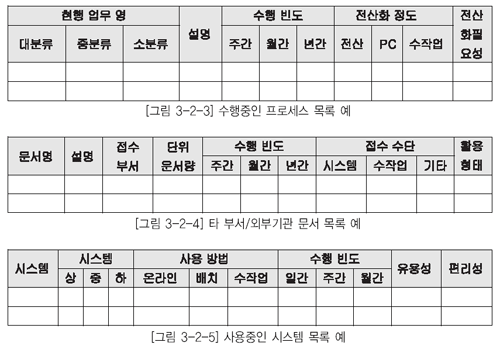

  * [그림 3-2-3] 수행중인 프로세스 목록 예 / [그림 3-2-4] 타 부서,외부기관 문서 목록 예 / [그림 3-2-5] 사용중인 시스템 목록 예

### 다. 워크숍 정리

사용자 워크숍을 통해 도출된 요구 사항이나 해결 과제들을 명백하고 간결한 문장으로 정리한 후 사후 대처할 수 있도록 한다. 해결과제에 대해서는 별도의 ID를 부여하여 관리한다. 워크숍 결과 정리시에는 다음 사항을 포함한다.

* 워크숍의 목적
* 워크숍 진행 내용
* 해결과제에 대한 상태
* 기타 특이사항

  * [그림 3-2-6] 워크숍 정리 예

### 라. 기타 기법 정리

관련 문서에 대한 정리 양식과 현행 프로그램 및 데이터에 대한 정리 양식은 일반적인 표준 양식을 정의하기가 어려워 제3장 정보 요구 사항 분석에서 사례를 들어 설명하기로 한다.

## 2. 정보 요구 우선순위 분석

사용자로부터 수집된 모든 정보 요구 사항을 전부 시스템에 반영할 수 없다면, 필요한 기법을 동원 하여 우선순위를 부여하고 부여된 우선순위에 맞게 절차적으로 진행될 수 있어야 한다. 이를 위해 적용할 수 있는 기법으로 화폐가치 산출 방법과 상대적 중요도 산정 방법이 있다. 이를 이용하여 우선 순위를 평가함으로써 단위시스템의 개발 우선순위를 산정하는 기준으로 활용할 수 있다. 별도의 기법을 적용하지 않고 고유상황에 맞게 우선순위를 부여하고 진행하는 경우도 고려할 수 있다.

현재는 요구 사항에 대한 우선순위, 중요도, 소요 비용, 기대 효과 등을 고려한 비교적 판단이 용이 한 방법으로 약식 형태로 판단하고 있으며, 본 분석 방법은 실제에서는 보편적으로 사용하기에 시간 과 노력이 많이 소요되는 관계로 적용에 일정 부분 어려움이 존재한다.

### 가. 가.화폐가치 산출 방법

화폐가치 산출 방법은 최종적으로 구해진 가치가 높을수록 우선순위가 있다. 그러나 최종 순위는 산출된 수치에 의존하지 않고 고유의 상황에 따라 다르게 적용될 수 있다.

* 정보 요구 사항을 전부 나열한다.
* 각각의 정보 요구 사항에 대하여 기업 차원의 중요성을 평가하여 1점부터 3점까지의 점수를 부여한다.
* 각각의 정보 요구 사항에 대하여 시스템 차원의 중요성을 평가하여 1점부터 3점까지의 점수를 부여한다.
* 각각의 정보 요구 사항이 다른 정보 요구 사항에 대해 얼마나 도움을 주는가를 평가하여 1점부터 5점까지의 점수를 부여한다.
* 앞서 부여한 세 가지 점수를 모두 곱한다.
* 전체 정보 요구 사항에 대하여 앞서 계산된 점수를 더하고, 점수 합계를 100으로 하여 각각의 정보 요구 사항 가치를 백분율(%)로 환산한다.
* 회사 전체의 이익에 앞에서 구한 백분율를 곱하여 각각의 정보 요구 사항 가치를 금액으로 환산한다.
* 가치가 높은‘정보 요구 사항2’,‘ 정보 요구 사항1’의 순으로 우선순위를 부여하는 방법이다.

  * [그림 3-2-7] 화폐가치 산출 방법 예

### 나. 상대적 중요도 산정 방법

상대적 중요도 산정 방법은 정보 요구 사항이 무엇을 지원하느냐에 따라 점수를 부여하고 이를 가 중치에 따라 계산하여 중요도를 산정하는 방식이다. 상대적 중요도 산정 방법 역시 다소 복잡하여 적 용에 한계를 가지며, 각기 부여된 가중치에 이해를 달리 할 수 있는 여지가 있다.

* 정보 요구 사항이 업무에 기여하는 수준에 따라 1점부터 5점까지의 점수를 부여한다. 예를 들어 목적을 지원하면 5점, 목표를 지원하면 4점, 전략을 지원하면 3점 등의 방법으로 업무를 분류한 체계에 따라 결정한다.
* 정보 요구 사항 대 정보 요구 사항 매트릭스를 작성하여, 각각의 정보 요구 사항이 다른 정보 요구 사항에 얼마나 관련되어 있는가를 계산한다. 가장 관련이 큰 정보 요구 사항에 9점을 부여하고, 나 머지 정보 요 정보시스템이 각각의 정보 요구 사항을 얼마나 충족하는가에 대하여 1점에서 3점까지의 점수를 부여한다. 예를 들어 만족스러운 경우에는 3점, 보통인 경우에는 2점, 지원하지 않는 경우에는 1점 등의 방식으로 부여한다.
* 앞서 부여한 세가지 점수에 대하여 가중치를 결정한다. 예를 들어 업무 지원 정도는 50%, 다른 정보 요구 사항과의 관련도는 20%, 현행 시스템 지원 정도는 30% 등의 방법으로 정하되, 정보 전략계획을 수립하는 대상 기업의 특성을 감안하여 결정한다.
* 가중치에 따라 앞에서 계산한 세 가지 요인의 가중 평균을 구하여 각각의 정보 요구 사항에 대한 중요도를 평가한다.

## 1. 정보 요구 사항 목록 검토

전사 관점에서 동일한 정보 요구 사항을 여러 부서 및 사용자가 제시했는지를 검토하기 위하여 별도의 양식으로 취합 조정한 후 중복 도출 여부를 검토한다.

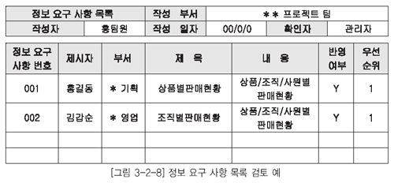

  * [그림 3-2-8] 정보 요구 사항 목록 검토 예

## 2. 정보 요구 사항 목록 통합/분할

취합된 전체 정보 요구 사항을 대상으로 최종 분석할 정보 요구 사항을 도출한다. 우선 동일 부서 내 정보 요구 사항을 기준으로 중복성 검토를 진행하여 유일한 정보 요구 사항을 도출하고, 도출된 정보 요구 사항이 다른 부서의 정보 요구 사항에 포함되어 있는지를 확인한다.

### 가. 동일 부서 내 중복 요구 사항 검토

* 부서 내 정보 요구 사항 목록을 작성한다.
* 정보 요구 사항 제목을 기준으로 부서 내 동일 요건의 요구 사항이 존재하는지를 파악한다.
* 정보 요구 사항의 세부 요청 내용을 기준으로 세밀하게 중복 여부를 파악한다
* 부서 내 동일 요건이 도출된 경우 관리대상 요구 사항에 통합할 정보 요구 번호를‘비고’란에 기입 한다.
* 동일 부서 내 중복성을 배재한 요구 사항 목록을 완성한다.

### 나. 서로 다른 부서간 중복 요구 사항 검토

* 부서 내 정리된 정보 요구 사항 목록과 부서간에 동일한 정보 요구 사항이 존재하는지를 파악한다.
* 정보 요구 사항의 세부 내용을 세밀하게 검토하여 중복여부를 파악한다.
* 부서 간에 동일 요건이 도출된 경우 관리 대상 요구 사항에 통합할 정보 요구 번호를 기입하여 관리한다.
* 최종적으로 전사 관점의 검토된 정보 요구 사항 목록을 작성한다.

  * [그림 3-2-9] 정보 요구 사항 목록 검토 예

* 제1절 정보 요구 사항 수집
  * 사용자 정보 요구 사항을 좀 더 명확하게 정의하고 기업과 업종에 대한 이해를 하기 위해 관련된 문서를 수집한다.
  * 수집된 문서는 별도의 양식으로 정리하여 재차 요구하지 않도록 한다.
  * 사용자와의 면담을 위해 필요한 진행 절차는 계획 및 준비, 면담 수행, 면담 결과 분석, 분석 결과 피드백으로 진행한다.
  * 현업 부서 및 전산 부서를 대상으로 다르게 면담 요지를 구성한다.
  * 현업 부서 면담 내용에 포함될 주요 사항으로는 면담 취지, 목적, 수행 방법, 향후 수행 방향에 대한 의견, 현재 사용하고 있는 정보시스템에 대한 개인적인 의견 등을 포함한다.
  * 전산 부서 면담 내용에 포함될 주요 사항으로는 시스템 분야 및 활용 현황, 현재 시스템 운영 조직 및 문제점, 전체 애플리케이션 현황 및 유지 보수, 진행 중인 개발 프로젝트 등을 포함한다.
  * 면담 대상자는 업무에 대한 명확한 이해를 가능하게 해 줄 수 있는 사람으로 선정해야 한다. 면담 일정과 면담 내용은 사전에 공지하여 준비한다.
  * 사용자 면담 결과를 분석한 결과 중 부서 간 이해 관계에 따라 이견이 발생할 수 있는 사안은 반드시 담당자들과 사전 조정 작업이 필요하다.
  * 정보의 공유가 필요한 경우나 단순한 토론 이상이 요구되는 경우에 워크숍을 활용한다. 서로 관련있는 부서들은 반드시 포함하여 실시한다.
  * 사용자가 처리하고 있는 업무 기능들을 일목요연하게 정리하고자 한다면 현행 업무 조사서를 활용한다.
  * 현행 시스템에서 사용되고 관리되는 프로그램 목록이나 화면 목록도 정보 요구 사항의 중요한 수단이다.
  * 테이블 목록이나 각각의 레이아웃과 정의서를 이용하여 현행 데이터의 문제점과 사용자 정보 요사항을 도출할 수 있기 때문에 수집해야 할 자료 중 하나다.

* 제2절 정보 요구 사항 정리
  * 정보 요구 수집 유형별로 요구 사항을 정리한다.
  * 사용자 면담 내용에 대해서는 정리 후 오류가 있는지를 반드시 면담자에게 확인한다.
  * 워크숍에서 발행한 이슈 사항이나 특이 사항인 경우에 지속적인 관심을 가지고 해결할 수 있도록 별도의 리스트를 작성한다.
  * 사용자로부터 접수된 정보 요구 사항에 대해 우선순위 분석을 실시한다.
  * 정보 우선순위 분석을 위해 화폐가치 산출 방법과 상대적 중요도 산정 방법을 이용한다.

* 제3절 정보 요구 사항 통합
  * 1차적으로 정보 요구 사항을 동일한 부서 내 중복 요건이 있는지 확인한다.
  * 동일 부서 내 정보 요구 사항을 정리한 후 부서 간 정보 요구 사항으로 검토한다.
  * 동일한 정보 요구 사항은 부서 간 협의를 통해 하나로 통합하고 별도의 번호를 부여하여 관리한다.

문제 1. 새로운 방법으로 창구직원에 대한 활동원가를 집계하고자 기준을 제시하였으나, 기준에 따라 이해당사자의 득실이 차이가 많아 결론을 내리지 못하였다. 다음 중 효율적으로 결론을 도출할 수 있는 기법으로 적합한 것은?
① 워크샵 기법
② 사용자 면담 기법
③ 브레인 스토밍 기법
④ 업무 매뉴얼 조사 기법

문제 2. 다음 중 면탐팀 구성 단계에 있어서 반드시 고려해야 할 내용이 아닌 것은?
① 면담팀은 가능하다면 2-3인으로 구성하도록 한다. 
② 면담 팀원간 역할을 구분하도록 한다.
③ 면담 기록자나 관찰자는 사전에 업무를 습득하도록 한다. 
④ 프로젝트 후원자의 추천을 받아 선별하도록 한다.

문제 3. 현업의 정보 요구 사항 파악을 위해 사용자 면담이 계획되어 있다. 다음 중 현업 내 사용자 면담 대상자를 선발하는 방법으로 가장 적합한 것은?
① 업무에 대해 명확하게 설명할 수 있는 사람으로 선발한다. 
② 면담은 통상적으로 2인으로 구성하여 면담 기록에 누락이 없도록 한다.
③ 현업의 관련분야에 정통한 전문가를 집중적으로 선발한다.
④ 면담에 대한 부담을 줄이기 위하여 면담 진행자와 안면이 있는 사람으로 구성한다.

문제 4. 프로젝트 분석 단계 초기에 업무요건이나 업무절차의 조사방법 중에는 면담 기법이 있다. 각 면담을 진행하기 위해 2명 이상으로 면담 진행팀을 구성하고자 할 때, 다음 중 면담 대상자와 면담 진행팀의 역할에 대한 설명으로 틀린 것은?
① 면담대상자 : 업무에 대해서 면담자에게 명확하고 이해하기 쉽게 설명해 주어야 한다. 
② 기록자 : 면담 종료 시에 기록 내용 중에 주요 사항을 확인한다. 
③ 면담자 : 면담의 취지를 설명하고 면담 주제의 범위에서 이탈 시에는 주의를 환기시킨다. 
④ 관찰자 : 수행 의도대로 면담진행 여부 및 최종적 면담종료에 대해 판단한다.

문제 5. 'New Feature' 프로젝트를 통해 A기업의 경영환경을 정리한 후 경영전략을 체계적으로 정리하고, 현재 적용하고 있는 정보기술, 전산장비, 정보시스템, 데이터저장소 등의 현황을 조사하고, 활용도를 평가하기로 하였다. 다음 중 이를 위한 조사기법으로 부적합한 것은?
① 경쟁환경 분석
② SWOT 분석
③ RAEW 분석
④ Activity 분석

사용자로부터 수집한 정보 요구 사항을 바탕으로 업무 현황을 파악한다. 이를 근간으로 관련 업무 및 시스템의 문서를 조사, 수집 및 파악함으로써 현행 업무 및 현행 시스템에 대한 분석 대상을 정의한다. 사용자의 정보 요구 사항을 구체화하고 상세화하는 작업의 효율성을 이루고자 한다.

## 1. 현행 업무 분석 대상 정의

### 가. 분석 대상 자료

현행 업무를 파악하여 필요한 정보 요구 사항을 도출하기 위해 필요한 관련 자료를 확보하여야 하며, 이에 해당되는 업무 자료는 다음과 같은 자료를 활용한다.

* 현행 업무 흐름도
* 현행 업무 설명서
* 현행 업무 분장 기술서

### 나. 분석 대상 업무 영역 선정

수집된 사용자의 정보 요구 사항을 바탕으로 현행의 업무흐름 및 관련 데이터를 파악하여 분류기준에 따라 분석 대상 현행 업무 목록을 작성한다. 작성된 분석 목록을 가지고 정보 요구 사항 분석을 위한 대상으로 선정할 것인지 결정을 하고 분석 대상 업무 목록표에 표기한다. 분류기준이란 통상적으로 현행 업무 기능 분해도의 단위 업무 또는 업무 분장상의 구분 등을 말한다. 분석 대상 현행 업무 목록의 예는 [그림 3-3-1]과 같다.

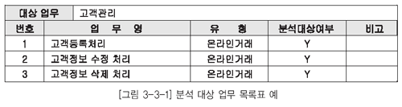

  * [그림 3-3-1] 분석 대상 업무 목록표 예

## 2. 현행 시스템 분석 대상 정의

### 가. 분석 대상 현행 시스템 선정

정리된 정보 요구 사항에 대해서 업무 영역별 분석 대상 현행 시스템을 선정하기 위하여 업무 영역/현행 시스템 매트릭스를 작성한다. 이를 작성하기 위해서는 업무 분석 프로젝트의 수행 범위를 정확히 파악하는 것이 선행되어야만 업무 영역별로 대상 현행 시스템을 선정하는 작업이 가능하다.

업무 영역/현행 시스템 매트릭스의 예는 [그림 3-3-2]과 같다.

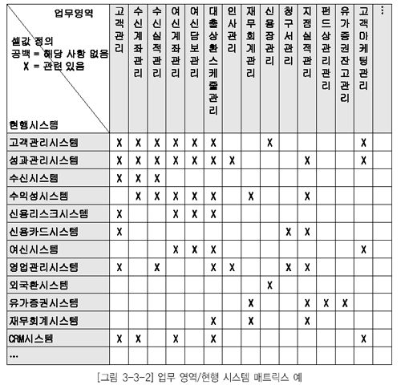

  * [그림 3-3-2] 업무 영역/현행 시스템 매트릭스 예

업무 영역/현행 시스템 매트릭스를 바탕으로 업무 영역별 분석 대상 시스템 목록을 작성한다. 분석 대상 시스템 목록의 예시는 [그림 3-3-3]과 같다.

  * [그림 3-3-3] 분석 대상 시스템 목록 예

### 나. 분석 대상 현행 시스템 관련 자료

현행 시스템과 관련된 문서를 조사 및 수집하고 이를 현행 시스템 수집 문서 목록에 정리한다. 현행 시스템 관련 수집 대상 문서는 다음과 같다.

* 현행 시스템 구성도
* 현행 시스템의 분석, 설계 및 개발 보고서
* 화면, 장표 및 보고서 레이아웃
* 현행 시스템 테이블 목록 및 테이블 정의서
* 프로그램 목록
* 사용자 및 운영자 지침서
* 시스템 지원 및 유지보수 이력
* 시스템 개선 요구 사항 등

현행 시스템 수집 문서 목록의 예는 [그림 3-3-4] 과 같다.

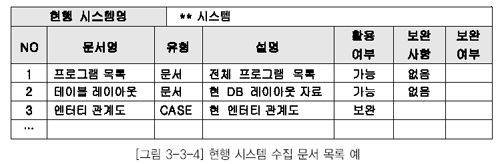

  * [그림 3-3-4] 현행 시스템 수집 문서 목록 예

수집된 문서의 평가는 다음의 기준으로 수행하고 보완 여부 항목에 표기함으로써 보완 작업을 종료한다.

* 유용성 : 문서의 활용 가능성 여부
* 완전성 : 문서의 내용에 누락된 부분이 없는지의 여부
* 정확성 : 문서의 내용이 현재의 시스템과 일치하는지의 여부
* 유효성 : 문서가 최신의 내용을 반영하고 있는지의 여부

### 다. 추가적인 분석 대상

현행 데이터 측면의 업무 요건 혹은 업무 규칙을 보다 상세하게 분석하기 위하여 사용자 뷰도 분석 대상에 포함한다. 데이터 뷰는 전체적인 정보 중에서 일부를 바라보는 관점을 나타내며, 이러한 사용 자 뷰가 종합되어 나타나는 것이 화면, 수작업 파일, 수작업/전산 양식, 보고서 등의 레이아웃이다.

정보 요구 사항 분석 대상이 정의된 현행 업무 영역 관련 자료 및 현행 시스템 관련 자료에 대하여 분 석을 하고, 분석 결과인 분석 산출물을 토대로 사용자의 정보 요구 사항을 보완하고 비기능적 정보 요 구 사항을 포함하여 문서 작업을 통한 정보 요구 사항 정의서를 보완한다.

* 비기능적 정보 요구 사항
  * 시스템이 만족시켜야 하는 제약 조건(기술적 제약 조건, H/W, S/W와 관련된 제약 조건)
  * 시스템이 반드시 만족시켜야 하는 주요 성능 척도(반응 시간, 저장 능력, 동시 처리 능력)
  * 신뢰성, 확장성, 이식성, 보안

## 1. 프로세스 관점의 정보 요구 사항 상세화

프로세스는 실제로 업무가 수행되는 행위를 뜻한다. 프로세스는 기본 기능이 분해되면서 나타나 다시 프로세스로 분해된다. 업무 기능은 기업의 목표달성을 위하여 지속적으로 수행되기 때문에 시작 시점과 종료 시점이 명확히 구분되지 않는다. 하지만 프로세스는 시작 시점과 종료 시점이 명확하고 실행 횟수를 셀 수 있는 업무 활동을 의미한다. 프로세스는 업무를 어떻게 수행하는가 보다는 어떤 업무가 수행되는지를 나타낸다. 따라서 입력(Input)과 출력(Output)이 있으며 입력을 출력으로 바꾸는 변환과정을 포함한다. 프로세스를 분해하다 보면 더 이상 분해되지 않는 최소 단위의 업무를 찾게 되는 데 이를 기본 프로세스라 부른다.

### 가. 수행 절차

* 프로세스 중심으로 정리된 프로세스 목록, 프로세스의 업무 흐름도 내용을 수반하는 업무 조사서를 바탕으로 프로세스 계층도, 프로세스 정의서를 작성한다.
* 도출된 기본 프로세스를 기준으로 기본 프로세스에서 필요로 하는 정보 항목과 산출되는 정보 항목을 정리하고, 산출되는 정보 항목 중 기본 로직이 필요한 경우 기본 로직을 정리한다.
* 표준화 과정을 통하여 해당 정보 항목에 대해서 통합성/분리성 여부를 검토한 후 최종적으로 사용자의 정보 요구 사항을 충족하는 정보 항목 목록을 정의한다.

### 나. 수행 작업 내용

[표 2-3-1] 프로세스 관점의 정보 요구 상세화

| 수 행 작 업 | 수 행 작 업 내 용 |
|----|----|
| 프로세스 분해/상세화|◼ 단위 업무 기능별 하향식으로 프로세스를 분해 및 도출 ◼  프로세스 계층도 및 프로세스 정의서를 작성 |
| 정보 항목 도출 및 표준화|◼ 기본 프로세스별 정보 항목을 정리 ◼  정보 항목에 대한 표준화 정리 ◼  정보 항목 목록 정의 |
| 정보 항목별 통합성, 분리성 여부 검토|◼ 프로세스별로 관리되는 정보 항목을 분류 ◼  정보 항목별 동음이의, 이음동의 존재 여부 파악 ◼  통합/분리 여부 검토 후 최종 정보 항목 목록 정의 |

### 다. 수행 작업 지침

#### 1) 프로세스 분해 / 상세화

* 가) 프로세스의 분해
  * 프로세스의 분해는 단위 업무 기능으로부터 출발하여 점진적으로 수행한다. 단위 업무 기능은 하위에 더 이상 업무 기능을 포함하지 않고, 프로세스만으로 구성된 업무 기능을 의미한다.
  * 단위 업무 기능별로 상세하게 프로세스를 분해하지 않고, 해당 업무 영역의 전체 단위 업무 기능 에 대하여 프로세스의 분해 수준을 맞추어 점진적으로 분해한다.
  * 업무 기능 계층도가 단위 업무 기능 수준까지 분해되지 않았을 경우에는 단위 업무 기능 수준까지 더 분해한 후 프로세스를 도출한다.

* 나) 프로세스 분해 깊이
  * 프로세스 분해시 업무적인 특성을 고려하여 분해의 수준은 3차 수준까지 분해한다.
  * 3차 수준까지 프로세스를 도출하는 과정에서 기본 프로세스 수준까지 도출되는 경우도 있으며 업무 활동 분해의 근본적인 목적은 최종적으로 기본 프로세스의 도출에 있다.
  * 그러나 초기 작업에서는 도출된 프로세스가 기본프로세스인지는 중점을 두지는 않으며 대상 범위의 모든 프로세스를 균형 있게 분해하는 데에 주의를 기울인다.
  * 도출할 프로세스의 대상은 일반적으로 데이터의 상태를 변화시키는(생성, 수정, 삭제) 것만을 프로세스로 정의한다. 하지만 업무적으로 중요한 의미를 가지는 조회용 프로세스 또는 수작업 프로세스는 필요에 따라 명명규칙을 달리하여 도출하는 것도 바람직하다.

* 다) 프로세스 명칭

프로세스의 명칭은 명명규칙을 준수하여 명명하되 업무 용어를 그대로 사용하고 이름만으로도 개략적인 수행 내용의 파악이 가능하도록 함축적이며 유일한 이름을 부여하는 것이 중요하다.

* 라) 프로세스 계층도
  * 프로세스 계층도를 작성하는 목적이 기본 프로세스의 도출에 있으며, 추후 업무적으로 기술한 프로세스 정의서를 바탕으로 작업을 수행하게 되므로 이에 대한 상세한 내용이 반영된다.
  * 프로세스 계층도는 높은 응집도(Cohesion) 및 낮은 결합도(Coupling)를 유지하도록 모듈성을 확보하는 것이 중요하다. 이러한 원칙에 따라 분석하면 분석의 복잡도와 모호성이 감소되고 분석의 집중력이 향상되어 프로젝트 관리 및 프로세스 유지보수가 용이하다. 일반적으로 상위 프로세스에 포함되는 하위 프로세스가 7개를 초과하면 상위 프로세스를 분리하는 것을 고려한다. 프로세스 계층도의 예는 [그림 3-3-5]과 같다.
  * 프로세스별 정의(설명)는 업무를 구체적으로 이해할 수 있는 수준으로 상세하게 작성한다. 프로 세스 정의서는 프로세스와 기본 프로세스를 함께 기술하는 양식으로서, 프로세스 정의서 양식의 데이터 사용 항목은 모든 프로세스에 대해 기술할 필요는 없다. 그러나 기본 프로세스의 경우에는 반드시 작성하도록 한다. 프로세스 정의서는 [그림 3-3-6]과 같다.
  * 이미 작성된 프로세스 계층도를 재검토해 해당 업무 영역에 포함되는 모든 업무 요건 및 업무 규칙이 반영되었는지를 확인하고, 프로세스 계층도를 조정한다.
  * 현 수준의 프로세스 계층도를 더욱 상세하게 분해하여 업무의 최소 단위인 기본 프로세스까지 도출한다.

  * [그림 3-3-5] 프로세스 계층도의 예

  * [그림 3-3-6] 프로세스 정의서의 예

#### 2) 정보 항목 도출 및 표준화

* 프로세스 분해 및 상세화에서 도출한 기본 프로세스별로 등록(C), 조회(R), 변경(U), 삭제(D) 기능을 구분하여 기술한다.

* 기능에 따라 구분된 프로세스별로 정보 요구 분석에서 정의된 정보 요구 사항 정의서 및 업무 조사서 상의 내용을 파악하여 관리하고자 하는 정보 항목을 도출한다. 서술식으로 표현된 자료에서 정보 항목을 도출하기 위해서 ‘명사형’으로 표현된 단어를 파악하면, 이러한 단어들이 정보 항목의 대상이 되는 경우가 많다.

* 도출한 정보 항목은 명명규칙을 준수하여 명명하되, 업무 용어를 그대로 사용하며, 명사형으로 기술한다.

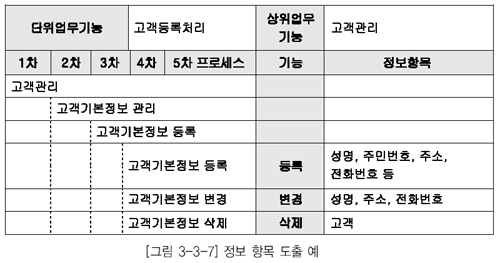

  * [그림 3-3-7] 정보 항목 도출 예

* 해당 도출된 정보 항목에 대해서 그룹핑하여 정보 항목군으로 구분하고. 정보 항목 목록을 작성 한다. 정보 항목 정의는 [그림 3-3-8] 로 정리한다.

  * [그림 3-3-8] 정보 항목 목록 예

#### 3) 정보 항목별 통합성 검증

* 정보 유형별 및 정보 항목별로 전사 관점에서의 통합/분리여부를 검토한다.
* 동일한 정보 항목에 대해서 통합시 다음과 같은 장점이 존재한다.
  * 통합 정보 항목으로 도출 시 정보 항목의 관리가 용이함
  * 동일한 유형의 정보 항목이 존재 시 통합 정보 유형으로 수용 가능
* 단, 아래와 같은 단점도 존재한다.
  * 무리한 통합 작업으로 인한 정보 항목의 애매모호성 존재
  * 통합 정보 항목에 대한 관리 부족으로 통합의 의미 상실 가능성 존재
* 통합 작업 후 해당 정보 항목 목록에 대한 통합성 여부를 기재하고 최종 정보 항목 목록을 작성 한다.

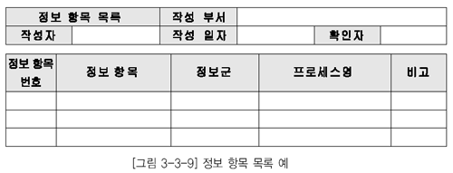

  * [그림 3-3-9] 정보 항목 목록 예

## 2. 객체지향 관점의 정보 요구 사항 상세화

객체지향 방법론에서는 유즈케이스 다이어그램을 중심으로 정보시스템의 기능적 정보 요구 사항을 정의한다. 해당 다이어그램은 사용자와의 의사소통을 원활하게 진행될 수 있도록 도움을 주며, 시스템 영역내의 유즈케이스와 액터, 그리고 그들 간의 관계를 유즈케이스 다이어그램으로 도식화하고 도출된 유즈케이스의 사건 흐름을 상세화한다.

### 가. 유즈케이스 다이어그램

* 액터(Actor)
  * 정보시스템과 상호작용하는 개인, 그룹, 회사, 조직, 장비 등 정보 서비스를 받는 객체를 말한다.
  * 엑터의 이름은 명확하게 액터의 역할을 나타내는 이름으로 정의한다.
* 유즈케이스(Usecase)
  * 도출된 액터별로 개발 시스템에서 제공해야 하는 기능을 나타낸다.
  * 사건 흐름에 대한 개요을 간략하게 기술한다.
* 액터(Actor)와 유즈케이스 간의 관계
  * 확장(Extend) : 하나의 유즈케이스가 다른 유즈케이스의 행동을 추가함에 따라 나타나는 두 유즈케이스의 관계를 말한다. 하나의 유즈케이스가 다른 유즈케이스를 경우에 따라 선택적으로 수행되는 경우에 사용된다.
  * 포함(Include) : 하나의 유즈케이스가 다른 유즈케이스를 사용함을 나타내는 두 유즈케이스의 관계를 말한다. 하나의 유즈케이스가 다른 유즈케이스를 반드시 수행하는 경우에 사용된다.
  * Communicates : 행위자가 어떤 유즈케이스에 참가함을 나타낸다. 이것은 행위자와 유즈케이스 사이의 유일한 관계이다.

* 유즈케이스 다이어그램의 예는 [그림 2-3-10]과 같다.

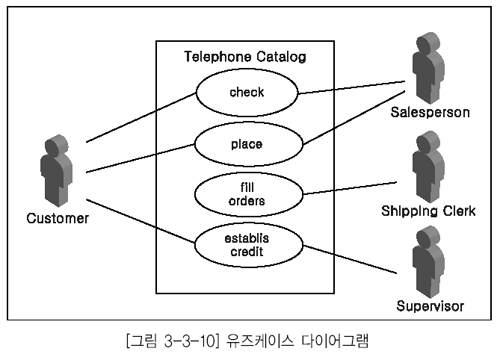

  * [그림 3-3-10] 유즈케이스 다이어그램

### 나. 유즈케이스 상세화

유즈케이스의 사건 흐름을 구조화하는 작업으로 모든 선택 또는 대안 흐름을 기술한다. 유즈케이스의 특별 정보 요구 사항을 정의한다. 유즈케이스에는 관련이 있지만 사건 흐름에는 고려되지 않는 정보 요구 사항을 유즈케이스의 특별 요구 사항으로 정의한다. 이러한 특별한 정보 요구 사항은 비기능적인 정보 요구 사항으로 기술한다. 사건 흐름을 기술할 때 정상적인 흐름에 대해 먼저 기술한 후 예외사항에 대한 사건흐름을 기술한다. 다음과 같은 내용을 기술한다.

* 유즈케이스에 대한 개략적인 설명
* 사건 흐름(Flow or Event)
* 사전, 사후 조건
* 비기능적인 정보 요구 사항
* 주된 사건 흐름에 대체될 수 있는 대안 흐름
* 예외 처리 사항

### 다. 클래스 다이어그램 작성

#### 1) 엔터티 클래스 도출

유즈케이스 모형을 검토하여 문제 영역 내의 개념을 나타내 엔터티 클래스를 도출하여 정의한다. 식별된 클래스에 이름을 부여하고, 간략한 설명을 기술한다. 클래스 이름은 간결하고 업무적 의미를 함축한 단수형 명사로 부여하며, 은어 및 약어 사용은 배제한다.

* 유즈케이스 다이어그램을 조사하여 명사 및 명사구를 후보 객체로 선정한다.
* 의미가 모호한 것은 제거한다.
* 이음동의어 및 동음이의어를 고려하여 선정한다.
* 문제 영역과 관련이 없는 것은 제거한다.
* 유사한 구조와 행위를 가진 객체들을 클래스로 그룹핑한다.

#### 2) 관계 도출 및 클래스 도출

관계란 의미있고 관심있는 연결을 나타내는 클래스간의 관계를 의미한다. 클래스간의 집단화 관계를 식별하고 명명한다. 집단화 관계란 전체적인 클래스와 부분적인 클래스의 포함 관계를 표현한다.

#### 3) 속성 정의

속성이란 클래스가 나타내는 객체의 특성을 의미한다. 유즈케이스 다이어그램을 검토하여 클래스를 구성하는 속성을 도출한다. 속성에 대한 이름을 부여하고 간략한 설명을 기술한다. 속성의 이음은 성을 가지고 있는 정보를 명확하게 지정하는 명사로 한다.

사용자 및 부서로부터 접수해서 최종적으로 작성된 산출물에 대해 정보 요구 사항을 제시한 담당자와 세부 재검토를 통하여 누락 사항 및 보완 사항을 도출하기 위한 계획을 수립하고 재검토를 실시한다.

## 1. 수행 절차

* 분석 결과 도출된 산출물에 대해서 재검토 기준을 정의하고, 재검토 계획을 수립한다.
* 재검토 대상 산출물의 완전성, 정확성, 일관성, 안정성 등 다양한 측면에서 재검토를 실시한다.
* 재검토 결과, 추가 및 보완 사항이 존재하는 경우에 내용을 문서로 정리한 후 해당 산출물에 추가 반영 여부를 확인하고, 미반영시 미반영 사유의 타당성을 검토한다.

## 2. 수행 작업 내용

[표 3-3-2] 정보 요구 사항 확인 수행 작업

| 수 행 작 업 | 수 행 작 업 내 용 |
|----|----|
| 재검토 계획 수립|◼ 재검토의 대상이 되는 분석 결과 및 정보 요구 사항 정의서 산출물 확인 ◼  대상 산출물별로 재검토 기준(체크 리스트) 정의 |
| 재검토 실시|◼ 재검토 계획서 작성 및 승인 ◼  재검토 대상 산출물 준비 및 배포와 재검토 담당자별 역할 분담 ◼  업무 영역별로 재검토 대상 산출물을 재검토 |
| 보완 결과 확인|◼ 재검토 결과를 토대로 업무 영역별로 산출물 보완 ◼  재검토 결과 반영 여부 확인 및 미반영 사유 검토 ◼  정보 요구 사항 정의서의 안정성 분석 ◼  재검토 결과를 토대로 보완 목록 수정 |

## 3. 수행 작업 지침

### 가. 재검토 계획 수립

재검토의 대상이 되는 분석 결과 산출물을 확인한다. 일반적인 재검토의 대상이 되는 것은 정보 요구 사항 정의서, 정보 항목 목록, 유즈케이스 정의서 , 클래스 다이어그램 등이 있다. 재검토 기준은 해당 작업의 완전성과 정확성 및 안정성을 검증할 수 있는 체크리스트로 작성한다. 재검토 및 검증의기준을 간략히 요약하면 다음과 같다.

* 완전성: 사용자의 정보 요구 사항이 누락없이 모두 정의되었는지 확인
* 정확성: 사용자의 정보 요구 사항이 정확히 표현되었는지의 여부
* 일관성: 표준화 준수 여부 확인
* 안정성: 추가 정보 요구 사항 변경에 따른 영향도 파악

정보 요구 사항별로 1차 재검토 후 결과를 모델에 반영할 수 있도록 일정을 계획하여야 한다. 재검토를 통해 전체 업무영역에 영향을 미치는 공통사항에 대한 변경과 통합성을 일관되게 추적 관리할 수 있도록 별도의 인원을 재검토팀에 배정하여야 한다.

* 재검토 계획서에 포함되어야 할 사항
* 정보 요구 사항 재검토 개요 및 목적
* 재검토 일자
* 재검토 장소 및 시간 계획
* 재검토 참석 대상 및 재검토 업무
* 참석 대상별 재검토 세부 시간 계획
* 재검토시 준비물
* 재검토 후 산출물
* 재검토 후 지적사항 반영 계획 수립

### 나. 재검토 실시

* 재검토 기준 및 재검토 대상 산출물을 준비하고 재검토에 참여할 대상자에게 배포한다.
* 재검토 관련 장소, 시간, 준비 장비 등 재검토를 실시하기 위한 제반 준비를 수행하며, 재검토 담당자별로 재검토 세션에서 수행해야 할 역할을 충분히 주지시킨다.
* 재검토 세션 실시 이전에 반드시 배포된 산출물을 예습해야 한다. 재검토 세션 이전에 재검토 대상 산출물을 예습하는 것은 아주 중요한 일이다. 실제 재검토 세션에서의 재검토는 재검토한 결과를 토대로 의문사항, 잘못 정의된 사항 등에 대하여 의견을 개진하고 결론을 도출하여 반영 대상을기준에 따라 반드시 사전에 담당자별로 수행되어야 한다.
* 재검토시 진행자는 제기되는 이슈에 대해서 참석자들간에 결론을 도출하기 위한 토론이 발생하지 않도록 이슈 목록으로 정리하게 하고 정해진 일정 내에 마칠 수 있도록 주의를 기울여야 한다.
* 재검토시에는 통합성 검증을 위하여 해당 업무 영역과 관련 있는 업무 영역 담당자가 참여하여야 한다.
* 재검토는 많은 인원이 함께 작업을 수행하는 경우에, 진행시간이 초과되어 충분한 검증이 이루어지지 못할 수도 있으므로, 진행자는 세션별로 적절한 시간 배분 및 조정의 역할을 충실히 수행하는 것이 중요하다.
* 재검토 세션이 종료되면 세션별로 그 결과를 재검토 결과로 정리한다. 재검토 결과는 [표 3-3-11]과 같은 양식에 정리한다.

  * [그림 3-3-11] 재검토 결과서 예

* 재검토 결과가 정리되면 해당 정보 요구 사항별 보완 사항을 유형에 따라 보완 목록에 작성한다. 보완 목록을 작성시에는 재검토 결과의 지적 사항만을 기록하는 것이 아니라 내용 보완시 해당 분석 결과 산출물의 일관성 유지를 위해, 특정내용이 변경됨으로써 함께 변경되어야 할 대상도 함께 기록한다. 보완 목록은 [그림 3-3-12]과 같은 양식에 작성한다.

  * [그림 3-3-12] 보완 목록 예

* 보완 사항을 반영할 경우에는 정보 요구 사항간의 일관성이 유지되도록 주의한다. 모든 사항의 반영이 완예되면 반영해야 할 사항의 누락은 없는지, 잘못 반영된 사항은 없는지를 전체적으로 검토한다.

### 다. 보완 결과 확인

* 재검토 준비와 마찬가지로 보완 결과에 대한 확인 준비를 한다. 재검토 결과, 보완 목록, 보완 사항이 반영된 정보 요구 사항 정의서를 준비하고 배포한다.
* 보완 목록에 준하여 정보 요구 사항 정의서 반영 여부를 확인한다. 반영되지 않은 사항의 미반영사유가 존재할 경우에는 미반영 사유가 타당성이 있는지를 검토하고, 사유가 타당하지 못한 경우에는 보완이 되도록 조치한다.
* 재검토 결과 미반영 사유가 업무 규칙이나 정책의 변경을 수반하는 경우에 프로젝트 기간 내에 해결 가능한 것은 개선 과제로 정리하여 해당 부서에 의뢰한다.
* 보안 목록에 있는 보완 사항이 모델에 모두 반영된 것을 확인하면 본 작업은 종료된다.

## 4. 수행시 고려사항

* 일관성 있는 기준 및 명확한 일정을 수립함으로써 모든 참여 인력에 공감대를 형성하는 것이 중요하며, 이를 바탕으로 작업을 수행해야 한다.
* 재검토는 한번으로 종료되지 않는 것이 보통이므로 두번 이상을 진행하되 세션마다 재검토 기준을 명확히 하여 해당 기준에 초점을 맞추어 수행하는 것이 바람직하다.
* 재검토 세션을 수행시 세션 진행의 효율성을 감안하여 적정한 참여 대상을 선정해야 한다. 너무 많은 인력이 참여하게 되어 세션의 집중력을 상실하거나 결론에 도달하지 못하는 경우에 주의해야 한다.

* 제1절 분석 대상 정의
  * 사용자의 정보 요구 사항에 대해 수집한 기초 자료를 바탕으로 현행 업무 및 현행 시스템에 대한분석 대상을 정의함으로써 사용자의 정보 요구 사항을 구체화하고, 상세화하는 작업의 효율성을 이루고자 한다.
  * 현행 업무에 대한 분석 대상은 현행 업무 흐름도, 업무 설명서, 업무 분장 기술서 등이다.
  * 현행 시스템의 분석 대상을 선정하기 위해서는 업무 영역/현행 시스템 매트릭스를 작성하여 관련있는 현행 시스템을 정의하고, 정의된 현행 시스템에 대한 관련 자료를 분석 대상으로 정의한다.

* 제2절 정보 요구 사항 상세화
  * 정보 요구 사항에 대한 분석 및 상세화 작업으로 프로세스 관점과 객체지향 관점으로 구분할 수있다.
  * 프로세스 관점으로는 조직의 업무 프로세스를 기본 프로세스까지 분해하는 과정을 통해 기본 프로세스에서 필요로 하는 정보 항목에 대해 정리한 후 최종 정보 항목을 도출하는 과정이다.
  * 객체지향 관점에서는 사용자의 정보 요구 사항에 대해서 유즈케이스 다이어그램을 작성하여 정보요구 사항을 다이어그램화하고, 해당 정보 요구 사항에 대한 사건 흐름을 상세하게 기술한다. 대안 흐름, 예외 사항 등 비기능적인 정보 요구 사항도 기술한다.
  * 최종적으로 유즈케이스 다이어그램 및 유즈케이스 정의서를 통해서 해당 클래스 엔터티를 도출하고 클리스 간의 관계 및 클래스의 특성을 나타내는 속성을 도출함으로써 최종적인 정보 요구 사항의 상세화 작업이 종료된다.

* 제3절 정보 요구 사항 확인
  * 최종적으로 작성된 산출물에 대해서 정보 요구 사항을 제시한 담당자와 세부 재검토를 통하여 누락 사항 및 보완 사항을 도출하기 위한 계획을 수립하고, 사전에 계획된 재검토 기준에 맞게 재검토를 실시한다.
  * 재검토 결과에서 도출된 추가 및 보완 사항이 존재하는 경우에 내용을 문서로 정리한 후 해당 산출물에 추가 반영 여부를 확인하고 미반영 시 미반영 사유의 타당성을 검토한다.
  * 기술한 재검토 기준에는 완전성, 정확성, 일관성, 안정성 측면 모두를 고려하여 체크 리스트를 작성하여 실시한다.

.

도출된 정보 요구 사항을 다른 영역(기능, 프로세스, 조직 등)과 비교 분석함으로써 정보 요구 사항의 도출이 완전하게 효과적으로 이루어졌는지를 파악할 수 있다. 이를 기반으로 향후 안정적이고 확장 가 능한 데이터 모델 설계가 가능하다. 이러한 상관분석은 매트릭스 분석 기법을 활용하며, 이 절에서는 정보 요구 사항과 애플리케이션의 기본 프로세스, 비즈니스의 업무 기능, 조직과의 매트릭스 분석 기법 을 소개한다.

정보 요구 사항의 충족도를 파악하기 위한 상관분석 수행의 주체는 다음과 같으며, 아래의 장·단점 을 고려하여 충분한 시간을 가지고 검토한다. 정보 요구 분석가나 품질보증 팀에 의해 상관분석을 진행 한 후, 단계 종료 시점에 외부 인력에 의한 요구 사항의 감리를 통하여 객관성 및 완전성을 증대시킨다.

## 1. 주체별 분류

### 가. 요구 사항 분석가 수행

정보 요구 사항을 수집하고 분석한 주 담당자를 기준으로 검토 기준 항목을 마련하고 상관분석을 수행하는 방법을 말한다.

* 정보 요구 사항을 도출한 분석가에 의해 수행되므로 자체 분석에 의한 객관성 저하의 문제점이 발생할 수 있다.

* 정보 요구 사항의 도출 절차 및 관련 업무팀과의 의사소통이 원활하므로 상관분석에 추가 인력의 투입 없이 원활하게 진행할 수 있다.

* 요구 사항 분석가의 업무에 대한 이해도가 높으므로 상관분석을 통한 정확한 업무의 분석 가능성이 높다.

### 나. 품질보증팀 수행

프로젝트팀 내의 통합 검토팀이나 품질보증팀의 협조를 얻어 도출된 정보 요구 사항의 상관분석을 수행한다.

* 요구 사항 분석가보다는 업무에 대한 이해도가 낮으나 상관분석 작업의 수행을 통한 업무 이해도를 높일 수 있으며 전체적인 인터페이스의 검증에 용이하다.

* 낮은 업무의 이해도로 인해 일부 사안에 대한 정확한 분석을 통해 단점을 지적하여 수정하기 어렵다.

### 다. 외부 감리 수행

외부 감리 인력을 이용한 정보 요구 사항 상관분석을 수행한다.

* 업무 파악의 한계가 있으나 제 3자의 시각으로 검토할 수 있다.

* 프로젝트 내부 인력이 효과적으로 지원하지 않을 경우 상황에 맞지 않는 분석 결과를 초래할 수 있다.

* 상관분석의 객관성을 극대화 할 수 있다.

## 2. 정보 요구/애플리케이션 상관분석

정보 요구 사항을 바탕으로 도출된 정보 항목을 애플리케이션 아키텍처에서 정의된 프로세스 모델과 비교하여 상호 간의 일관성을 확보하고 품질 수준을 향상시키는 동시에 누락 혹은 중복된 정보 요구 사항을 점검한다. 이는 다음과 같은 절차를 통해 매트릭스 분석을 진행한다.

* 정보 요구/애플리케이션 상관분석을 위해 정보 요구 사항을 바탕으로 도출된 정보 항목들과 애플리케이션 영역에서 도출한 기본 프로세스를 사용하여 매트릭스를 작성한다.

* 매트릭스 분석은 기본 프로세스와 정보 요구 사항을 기반으로 기본 프로세스의 액션 (C: 생성, R: 조회, U: 수정, D: 삭제)을 빠짐없이 정의한다. 그리고 기본 프로세스/정보 요구 사항 매트릭스를 작성하여 모든 정보 요구 사항들이 기본 프로세스에 의해 충분히 사용되고 있는지 또는 모든 기본 프로세스를 수행하는데 필요한 정보 요구 사항이 도출되어 있는지를 조사함으로써 정보 요구 사항과 기본 프로세스 도출의 완성도 및 일관성을 검증한다.

  * [그림 3-4-1] 정보 요구/ 애플리케이션 상관분석 매트릭스 예

* 매트릭스의 각 셀에는 기본 프로세스가 사용하는 정보 항목에 대한 액션이 생성(C), 조회(R), 수정(U), 삭제(D)로 표현되는데, 복수의 액션이 발생할 경우에는 C &gt; D &gt; U &gt; R의 우선순위에 따라 하나만을 기록한다. 그러나 분석기법의 활용시 CRUD가 복수로 발생할 경우 모두 기록할 수 있으며, 이는 분석기법을 활용하는 분석가의 매트릭스 활용 목적에 따라 선택 가능하다.

* 모든 정보 항목이 모든 기본 프로세스에서 사용되었는지 혹은 모든 정보 항목을 사용하고 있는지를 확인한다.

* 정보 요구/애플리케이션 상관분석 매트릭스는 두 가지 객체 중에서 한가지가 누락되거나 잘못 정의된 경우에는 분석이 가능하지만 정보 항목과 기본 프로세스가 모두 누락된 경우에는 분석이 불가능하다. 따라서 매트릭스가 작성되기 전에 이러한 경우가 있는지를 사전에 확인해야 하며, 매트릭스를 분석하는 경우에도 이러한 사례가 있는지를 파악해야 한다.

## 3. 정보 요구/업무 기능 상관분석

정보 요구 사항을 바탕으로 도출된 정보 항목을 비즈니스 아키텍처에서 도출된 업무 기능과 비교하여 상호 간의 일관성을 확보하고 품질수준을 향상시키는 동시에 누락 및 중복된 정보 요구 사항을 점검할 수 있다. 비즈니스에서 요구하는 정보 항목은 데이터 모델링의 근간이 되므로 업무 기능별 필요 정보 항목의 누락 여부의 확인은 매우 중요하다.

* 가치 사슬 분석 등의 기법을 통해 도출된 최하위 수준의 전사 업무 기능을 도출하고 이렇게 도출된 업무 기능을 매트릭스의 열에 배치한다.
* 정보 요구 사항에 따라 도출된 정보 항목을 매트릭스의 행에 배치한다.
* 업무 기능과 정보 항목 간의 상호작용을 다음과 같이 정의한다.
* 정보 항목의 생성, 수정, 삭제를‘C’로 표시한다.(Create 또는 Change)
* 값의 변경 없이 정보 항목을 검색만 하는 경우에는‘U’로 표시한다.(Use)
* 아무 관련이 없는 것은 빈칸으로 남겨둔다.

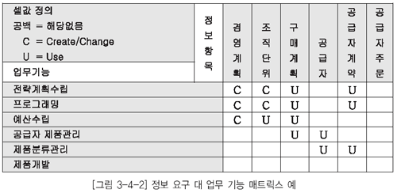

  * [그림 3-4-2] 정보 요구 대 업무 기능 매트릭스 예

## 4. 정보 요구/조직 기능 상관분석

정보 요구 사항을 바탕으로 도출된 정보 항목을 비즈니스 아키텍처에서 도출된 조직 단위와의 매트릭스 분석을 통해 정보 항목의 생성 주체 및 활용 부서의 매핑이 가능하다. 이를 기반으로 향후 정보 항목에 대한 오너십(Ownership)을 할당하여 관리함으로써 데이터를 효율적으로 관리할 수 있다.

* 조직 단위명은 기업의 조직도에 나타난 순서로 입력한다. 만일 기업이 둘 이상의 소재지에서 운영 된다면 조직 단위를 분할하고 소재지 타입에 따라 클러스터링한다. 매트릭스에 소재지 타입(예 : 본사, 영업소, 공장)에 의해 그룹핑된 조직 단위명을 입력한다.
* 정보 요구 사항에 따라 도출된 정보 항목을 매트릭스의 행에 배치한다.
* 조직과 정보 항목 간의 상호작용을 다음과 같이 정의한다.
  *  정보 항목의 생성, 수정, 삭제를‘C’로 표시한다. (Create 또는 Change)
  *  값의 변경 없이 정보 항목검색만 하는 경우에는‘U’로 표시한다.(Use)
  *  아무 관련이 없는 것은 빈칸으로 남겨둔다.

  * [그림 3-4-3] 정보 요구 대 조직 기능 상관분석 매트릭스 예

## 1. 정보 요구/애플리케이션 상관분석

### 가. 애플리케이션 충족도 분석 매트릭스

애플리케이션 충족도 분석 매트릭스는 다음 기준에 따라 점검하며 추가되거나 삭제되어야 할 정보 요구 사항을 도출한다.

* 정보 요구 사항에 따라 발생하는 정보 항목을 생성하는 기본 프로세스가 반드시 존재해야 한다.
* 정보 항목의 상태를 종료시키는 기본 프로세스가 존재해야 한다.
* 생성된 정보 항목은 조회, 수정, 삭제 액션 중 하나가 발생해야 한다.
* 하나의 정보 항목을 생성, 수정, 삭제하는 프로세스의 합은 7개를 초과하지 않는 것이 보통이다. 이를 초과하는 경우에는 올바르게 정의되었는지를 확인한다.
* 수작업으로 정의하거나 조회 전용으로 특별히 정의된 기본 프로세스를 제외한 나머지의 기본 프로 세스는 반드시 생성, 수정, 삭제 액션 중의 하나를 수행해야 한다.

### 나. 매트릭스 분석

매트릭스 분석은 다음과 같은 점검 내용을 중심으로 보완한다.

  * 매트릭스 분석은 추가 및 삭제되어야 할 정보 요구 사항을 도출한다. 해당 점검 내용의 조치 사항이 애플리케이션과 관련된 것일 경우에는 해당 애플리케이션 팀에 전달하고 협의하여 정의된 정보 요구 사항과 애플리케이션은 프로세스와의 일관성을 가져야 한다.

[표 3-4-1] 매트릭스 점검 내용

| 번호 | 점검 내용 | 분석 결과 | 조치 사항 |
|----|----|----|----|
|1|기본 프로세스가 사용 (CRUD)하는 정보 항목이 없음|정보 항목의 누락|정보 항목 도출 |
|||기본 프로세스 필요없음|기본 프로세스 삭제 |
|||기본 프로세스가 분석 대상 업무 영역에 속하지 않음|해당 업무 영역으로 이동 |
|2|정보 항목이 7개 이상의 기본 프로세스에서 사용됨|정보 항목이 너무 큼|정보 항목의 세분화 필요 |
|3|정보 항목을 생성하는 기본 프로세스가 없음|기본 프로세스의 누락 정보 항목이 필요없음 정보 항목이 분석 대상 업무 영역에 속하지 않음|기본 프로세스의 도출 정보 항목 삭제 해당 업무 영역으로 이동 |
|4|정보 항목을 생성하는 기본 프로세스가 둘 이상 존재|기본 프로세스의 중복|기본 프로세스의 합성 |
|5|엔터티를 삭제하는 기본 프로세스가 없음|기본 프로세스의 누락|기본 프로세스의 도출 |
|||업무에 삭제가 존재하지 않음|전산상의 오류인 경우에 삭제가 필요한지 확인 |
|||기본 프로세스가 분석 대상 업무 영역에 속하지 않음|해당 업무 영역으로 이동 |
|6|정보 항목을 삭제하는 기본 프로세스가 둘 이상 존재|기본 프로세스의 중복|기본 프로세스 합성 |
|7|정보 항목이 생성만 되고 사용되는 곳이 없음|기본 프로세스의 누락|기본 프로세스의 도출 |
|8|기본 프로세스가 정보 항목을 조회만 함|기본 프로세스가 아님|모듈 검토 |
|9|기본 프로세스가 여러 액션을 수행함|정의된 기본 프로세스가 너무 큼|프로세스 추가 분해 |

## 2. 정보 요구/업무 기능 상관분석

* 매트릭스 분석 매트릭스가 완료된 후 다음 질문을 통해 행과 열을 분석한다.
  * 모든 업무 기능은 정보 항목과 연관이 있는가?
  * 각 정보 항목은 적어도 한번 이상의‘C’(Create)를 갖는가?
  * 생성된 정보 항목은 다른 업무 기능에 의해 사용( ‘U’)되는가? 이것은 정말 단순조회인가?
* 정보 항목과 연관성이 없는 업무 기능은 관련 팀과의 협의 하에 업무 기능 도출의 적절성이나 관련 정보 항목을 다시 파악해야 하며, 이를 바탕으로 매트릭스를 보완한다.
* 정보 항목에 매핑이 없는 업무 기능의 경우 관련 팀과 협의하여 정보 요구 사항 보유 여부를 확인한 후 추가적인 정보 요구 사항이 있을 경우 정보 요구 조사 프로세스에 따라 정보 요구 목록에 신규로 추가한다.

## 3. 정보 요구/조직 기능 상관분석

* 매트릭스 분석 매트릭스가 완료된 후 다음 질문을 통해 행과 열을 분석한다.
  * 모든 업무 기능은 정보 항목과 연관이 있는가?
  * 각 정보 항목은 적어도 한번 이상의‘C’(Create)를 갖는가?
  * 생성된 정보 항목은 다른 업무 기능에 의해 사용( ‘U’)되는가? 이것은 정말 단순조회인가?
* 정보 항목의 활용도를 파악할 수 있으며, 정보 항목의 수요가 많은 경우에는 해당 정보 항목의 물리 모델링 단계에 성능/활용 측면의 모델링 기법을 적용함으로써 정보 활용의 효율성을 기한다.
* 정보 항목을 생성하는 조직 단위가 복수로 존재할 경우 데이터 관리의 복잡성으로 인해 향후 문제가 발생할 수 있으므로 해당 정보 항목에 대한 데이터 관리 주체의 선정에 주의를 기울인다.

## 1. 정보 요구 보완

애플리케이션 기본 프로세스 대 정보 요구 사항, 업무 기능 대 정보 요구 사항, 조직 대 정보 요구 사항 매트릭스 분석을 통해 파악된 추가 및 삭제 정보 요구 사항에 대하여 담당자와 구체적인 미팅을 실시하고, 일정 계획시 설정된 반영 계획에 따라 정보 요구 목록을 보완한다.

## 2. 정보 요구 확정

보완된 정보 요구 사항에 대하여 재차 사용자 재검토를 실시하며, 추가 반영 사항에 대한 반영 여 부 의사결정을 실시한 후 최종 정보 요구 목록에 대한 확정을 실시한다. 정보 요구 목록을 통해 향후 데이터 모델과 관련된 모든 산출물을 추적할 수 있으므로 누락된 항목 없이 정확하게 작성한다.

* 제1절 정보 요구 사항 상관 분석 기법
  * 정보 요구 조사 및 분석 단계를 거쳐 도출된 정보 요구 목록의 완전성을 검증하기 위한 목적으로 상관분석을 활용한다.
  * 상관분석을 위해 정보 요구 대 애플리케이션, 정보 요구 대 업무 기능, 정보 요구 대 조직에 대한 매트릭스 기법을 활용한다.
  * 정보 요구 대 애플리케이션의 상관분석에는 CRUD 매트릭스 분석 기법을 활용하며, 매트릭스의 셀 값은 기본 프로세스의 셀 값에 대한 액션을 기준으로 C(Create), R(Read), U(Update), D(Delete)로 작성한다.
  * 정보 요구 대 업무 기능, 정보 요구 대 조직의 상관분석 시 매트릭스의 셀 값은 정보 항목을 생성 또는 변경하는 경우에는 C(Create or Change)로, 그리고 활용만 하는 경우에는 U(Use)로 작성한다.
  * 매트릭스 작성 시 정보 요구, 기본 프로세스, 업무 기능, 조직을 빠짐없이 도출하여 가로축과 세로축에 배치하여야 하며, 가로축과 세로축의 대응 값이 모두 누락되었을 경우에는 분석의 완성도가 낮아지게 된다.

* 제2절 추가 및 삭제 정보 요구 사항 도출
  * 상관분석 매트릭스의 셀 값을 통해 정보 요구 사항 도출의 누락 및 삭제 여부를 파악할 수 있으며, 동시에 업무 기능, 프로세스, 조직과 정보 요구의 일관성을 유지할 수 있다.
  * 정보 요구 대 애플리케이션 상관분석을 통해 작성된 매트릭스는 다양한 점검 기준에 의해 조치 사항을 도출할 수 있으며, 애플리케이션과 관련된 조치 사항이 발생될 경우에는 관련 애플리케이션 팀과 협의하여 정보 요구 사항과 기본 프로세스의 일관성을 유지한다.
  * 정보 요구 대 조직, 정보 요구 대 업무 기능에 대한 매트릭스 작성 후, 작성된 매트릭스 셀 값의 매핑 누락 여부, 정보 항목의 생성 업무 기능이나 조직의 존재 여부 및 정보 항목의 활용 여부 등에 대한 상세 분석을 실시한다..

* 제3절 정보 요구 보완 및 확정
  * 상관분석을 통해 파악된 누락 혹은 삭혜 정보 요구 사항은 현업 담당자와의 미팅을 실시한 후 반영계획에 따라 정보 요구 목록에 반영한다.
  * 상관분석의 결과에 따라 보완된 정보 요구 사항은 사용자의 리뷰를 거쳐 최종 정보 요구 사항으로의 최종 반영 여부에 대한 의사결정 프로세스를 거친 후 확정된다.

문제 1. 일반적으로 정의된 정보 요구 사항은 정보 항목/애플리케이션 상관분석, 정보 항목/업무기능 상관분석, 정보 항목/조직 상관분석 등의 기법으로 수집된 사용자 정보 요구 사항이 적절하게 반영되었는지를 검증한다. 다음 중 상관분석 기법의 설명으로 틀린 것은?
① CRUD 매트릭스 분석 수행 과정에서 기본 프로세스가 사용하는 정보 항목에서 복수의 액션이 발생하는 경우에는 C(create) > D(delete)〉U(update)〉R(read)의 우선순위에 따라 기술한다.
② 모든 정보 항목이 모든 기본 프로세스에서 사용되는지 혹은 기본 프로세스가 모든 정보항목을 사용하고 있는지를 확인한다.
③ 업무 기능/조직 대 정보 항목의 상관분석에서 정보 항목의 생성, 수정, 삭제 등을C(Create, Change)' 로 표시한다.
④ 업무 기능/조직 대 정보 항목의 상관분석에서 정보 항목 값의 변경 없이 검색만 하는 경우에는 'R(Read)'로 표시한다.

문제 2. K과장은 약 1.5개월간의 분석공정을 거쳐 H대리의 정보 요구 사항을 반영하였는데 요구 사항이 정확하게 반영되었는지 시스템 및 산출물에 대한 리뷰(Review)를 실시하고자 한다. 다음 중 산출물별 체크리스트 기준에 일반적으로 포함되지 않는 것은?
① 일관성
② 주관성
③ 정확성
④ 완전성

문제 3. H대리는 약 3개월간 진행된 분석 단계에서 사용자의 요구 사항들이 잘 반영되었는지확인하기 위해 1박 2일로 사용자가 포함된 상태에서 검토회의를 진행할 예정이다. 현재 회의 계획서를 작성하던 중 사용자는 자신의 요구 사항이 잘 반영되었는지, 분석/설계자는 사용자의 요구 사항을 잘 이해하여 처리하였는지를 검토할 수 있는 재검토기준을 도출하였다. 다음 중 재검토 기준에 포함되지 않는 것은?
① 사용자의 정보 요구 사항의 누락 여부에 대한 검토 기준
② 사용자의 정보 요구 사항이 정확성 검토 기준
③ 사용자의 정보 요구 사항에 따른 영향도 파악에 대한 검토 기준
④ 사용자의 정보 요구 사항에 대한 주도성 검토 기준

문제 CRUD 매트릭스 분석을 실시할 때 하나의 정보 항목에 대하여 여러 개의 프로세스 액션이 발생할 경우 있다. 다음 중 CRUD의 셀 값 입력 우선순위로 가장 적절한 것은?
① C > D > R > U
② C > R > U > D
③ C > D > U > R
④ C > U > R > D

문제 5. 아래 매트릭스의 분석 결과 창고, 공급자, 직원 등의 정보 항목에서 문제가 발견되었다. 다음 중 문제가 발생한 3가지 정보 항목에 대한 조치사항으로 부적합한 것은?
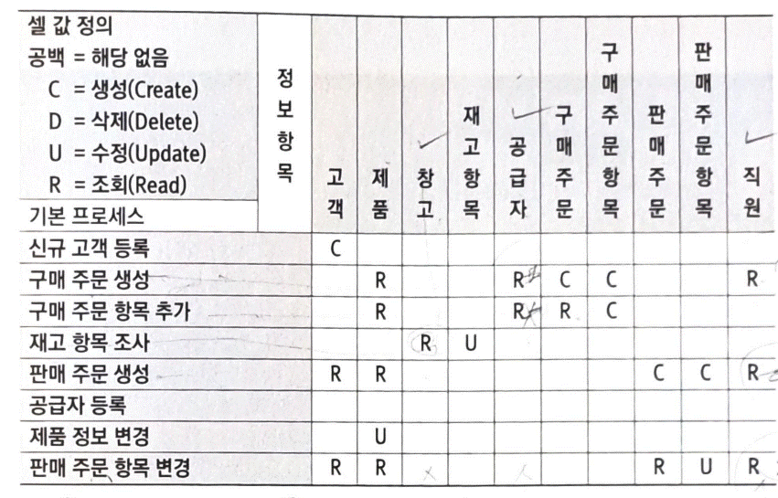
① 생성하는 기본 프로세스의 도출이 필요하다.
② 불필요한 정보에 해당할 수 있으므로 정보 항목 삭제 여부를 검토한다.
③ 분석 대상의 업무 영역 범위 외에 해당하므로 해당 업무 영역으로 이동한다.
④ 기본 프로세스의 통합 여부를 고려한다.

## 1. 데이터 관리 현황 및 개선 방안

최근 데이터가 기업의 전략적 의사결정의 핵심 요소로 대두됨에 따라 데이터 통합 및 데이터 품질 에 대한 관심이 증대되고 있다. 데이터의 품질을 확보하기 위해 데이터의 표준화가 필수적으로 수반 되어야 한다. 그러나 데이터 활용에 있어 다음과 같은 현실적인 문제점들이 정확한 정보를 적시에 사 용자에게 전달하는 데 장애 요인이 되고 있다.

### 가. 데이터 활용상의 문제점

* 데이터의 중복 및 조직, 업무, 시스템별 데이터 불일치 발생

데이터 표준 정책의 미비로 정보시스템 개발 및 운영 과정상에서 동일한 의미의 데이터를 다른 명칭으로 중복 관리하거나 동일한 명칭의 데이터를 시스템간에 상이한 로직으로 산출하여 다른 의미로 활용한다.

* 데이터에 대한 의미 파악 지연으로 정보 제공의 적시성 결여

데이터 명칭, 데이터 정의에 대한 표준 미관리로 인해 새로운 정보 요건이나 정보 요건 변경시 필요 데이터를 파악하는데 많은 시간을 낭비하여 정보 사용자에게 적시에 정확한 정보를 제공하는데 어려움이 있다.

* 데이터 통합의 어려움

단위 시스템 위주의 데이터 표준을 적용하거나 적용치 않는 경우도 존재하여 전사 데이터웨어하우스 구축 등 전사 데이터에 대한 통합적인 정보 요건을 기반으로 시스템을 구축할 때에는 데이터의 의미 파악 및 데이터의 중복 여부 파악 등에 많은 어려움이 있다.

* 정보시스템 변경 및 유지보수 곤란

데이터 표준 정책 미비로 인해 정보시스템의 변경이나 유지보수시 데이터 의미 파악에 어려움을 겪고 있고, 새로운 정보 요건 반영시 기존 데이터의 활용이 가능한지 파악이 어려워 유지보수에 많은 노력이 따른다.

### 나. 데이터 문제점의 원인

이러한 문제점들은 과거 정보시스템 개발 및 운영 과정상에서 다음과 같은 요인들로 인하여 발생한다.

* 동시 다발적인 정보시스템 개발

최근의 정보시스템 개발 프로젝트는 시스템간 상호 연관성이 증대되어 단위 시스템 위주의 개발 보다는 관련 정보시스템을 동시에 개발하는 경향이 뚜렷하다. 이러한 개발 환경 하에서 전사적인 데이터 표준 정책 없이 단위 시스템 위주로 표준 정책을 수립하여 단위 시스템의 업무 기능 구현에 초점을 맞추어 개발 프로젝트가 진행되었다.

* 전사 데이터 관리 마인드 미형성

데이터에 관리 주체가 단위 시스템의 개발자, 운영자 중심으로 이루어져 있어 단위 업무 지원에 초점을 맞추고 있다. 최근의 정보화 요건들은 단위 시스템의 데이터뿐만 아니라 여러 시스템의 데이터를 복합적으로 활용하는 경우가 많으므로 전사 데이터를 체계적으로 관리하고자 하는 마인드 형성이 필요하다.

* 전사 데이터 관리 인력 부재

정보시스템 개발 단계에서는 개발 수행사의 품질 관리 조직을 통해 표준에 대한 관리가 이루어진 다. 유지 보수 단계에서는 개발 단계에서 수립된 표준과 표준 준수 관리에 대한 역할을 맡은 전문 적인 데이터 관리 인력을 활용치 않고 개별 유지 보수 인력들에 의존한다.

* 전사 데이터 표준 관리 도구 부재

데이터 표준 관리에는 데이터 표준, 데이터 표준 준수 체크, 데이터 표준 조회 및 활용 등 많은 자동화된 시스템의 지원을 필요로 한다. 정보시스템 개발시에는 수작업으로 데이터 표준의 적용, 준수 체크 등을 수행하였지만 운영 단계에서 수작업에 가까운 표준 관리 방법은 많은 애로사항이 존재한다.

### 다. 데이터 관리 개선방안

데이터가 기업의 전략적 의사결정을 위한 핵심 요소이기 때문에 데이터 통합, 데이터 품질을 달성하기 위해서는 전사적인 데이터 표준화 활동이 필요하다.

* 데이터 표준화, 규격화를 위한 기본 방침 설정
* 전사적인 정보 공유를 위해 유지되어야 할 공통 데이터 요소의 도출
* 전사적인 데이터 요소 등록 및 관리 체계 구축
* 정보시스템 개발 및 유지보수시 승인된 데이터 요소를 활용함으로써 시스템 개발의 효율성 및 데이터 공유성 향상

## 2. 데이터 표준화 기대효과

전사적인 데이터 표준화 활동들이 수행되면 현업 사용자는 정확한 데이터를 사용할 수 있고, 올바른 의사결정을 내릴 수 있다. 이는 기업의 경쟁력 확보에 많은 영향을 미친다.

* 명칭의 통일로 인한 명확한 의사소통의 증대

동일한 데이터에 대해서는 동일한 명칭을 사용함으로써 개발자-현업, 운영자-현업, 운영자-운영자 등 다양한 계층간에 명확하고 신속한 의사소통이 가능하다.

* 필요한 데이터의 소재 파악에 소요되는 시간 및 노력 감소

새로운 정보 요건 사항 발생시 표준화된 데이터를 사용함으로써 데이터의 의미, 데이터의 위치 등을 신속하게 파악할 수 있어 정보 활용자에게 원하는 시기에 정확한 정보를 전달한다.

* 일관된 데이터 형식 및 규칙의 적용으로 인한 데이터 품질 향상

데이터 형식 및 규칙을 데이터 표준에 맞게 적용함으로써 데이터의 입력 오류 방지를 통해 데이터 의 품질을 향상시킬 수 있다. 또한 데이터의 활용에 있어 표준에 근거하여 활용함으로써 잘못된 데 이터의 활용으로 인한 의사결정의 오류를 줄인다.

* 정보시스템 간 데이터 인터페이스 시 데이터 변환, 정제 비용 감소

데이터 통합 프로젝트나 개별 시스템에서 다른 시스템의 데이터가 필요한 경우 전사적으로 데이터 표준에 의해 데이터가 관리되고 있으면, 별도의 변환이나 정제 작업을 수행하지 않고 그대로 활용 하면 되기 때문에 별도의 비용적인 부분이 발생하지 않는다.

## 1. 데이터 표준화 정의

데이터 표준화는 시스템별로 산재해 있는 데이터 정보 요소에 대한 명칭, 정의, 형식, 규칙에 대한 원칙을 수립하여 이를 전사적으로 적용하는 것을 의미한다. 이러한 데이터 표준화 작업은 데이터의 정확한 의미를 파악할 수 있게 할 뿐만 아니라 데이터에 대한 상반된 시각을 조정하는 역할을 수행한다.

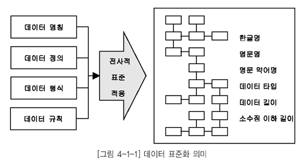

  * [그림 3-1-1] 데이터 표준화 의미

### 가. 데이터 명칭

데이터 명칭은 해당 기업 내에서 데이터를 유일하게 구별해주는 이름이다. 따라서 데이터 명칭에 대한 표준화는 동음이의어 및 이음동의어의 조정을 필요로 한다. 데이터 명칭은 일반적으로 다음의 원칙에 부합되어야 한다.

* 유일성

데이터 명칭은 해당 개념을 유일하게 구분해 주는 이름이어야 한다. 하나의 개념에 대해 모든 사용자들이 통일된 용어를 사용할 수 있도록 오직 하나의 명칭만을 허용해야 한다.

예1) 고객 계좌번호, 고객 구좌번호 -&gt; ‘고객 계좌번호’로 통일

예2) EMAIL 주소, EMAIL -&gt; ‘EMAIL 주소’로 통일

* 업무적 관점의 보편성

데이터 명칭은 업무적 관점에서 보편적으로 인지되는 이름이어야 한다. 일반적으로 기업 또는 조직 내의 구성원들이 해당 개념을 지칭할 때 가장 많이 사용하는 업무 용어를 그대로 사용하는 것이바람직하다.

* 의미 전달의 충분성

데이터 명칭은 그 이름만으로 데이터의 의미 및 범위가 파악될 수 있어야 한다. 업무나 사용자의 관점에 따라 의미가 달라질 수 있는 이름은 수식어 등을 사용함으로써 구체화하는 것이 좋다.

### 나. 데이터 정의

데이터 정의는 해당 데이터가 의미하는 범위 및 자격 요건을 규정한다. 사용자가 데이터의 의미를 가장 잘 이해할 수 있도록 업무 관점에서 범위와 자격 요건을 명시해야 하고, 데이터 명칭만으로는 사용자에게 전달하기 어려운 기타 사항들을 전달하는 역할을 한다. 또한 데이터 정의는 데이터 소유자를 결정하는 기준이 된다. 데이터 정의를 기술할 경우 다음의 사항들을 고려한다.

* 데이터 사용자가 데이터의 의미를 잘 이해할 수 있도록 관련 업무를 모르는 제 3자의 입장에서 기술한다.

* 서술식 정의만으로 데이터의 의미 전달이 어려울 경우에 실제 발생할 수 있는 데이터의 값도 같이 기술한다.

* 데이터 명칭을 그대로 서술하거나 약어 또는 전문 용어를 이용한 정의 기술은 가급적 사용하지 않는다.

### 다. 데이터 형식

데이터 형식은 데이터 표현 형태의 정의를 통해 데이터 입력 오류와 통제 위험을 최소화하는 역할을 한다. 데이터 형식은 업무 규칙 및 사용 목적과 일관되도록 정의한다.

* 데이터 타입
  * Numeric
  * Text
  * Date
  * Char
  * Timestamp 등
* 데이터 길이 및 소수점 자리
  * 데이터 형식을 정의할 경우에는 다음의 사항들을 고려한다.
* 도메인을 정의하여 데이터 표준에 적용함으로써 성격이 유사한 데이터 간의 데이터 형식을 통일화 한다.
* 데이터의 최대값 또는 최대 길이가 고정되어 있지 않을 경우 충분히 여유있게 정의한다.
* 특수 데이터 타입(CLOB, Long Raw 등)은 데이터 조회, 백업, 이행 등에 있어서 제약 사항이 존재하는 경우가 많기 때문에 가급적 사용하지 않는다.

### 라. 데이터 규칙

데이터 규칙은 발생 가능한 데이터 값을 사전에 정의함으로써 데이터의 입력 오류와 통제 위험을 최소화하는 역할을 한다. 데이터 규칙을 통해 데이터의 정합성 및 완전성을 향상할 수 있다. 데이터 규칙의 유형은 다음과 같다.

* 기본 값

사용자가 화면이나 프로그램으로부터 어떠한 값의 입력도 없는 경우 데이터 타입에 따라 미리 정의된 기본값이 입력될 수 있도록 한다. 즉 데이터 값의 입력을 생략했을 경우 자동으로 입력되는 데이터 값을 의미한다. 예를 들면, Numeric 타입의 항목에 대한 기본 값으로 ‘0’이 자동으로 입력되게 하거나 Char 타입의 항목에 대한 기본 값으로 ‘스페이스’가 자동으로 입력되게 한다.

* 허용 값

업무 규칙과 일관성을 갖도록 입력이 가능한 데이터 값을 제한하는 것으로 표준 코드 중 데이터 항목별로 가질 수 있는 코드 값을 사전에 정의하는 경우가 이에 해당한다. 예를 들면 표준코드에 정의된 허용 값이 01,02,03,04...10과 같이 정의 되었으나 특정 데이터 항목에서 발생할 수 있는 허용 값은 01,03,05처럼 부분적인 값을 갖는 경우이다.

* 허용 범위

업무 규칙과 일관성을 갖도록 입력이 가능한 데이터 값을 범위로 제한하는 경우이다. 예를 들면, 특정 데이터 항목에 허용 범위로 1 ~ 5까지를 정의한 경우 1 ~ 5 이외에는 입력이 불가능하도록 사전 에 제한할 수 있다.

## 2. 데이터 표준화 구성요소

전사적인 데이터 표준화를 추진하기 위해 수립해야 할 표준화 구성요소는 데이터 표준, 데이터 관리 조직, 데이터 표준화 절차이다.

  * [그림 3-1-2] 데이터 표준화 구성 요소

### 가. 데이터 표준

데이터 표준화는 기본적으로 데이터 모델 및 데이터베이스에서 정의할 수 있는 모든 오브젝트를 대상으로 하는 것이 수행하는 것이 이상적이나 주로 관리해야 될 필요성이 있는 오브젝트만을 대상으로 데이터 표준화를 하는 것이 효율적이다. 일반적으로 데이터 표준으로 관리되는 대상에는 용어, 단어, 도메인, 코드가 있다.

* 표준 용어 업무적으로 사용하는 용어에 대한 표준을 정의함으로써 용어 사용 및 적용에 대한 혼란을 방지하고 원활한 커뮤니케이션을 촉진시킨다. 표준 용어는 업무적 용어와 기술적 용어가 있다.
  * 업무적 용어
   흔히 일상 업무에서 사용하는 용어로서 보고서나 업무 매뉴얼상에서 많이 나타난다. 데이터 표준화 작업은 주로 데이터베이스에 적용하고 사용할 객체에 국한되기 때문에 업무적 용어의 표준화가 반드시 필요한 것은 아니다. 그러나 데이터베이스에서 적용할 용어들이 대부분 현업에 서 사용하는 용어를 그대로 수용한다는 점을 고려할 때 업무적 용어의 표준화는 데이터 표준화 작업을 수월하게 해주는 장점이 있다. 업무적 용어 표준화의 예는 색인(INDEX)을 들 수 있다.
  * 기술적 용어
   정보시스템에서 사용하는 용어를 지칭한다. 데이터 모델 또는 데이터베이스 스키마에서 나타나는 테이블명 및 칼럼명 등이 기술적 용어에 해당한다. 데이터 표준화 측면에서 용어를 표준화한다는 것은 업무적인 용어를 정보시스템에 반영하기 위해 기술적인 용어로 전환하고 이것을 일관되게 유지하고 관리한다는 것이다. 테이블 및 칼럼의 한글명은 대부분 업무적이터베이스의 제약 사항(테이블명의 중복 불허, 명칭에 대한 길이 제약)과 표준 단어의 사용에 따라 업무적 용어와는 상이하게 정의될 수도 있다.
* 표준 단어 표준 용어를 구성하는 단어에 대한 표준을 정의함으로써 용어에 대한 한글명과 영문명을 일관되게 정의할 수 있게 한다. 표준 단어의 목적은 2가지를 들 수 있다.
  * 표준 단어를 관리함으로써 동일한 개념을 의미하는 용어(또는 표준용어)의 생성을 예방한다. 예를 들어 ‘고객’과 ‘계좌’라는 표준단어를 정의함으로써 ‘고객 계좌’라는 용어만 표준으로 인정 하고 ‘고객 구좌’라는 용어는 표준에서 배제할 수 있다.
  * 표준용어의 영문명 작성 기준이 된다. 즉, 테이블 및 칼럼의 한글명만 작성하면 영문명은 표준 단어에 의해 자동으로 결정된다.
* 표준 도메인 표준 도메인은 칼럼에 대한 성질을 그룹핑한 개념이다. 도메인은 크게는 문자형, 숫자형, 일자형, 시간형으로 분류할 수 있고, 더 세부적으로는 명, 주소, ID(이상 문자형), 금액, 율, 수량(이상 숫자형) 등으로 분류할 수 있다. 도메인에 대한 표준을 정의함으로써 동일한 성질을 가진 칼럼의 데이터 타입 및 데이터 길이를 일관되게 관리할 수 있으며, 향후 칼럼 값에 대해 공통적인 데이터 검증 규칙의 적용이 가능하다. 표준 도메인을 칼럼에 적용함으로써 칼럼의 데이터 타입 및 데이터 길이를 일관되게 정의할 수 있다.
* 표준 코드 코드는 도메인의 한 유형으로서 특정 도메인 값(코드값)이 이미 정의되어 있는 도메인이다. 따라서 코드에 대한 표준은 다른 표준과는 달리 데이터 값, 즉 코드값까지 미리 정의해야 한다.
* 기타 데이터 표준 관련 요소 용어, 단어, 도메인 및 코드 등 일반적으로 관리하는 데이터 표준 이외에도 필요에 따라서 데이터 모델에서 정의하는 주제영역, 관계명과 데이터베이스에서 정의하는 데이터베이스, 데이터베이스 스키마, TABLESPACE, INDEX, CONSTRAINT 등에 대한 표준을 관리한다.

### 나. 데이터 표준 관리 조직

전사적으로 수립된 데이터 표준 원칙, 데이터 표준, 데이터 표준 준수 여부 관리 등을 위해서는 데이터 관리자(DA, Data Administrator)의 역할이 요구된다. 데이터 관리자는 하나의 기업 또는 조직 내에서 데이터에 대한 정의, 체계화, 감독 및 보안 업무를 담당하는 관리자를 의미한다. 이러한 데이터 관리자는 기업 또는 조직 전반에 걸쳐 존재하는 데이터에 대한 관리를 총괄하고 정보 활용에 대한 중앙 집중적인 계획 수립 및 통제를 수행한다.

#### 1) 데이터 관리자 주요 역할

* 데이터에 대한 정책과 표준 정의

데이터 관리자는 데이터에 대한 표준화 원칙 및 표준을 정의한다. 표준에 대한 변경과 추가가 발생시에 최종적으로 승인 의사결정을 수행하며, 기업 내에 산재된 시스템에 대한 데이터 표준 준수 여부를 주기적으로 체크하여 지속적인 표준 관리 활동을 수행한다.

* 부서간 데이터 구조 조율

데이터 관리자는 전사 데이터 관리 기준에 의거하여 단위 시스템이나 조직 부처에 명확한 데이터 관리 기준을 제시하고, 부서간에 데이터 구조에 대한 이견 발생시에 전사 데이터 관리 관점에서 데이터 구조를 제시하여 체계적인 데이터 구조 관리가 이루어지는 역할을 수행한다.

* 데이터 보안 관리

데이터 관리자는 데이터에 대한 보안 정책 수립, 보안 정책 준수 여부 체크, 보안 시정 조치 요구등을 수행한다.

* 데이터 모델 관리

데이터 관리자는 데이터에 대한 중요한 의사소통의 도구가 되는 데이터 모델을 물리적인 변경 시점에 동일하게 관리함으로써 향후 데이터 활용에 대한 업무 협의시 신속한 의사결정이 이루어지도록 관리한다.

* 데이터의 효율적인 활용 방안 계획

데이터 관리자는 데이터가 전사적으로 공유되어 효율적으로 활용되도록 지속적으로 데이터 활용상의 문제점 등을 체크하여 데이터 활용과 관련된 방안을 수립하여 시행한다.

#### 2) 데이터 관리자 세부 역할

데이터 관리자는 다음과 같이 전사 데이터 관리자, 업무 데이터 관리자, 업무 시스템 데이터 관리 자로 나뉘어지고 각자의 역할은 [표 3-1-1]과 같다.

[표 3-1-1] 데이터 관리자 세부 역할

| 구분 | 주요 활동 |
|----|----|
| 전사 데이터 관리자|◼ 데이터 표준화에 대한 정책 결정 ◼ 검토된 데이터 표준 제안에 대한 승인 |
| 업무 데이터 관리자|◼ 담당 업무 기능의 데이터 요구 사항 반영을 위해 필요한 데이터 표준 정의 ◼ 업무 관련 데이터 표준 변경 제안에 대한 합동 검토 |
| 업무 시스템 데이터 관리자|◼ 시스템 관리 목적의 데이터 요구 사항을 위해 필요한 데이터 표준 정의 ◼ 업무 관련 데이터 표준 변경 제안에 대한 합동 검토 ◼ 데이터 모델에 대한 데이터 표준 적용 및 준수 여부 체크 |

#### 3) 데이터베이스 관리자와 비교

데이터 관리자(DA, Data Administrator)와 데이터베이스 관리자(DBA, DataBase Administrator) 는 [표 3-1-2]와 같이 역할이 구분된다.

[표 3-1-2] 데이터 관리자/데이터베이스 관리자 역할 비교

| 구분 | 데이터 관리자(DA) | 데이터베이스 관리자(DBA) |
|----|----|----|
| 관리 대상|데이터 요구 사항을 반영한 데이터 모델 및 각종 표준|데이터 모델을 특정 데이터베이스 제품의 특성에 맞추어 구축한 데이터베이스 |
| 주업무|업무에 필요한 데이터의 메타 데이터를 정의하고 신규 또는 변경된 요구 사항을 신속하게 데이터 모델에 반영|요구되는 성능 수준을 발휘하면서 안정적 으로 운영되도록 데이터베이스를 관리 |
| 품질 수준 확보|데이터 표준의 관리 및 적용을 통해 품질 수준을 확보|데이터의 정합성 관리를 통해 데이터 품질 수준을 확보 |
| 전문 기술|담당 업무 분야에 대한 업무 지식과 데이 터 모델링에 대한 전문성이 필요|데이터 모델에 대한 해독 능력 및 특정 데 이터베이스 제품에 대한 전문 지식이 필요 |

### 다. 데이터 표준화 절차

일반적인 데이터 표준화 절차는 데이터 표준화 요구 사항 수집, 데이터 표준 정의, 데이터 표준 확 정, 데이터 표준 관리로 이루어지며, 데이터 표준화 절차별 주요 활동은 [표 3-1-3]과 같다.

[표 3-1-3] 데이터 표준화 절차별 활동

| 구분 | 주요 활동 |
|----|----|
| 데이터 표준화 요구 사항수집|◼ 개별 시스템 데이터 표준 수집 ◼ 데이터 표준화 요구 사항 수집 ◼ 표준화 현황 진단 |
| 데이터 표준 정의|◼ 표준화 원칙 ◼ 데이터 표준 정의 : 표준 용어, 표준 단어, 표준 도메인, 표준코드, 기타 표준 |
| 데이터 표준 확정|◼ 데이터 표준 검토 및 확정 ◼ 데이터 표준 공표 |
| 데이터 표준 관리|◼ 데이터 표준 이행 ◼ 데이터 표준 관리 절차 수립 : 데이터 표준 적용, 변경, 준수 검사 절차 |

데이터 표준 관리 도구는 수립된 전사 데이터 표준 정보의 관리, 데이터 표준에 의한 개발 및 유지보수 지원, 데이터 표준 준수 및 변경 영향도 평가를 담당하는 기능으로 구성된다. 최근에는 이러한 데이터 표준 관리 기능과 더불어 애플리케이션 정보, 데이터 흐름 정보, 각종 데이터에 대한 메타 정보에 대한 조회 기능을 갖는 시스템을 도입하여 활용하고 있다.

## 1. 확장된 데이터 표준 관리 도구의 기능

최근에는 이러한 데이터 표준 관리 기능 외에 애플리케이션 정보, 데이터 흐름 정보, 각종 데이터 에 대한 메타(Meta) 정보에 대한 조회 기능을 갖는 메타 데이터 시스템을 도입하여 활용하고 있다.

  * [그림 3-1-3] 데이터 표준 관리 시스템 구성

[그림 3-1-3] 데이터 표준 관리 시스템 구성

| 기능명 | 설명 |
|----|----|
| 데이터 모델 관리|데이터 표준 관리 도구를 이용하여 개념, 개괄, 논리, 물리 모델에 대한 조회 및 변경 관리를 하는 기능 |
| 데이터 표준 관리|표준 단어, 표준 도메인 등의 표준 관련 사전을 관리하는 기능 |
| 데이터 품질 관리|데이터 품질 진단 및 분석과 비즈니스 규칙 등을 관리하는 기능 |
| OLAP 정보 관리|OLAP 시스템에 구현된 메타 정보와 연계하여 관리하는 기능 |
| 사용자 권한 관리|현업 및 IT 사용자에 대한 권한 관리 기능 |
| 변경 영향도 분석|표준 및 모델 변경에 따른 전체 영향도를 분석하는 기능 |
| ETL 정보 관리|계정계부터 최종 사용자까지 데이터 흐름 및 매핑 정보에 대한 관리 기능 |
| 표준 요청 관리|표준의 신규 및 변경에 따른 절차와 승인 관리 기능 |
| JOB 관리|ETL 프로그램의 정상 및 오류 여부 등을 관리하는 기능 |
| DB 스키마 관리|데이터 모델과 실제 DB와의 일치성 등을 관리하는 기능 |

## 2. 데이터 표준 관리 시스템 기능

일반적인 데이터 표준 관리 시스템은 데이터 표준 관리, 데이터 구조 관리, 프로세스 관리의 기능으로 구성된다.

### 가. 데이터 표준 관리 기능

데이터 표준을 정의하고자 할 때 기존에 정의된 표준들을 조회하고, 이미 정의된 데이터 표준이 잘준수되도록 관리하는 기능으로 구성된다.

[표 3-1-4] 데이터 표준 관리 기능

| 기능 | 세부 설명 | 주요 내용 |
|----|----|----|
| 단어 관리 | 전사 단어 사전 및 금칙어|◼ 전사 관점에서의 단어 사전 관리 ◼ 금칙어의 사전 정의 및 관리 |
| 용어 관리 | 용어 사전|◼ 업무적으로 정의된 표준 용어에 대한 관리 ◼ 기본 단어의 조합으로 업무 용어를 생성함 |
| 도메인 관리 | 도메인 사전|◼ 대표 및 그룹 속성에 대한 데이터 타입, 길이, 소수점 이하 길이 등을 사전에 정의한 도메인 관리 |
| 표준 코드 관리 | 전사 표준 코드|◼ 수집된 코드로부터 코드 통합 과정을 거쳐 전사 표준 코드를 도출한 후 관리 |
| 코드 변환 매핑 |◼ 소스 코드 값과 표준 코드와의 변환 매핑 관리 |
| 멀티 표준 관리 | 멀티 표준|◼ 코드, 칼럼, 테이블, 도메인 등에 대하여 멀티 표준을 관리해서 전사에 존재하는 여러 표준을 지원하고 이후 전사 표준으로 통합 되도록 함 |

### 나. 데이터 구조 관리 기능

데이터 모델의 구조를 관리하거나 소스 시스템으로부터 DB 스키마를 리포지터리에 로드하기 위 해 필요한 기능 등으로 구성된다.

[표 3-1-5] 데이터 구조 관리 기능

| 기능 | 세부 설명 | 주요 내용 |
|----|----|----|
| ER 모델 구조 관리 | 모델, 테이블의 구조 정보|◼ ER 모델 관리 ◼ 리포지터리로부터 데이터 구조 정보를 추출 및 로드 |
| DB 스키마 관리 | 다양한 DBMS 지원 및 DB 스키마 로드|◼ 다양한 DBMS로부터 DB 카탈로그를 추출 및 로드 |
| 가변 속성 관리 | 모델의 사용자 속성을 자동 생성|◼ 모델 기본 속성 외에 설계 속성을 쉽게 추가 |
| 이력 관리 | 이력 관리|◼ 데이터 모델 변경 이력 ◼ 형상 관리 지원 |
| 모델 비교 관리 | 충실도 및 준수도 검사|◼ 데이터 구조 정보에서 표준화 자동 검사 ◼ 표준에 대한 준수도 자동 검사 ◼ 데이터 구조 정보 간 비교 |

### 다. 프로세스 관리 기능

데이터 표준에 대하여 신규 및 변경이 발생하거나 데이터 모델과 관련해 신규 테이블 등을 요청하고 승인하는 업무 프로세스 기능으로 구성된다.

[표 3-1-6] 프로세스 관리 기능

| 기능 | 세부 설명 | 주요 내용 |
|----|----|----|
| 표준 등록 | 표준 요청 프로세스 지원|◼ 코드, 칼럼, 테이블, 도메인 등에 대한 사용자 요청부터 데이터관리자의 승인/반려 기능 지원 |
| 모델 등록 | 모델 등록 요청 프로세스 지원|◼ 엔터티, 속성, 테이블, 칼럼 등 데이터 모델에 대한 사용자 요청을 등록하고 관리자의 승인/반려 기능을 지원 |

## 3. 데이터 표준 관리 시스템 도입시 고려사항

데이터 표준 관리 시스템 도입시 시스템의 확장성, 유연성, 편의성 관점에서 충분한 검토가 이루어져야 한다.

* 확장성

다양한 시스템 및 DBMS의 정보 수집과 OLAP 툴 등의 다양한 데이터 구조 정보를 추출 할 수 있는지 검토한다.

* 유연성

데이터 표준을 전사적으로 일시에 적용하기는 곤란하므로 단계적 적용을 위한 여러 개의 통합 표준을 사용할 수 있는 복수 표준 관리가 가능한지와 한글명 및 영문명의 표현 방식, 표준의 변경 용이성을 검토한다.

* 편의성

한글명의 영문명 자동 변환, 표준 검증의 주기적인 작업 수행 기능, 메타 정보 수집시 Import 수작업 최소화 등 사용자 편의성을 검토한다.

* 제1절 데이터 표준화 필요성
  * 현재 데이터 활용에 따른 문제점으로는 데이터의 중복, 시스템별 데이터 불일치, 데이터에 대한 의미 파악 시 어려움 등이 있다.
  * 데이터 품질 및 표준이 가지는 문제점으로 동시 다발적인 정보시스템 개발, 전사 데이터 관리 마인드 미형성, 전사 데이터 관리 인력 부재, 전사 데이터 표준 관리 도구 부재를 들 수 있다.
  * 기업의 전략적 의사결정으로서 데이터의 중요성이 증가함에 따라 전사적인 데이터 표준화 활동이 필요하다.
  * 데이터의 표준화 후 발생되는 기대 효과로는 명칭의 통일로 인한 명확한 의사소통의 증대, 일관된 데이터 형식 및 규칙의 적용으로 인한 데이터 품질 향상 등을 들 수 있다.

* 제2절 데이터 표준화 개념
  * 데이터 표준화 구성 요소로는 데이터 명칭, 데이터 정의, 데이터 형식, 데이터 규칙 등이 있다.
  * 데이터 표준화는 시스템별로 산재해 있는 정보 요소에 대한 정의, 명칭, 형식, 원칙을 수립하여 전사적으로 적용하는 것을 의미한다.
  * 데이터 명칭을 부여할 때는 유일성, 업무적 관점에서의 보편성, 의미 전달의 분성 등을 고려하여 부여한다.
  * 사용자가 의미를 잘 이해할 수 있도록 데이터의 정의를 기술해야 하며, 서술로서만 의미가 어려울 경우 관련 계산식이나 예를 포함하여 이해를 높인다.
  * 데이터 항목에 도메인 표준을 적용함으로써 형식이 비슷한 항목이 서로 다르게 되지 않도록 적용한다.
  * 발생 가능한 데이터 값을 사전에 정의함으로써 데이터의 정합성 및 완전성을 향상할 수 있는 방법으로 데이터에 대한 기본 값, 허용 값, 허용 범위 등을 정의한다.
  * 데이터 표준으로 관리하는 대상으로는 표준 용어, 표준 단어, 표준 도메인, 코드 등이 있다. 표준 용어는 일상 업무에서 사용하는 업무적 용어와 정보시스템에서 사용하는 기술적 용어로 정의한다.
  * 데이터에 대한 정책과 표준 정의, 데이터 구조 설계, 데이터 모델 관리 등은 데이터 관리자의 기본적인 역할이다.

* 제3절 데이터 표준 관리 도구
  * 전사 데이터 표준을 관리하고 전체적인 프로세스를 지원하기 위해서는 데이터 표준 시스템을 고려한다.
  * 일반적인 데이터 표준 관리 시스템의 기본 기능으로 표준 관리, 구조 관리, 프로세스 관리가 있다.
  * 전시에 존재하는 여러 시스템의 표준을 지원하고, 향후 전사 표준화로 통합하기 위해 멀티 표준의 기능들이 필요하다.

문제 1. 다음 중 데이터 표준화 수립의 기대 효과로 가장 부적합한 것은?
① 표준화된 명칭을 사용하여 다양한 계층 간의 명확한 의사소통이 가능해진다. 
② 각 업무 시스템 간의 데이터 인터페이스 시에 데이터 변환 및 정제 비용이 감소한다.
③ 일관성 있는 명칭을 사용하여 시스템 운용 시간 및 개발 생산성이 감소한다.
④ 데이터 사용자들이 필요한 데이터의 소재 파악에 소요되는 시간 및 노력이 감소한다.

문제 2. A기업은 데이터 통합 프로젝트를 수행 중에 현행 시스템에서 사용한 데이터 표준화 문서를 검토하고자 한다. 다음 중 데이터 표준화의 일반적인 정의로 가장 적합한 것은?
① 데이터 코드 값에 대한 불일치를 파악하고 정의한다. 
② 데이터 명칭에 대한 현행 수준을 진단한다. 
③ 데이터 표준 요소에 대한 명칭, 정의, 형식 등을 수립하고 적용하는 것을 말한다.
④ 데이터 표준에 대한 영향도 분석을 수립한다.

문제 3. 데이터 표준화의 구성 요소 중에 하나인 데이터 명칭 표준화를 진행하고자 한다. 다음 중 데이터 관리자로써 데이터 명칭에 대한 표준화 원칙을 수립하고자 할 때, 고려할 사항으로 가장 부적절한 것은?
① 데이터 명칭은 해당 개념을 유일하게 구분해 주는 이름이어야 한다. 
② 데이터 명칭은 업무적 명칭과 기술적 명칭을 구별하여 활용해야 한다.
③ 데이터 명칭은 업무적 관점에서 보편적으로 인지되는 이름이어야 한다. 
④ 데이터 명칭은 그 이름만으로도 데이터의 의미 및 범위가 파악될 수 있어야 한다.

문제 4. A기업의 데이터 표준에 대한 전사 기본 원칙이 수립되었다. 다음 중 전사적 관점에서 데이터 표준화 기본 원칙으로 채택하기에 가장 부적절한 것은?
① 한글명에 대해서는 복수 개의 영문명을 허용한다. 
② 영문명 (물리명) 전환 시 발음식 (예: 번지-->BUNJI)도 허용한다.
③ 한글명 및 영문명 부여 시 띄어쓰기는 허용하지 않는다.
④ 영문명에 대해서는 복수 개의 한글명을 허용한다.

문제 5. 데이터아키텍처 담당자로써 데이터 명칭에 대한 표준화 원칙을 보완하고자음 중 고려할 사항으로 가장 부적절한 것은?
① 업무적 명칭과 기술적 명칭을 구별하여 활용해야 한다.
② 해당 개념을 유일하게 구분해 주는 이름으로 명명되어야 한다. 
③ 업무적 관점에서 보편적으로 인지되는 이름이어야 한다.
④ 이름만으로 데이터의 의미 및 범위가 파악될 수 있도록 명명되어야 한다.

## 1. 데이터 표준화 요구 사항 수집

현업 및 개발자로부터 데이터 표준과 관련된 요구 사항을 인터뷰 및 설문조사 등을 통하여 조사함으로써 전사 데이터 표준 대상 후보를 식별하고 개선점을 도출하는데 사용할 자료를 마련한다. 조사시 현업 및 개발자들이 각자 맡고 있는 담당 영역의 틀에서 벗어나 반드시 전체적인 관점 및 제3자의 관점에서 기술할 수 있도록 유도한다.

  * 데이터 표준과 관련된 문제점을 조사할 때 유효한 방법 중 하나는 자신이 맡고 있는 영역과 다른 영역간의 인터페이스 부분에서 발생하는 불편 사항 및 개선 사항을 파악하는 것이다. 영역이라는 것은 주제 영역간 또는 정보 시스템간 일 수 있다.

  * 특정 영역에 대한 데이터 표준 요구 사항을 조사할 때 해당 영역을 오랫동안 관리하여 온 담당자보다는 해당 영역에 대해 익숙치 않은 관련자의 관점이 오히려 더 유용하다. 담당자는 자기가 담당하고 있는 영역에 대해 이미 익숙해져 있기 때문에 데이터 표준에 대한 필요성을 많이 느끼지 못할수 있다.

  * [그림 3-2-1] 표준화 요구 사항 정의서 예

## 2. 현행 데이터 표준 원칙 분석

현행 정보시스템에서 적용하고 있는 데이터 표준 원칙 및 데이터 표준을 수집하고, 수집된 자료를 통하여 식별된 데이터 표준의 관리 대상 및 현황을 파악한다.

### 가. 현행 데이터 표준 원칙 수집

현행 정보시스템에 적용되고 있는 데이터 표준에 대한 원칙을 수집한다. 현행 데이터 표준 원칙은 다음의 방법들을 통하여 수집한다.

  * 현 정보시스템 개발 지침 문서 및 데이터 표준의 확보

현행 데이터 표준 원칙은 기존 정보시스템을 개발할 당시 작성하고 적용되었던 개발 지침 문서 및 데이터 표준을 통하여 수집한다. 데이터 표준 개발 지침 문서로는 각종 오브젝트(테이블, 칼럼 등)에 대한 명명규칙 등이 있다. 또한 실제 정의된 데이터 표준에 대한 검토를 통해서도 각 데이터 표준 대상별 관리 항목을 파악할 수도 있다.

  * 현행 정보시스템 모델의 분석

현행 데이터 모델 또는 데이터베이스 스키마에서 보여지는 오브젝트의 정의 패턴 분석을 통하여 정보시스템 구축시 적용했던 원칙을 유추해 낼 수 있다. 그러나 유추해 낼 수 있는 데이터 표준 대상 및 관리 항목이 상당히 제한적이다.

### 나. 데이터 표준 원칙 사용 현황 분석

수집된 데이터 표준 원칙 자료를 토대로 현행 정보시스템에서 적용하고 있는 데이터 표준 대상 및 관리 항목을 도출한다. 데이터 표준 대상별로 어떠한 정보시스템에 적용하고 있는지, 어떠한 관리 항목을 관리하는지, 어떻게 상이하게 관리되고 있는지에 대해 조사한다. 이를 통해 향후 전사 데이터 표준 대상에 대한 개선점을 도출하는데 사용할 자료를 마련한다.

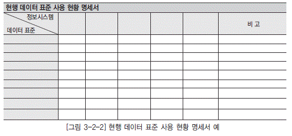

  * [그림 3-2-2] 현행 데이터 표준 사용 현황 명세서 예

## 3. 데이터 표준 개선 방안 정의

현행 데이터 표준 사용 현황 명세서와 표준화 요구 사항 정의서를 토대로 하여 데이터 표준 대상별 문제점 및 개선 방안을 도출한다. 문제점 및 개선 방안 도출시 반드시 전사적인 관점에서 접근하며, 전사적 관리의 필요성을 검토하여 관련 데이터 표준 대상 또는 대상별 관리 항목을 신규로 정의하거나 정의 대상에서 제외한다. 또한 최종적으로 데이터 표준 개선 방안은 기존에 수립된 데이터 관리 정책에 부합되어야 한다.

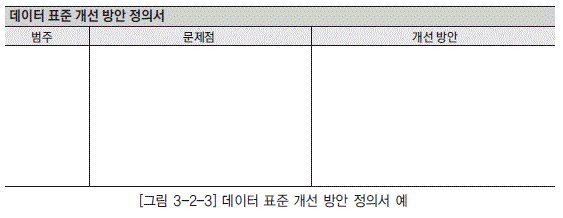

  * [그림 3-2-3] 데이터 표준 개선 방안 정의서 예

## 4. 데이터 표준 원칙 수립

현행 데이터 표준에 대한 개선 방안을 토대로 향후에 적용할 전사 데이터 표준 기본 원칙을 정의하고, 향후 전사 데이터 표준의 생성 및 변경시 참고할 수 있도록 각 데이터 표준 대상별 데이터 표준 원칙을 작성하여 문서화한다.

### 가. 데이터 표준 기본 원칙 정의

데이터 표준 개선 방안을 참고하여 전체적으로 적용할 기본 원칙을 수립함으로써 표준화에 대한 방향을 사전에 정의할 수 있다. 표준화 원칙의 예로는 한글명에 특수 기호를 사용하지 않거나, 영문명 표기시 발음되는 대로 기술하는 것을 금지하거나, 이음동의어 사용을 금지하는 것을 정의하는 것이다.

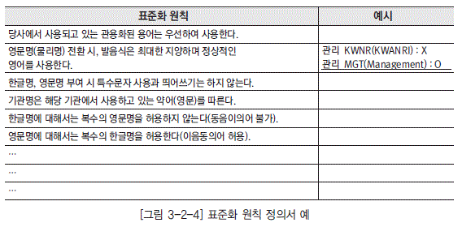

  * [그림 3-2-4] 표준화 원칙 정의서 예

### 나. 데이터 표준 지침 작성

모든 사용자들이 참고해야 하는 데이터 표준화에 대한 구체적인 지침 문서를 작성한다. 각 데이터 표준 대상에 대한 세부 지침 사항은 데이터 표준 기본 원칙에 부합되도록 작성한다.

#### 1) 데이터 표준 지침의 기본 구성

데이터 표준 지침은 데이터 표준 대상별로 어떻게 표준화할 것인가에 대해 구체적으로 정의한 문 서이다. 일반적으로 데이터 표준 지침에 포함될 내용들은 다음과 같다.

  * 개요

  * 데이터 표준화 및 데이터 표준 지침에 대한 목적을 기술한다.

  * 데이터 표준화 관련자의 역할과 책임

  * 데이터 표준화와 관련된 사용자들을 정의하고 그들의 역할 및 책임을 규정한다. 일반적으로 정의 하는 관련자로는 전사 데이터 관리자, 데이터 관리자, 모델러 등이 있다

  * 데이터 표준 관리 절차

  * 데이터 표준과 관련된 일련의 작업 프로세스를 규정하고, 프로세스별로 데이터 표준화 관련자들의역할을 기술한다. 일반적으로 데이터 표준 관리 절차로는 데이터 표준 정의, 데이터 표준 변경, 데이터 표준 준수 프로세스가 있다.

  * 데이터 표준 기본 원칙

  * 데이터 표준 대상 모두에 대해 일반적으로 적용되어지는 기본 원칙을 기술한다.

  * 데이터 표준 대상별 명명규칙

  * 데이터 표준 대상별로 데이터 표준 명칭을 작성하는 방법에 대해 구체적으로 기술한다. 데이터 표 준 대상별로 차이는 있으나, 일반적으로 명명 규칙은 [표 3-2-1]의 내용들을 포함한다.

[표 3-2-1] 데이터 표준 대상별 명명규칙

| 기술 내용 | 설명 |
|----|----|
| 사용 문자|알파벳, 한글, 숫자, 특수문자, 전각/반각 등의 허용 여부 또는 사용 조건을 규정한다. |
| 영문 대소문자|알파벳을 사용할 경우 대소문자 사용과 관련한 규칙을 규정한다. |
| 한글명과 영문명 동시 정의 여부|DBMS에 반영되는 객체들은 대부분 알파벳으로 정의하도록 되어 있는 경 우가 있기 때문에 이와 관련된 데이터 표준 정의 대상에 대해서는 한글명과 영문명의 정의가 필요하다. 일반적으로 표준 단어, 표준 용어가 이에 해당 한다. |
| 명칭의 구조|표준 용어를 사용하는 테이블명 및 칼럼명의 경우 명칭을 통하여 그 특성 또는 부가 정보를 표시할 수 있도록 명칭에 대한 단어 표준 조합 구조를 명시한다. 예) 수식어 + [수식어] + 속성 유형(금액, 건수, 코드 등) |
| 명칭에 대한 허용 길이|표준 용어를 사용하는 테이블명 및 칼럼명의 경우 DBMS의 물리적 특성으 로 길이의 제약을 받기 때문에 표준 용어의 허용 길이를 명시해야 한다. |
| 명칭 표준화에 대한 기준|유사한 개념의 단어/용어가 복수 개 존재할 경우 어떤 기준으로 표준 단어/ 표준 용어로 선택할 것인가를 결정하는 기준을 정의한다. 예) 일련번호, ID, SEQ --&gt; ID로 표준화한다. |
| 명칭에 대한 예|명칭에 대한 허용 길이, 명칭 구조 체계, 명칭 표준화 기준 등을 준수하여 작성된 샘플을 몇 가지 명시한다. |

  * 데이터 형식 정의에 대한 기준

  *

데이터 표현 형태를 정의하는 기준 및 방법을 기술한다. 일반적으로 표준 용어를 칼럼으로 사용하 는 경우나 표준 도메인, 표준 코드에 대하여 데이터 형식 정의에 대한 기준을 정의한다. 표준 용어 의 명칭에 대한 표준화 기준을 정의할 때 데이터 형식도 같이 정의함으로써 명칭의 결정과 동시에 데이터 형식도 자동적으로 결정된다.

  *  예1) 표준 용어의 경우: ID에 대한 데이터 형식은 8자리 텍스트로 한다.

  *  예2) 표준 도메인의 경우:‘ 번호’성 도메인에 대한 데이터 형식은 텍스트로 정의한다.

  * 기타

  * 데이터 표준 대상별로 고유한 특성에 대해 원칙을 구체적으로 기술한다.

  *  예) 표준 도메인의 경우 데이터 타입을 결정하는 기준

#### 2) 주요 데이터 표준 대상별 지침의 일반적인 구성

데이터 표준 대상에 대한 세부 지침은 각 데이터 표준 대상의 특성에 맞게 기술한다. 다음은 관련 데이터 표준 대상별로 일반적으로 기술하는 지침의 내용이다.

* 표준 단어
  * 한글명 및 영문명에 대한 알파벳, 한글, 숫자, 특수문자, 전각/반각 등의 허용 여부 또는 사용조건
  *  대소문자 사용 규칙
  *  한글명, 영문명에 대한 허용 길이
  *  합성어(단어의 조합으로 이루어진 단어) 정의에 대한 지침
  *  접두사에 대한 처리 방안
  *  동음이의어/이음동의어 허용 여부 및 처리 방안

* 표준 용어
  *  데이터 명칭에 대한 구조 체계
  *  한글명, 영문명에 대한 허용 길이
  *  용어를 테이블이나 칼럼명으로 사용할 경우 준수해야 할 특이한 명명규칙
  *  용어를 칼럼명으로 사용할 경우 데이터 형식 표준화에 대한 기준 및 표준 도메인 적용 여부

* 표준 도메인
  *  데이터 형식 표준화에 대한 기준

* 표준 코드
  *  데이터 명칭에 대한 구조 체계 및 명명에 대한 기준
  *  데이터 형식 표준화에 대한 기준
  *  코드번호 체계 정의에 대한 규칙

#### 3) 데이터 표준 개발 지침 작성 시 유의사항

일반적으로 데이터 표준 지침은 현행 데이터 표준 지침을 그대로 유지하는 것이 가장 바람직하지만, 무엇보다도 단위 정보시스템의 영역을 벗어나 다른 정보시스템에서도 적용이 가능하도록 범용성을 고려하여 정의한다.

  * DBMS마다 허용하는 테이블 및 칼럼의 물리명 길이가 상이하다. 따라서 용어에 대한 영문명의 허용 길이에 대한 지침을 정의할 때 적용대상 DBMS에 모두 적용이 가능하도록 고려해야 하며, 어려울 경우 영문 축약명을 추가로 정의하거나 뷰(View)를 사용하는 등 다른 대안을 마련한다.

  * DBMS마다 정의하고 있는 데이터 타입이 각기 상이하기 때문에 특정 DBMS 기준으로 데이터 형식을 정의할 경우 다른 DBMS에서는 다른 데이터 타입으로 적용되는 경우가 발생한다. 따라서 표준 용어 또는 표준 도메인에 서로 다른 DBMS에 따라 어떻게 적용할 것인가에 대한 방안을 고려해야 한다.

  *  방안1) 데이터 형식을‘문자 1자리’, ‘숫자 15.2자리’등 논리적으로 기술하는 것으로 지침을 내리고, 이러한 논리적인 데이터 형식과 각 DBMS별 물리적인 데이터 타입 간의 변환 Map을 정의한다.

  *  방안2) 데이터 형식의 정의시 특정 DBMS 기준의 데이터 타입을 이용하여 정의하고, 기준이 되는 DBMS의 데이터 타입과 기타 DBMS의 데이터 타입 간의 변환 Map을 정의하여 다른 DBMS에 적용할 때 데이터 타입 결정에 대한 기준을 제공한다.

   
> 출처 : 데이터온에어 – 한국데이터산업진흥원([https://dataonair.or.kr](https://dataonair.or.kr))