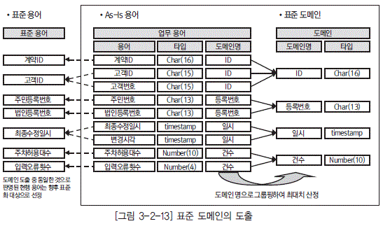
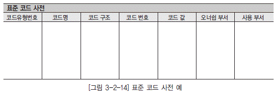
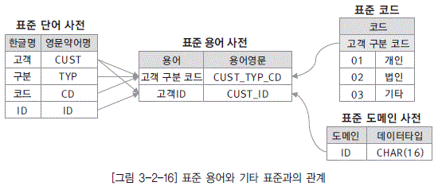

# 과목3. 데이터 표준화
# 제2장 데이터 표준 수립
# 제2절 데이터 표준 정의

## 1. 표준 단어(Word) 사전 정의

표준 단어 사전 정의는 기존 데이터 모델 및 용어집을 통해 해당 기관에서 사용되고 있는 모든 단 어를 추출한다. 추출된 단어는 단어 종류와 유형을 분류하고 업무 정의 및 용도를 고려하여 표준 단어를 정의한다. 표준 단어 사전을 정의할 경우 이음동의어, 동음이의어 처리에 주의해야 한다. 정의된 표준 단어는 정의된 표준화 원칙을 참고하여 영문명과 영문 약어명을 정의한다.

### 가. 표준 단어 사전

일반적으로 단어란 문법상 일정한 뜻과 구실을 가지는 말의 최소 단위를 의미하며, 정보 시스템에서 사용하는 표준 단어 사전이란 기업에서 업무상 사용하며 일정한 의미를 갖고 있는 최소 단위의 단어를 정의한 사전을 말한다.

표준 단어를 정의함으로써 업무상 편의나 관습에 따라 동일한 단어를 서로 다른 의미로 사용하는 경우, 혹은 하나의 단어에 다양한 의미를 부여하여 사용하는 등의 문제를 방지한다.

#### 1) 표준 단어 관리 기준

<dl class="t_dot">

  * 표준성

  * 정보시스템이나 일반적인 업무에서 사용되는 단어 가운데에서 추출해야 하며, 너무 업무적인 용어 의 사용을 최소화하여 정보시스템의 특성에 부합되도록 한다.

</dl>

<dl class="t_dot">

  * 일반성

  * 일상적으로 사용하고 있는 사전적 의미의 단어와 의미상 크게 다르지 않아 일반인도 해당 단어의 의미를 이해할 수 있어야 한다.

</dl>

<dl class="t_dot">

  * 대표성

  * 동의어를 가질 수 있으며 표준 단어로 선언된 단어는 비슷한 의미의 동의어들을 대표할 수 있어야 한다.

</dl>

#### 2) 표준 단어 작성 형식

표준 단어는 전사적으로 관리하고 있는 엔터티와 속성을 개별 단위로 하여 추출하며, 추출된 단어 는 동음이의어와 이음동의어를 정비한 후 논리명(한글명)을 기준으로 물리명(영문명, 영문약어명), 유사 용어까지 함께 정리하여 관리한다. 표준 단어 사전에는 개별 단어 외에도 동의어, 유의어, 반의 어 등과 같은 단어 간의 구조도 함께 정의해야 한다. 표준 단어 사전은 [그림 3-2-5]와 같은 형식으 로 작성한다.

  * [그림 3-2-5] 표준 단어 사전 예">

### 나. 표준 단어 정의

표준 단어는 정보시스템별로 혼재되어 사용되고 있는 모든 용어를 단어 단위로 분할하여 도출한 다. 표준 단어는 [그림 3-2-6]과 같은 일련의 과정을 거쳐 정의한다.

  * [그림 3-2-6] 표준 단어의 도출">

#### 1) 현행 용어 수집

기업 내 존재하는 모든 정보시스템에 대한 데이터 모델 또는 테이블 정의서와 칼럼 정의서를 분석하여 현행 용어에 대한 한글명 및 영문명을 수집한다. 현행 용어를 통하여 단어를 분할하고 그에 해당하는 영문 약어명을 도출하려는 것이 목적이므로 일부 상용화된 애플리케이션 패키지처럼 한글명이 존재하지 않은 데이터 모델은 수집 대상에서 제외한다.

#### 2) 단어 분할

수집된 현행 용어에서 업무상 사용되며 일정한 의미를 갖고 있는 최소 단위의 단어로 분할한다. 단어 분할을 통하여 한글명과 그에 해당하는 영문 약어명이 도출되어야 하기 때문에 단어 분할시 한글명을 비롯하여 영문명도 같이 분할이 되는가를 고려해야 한다. 단어 분할시 단독으로 분할되는 숫자는 표준화 대상 단어에서 제외한다.

  * [그림 3-2-7] 단어 분할의 예">

#### 3) 단어 정렬

분할하여 취합된 모든 단어 중에서 의미가 동일한 단어들에 대해 하나의 대표 단어를 표준으로 선정하고 그에 대한 영문 약어명을 선택한다. 최종적으로 도출해낸 모든 단어들은 한글명과 영문 약어명 모두 유일해야 한다.

단어 정렬시 이용 가능한 기법

  * 한글명이 동일한 단어와 의미가 동일한 단어(이음동의어)들을 취합한 후 활용 빈도가 가장 많은 한글명을 표준 단어로 선택한다. 이음동의어는 영문 약어명이 동일한 단어들에 대한 검색으로 찾을 수 있다.

  * 한글명이 동일한 단어와 이음동의어를 모두 통틀어 가장 많이 나타나는 영문 약어명을 해당 표준 단어에 대한 영문 약어명으로 선택한다.

  * 동음이의어의 경우 상대적으로 활용 빈도가 낮은 의미의 단어에 대해서는 동일한 의미를 갖는 다른 한글명을 표준 단어로 선택한다.

  * [그림 3-2-8] 이음동의어 처리">

  * [그림 3-2-9] 동음이의어 처리">

#### 4) 표준 단어 사전 정의

단어 정련 작업을 통하여 표준으로 선택한 모든 단어들에 대한 한글명 및 영문명을 표준 단어 사전에 등록한다. 그리고 의미는 유사하나 각기 다른 표준으로 등록한 표준 단어들은 유사어로, 표준으로 선택되지 않은 나머지 이음동의어들에 대해서는 금칙어로 등록하여 관리하고 향후 적절한 표준 단어의 검색을 위해서 관련 표준 용어를 같이 기술한다.

### 다. 표준 단어 정의시 고려사항

  * 표준 단어의 단위는 최소 단위를 기준으로 하되 사용 빈도가 높은 단어의 조합 또는 단어의 조합이 하나의 고유한 의미를 가지는 경우 하나의 표준 단어로 정의하는 것이 유리할 수 있다.

예) 신용카드, 선하증권

  * 대부분의 DBMS는 테이블 물리명 및 칼럼 물리명의 첫 글자를 알파벳으로 시작하도록 제약하고 있다. 따라서 표준 단어의 영문명도 반드시 알파벳으로 시작하도록 정의하도록 한다.

예) 1순위 --&gt; RNK1, 2개월 --&gt; M2

  * 단어는 특히 동음이의어가 많기 때문에 사용빈도가 높은 것을 표준 단어로 사용빈도가 낮은 것은 다른 단어와 조합하여 표준 단어로 정의하도록 한다.

  * 접두어, 접미어와 같이 한 자리로 구성된 단어들은 가급적 표준에서 배제하는 대신 앞뒤에 나오는 단어와 조합하여 표준 단어로 정의하는 것이 바람직하다.

  * [그림 3-2-10] 접두어/접미어 개별 단어 방식">

  * [그림 3-2-11] 접두어/접미어 합성 단어 방식">

## 2. 표준 단어(Word) 사전 정의

표준 도메인 사전 정의는 업무적인 용도, 사용 빈도와 데이터의 물리적인 특성 등을 고려하여 도메 인을 분류하고 도메인별 데이터 타입을 부여한다. 도메인에는 코드성 도메인과 숫자 도메인, 날짜 도 메인, 문자 도메인 등이 있다.

### 가. 표준 도메인 사전

도메인이란 속성에 정의된 조건을 만족시키는 값의 범위를 의미한다. 표준 도메인은 전사적으로 사용되고 있는 데이터 가운데에 논리적, 물리적으로 유사한 유형의 데이터를 그룹화하여 해당 그룹에 속하는 데이터의 유형과 길이를 정의한 것을 말한다. 도메인은 여러 개의 하도메인이 여러 개의 도메인에 중복적으로 사용될 수 있다.

#### 1) 표준 도메인 관리 기준

<dl class="t_dot">

  * 표준성

  * 표준 도메인은 전사 차원에서 공통적으로 사용되는 속성을 대상으로 정의한다. 예를 들어 은행의 계좌번호는 은행 하위 업무나 상품에 따라 다르지 않으므로 표준 도메인을 정의하여 사용한다.

</dl>

<dl class="t_dot">

  * 유일성

  * 동일한 내용의 중복 도메인이 서로 다른 이름으로 선언되지 않도록 관리한다.

</dl>

<dl class="t_dot">

  * 업무 지향성

  * 도메인은 지나치게 일반화하여 정의하기보다는 업무의 특성을 충분히 반영할 수 있도록 선언하여 관리한다. 예를 들어 계좌번호의 도메인은 ‘-’가 없이 정의하는 것보다 적절한 의미를 나타내도록 ‘-’를 이용하여 표현할 수 있다.

</dl>

#### 2) 표준 도메인 작성 형식

전사적으로 관리하고 있는 모든 데이터 속성 혹은 대표 속성 가운데에 DBMS에 동일한 형태로 구현되는 속성들을 추출하여 그룹화한다. 모든 속성은 임의의 도메인에 할당되어야 하며, 하나 이상의 도메인에 복수로 할당되면 안 된다. 속성과 도메인은 상호 매핑하여 관리해야 하며 새로운 속성이 추가될 경우 해당 속성의 도메인을 선정, 등록할 것을 권장한다. 또한 도메인의 삭제는 해당 도메인을 사용하고 있는 속성이 없을 경우에만 가능하도록 해야 한다. 표준 도메인 사전은 [그림 3-2-12]와 같은 형식으로 작성할 수 있다.

  * [그림 3-2-12] 표준 도메인 사전 예">

### 나. 표준 도메인 정의

표준 도메인은 정보시스템별로 혼재되어 사용되고 있는 칼럼의 칼럼명, 데이터 타입, 길이 등을 정리 하여 표준 도메인을 정립한다. 표준 도메인은 [그림 3-2-13]과 같은 일련 과정을 거쳐서 정의하게 된다.

  * [그림 3-2-13] 표준 도메인의 도출">

#### 1) 현행 용어 정보 분석

기업 내 존재하는 모든 정보시스템에 대한 데이터 모델 또는 칼럼 정의서를 이용하여 현행 용어에 대한 용어명과 데이터 타입 정보를 수집한 뒤 물리적으로 유사한 유형의 용어들을 그룹화한다. 그룹화할 때에는 다음의 기법을 이용해 정리하도록 한다.

  * 동일한 정보시스템에 대한 데이터 모델에서 추출된 현행 용어들을 유일하게 추출한다. 유일한 용어를 추출할 때에는 한글명, 영문명, 데이터 타입 및 길이 모두 일치하는지를 확인한다.

  * 데이터 타입과 길이가 동일한 용어들을 검색하여 유사한 속성의 용어들을 그룹핑한다.

  * 용어명 중에서 끝 쪽 단어를 기준으로 유사한 속성의 용어들을 그룹핑한다.

#### 2) 표준 도메인 정의

그룹핑된 유사 속성 용어의 의미에 따라 표준 도메인명을 정의하고 그에 따른 데이터 타입 및 길이를 정의한다. 표준 도메인은 다음의 기준에 따라 정의한다.

  * 가급적이면 업무적으로 의미가 있는 도메인명을 부여한다.

예) ID, 증권번호, 일자, 일시, 주소, 여부, 환율(O), 문자1, 문자2, 숫자12(X)

  * 기존 데이터와의 호환성 및 범용성을 위하여 그룹핑된 용어들에게 부여된 데이터 타입 길이 중 가장 큰 데이터 타입 길이를 표준으로 정한다.

### 다. 표준 도메인 정의시 고려사항

  * 현실적으로 어느 도메인에도 속하지 않는 칼럼이 있을 수 있기 때문에 모든 용어를 포괄하는 표준 도메인을 생성할 필요는 없다.

  * 표준 도메인에 정의할 데이터 형식을 어떻게 정의하고 각기 다른 DBMS에 어떻게 물리적으로 적용할 것인가에 대한 방안을 고려해야 한다.

  * 표준 도메인을 도출하면서 동일한 용어로 판명된 현행 용어들을 별도로 기록하여 향후 동일한 데이터 표준 용어로 통일할 때 참고

## 3. 표준 코드(Code) 사전 정의

표준 코드 정의는 수집된 용어로부터 코드를 선별하여 현 코드의 코드값을 조사한다. 현 코드를 바탕으로 통합 요구 사항과 통합 필요성에 따라 통합 대상을 파악하고 표준 코드를 정의하고 현 코드와 매핑 설계를 한다. 정의된 표준 코드별로 오너십(Ownership)을 정의하여 향후 해당 코드에 대한 수정, 삭제에 대한 권한을 관리할 수 있도록 한다.

### 가. 표준 코드 사전

표준 코드에는 각 산업별로 법·제도적으로 부여하여 공통적으로 사용되는 코드뿐만 아니라 기업 내부에서 정의하여 사용하는 코드도 포함된다.

#### 1) 표준 코드 관리 기준

<dl class="t_dot">

  * 재사용성

  * 표준 코드는 기업에서 자체적으로 정의하여 사용하는 것보다 표준화 기구나 정부, 공공기관에서 정의한 코드를 재사용하는 것이 데이터에 대한 이해력을 높이고 코드 관리를 용이하게 하는데 더 효과적이다.

</dl>

<dl class="t_dot">

  * 일관성

  * 코드는 업무 범위 내에서 가능한 한 유일하게 정의되어야 한다. 동일한 내용의 코드를 사용 형태나 업무 범위에 따라 중복 정의하여 사용할 경우 전사 차원의 코드 데이터의 중복은 물론 코드 데이터의 불일치 문제를 발생시킨다.

</dl>

<dl class="t_dot">

  * 정보 분석성

  * 가능한 범위의 데이터는 모두 코드화하여 관리한다. 즉 사용자가 텍스트로 직접 입력하는 값을 최소화하고 정의된 범위 안에서 선택하도록 함으로써 정보 분석시에 데이터는 있으나 분석 가치가 없는 데이터가 생성되지 않도록 한다.

</dl>

#### 2) 표준 코드 작성 형식

전사적으로 사용하고 있는 코드를 추출하여 정의하고 부여된 코드와 동일한지를 확인하고, 동일한 값을 가지는 코드에 대해서 통합 작업을 수행하여 단일화 작업을 수행한다. 코드는 표준화 팀에서 엄 격한 기준에 따라 관리되어야 하며, 사용자 임의대로 코드 체계를 생성하거나 수정해서는 안된다. 또 한 코드는 도메인과 밀접하게 연관되어 관리해야 하나 도메인에 값의 범위가 명확히 정의되어 있는 경우(예를 들어‘여부’는‘Y/N’으로 표기)에는 특별히 코드화하여 관리하지 않아도 된다. 표준 코드 사

  * [그림 3-2-14] 표준 코드 사전 예">

### 나. 표준 코드 정의

표준 코드는 각 정보시스템별로 사용되고 모든 코드들을 수집하여 동일 코드를 파악하고 통합하여 표준 코드를 정의한다. 표준 코드는 다음과 같은 일련의 과정을 거쳐 정의한다.

#### 1) 현행 코드 수집

기업 내 존재하는 모든 정보시스템에서 사용하는 코드 정보를 수집한다. 일반적으로 각 정보시스 템에서는 단독 코드 테이블, 통합 코드 테이블, 애플리케이션 정의 등 3가지 코드 관리 형태가 있으 므로 코드 관리 형태별로 수집 방법을 달리해야 한다.

<dl class="t_dot">

  * 단독 코드 테이블

  * 하나의 코드를 하나의 테이블에서 관리하는 형태이다. 이런 형태로 관리하는 코드들은 대부분 코드 데이터가 필수적으로 가지고 있어야 할 코드 번호, 코드값 외에 부가 정보들을 관리할 경우가 많다. 따라서 이런 형태로 관리하는 데이터가 코드인지, 아니면 정보성 데이터(ID로 관리되는 정보)인지를 명확히 구분한 뒤 추출 여부를 판단해야 한다.

</dl>

<dl class="t_dot">

  * 통합 코드 테이블

  * 복수개의 코드를 하나의 통합 관리 테이블에서 관리하는 형태이다. 통합 관리 테이블에서 관리하는 기본적인 내용으로는 코드 자체를 식별하기 위한 코드 유형 번호, 코드명, 코드 구조, 코드 번호, 코드값 등이 있고 기타 코드 관리 차원에서 필요한 정보들(생성 일자, 폐지 일자, 오너십, ...)이 있다. 통합 코드 테이블에서 관리하는 코드는 모두 수집한다.

</dl>

<dl class="t_dot">

  * 애플리케이션 정의

  * 코드를 데이터베이스에 저장하여 관리하지 않고 애플리케이션에서 정의하여 관리하는 형태이다. 애플리케이션의 프로그램 소스를 확보하지 않고서는 코드 정보를 확보하기가 어렵기 때문에, 이러한 코드 정보의 확보는 사용자 인터페이스를 조회하거나 해당 코드 정보를 데이터로서 저장하는 코드성 칼럼의 데이터 값을 추출하는 간접적인 방법을 통해 수집할 수 있다.

  * 코드는 해당 코드를 관리하는 테이블에서 코드값을 누락하거나 애플리케이션에서 코드값을 정의하는 이유 때문에 단어, 도메인, 용어와는 달리 수집시 누락될 가능성이 많다. 코드 정보 수집의 누락을 최대한 방지하기 위해서 다음의 방법을 통하여 수집 대상 코드를 정확히 파악하도록 한다.

</dl>

<dl class="t_dot">

  * 코드 데이터 값 수집

  * 코드를 관리하는 테이블, 통합 코드 테이블, 애플리케이션 사용자 인터페이스를 통하여 코드 정보를 수집한다.

</dl>

<dl class="t_dot">

  * 코드성 칼럼 파악

  * 각 정보시스템의 테이블에 존재하는 칼럼 중에서 코드 정보를 저장하는 코드성 칼럼을 파악한다. 이 경우 해당 칼럼이 코드를 저장하는 칼럼인지 아니면 정보성 데이터에 대한 참조 데이터를 저장하는 칼럼인지 명확히 구분해야 한다.

</dl>

<dl class="t_dot">

  * 수집된 코드에 대한 사용처 파악

  * 식별한 코드성 칼럼별로 어떠한 코드를 저장하는지를 파악함으로써 누락된 코드를 확인한다. 코드의 누락은 코드성 칼럼에 저장된 코드 데이터 값과 수집된 코드 번호를 비교하고 검증함으로써 파악한다. 이 과정을 통하여 코드 테이블 및 애플리케이션 사용자 인터페이스를 통하여 확보하지 못했던 코드 정보를 추가로 수집한다.

</dl>

#### 2) 현행 코드 상세 분석

수집된 현행 코드 정보를 상세히 분석함으로써 동일하거나 통합이 가능한 코드를 식별한다. 통합 대상 코드의 식별은 다음의 방법을 고려하여 식별한다.

  * 코드값이 일치하는 동일한 코드 인스턴스를 가지는 코드를 찾은 뒤 해당 코드의 모든 코드 인스턴스를 확인하고 비교함으로써 통합 가능한 코드를 식별한다.

  * 분석해야 할 대상 코드가 너무 많을 경우에는 코드를 사용하는 업무 기능별로 코드를 분류한 후, 분류된 단위로 코드를 분석한다.

#### 3) 표준 코드 정의

현행 코드 상세 분석을 통하여 식별된 통합 대상 코드의 코드 인스턴스를 정련하여 통합한다.

  * 통합 대상이 없는 코드는 현행 코드 인스턴스를 그대로 유지하는 것이 일반적이다.

  * 통합 대상이 존재하고 통합 대상 코드의 코드 번호가 서로 상이할 경우 새로운 코드 번호를 부여함으로써 표준 코드를 정의한다.

### 다. 표준 코드 활용

향후 모든 정보시스템은 표준 코드를 사용해야 한다. 그러나 일부 업무에서 특정 코드의 모든 코드 값을 사용하지 않고 범위를 한정하여 일부 코드값만 사용 할 경우에는 표준 코드로부터 파생된 코드를 정의하여 사용한다. 이 경우 파생 코드에 정의된 코드 번호, 코드값은 반드시 표준 코드에 정의되어 있어야 하며, 파생 코드에 코드 인스턴스를 추가해야 할 경우 표준 코드에 먼저 정의 하도록 한다.

### 라. 표준 코드 정의시 고려사항

  * 코드값은 향후 확장성을 고려하여 정의하여야 하며, 여러 업무에서 사용할 수 있도록 통합된 코드로서의 일관성을 유지해야 한다.

  * 시스템 운영 중에 코드값이 변경되는 경우 해당 코드를 사용한 기존 데이터의 유지를 위해 기존 코드값을 삭제하는 대신 사용 중지 상태로 관리하고 새로운 코드값을 신규로 정의한다.

  * 표준 코드를 도출하면서 파악한 표준 코드-현행 코드 간의 변환 매핑 정보를 별도로 기록하여 향후 신규 정보시스템으로의 데이터 이행시 참고한다.

  * [그림 3-2-15] 표준 코드와 파생 코드의 정의 및 활용">

## 4. 표준 용어 사전 정의

표준 용어 사전 정의는 단어, 도메인, 코드 표준이 정의되면 이를 바탕으로 표준 용어를 구성하고, 단어의 조합, 도메인 분류, 데이터 타입 길이, 코드값 등을 기준으로 해서 표준 적용이 업무적으로나 IT적으로 무리가 없는지 검토한다. 또한 검토 과정에서 누락된 단어, 도메인, 코드 등이 없는지를 확인하고 추가 보완 작업을 수행 한다.

  * [그림 3-2-16] 표준 용어와 기타 표준과의 관계">

### 가. 표준 용어 사전

용어는 업무에서 자주 사용하는 단어의 조합을 의미하며, 표준 용어는 전사적으로 사용하는 엔터티와 속성을 대상으로 표준 단어 사전에 정의된 단어를 조합하여 정의한다. 단어는 개별적이나 용어는 업무와 조직의 성격에 따라 그 조합이 달라질 수 있다. 표준 용어를 정의함으로써 기업 내부에서 서로 상이한 업무 간에 의사소통이 필요한 경우, 용어에 대한 이해 부족으로 유발되는 문제점을 최소화 할 수 있다.

#### 1) 표준 용어 관리 기준

<dl class="t_dot">

  * 표준성

  * 같은 기업 내부라도 업무별로 동일한우가 매우 많 다. 따라서 표준 용어 사전은 용어의 표준화를 통해 용어 사용의 차이에 따라 발생되는 전사 차원 의 혼란을 최소화할 수 있어야 한다.

</dl>

<dl class="t_dot">

  * 일반성

  * 용어가 지나치게 업무 관점에서만 정의되어 일반적으로 이해하기 힘들거나 의미상에 혼란을 초래해서는 안 된다. 일반적인 의미와 전혀 다르게 사용된 용어는 적절한 다른 용어로 대체하고, 새로운 용어 개발 또한 자제해야 한다.

</dl>

<dl class="t_dot">

  * 업무 지향성

  * 용어는 기업의 업무 범위 내에서 약어를 사용하거나 내부에서 별도로 정의하여 사용할 수 있다. 단 지나친 약어의 사용은 업무에 대한 이해도를 떨어뜨릴 수 있으므로 주의한다.

</dl>

#### 2) 표준 용어 작성 형식

표준 용어는 전사적으로 보유하고 있는 엔터티와 속성을 대상으로 추출된 표준 단어를 조합하여 생성되며 용어 사전은 엔터티 용어 사전과 속성 용어 사전으로 구분하여 정의 관리한다. 정의된 각각 의 용어는 논리명(한글명)과 물리명(영문명)을 가지며, 용어 범위 및 자격 형식 등이 설명되어야 한 다. 표준 용어 사전은 [그림 3-2-17]과 같은 형식으로 작성할 수 있다.

  * [그림 3-2-17] 표준 용어 사전 예">

### 나. 표준 용어 정의

표준 용어는 정보시스템별로 사용되고 있는 모든 현행 용어를 수집하고 표준 단어 사전, 표준 도메인 사전, 표준 코드 사전 등을 참조하여 현행 용어에 대한 표준 용어를 도출한다. 표준 용어는 [그림 3-2-18]과 같은 일련의 과정을 거쳐 정의한다.

  * [그림 4-2-17] 표준 용어 도출">

#### 1) 현행 용어에 대한 표준 단어 도출 및 표준 용어 정의

현행 용어로부터 표준 용어의 도출은 단어 수준에서의 표준화를 통해 이루어진다. 우선 현행 용어를 분할하여 구성 단어를 도출한 뒤 해당 단어와 관련된 유사 단어를 검색한다. 검색한 유사 단어 중에서 표준 단어를 찾아낸 뒤 각각의 현행 구성 단어에 대한 표준 단어를 조합하면 표준 용어가 도출 된다. 표준 용어에 대한 영문명은 표준 단어의 조합을 통하여 자동으로 부여된다.

#### 2) 표준 단어에 대한 도메인/코드 정의

표준 도메인을 도출하면서 별도 관리했던 정보를 가지고 표준 단어에 대한 도메인을 정의할 수 있 다. 현행 용어가 어떠한 표준 도메인 도출에 관련되었는지를 찾은 다음 해당 표준 도메인을 위의 과 정에서 도출된 표준 용어에 적용한다. 표준 단어가 사용하는 표준 코드도 이와 유사한 방법을 이용하 여 정의한다.

### 다. 표준 용어 정의시 고려사항

  * 표준 용어 도출시 데이터 표준 원칙에서 정의한 한글명 및 영문명의 허용 길이를 넘지 않도록 한다.

  * 만약 영문명의 허용 길이가 문제가 된다면 한글명을 변경하거나 한글명을 구성하는 표준 단어들 중 일부를 조합하여 하나의 표준 단어를 등록하여 영문명의 길이를 축약한다.

  * 생성된 표준 용어가 너무 길다면 두개의 표준 용어를 복합하여 생성하는 방법도 고려한다.

   
> 출처 : 데이터온에어 – 한국데이터산업진흥원([https://dataonair.or.kr](https://dataonair.or.kr))