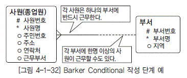
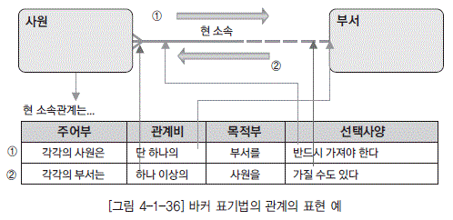

###### 과목4. 데이터 모델링
###### 제1장 데이터 모델링 이해
###### 제3절 데이터 모델링 표기법 이해

## 1. 바커 표기법 (Baker Notation)

바커 표기법은 영국 컨설팅 회사 CACI에 의해 처음 개발되었고 리차드 바커(Richard Barker)에 의해 지속으로 업그레이드 되었다. 오라클에서 Case Method(Custom Development Method)로 채택하여 사용하고 있다.

### 가. 엔터티(Entity)

엔터티는 기업에서 지속적으로 저장하고 관리해야 할 대상이다. 하나의 관리 대상이 엔터티가 되기 위해서는 반드시 두개 이상의 속성을 가져야 한다. 속성이 없는 실체는 존재할 수 없다. 엔터티란 실제 세상에 있는 객체(Object)이다.

  * 엔터티는 네 부분의 모서리가 둥근 형태인 소프트-박스(Soft-box)로 표현한다.

  * 엔터티는 하나 이상의 속성으로 구성된다.

  * [그림 4-1-30] 바커 엔터티(Entity) 예

### 나. 속성(Attribute)

속성은 하나의 엔터티에 종속되는 명사적 단어들을 말한다. 일반적으로 명사적 단어들 중에 구성 요소를 포함하고 있는 명사들은 엔터티가 되고 그렇지 못한 명사들은 속성이 된다. 속성의 상태에는 2가지 종류가 있다. 해당 속성에 어떤 값을 반드시 저장해야 하는 경우에는 * (Mandatory)를 표시하며 해당 속성에 어떤 값이 존재할 수도 있고 존재하지 않을 수도 있는 경우에는 o (Optional)를 표시하게 된다.

  * [그림 4-1-31] 바커 속성(Attribute) 예

### 다. 관계(Relationship)

두 개의 엔터티간에 CONDITIONAL을 표기한 후 해당 엔터티의 가까운 위치에 관계 명칭을 표기하고 관계(Relationship)는 실세계의 해당 엔터티에서 발생하는 동사적 단어들을 표기한다.

  * [그림 4-1-32] Barker Conditional 작성 단계 예

#### 1) 엔터티와 엔터티간의 관계

  *  *1:1 관계*

A 엔터티에 존재하는 데이터 1개와 관계되는 B 엔터티에 존재하는 데이터의 개수도 1개인 엔터티간의 관계를 1:1 관계라고 한다.

  *  *1:M 관계*

A 엔터티에 존재하는 데이터 1개와 관계되는 B 엔터티에 존재하는 데이터의 개수가 여러 개인 엔터티 간의 관계를 1:M의 관계라고 한다.

  *  *M:M 관계*

A 엔터티에 존재하는 데이터 1개와 관계되는 B 엔터티에 존재하는 데이터의 개수가 여러 개이며, B 엔터티에 존재한 데이터 1개와 관계되는 A 엔터티에 존재하는 데이터의 개수도 여러 개인 엔터티 간의 관계를 M:M 관계라고 말한다.

#### 2) 엔터티와 엔터티간 상관 관계의 조건

  *  *필수 조건*

필수 사항은 실선으로 표시하고 상대 엔터티에 대해 해당 엔터티에 조건을 만족하는 엔터티가 반드시 존재할 경우에 표시한다.

  *  *선택 조건*

선택 사항은 점선으로 표시하고 상대 엔터티에 대해 해당 엔터티에 조건을 만족하는 엔터티가 존재할 수도, 존재하지 않을 수도, 있을 경우 표시한다.

  * [그림 4-1-33] 바커 관계 예

### 라. 식별자(Unique Identifier)

식별자란 하나의 엔터티에 구성되어 있는 여러 개의 속성 중에 엔터티를 대표할 수 있는 속성을 의미하며 하나의 엔터티는 반드시 하나의 식별자가 존재해야 한다. 보통 식별자와 키(Key)를 동일시 생각하고 있는 경우가 있는데 식별자는 논리 데이터 모델링 단계에서 사용하고 키는 물리 데이터 모델링 단계에서 사용한다.

#### 1) 식별자의 유형

  *  *본질 식별자*

속성들 중에서 집합의 본질을 명확하게 설명할 수 있는 의미상의 주어를 본질 식별자라한다. 의미상의 주어에는 사원번호, 상품번호처럼 집합을 식별하기 위한 임의의 유일값을 사용하는 인조 식별자(Artificial Unique Identifier)도 있고, 내가 태어나기 위해서 절대적으로 존재했어야만 하는 본질 속성들에 해당하는 것으로 자신의 고유 속성과 부모로부터 물려받은 속성(릴레이션십)들로 이루어진 것도 있을 수 있다.

  *  *후보 식별자*

각 인스턴스를 유일하게 식별할 수 있는 속성 또는 속성들의 조합이며, 후보 식별자로 속성 집합을 선택하는 경우에는 개념적으로 유일해야 한다.

  *  *대체(보조) 식별자*

보조 식별자란 원래의 식별자를 대신할 수 있는 또 다른 속성들이나 릴레이션십을 말한다. 가령 사원 엔터티에 공식적으로 부여된 식별자(실질식별자)는 사원번호이지만, 만약 주민등록번호 속성이 유일한 값을 가지면서 필수적(mandatory)으로 정의되었다면 비록 공식적인 식별자는 아니지만 식별자로서의 역할을 할 자격은 충분히 갖추고 있다. 특히 보조 식별자는 여러 참조 엔터티 중에서 원래의 식별자보다 보조 식별자로 연결을 맺는 것이 자신에게는 훨씬 유리한 경우에 의미가 있게 된다.

  *  *인조 식별자*

인조 식별자란 식별자 확정시 기존의 본질 식별자를 그대로 실질 식별자로 인정할 수 없는 여러 가지 상황이 발생했을 때, 전부 혹은 일부를 임의의 값을 가진 속성들로 대체하여 새롭게 구성한 식별자를 말한다. 가령, 사원 엔터티에 이미 존재하고 있는 속성 중에서 원래의 본질 식별자를 찾으라고 한다면 주민등록번호가 될 것이다. 그러나 이 속성은 너무 길고 관리상 여러 가지 문제점이 발생하기 때문에 새롭게 사원번호라는 임의의 값을 가진 인조 속성을 영입하여 공식적인 식별자 자리까지 부여받은 것이다.

  *  *실질 식별자*

인스턴스를 식별하기 위해 공식적으로 부여된 식별자를 말한다. 본질 식별자나 인조 식별자 모두가 실질 식별자가 될 수 있다.

#### 2) 작성 방법

식별자 앞에는 # 기호를 표시하고 여러 개# 기호를 반복적으로 표시한다.

  * [그림 4-1-34] 바커 식별자(Unique identifier) 예

### 마. 서브타입(Sub-type)

바커 표기법에서는 슈퍼타입(super-type) 안에 서브타입(sub-type)을 상자로 나타낸다. 이것은 다이어그램에서 공간을 적게 사용하는 장점을 가지고 있다. 서브타입은 서브타입의 중복을 허락하지 않는 상호 배타적 관계이다.

  * [그림 4-1-35] 바커 서브타입 예

### 바. 관계의 표현 비교

다음은 바커 표기법과 I/E 표기법의 가장 큰 차이점인 관계의 표현 비교를 설명하겠다. [그림 4-1-36]은 사원과 부서 엔터티 간의 관계를 표현한 모습이다. 릴레이션이란 양방향 관계를 합성한 것이라 할 수 있다. 각 관계를 설명하자면 사원을 주어로 부서를 보는 관계에서 의미는“각각의 사원은 단 하나의 부서를 반드시 가져야 한다”라고 정의할 수 있다. 또한 부서를 주어로 사원을 보는 관계의 정의는 “각각의 부서는 하나 이상의 사원을 현 주소속 부서로서 배치 받을 수도 있다”라는 의미를 표현한 것이 바로 관계선이다. 이때 관계선을 살펴보면 실선과 점선으로 구분할 수 있다. 실선은 필수를 뜻하고 점선은 필수가 아님을 뜻한다. 현재 [그림 4-1-36]의 사원 엔터티가 주어일 경우 사원 엔터티 쪽에 가까이 있는 실선이 바로 사원이 주어일 때 부서를 바라보는 관계를 설명한 것이다. 때문에 까마귀 발 모양은 이미 설명한 것처럼 하나 이상의 개체를 허용한다는 뜻이다. 이런 표시를 근거로 “각각의 사원은 단 하나의 부서를 반드시 가져야 한다”와 같이 정의할 수 있다.

  * [그림 4-1-36] 바커 표기법의 관계의 표현 예

## 2. I/E 표기법 (Information Engineering Notation)

Information Engineering(I/E)은 1981년에 Clive Finkelstein과 James Martin이 공동 저술로 발표하였으며, 80년대 중반에 James Martin에 의해 그 체계가 정리되면서 본격적으로 활용이 되었고, 정보시스템을 구축하는데 있어서 데이터 분석(Data Analysis)과 데이터베이스 설계(Database Design)를 위한 매우 유용한 기법으로 자리 잡게 되었다.

이 모델은 관계의 다(Many) 쪽을 나타내기 위해 까마귀 발을 사용하기 때문에 때때로 까마귀 발모델(Crow’s Foot Model)이라 부른다.

### 가. 엔터티(Entity)

엔터티란 사용자가 추적하고자 하는 어떤 사물이다.

  * [그림 4-1-37] I/E 엔터티(Entity) 예

### 나. 속성(Attribute)

엔터티는 엔터티의 특징을 기술해 주는 여러 개의 속성을 가진다. 속성은 [그림 4-1-38]과 같이 엔터티 안에 위치한다.

  * [그림 4-1-38] I/E 속성(Attribute)의 예

### 다. 관계(Relationship)

까마귀 발 부호는 관계의 다(Many) 쪽을 보여주는 데 사용되고, 타원(Oval), 해쉬 마크 및 까마귀발의 다양한 조합들은 [표 4-1-3]과 같이 사용된다.

  * [표 4-1-3] I/E 관계(Relationship) 예

### 라. 식별자(Unique Identifier)

엔터티는 그들을 지칭하거나 식별해 주는 속성인 식별자를 가지고 있다. 속성의 식별자는 엔터티의 상단에 나타나며, [그림 4-1-39]와 같이 수평선이 식별자 밑에 그려진다.

  * [그림 4-1-39] I/E 식별자(Unique Identifier) 예

### 마. 서브타입(Sub-type)

서브타입은 배타적 또는 포괄적일 수 있다. 만일 배타적이라면 슈퍼타입은 많아야 1개의 서브타입과 관련될 수 있다. 만일 포괄적이라면 슈퍼타입은 1개 또는 그 이상의 서브타입과 관련될 수 있다. [그림 4-1-40]에서 A는 슈퍼타입, B와 C는 배타적 서브타입이다. 구분자는 보이지 않고 있다. 관계는 실선으로 그려져 있다. [그림 4-1-41]에서 A는 슈퍼타입, B와 C는 포괄적 서브타입이다. 관계는 실선으로 그려져 있다.

  * [그림 4-1-40] I/E 배타적 서브타입 예와 [그림 4-1-41] I/E 포괄적 서브타입 예

   
> 출처 : 데이터온에어 – 한국데이터산업진흥원([https://dataonair.or.kr](https://dataonair.or.kr))