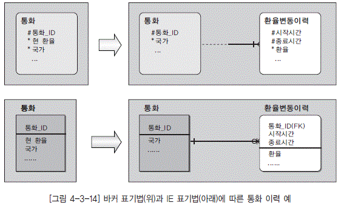
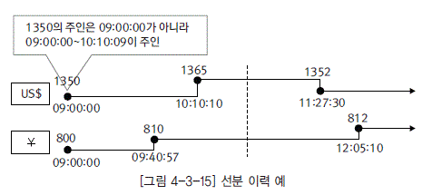
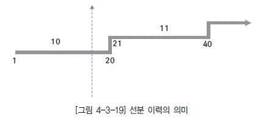
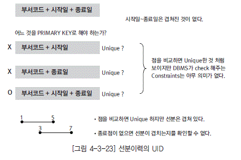

###### 과목4. 데이터 모델링
###### 제3장 논리 데이터 모델링
###### 제4절 이력 관리 정의

## 1. 이력 관리란 ?

데이터는 현재의 프로세스만 처리하고 버리는 것이 아니라 마치 후손에게 물려주어야 할 귀중한 문화유산처럼 오랜 기간의 데이터를 유지시켜 좀 더 가치있는 정보를 제공할 수 있는 밑거름이 되도 록 해야 한다. 현재는 단지 하나의 점에 불과하지만 과거란 엄청난 개수의 점이 모여 있는 형상이다. 사실 현재의 데이터조차 제대로 다루기가 어려운 데 이미 지나가 버린 데이터에 연연한다는 것은 생 각처럼 그리 쉬운 일이 아닌 것은 분명하다. 굳이 위상수학(topology)을 동원하지 않더라도 수학 시 간에 배웠듯이 점으로 선분을 만들려면 무한대의 점이 필요하다. 이력은 선분이고 현재의 순간은 점 이므로 선분 -그것도 과거에 비해 현저하게 오랜 기간 - 을 관리해야 한다는 것은 결코 함부로 결정 해서는 안된다.

모든 업무는 언제 시작해서 언제 끝났는지에 관한 정보가 기록되어 있다. 가장 흔한 예로 주민등록 증의 뒷면을 보면 주소 변경란이 있다. 이사를 가서 주소지를 옮길 때마다 거기에는 주소 이력 정보 가 기입된다. 언제 어느 동으로 이사를 갔으며, 변경된 주소는 무엇이냐 하는 것 등이다.

예를 들면 [그림 4-3-14]에서와 같이 통화 데이터에서 관리되고 있던 환율 데이터에 대한 다음과 같은 업무 요구 사항이 발생하면 환율에 대한 이력을 관리하게 된다.

  * [그림 4-3-14] 바커 표기법(위)과 IE 표기법(아래)에 따른 통화 이력 예

  * 어제의 환율은 얼마인가?

  * 오늘 아침의 환율은 얼마인가?

  * 환율의 변화에 대한 추이 분석을 하고자 한다.

  * [그림 4-3-15] 선분 이력 예

[그림 4-3-15]는 [그림 4-3-14]의 데이터 모델이 구현되어 실제 데이터가 들어가 있는 모습이다. 즉, 환율별로 이력이 관리되고 있는 모습을 보여주고 있다.

## 2. 이력 관리 대상 선정

### 가. 사용자 조사

데이터의 이력을 관리한다는 것은 관리하지 않을 때와 비교했을 때 많은 비용이 들어가는 일이다. 즉, 이력을 관리할 필요가 없는 데이터에 대해서 이력을 관리하는 것은 여러 가지 측면에서 낭비이 다. 그래서 다음과 같은 질문에 대한 사용자의 검증 과정을 거쳐야 한다.

  * 변경 내역을 감시할 필요가 있는가?

  * 시간의 경과에 따라 데이터가 변할 수 있는가?

  * 시간의 경과에 따라 관계가 변할 수 있는가?

  * 과거의 데이터를 조회할 필요가 있는가?

  * 과거 버전을 보관할 필요가 있는가?

### 나. 인력 데이터의 종류

이력 데이터의 종류에는 크게 세 가지 정도의 종류가 있는데 여기에 따라서 이력을 관리하는 전략 을 세워서 관리해야 한다.

#### 1) 발생 이력(Occurrence History) 데이터

어떤 데이터가 발생할 때마다 이력 정보를 남겨야만 한다면 이력은 발생 이력이라고 볼 수 있다. 예를 들어 고객의 접속 기록을 남겨야만 하는 경우 고객이 웹사이트를 접속할 때마다 그 접속 데이터 를 남긴다면 이것을 발생 이력이라고 할 수 있다. 이 방법은 전통적으로 이력을 관리하는 방법으로 사용되어 왔다.

이러한 이벤트성 이력 데이터를 관리하는 방법으로는 [그림 4-3-16]의 그림처럼 이벤트가 발생할때에만 이력 데이터를 발생하는 방법이 있고, 아래 그림과 같이 이력이 발생하지 않더라도 날마다 데이터를 생성하는 경우도 있다.

  * EVENT 발생 시마다 생성-Event가 발생할 때마다 사진을 찍어 두어야 이력을 관리할 수 있는가?

  * DAILY마다 생성-아무 변화가 없는 경우도 데이터 생성 그러나 완벽한 이력 관리는 불가능 [그림 4-3-16] 발생 이력 예

#### 2) 변경 이력 (Modification History) 데이터

데이터가 변경될 때마다 변경 전과 후의 차이를 확인해야 한다면 변경 이력을 남길 수 있다. 예를 들어, 고객이 주문을 하고서 주문 정보를 변경하였을 때 이전 주문과 변경된 새로운 주문 정보를 관 리하기 위해서 변경된 새로운 주문 정보를 이력 정보로 남겨야 한다.

#### 3) 진행 이력 (Progress History) 데이터

업무의 진행에 따라 이 데이터를 이력 정보로 남겨야만 하는 경우가 있다. 가장 대표적인 것이 바로 주문과 같은 업무 처리이다. 물론 이력이 관리되는 형태는 위의 변경 이력과 같은 형태로 관리 된다. 예를 들면, 주문의 업무 처리는 구매 신청 -&gt; 입금 완료-&gt; 배송 준비 중 -&gt; 배송 중 -&gt; 배송 완료 혹은 주문 취소 등과 같은 업무 진행 상황이 있다. 대부분의 주문 업무 처리의 경우 각 단계가 언제 누구에 의해서 처리되고, 현재 단계는 무엇인지에 관한 정보가 필요한 경우가 많다. 이러한 경우의 업무를 처리하기 위해서는 진행 이력이 중요하다.

### 다. 이력 관리 형태

  * 시점 이력 : 데이터의 변경이 발생한 시각만을 관리

  * 선분 이력 : 데이터 변경의 시작 시점부터 그 상태의 종료 시점까지 관리

#### 1) 시점 이력

특정 통화의 환율이 변경되면 새로운 인스턴스가 생겨나고(New Record), 그 시점의 해당 통화의 환율과 발생 시각을 기록/보관함으로써 환율이 어느 시점에 얼마의 값으로 변경되었다라는 정보를 관리하는 것이다. 이러한 방식의 이력 관리 방법은 아래 예에서 특정한 시점의 데이터를 추출하고자 할 경우에 불필요한 작업을 수행하게 된다. 이러한 점을 주의하여야 한다.

  * [그림 4-3-17] 바커 표기법(위)과 IE 표기법(아래)에 따른 시점 이력 예

  *  시점 이력 활용 예

  * SELECT 환율

  * FROM 환율 변동 이력

  * WHERE 발생 시각 = (SELECT MAX(발생시각)

FROM 환율 변동 이력

WHERE 발생 시각 &lt;=20020521 AND 통화_ID =‘ USD’)

AND 통화_ID = ‘USD

#### 2)선분 이력

각 통화의 특정 기간 동안 유효한 환율을 관리

  *  선분 이력 활용 예

  * SELECT 환율

  * FROM 환율 변동 이력

  * WHERE 발생 시각 between 시작 시각 and 종료 시각

  * AND 통화_ID = ‘USD’

  *  선분 이력 의미

  * [그림 4-3-19]를 예를 들어 선분 이력의 의미를 살펴 본다.

  * 17을 가진 선분을 = 로 찾을 수는 없다.

  * 그러나 17이 통과하는 선분을 찾아보자.

  * 어떤 점이나 반드시 하나의 선분을 통과한다.

  * 선분이 아무리 길어도 레코드는 하나이다.

  *

  * [그림 4-3-19] 선분 이력의 의미

  * 17의 지점을 [그림 4-3-19]에서와 같은 선분 이력 데이터에서 찾는 방법은 다음과 같다.

  * 부등식 표현 : 시작점 &lt;= 17 &lt;= 종료점

  * 연산자 표현 : 17 Between 시작점 and 종료점

### 라. 선분 이력 관리 유형

#### 1) 인스턴스 레벨 이력 관리

하나의 인스턴스의 어떤 변경이라도 발생하면 전체 인스턴스를 새롭게 생성하는 방식의 이력 관리 유형이다.

  * [그림 4-3-20] 인스턴스 이력 관리 예

이러한 방식의 이력 관리 유형의 특징은 다음과 같다.

  * 한번의 액세스로 스냅샷을 참조하는 것이 가능하다. 즉, 한번의 액세스로 해당 시점의 모든 데이터 를 참조하는 것이 가능하다.

  * 로그성 데이터를 저장할 목적인 경우 적당한 방법이다.

  * 다른 이력 관리 유형에 비해서 저장하기가 쉽다.

  * 가장 큰 단점 중에 하나는 하나 이상의 칼럼에 변경이 발생했을 때 이벤트가 모호해진다는 점이다.

  * 만약 이벤트가 자식 정보를 가지게 된다면 매우 치명적이다. 즉, 각각의 변경 이벤트가 하위의 데이터(엔터티)를 가지게 된다면 해당 이벤트를 찾기가 매우 어려워진다.

  * 이력 관리의 다른 유형들에 비해서 저장 공간의 낭비를 초래할 수 있다.

  * 실제 어떤 데이터가 변경된 것인지를 찾기 위해서는(즉, 이벤트를 찾기 위해서는) 과거의 데이터를 Merge해서 비교를 해야만 가능할 수 있다.

  * 특정 순간의 스냅샷만 보는게 아니라면 처리가 복잡해지는 경향이 있다.

  * 변화가 빈번하게 발생하는 상황이라면 고려해 볼 수 있는 유형이다.

#### 2) 속성 레벨 이력 관리

[그림 4-3-21]에서와 같이 이력을 관리할 대상 속성에서 변화가 생길 때만 이력을 생성하는 방식이다

  * [그림 4-3-21] 속성 레벨 이력 관리 예

이러한 방식의 이력 관리 유형의 특징은 다음과 같다.

  * 변경 이벤트가 매우 분명하게 관리된다. 즉, 실제 어떤 데이터가 변경되었는지가 분명하다.

  * 하나의 이력 관리 엔터티에서 다른 엔터티와 통합 이력 관리가 가능하다.

  * 변경된 것만 처리하기 때문에 독립적 처리가 가능하다.

  * 변화가 발생할 가능성은 매우 낮으면서 이력 관리 대상 속성은 매우 많은 경우에 사용하는 것이 유리하다.

  * 특정 속성들에 변화가 집중되는 경우에 해당 속성에 대해서만 이력을 관리할 수 있기 때문에 유리하다.

  * 여러 속성에 대한 이력이 필요할 때 많은 Merge가 발생하게 된다.

  * 이력 관리의 다른 유형들에 비해서 향후 사용될 데이터 액세스 쿼리에서 조건 검색이 조금 어렵다.

  * 변화가 너무 많은 경우에는 적용이 곤란하다.

#### 3) 주제 레벨 이력 관리

[그림 4-3-22]에서와 같이 내용이 유사하거나 연동될 확률이 높은 것별로 인스턴스 레벨 이력을 관리하는 방법이다.

  * [그림 4-3-22] 주제 레벨 이력 관리 예

이러한 방식의 이력 관리 유형의 특징은 다음과 같다.

  * 인스턴스 레벨과 속성 레벨의 장점을 모두 수용하는 형태의 이력 관리 형태이다.

  * 목적이 분명한 엔터티를 생성함으로써 확장성을 확보할 수 있는 용도로 사용할 수 있다.

  * 변경 부분만 처리가 가능하다.(독립적 처리 가능)

  * 다른 엔터티와 통합 이력 관리가 가능하다.

  * 속성 레벨의 단점을 해소할 수 있다.

  * 전체를 참조할 때 인스턴스 레벨에 비해 Merge가 발생하는 문제점이 존재한다.

  * 부문에 따라 변경 정도의 차이가 심한 경우 유리하다.

## 3. 선분 이력 관리용 식별자 확정

### 가. 선분 이력에서 식별자 결정 시 고려사항

선분 이력을 관리하는 엔터티의 UID를 확정하는 것은 향후에 테이블로 만들어지고 사용될 때의 성능 측면도 고려되어야 한다.

[그림 4-3-23]에서와 같이 부서별로 이력이 관리되는 엔터티를 예를 들어 설명하면 의미적인 UID는 부서코드 + 이력시작일 + 이력종료일을 기본키로 하는 것이 유리하다. 하지만 이것은 [그림 4-3-23]에서과 같이 물리적인 측면, 즉 실제 데이터는 Unique하지만 의미적으로는 Unique하지 않는 일이 발생한다. 이러한 부분의 의미적인 Unique을 검증할 수 있는 조치를 병행해야 한다.

  * [그림 4-3-23] 선분이력의 UID

### 나. 선분 이력에서 종료점 처리 시 주의사항

#### 1) 종료점이 미정이므로 NULL

  * 논리적으로는 타당하지만 비교가 불가능

  * 인덱스를 사용하지 못하므로 수행 속도 저하

#### 2) 수렴하므로 최대치 부여

  * 아직 종료되지 않았으므로 무한히 계속되는 것으로 간주

  * 최대치 부여 (예; 일자라면 9999/12/31)

  * 가능한 TABLE creation 시 Default constraints 부여

  * 수행 속도에 유리

   
> 출처 : 데이터온에어 – 한국데이터산업진흥원([https://dataonair.or.kr](https://dataonair.or.kr))