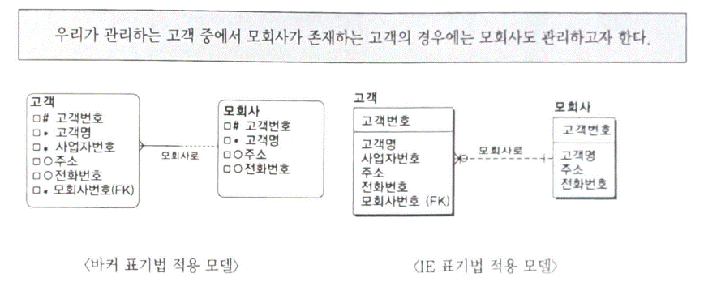

###### 과목4. 데이터 모델링
###### 제3장 논리 데이터 모델링
###### 연습문제

문제 1. 다음 중 논리 데이터 모델링의 필수 성공 요소로 부적절한 것은?
① 업무를 알고 있는 현업 사용자의 참여는 필수적이다. 
② 절차(Procedure)보다는 데이터에 초점을 두고 모델링을 진행하여야 한다. 
③ 데이터의 구조(Structure)와 무결성(Integrity)을 함께 고려해야 한다. 
④ 데이터 모델링을 지원하는 CASE 도구의 사용은 필수적이다.

문제 2. 엔터티에서 실제 인스턴스 탄생의 주체에 해당하는 속성들을 '본질 식별자'라고 한다. 본질 식별자는 여러가지 목적으로 인해 본질 식별자를 대체할 인조 식별자를 지정하게 된다. 다음 중 인조 식별자 지정에 대한 설명으로 부적절한 것은?
① 최대한 범용적인 값을 사용한다. 
② 유일한 값을 만들기 위해 인조 식별자를 사용한다. 
③ 편의성 · 단순성 확보를 위해 인조 식별자를 사용할 수 있다.
④ 내부적으로 사용되는 인조식별자는 가급적 피한다.

문제 3. 데이터 모델링에서는 계층적으로 생기는 데이터를 관리하기 위해서 흔히 순환관계 모델을 생정하게 된다. 다음 중 순환관계 데이터 모델에 대한 설명으로 가장 부적절한 것은?
① 순환관계 모델은 새로운 계층의 추가 수정에 대해서 유연하게 대처할 수 있다. 즉, 구조의 변화가 필요 없이 변화에 대처할 있다. 
② 순환관계 모델에서 최상위는 의미적으로 NULL이지만 물리적인 요소(수행 성능 등)를 고려해서 특정 값을 갖는 것이 바람직하다.
③ 다대다(M:M) 순환관계를 처리하기 위해서는 별도의 엔터티를 추가하여야 한다. 
④ 순환관계 모델에서 구조가 변경되면 식별자가 변해야 하기 때문에 과거의 데이터에 대해서 수정작업을 수행해야 한다.

문제 4. A기업은 논리 데이터 모델링의 중간 단계에서 속성후보들을 도출하고 각각의 속성 후보에 대해서 타당성 작업을 수행하고 있는데, 다음 중 검증의 방법으로 가장 부적절한 것은?
① 최소 단위 분할 여부를 판단한다. 
② 해당 속성 후보가 단일값을 갖는지 판단한다. 
③ 추출 속성인지 판단한다.
④ 식별자로 사용되는 것인지 판단한다.

문제 5. 다음 중 선분(기간)이력으로 관리해야 하는 것으로 가장 거리가 먼 것은?
① 각 상품별 이자율에 대한 이력 관리
② 매일 바뀌는 환율에 대한 이력 관리
③ 어느 부서에 어떤 사원이 근무했다는 이력 관리
④ 제조 기업의 상품 단가에 대한 이력 관리

문제 6. 다대다 관계를 해소하는 시점으로 가장 부적합한 것은?
① 다대다 관계가 도출되는 시점에 
② 자신만의 속성을 가져야 할 때
③ 자식을 가져야 할 때
④ 자신만의 속성을 갖지 않거나 자식을 갖지 않는 경우는 논리 모델 상세화 단계에서

문제 7. 아래 제시된 논리 데이터 모델을 보고 지문 내용에 적합한 상태로 다시 작성하시오.

문제 8~10. 다음에 제시한 지문의 내용에 가장 적합한 논리 데이터 모델을 작성하시오.

문제 8. 각 학과에서는 개설과목을 강의할 강사를 소속 교원 중에서 배정하는데, 하나의 과목을 강의하는 강사는 한 명 이상일 수 있다.

문제 9. 하나의 주문에는 최소 하나 이상의 상품이 포함되고, 하나의 상품은 여러 주문에 포함될 수 있다.

문제 10. 각 주문에 대해 청구고객, 배송고객, 주문고객을 관리하는데, 모회사가 존재하는 고객에 대해서는 모회사에 청구를 한다.

   
> 출처 : 데이터온에어 – 한국데이터산업진흥원([https://dataonair.or.kr](https://dataonair.or.kr))