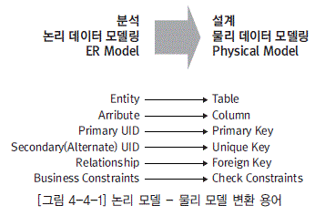
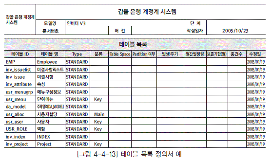
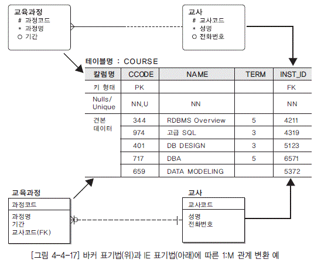
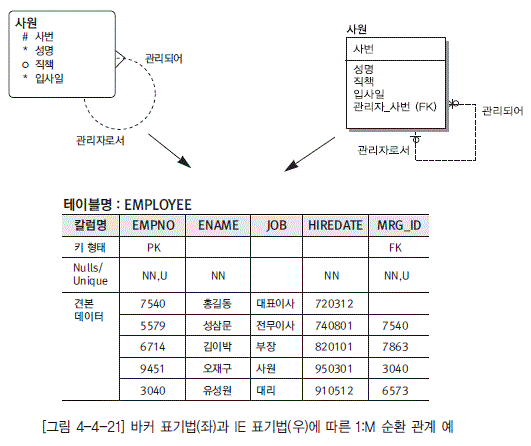
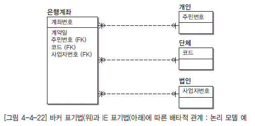
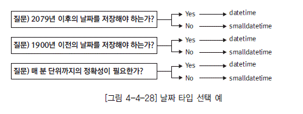

# 과목4. 데이터 모델링
# 제4장 물리 데이터 모델링
# 제3절 논리-물리 모델 변환

## 1. 논리 데이터 모델-물리 데이터 모델 변환(Transformation) 용어

논리 영역과 물리 영역을 보는 시각은 여러 가지 관점에서 조금씩은 다르다. 특히 학자, 모델링 툴도 이러한 차이는 존재한다. 하지만, 하지만 이 책에서는 다음과 같은 기준으로 논리 데이터 모델의 영역과 물리 데이터 모델의 영역을 구분하여 접근하고 있다.

  * [그림 4-4-1] 논리 모델 - 물리 모델 변환 용어

## 2. 엔터티-테이블 변환

### 가. 테이블 설명

테이블은 데이터를 저장하기 위해서 생성된 데이터베이스에서의 가장 기본적인 오브젝트이다. 기 본적인 모습은 아래와 같은 모양으로 만들어지게 된다.

  * [그림 4-4-2] 바커 표기법(위)과 IE 표기법(아래)에 따른 테이블 레이아웃

  * [그림 4-4-2] 바커 표기법(위)과 IE 표기법(아래)에 따른 테이블 레이아웃

#### 1)테이블(Table)

테이블은 기본적으로 칼럼(Column)과 로우(Row)를 가진다. 각각의 칼럼은 지정된 유형의 데이터 값을 저장하는 데 사용된다. [그림 4-4-2]에서 테이블 EMP는 사원 정보를 저장하기 위해서 생성된 구조이다.

#### 2)로우(Rows)

테이블의 한 로우에 대응. 튜플 , 인스턴스, 어커런스라고도 한다.

#### 3)칼럼(Columns)

각 사원 개개인의 관리 항목에 대한 Value를 저장한다.

#### 4)기본키(Primary keys)

하나의 칼럼 혹은 몇 개의 칼럼 조합으로 어떤 경우라도 테이블 내에 동일한 값을 갖는 튜플이 존재하지 않도록 한다.

#### 5)외래키(Foreign keys)

외부 데이터 집합과의 관계를 구현한 구조이다.

### 나. 서브타입 변환(Transformation)

논리 데이터 모델에서는 비즈니스 또는 업무를 데이터 모델로 표현하기 위해서는 최대한 상세한 표현이 필수적이다. 그러한 목적을 달성하기 위해서 가능하면 집합(엔터티)의 구성을 서브타입을 사용하여 구체적으로 표현하는 것이 통상적이다. 또한 각각의 서브타입들이 독립적인 속성(Attribute), 관계(Relationship)를 가지고 있는 경우에는 이러한 서브타입(Sub Type)을 사용한 집합의 표현은 필수적이다. 이렇게 논리 모델링에서 표현된 서브타입은 물리 데이터 모델에서는 테이블의 형태로 설계되어야 한다. 하지만 이러한 서브타입 모델은 단순 엔터티-테이블 변환과는 다른 몇 가지 방법을 통해서 테이블로 변환 작업을 하게 된다.

  * 슈퍼타입 기준 테이블 변환

  * 서브타입 기준 테이블 변환

  * 개별타입 기준 테이블 변환

[그림 4-4-3]과 같은 구체적인 논리 데이터 모델을 통해서 위 방법들을 살펴본다.

  * [그림 4-4-3] 바커 표기법(위)과 IE 표기법(아래)에 따른 서브타입 예

  * [그림 4-4-4] 바커 표기법(좌)과 IE 표기법(우)에 따른 슈퍼타입 기준 테이블 변환 예

* 슈퍼타입 기준 테이블 변환

  * 서브타입을 슈퍼타입에 통합하여 하나의 테이블로 만든다

  * 이 통합된 테이블에는 모든 서브타입의 데이터를 포함해야 한다

  * 주로 서브타입에 적은 양의 속성이나 관계를 가진 경우에 적용된다

가) 절차

  * 슈퍼타입으로 테이블 명칭 부여

  * 서브타입을 구분할 수 있도록 칼럼 추가

  * 슈퍼타입의 속성을 칼럼명으로

  * 서브타입의 속성을 칼럼명으로

  * 슈퍼타입의 관계를 FK로

  * 서브타입의 관계를 FK로

나) 테이블 사례

[그림 4-4-3]의 논리 모델에서의 서브타입을 하나의 테이블로 통합하는 경우 테이블의 모습은 [그림 4-4-5]의 사례 데이터 표와 같다.

  * 테이블명 : EMPLOYEE [그림 4-4-5] 테이블 사례 예

  *  *TYPE*
서브타입을 구분할 수 있는 칼럼이다. 즉 사원 구분에 해당하는 칼럼이다.

  *  *DEPT*
위의 구분이 정규직일 경우에 부서로부터의 관계로 인해서 생성된 칼럼이다.

  *  *UNION*
위의 구분이 임시직일 경우에 협력 업체로부터의 관계로 인해서 생성된 칼럼이다.

다) 하나의 테이블로의 통합이 유리한 경우

  * 데이터 액세스가 좀더 간편

  * 뷰를 활용하여 각 서브타입만을 액세스하거나 수정 가능

  * 수행 속도가 좋아지는 경우가 많다

  * 서브타입 구분없는 임의 집합의 가공 용이

  * 다수의 서브타입을 통합한 경우 조인(JOIN) 감소 효과가 크다

  * 복잡한 처리를 하나의 SQL로 통합하기가 용이

라) 하나의 테이블로의 통합이 불리한 경우

  * 특정 서브타입의 NOT NULL 제한 불가

  * 테이블의 칼럼 수가 증가

  * 테이블의 블럭 수가 증가

  * 처리시마다 서브타입의 구분(TYPE)이 필요해지는 경우가 많다

  * 인덱스(INDEX) 크기가 증가

* 서브타입 기준 테이블 변환

  * 슈퍼 타입 속성들을 각 서브타입에 추가하여 각각의 서브타입마다 하나의 테이블로 만든다

  * 분할된 테이블에는 해당 서브타입의 데이터만 포함돼야 한다

  * 주로 서브타입에 많은 양의 속성이나 관계를 가진 경우에 적용된다

  * [그림 4-4-6] 바커 표기법(좌)과 IE 표기법(우)에 따른 서브타입 기준 테이블 변환 예

* 가) 절차

  *

  * 서브타입마다 테이블 명칭 부여

  * 서브타입의 속성을 칼럼명으로

  * 테이블마다 슈퍼타입의 속성을 칼럼으로

  * 서브타입마다 해당되는 관계들을 FK로

  * 테이블마다 슈퍼타입의 관계를 FK로

* 나) 테이블 사례

  * 위의 [그림 4-4-3] 논리 모델에서의 서브타입을 여러 개의 테이블로 분할하는 경우 테이블의 모습은 [그림 4-4-7]과 [그림 4-4-8]의 데이터 사례 표와 같다. [그림 4-4-7]은 정규직 사원에 대한 표본 테이블의 모습과 인스턴스를 나타낸다. [그림 4-4-8]은 임시직 사원에 대한 표본 테이블의 모습과 인스턴스를 나타낸다.

  *

  * [그림 4-4-7] 테이블 예 : 정규직 사원

  * [그림 4-4-8] 테이블 예 : 임시직 사원

* 다) 여러 개의 테이블로 분할한 경우가 유리한 경우

  *

  * 각 서브타입 속성들의 선택 사양 명확한 경우에 유리하다.

  * 처리시마다 서브타입 유형 구분이 불필요하다.

  * 전체 테이블 스캔시 유리하다.

  * 단위 테이블의 크기가 감소한다.

* 라) 여러 개의 테이블로 분할한 경우가 불리한 경우

  *

  * 서브타입 구분 없이 데이터 처리하는 경우 UNION이 발생한다.

  * 처리 속도가 감소하는 경우가 많다

  * 트랜젝션 처리시 여러 테이블을 처리하는 경우가 증가한다.

  * 복잡한 처리의 SQL 통합이 어려워진다.

  * 부분 범위 처리가 불가능해 질 수 있다.

  * 여러 테이블을 합친 뷰는 조회만 가능하다.

  * UID 유지관리가 어렵다.

<h6 class="no_m">개별타입 기준 테이블 변환

* 슈퍼타입과 서브타입을 각각 테이블로 변환한 경우이다.

* 슈퍼타입과 서브타입 테이블 간에는 1:1 관계가 생성된다.(한 쪽을 모두 합치면 전체와 같게 된다는 면에서 개념적으로 아크 관계와 유사)

* 다음의 여러 가지 경우를 만족할 때 사용
  * - 전체 데이터 처리가 빈번하게 발생할 경우에 적용한다.
  * - 서브타입의 처리는 주로 독립적으로 발생할 경우에 적용한다.
  * - 테이블을 통합했을 때 칼럼의 수가 너무 많아지는 경우에 적용한다.
  * - 서브타입의 칼럼 수가 많은 경우에 적용한다.
  * - 트랜잭션이 주로 공통 부분(슈퍼타입)에서 발생한다.
  * - 슈퍼타입의 처리 범위가 넓고 빈번하여 단일 테이블 클러스터링을 해야 할 때 적용한다.

  * [그림 4-4-9] 바커 표기법(좌)과 IE 표기법(우)에 따른 개별타입 기준 테이블 변환 예

### 다. 서브타입 변환 예

[그림 4-4-10]과 같은 논리적 데이터 모델이 있다고 하자.

  * [그림 4-4-10] 바커 표기법(위)과 IE 표기법(아래)에 따른 서브타입 변환 대상 예

[그림 4-4-10]의 데이터 모델을 물리적 모델로 전환하는 방법은 다양하다. 하나의 데이터 모델을 이용하여 하나 이상의 노드(분산 데이터베이스를 구현하였을 때의 각각의 단위 데이터베이스)에 자 신만의 데이터베이스를 설계할 수 있을 것이다. 데이터 모델의 전부를 물리적 모델로 전환할 수도 있 지만 필요에 따라 원하는 것만 전환하고자 할 수도 있을 것이다.

뿐만 아니라 엔터티를 하나의 테이블로 할 수도 있겠지만 각각의 서브타입 혹은 몇 개를 묶어서 하 나의 테이블로 결정하는 경우도 있을 수 있다. 만약 [그림 4-4-10]의‘엔터티3’처럼 서브타입 세트 를 이용하여 여러 차원에서 분류한 서브타입을 가지고 있다면 자신이 원하는 서브타입 세트의 일부서브타입만 테이블로 전환하는 것도 가능하다. 하나의 엔터티를 여러 개의 테이블로 설계하고 싶다 면 최소한 논리적 데이터 모델에는 서브타입으로 반드시 정의되어 있어야 가능하다. 즉, 물리적 모델 을 결정하는 단계에서 기존에 정의해 둔 서브타입이 아닌 다른 방법으로 테이블을 분할하고 싶다면 논리적 데이터 모델에 새로운 서브타입 세트를 추가로 정의해야 한다는 것을 의미한다.

속성을 물리적 모델로 전환하는 경우에도 전부나 일부만 선택하는 것은 얼마든지 가능하다. 이러 한 개념을 활용하면 하나의 논리적 데이터 모델을 이용하여 여러 개로 수직 분할된 물리 모델을 생성 할 수 있다.

#### 1) Case 1 : 서브타입을 테이블로 분리

속성에 붙어 있는 숫자가 같은 칼럼이 서로 변환된 것으로 간주한다.(예: 속성31 --&gt; COL31)

  * [그림 4-4-11] 바커 표기법(위)과 IE 표기법(아래)에 따른 물리 모델 예제 1

  * 엔터티1은 그대로 TABLE10으로 전환되었다. 서브타입 세트란 일종의 구분코드라는 속성이라고 할 수 있으며, 서브타입세트1은 칼럼(SUBTYSET1)으로 전환되었다. 엔터티1에 있던 서브타입1,2는 서브타입세트1의 속성에 들어가는 값의 내용이므로 칼럼으로 전환할 필요가 없다.

  * 엔터티2는 서브타입별로 테이블을 분리한 모습이다. 서브타입21은 TABLE21로, 서브타입22는 TABLE22로 전환되었다. 공통 속성인 키2, 속성21은 양쪽 모두에 전환되었고, 엔터티

  * 엔터티3은 두 종류의 서브타입 세트를 가지고 있다. 위의 물리 모델은 이 중에서 서브타입세트32에 있는 서브타입별로 분리한 모습이다. 자세히 살펴보면 슈퍼타입에 있던 공통 속성 중에서 자신이 필요로 하는 일부분만 전환되었음을 발견할 수 있다. 바커표기법으로 표현할 모델에서 관계선에 세로선(UID BAR)이 붙어 있다면 식별자의 일부가 되겠다는 뜻이므로 물리적 모델이 될 때는 당연히 기본키(PK, Primary Key)이면서 외래키(FK, Foreign Key)가 되어야 한다.

#### 2) Case 2 : 서브타입을 통합 테이블로 생성

물리적 모델에서는 [그림 4-4-12] 같이 동일한 논리적 모델을 기반으로 했지만 앞서 예제와는 다른 모습의 모델을 만들 수도 있다.

[그림 4-4-12]의 물리 모델은 앞서 소개한 물리적 모델과는 테이블의 개수도 다르며, 경우에 따라 테이블 명칭은 동일하지만 내용은 다르게 정의할 수도 있다.

  * [그림 4-4-12] 바커 표기법(위)과 IE 표기법(아래)에 따른 물리 모델 예제 2

  * 바커 표기법에 따른 커뮤니티관리 논리 데이터 모델/IE 표기법에 따른 커뮤니티관리 논리 데이터 모델">

### 라. 테이블 목록 정의서

  * [그림 5-4-13] 테이블 목록 정의서 예

엔터티를 테이블로 변환하는 과정이 완료되면 [그림 4-4-13]과 같은 테이블 목록 정의서를 작성한다. 테이블 목록 정의서는 줄여서 테이블 목록이라 부르기도 하며, 전체 테이블이 목록으로 요약 관리되어야 한다.

## 3. 속성-칼럼 변환

속성이나 관계를 물리 데이터 모델 객체로 변환하는데 있어서 사례 데이터 표를 작성해 보는 것은 실제 데이터가 어떤 형태로 저장되는지, 어떠한 예외사항이 존재할 수 있는지 등을 용이하게 파악할 수 있도록 도움을 주기 때문에 여기서는 사례 데이터 표를 활용하여 변환 과정을 설명한다.

### 가. 일반 속성 변환

  * 엔터티에 있는 각 속성들에 대한 칼럼명을 사례 데이터 표의 칼럼명 란에 기록한다

  * 칼럼의 명칭은 속성의 명칭과 반드시 일치할 필요는 없으나 프로그래머와 사용자의 혼동을 피하기위해 가능한 표준화된 약어를 사용한다

  * 표준화된 약어의 사용은 SQL 해독 시간을 감소시킨다.

  * SSQL의 예약어(reserved word)의 사용을 피한다.

  * 가급적 칼럼 명칭은 짧은 것이 좋으며, 짧은 명칭은 개발자의 생산성에 긍정적인 영향을 준다.

  * 필수 입력 속성은 Nulls/Unique 란에 NN을 표시한다.

  * 실제 테이블에 대한 설계를 검증하기 위한 목적으로 가능하다면 표본 데이터를 입력시킨다.

### 나. Primary UID 기본키(Primary Key) 변환

논리 데이터 모델에서의 Primary UID는 물리 데이터 모델에서는 기본키로 생성된다. 실제 DDL 에서는 기본키 제약 조건의 형태로 오브젝트가 생성된다.

#### 1) 변환 절차

  * 사례 데이터 표의 키 형태 란에 엔터티의 Primary UID에 속하는 모든 속성에 PK를 표시

  * PK로 표시된 모든 칼럼은 Nulls/Unique 란에 반드시 NN,U로 표시되어야 함

  * 여러 개의 칼럼으로 UID가 구성되어 있는 경우는 각각의 칼럼에 NN,U1을 표시

  * 또 다른 Unique Key(Secondary UID)가 있다면 U2로 표시

#### 2) 변환 예

  * [그림 4-4-14] 기본키 변환

### 다. Primary UID(관계의 UID Bar) 기본키(Primary Key) 변환

논리 데이터 모델에서 Primary UID에 속하는 속성 중에는 해당 엔터티 자체에서 생성된 것도 존 재하지만 다른 집합(엔터티)으로부터의 관계에 의해서 생성되는 UID 속성(관계 속성)도 존재 한다. 이러한 관계 속성 UID의 변환은 기본적인 속성 UID 변환과는 약간 다르다.

#### 1) 변환 절차

  * 테이블에 외래키 칼럼을 포함시킨다

  * PK의 일부분으로 표시

-Nulls/Unique 란에 각각 NN,U1을 표시

-키 형태란에 PK, FK를 표시

-여러 UID BAR가 있는 경우는 (PK, FK1), (PK, FK2), …

-여러 칼럼으로 구성된 경우 PK,FK1을 각각 표시

  * 추가된 FK 칼럼에 표본 데이터를 추가

#### 2) 변환 예

  * [그림 4-4-15] 바커 표기법(좌)과 IE 표기법(우)에 따른 기본키 변환 예 : 외래키에 의한

### 라. Secondary (Alternate) UID Unique Key 변환

논리 데이터 모델에서 정의한 Secondary UID 또는 Alternate Key 들은 해당 집합과 상태 집합과의 선택적인 관계를 가질 수 있도록 하는 데 중요한 역할을 수행한다. 이러한 Secondary UID들은 물리 데이터 모델에서는 Unique Key로 생성된다. 변환 절차는 기본적으로 Primary UID 변환 절차와 동일하다.

### 마. 테이블 정의서

  * [그림 4-4-16] 테이블 정의서 예

기본적인 테이블 변환, 칼럼 변환 작업이 완성되면 [그림 4-4-16]과 같은 테이블 정의서를 생성할 수 있다. 대부분의 시스템 구축 프로세스상에서 개발자들이 프로그램 개발을 수행하는 단계에서 가장 많이 참조하는 산출물 중 하나이다 .

## 4. 관계 변환

### 가. 1:M 관계 변환

논리 데이터 모델에서 존재하는 관계 중에?? 따라 서 관계 칼럼의 선택사양이 결정되게 된다.

#### 1) 변환 절차

  * 1(One) 에 있는 PK를 M(Many)의 FK로 변환

  *  FK의 명칭 결정

  *  키 형태 란에 FK 표시

  *  Nulls/Unique 란에 NN 표시(Must Be 관계시)

  *  필수 관계가 아닌 경우에는 NN를 체크하지 않는다.

  * 표본 데이터 추가

  * UID BAR 가 있는 경우는 전단계에서 실시

#### 2) 변환 예

  * [그림 4-4-17] 바커 표기법(위)과 IE 표기법(아래)에 따른 1:M 관계 변환 예

#### 3) 1:M 관계에서 1 쪽이 Mandatory 관계일 때의 변환시 주의사항

  * 자식 쪽의 레코드(Row)가 반드시 하나 이상은 되어야만 부모 쪽의 레코드(Row)를 생성할 수 있다.

  * 자식 쪽의 레코드(Row)를 삭제할 경우에는 전체를 다 삭제할 수는 없고 반드시 하나 이상의 자식 레코드(Row)를 남겨두어야 한다. 또는 자식, 부모 레코드(Row)를 동시에 삭제해야 한다.

  * [그림 4-4-18] 바커 표기법(좌)과 IE 표기법(우)에 따른 1:M Mandatory 관계

### 나. 1:1 관계 변환

1:1 관계는 논리 모델에서는 자주 발생하지는 않는 관계이다. 이러한 1:1 관계를 물리 모델로 변환하는 과정은 관계의 Optionality(기수성)에 따라서 다른 방법으로 적용된다. 양쪽 다 Optional인 경우에는 보다 빈번하게 사용되는 테이블이 외래키를 가지는 것이 유리하다.

#### 1) 변환절차

  * Mandatory 반대쪽에 있는 테이블의 기본키를 Mandatory 쪽 테이블의 외래키로 변환한다.

  * NN 표시를 한다..

#### 2) 변환 예

  * [그림 4-4-19] 바커 표기법(위)과 IE 표기법(아래)에 따른 1:1 Mandatory 관계 변환 예

#### 3) 변환시 주의사항

  * 1:1 관계에 의해서 생긴 모든 외래키 부분은 Unique Key가 필수적이다.

  * 한쪽이 Optional이고 다른 한쪽이 Mandatory라면 Mandatory쪽의 테이블에 외래키가 생성 된다.

  * 양쪽다 Mandatory라면 변환시에 어떤 테이블에 외래키를 생성할 것인지를 선택해야 한다.

  * [그림 4-4-20] 바커 표기법(위)과 IE 표기법(아래)에 따른 1:1 Optional 관계 변환 예

### 다. 1:M 순환 관계 변환

대부분의 경우는 데이터의 계층 구조를 표현하기 위해서 이러한 관계를 사용한다. 특성상 최상위 관계 속성은 항상 Optional인 형태의 관계이어야 한다. 하지만 경우에 따라서는 최상위의 관계 속성에 특정 값을 지정하는 경우도 존재한다.

#### 1) 변환 절차

  * 해당 테이블 내에 외래키 칼럼을 추가한다. 외래키는 같은 테이블 내의 다른 로우의 기본키 칼럼을 참조하게 된다.

  * 외래키 칼럼 명칭은 가능한 한 관계 명칭을 반영한다. 외래키는 결코 NN(Not Null) 이 될 수 없다.

#### 2) 변환 예

  * [그림 4-4-21] 바커 표기법(좌)과 IE 표기법(우)에 따른 1:M 순환 관계 예

### 라. 배타적 관계 변환

[그림 4-4-22]와 같은 논리 모델에서의 배타적 관계의 모델은 실제 데이터 환경에서는 자주 등장하게 된다. 하지만 이러한 관계를 물리 데이터 모델로 생성하는 방법은 일반적인 관계를 물리 데이터 모델로 변환하는 것과는 다르다. 여기에는 두 가지 정도의 대표적인 방법을 가지고 설명한다.

  * [그림 4-4-22] 바커 표기법(위)과 IE 표기법(아래)에 따른 배타적 관계 : 논리 모델 예

  * [그림 4-4-22] 바커 표기법(위)과 IE 표기법(아래)에 따른 배타적 관계 : 논리 모델 예

#### 1) 외래키 (Foreign Key) 분리 방법

각각의 관계를 관계 칼럼으로 생성하는 방법이다. 이 방법을 사용하면 실제 외래키 제약조건 (Foreign Key Constraints)을 생성할 수 있다는 장점이 있다. 하지만 각각의 키 칼럼들이 Optional이어야 한다. 또한 다음과 같은 체크 제약조건(Check Constraints)을 추가적으로 생성하 여야 한다.

  * [그림 5-4-23] 배타적 관계 변환 : 외래키 분리 예

  * 추가적인 체크 제약조건

  * CHECK ( JUMIN_NO IS NOT NULL

AND PART_NO IS NULL

AND BUSINESS_ID IS NULL )

OR ( JUMIN_NO IS NULL

AND PART_NO IS NOT NULL

AND BUSINESS_ID IS NULL )

OR ( JUMIN_NO IS NULL

AND PART_NO IS NULL

AND BUSINESS_ID IS NOT NULL )

#### 2) 외래키 결합 방법

각각의 관계를 하나의 관계 칼럼으로 생성하는 방법이다. 이 방법을 사용하면 실제 외래키 제약조 건을 생성할 수 없다는 단점이 있다. 또한 각각의 관계를 선택적으로 구분할 수 있는 추가적인 칼럼이 필요하게 된다.

  * [그림 4-4-24] 배타적 관계 변환 : 외래키 결합 예

<h6 class="no_m">구분 칼럼 추가

[그림 4-4-24]에서와 같이 구분 칼럼 TYPE이 추가되어 배타적 관계의 각 테이블들이 구분된다.

  * -J : 개인

  * -P : 단체

  * -B : 법인

## 5. 관리상 필요한 칼럼 추가

### 가. 개념

논리 데이터 모델에는 존재하지 않지만 관리상의 이유로 혹은 데이터베이스를 이용하는 프로그래 밍이 좀더 빠르게 수행되도록 하기 위해서 테이블이나 칼럼을 추가할 수 있다. 예를 들면 해당 데이 터를 등록한 일자나 시스템 번호 등과 같은 관리상의 이유로 필요한 것들이다.

### 나. 시스템 칼럼 추가 예

[그림 4-4-25]는 생성일시, 생성 프로세스 ID라는 논리 데이터 모델에서는 존재하지 않는 속성인 데도 불구하고 물리 데이터 모델에서 추가하여 생성하고 있는 예를 보여주고 있다.

## 6. 데이터 타입 선택

### 가. 개념

물리 데이터 모델링 단계에서 일어나는 많은 문제 중의 하나가 칼럼의 데이터 형식을 잘못 설정하 는 데에서 발생한다. 특정 칼럼의 데이터 형식을 선택하는 것은 논리 데이터 모델에서 정의된 논리적인 데이터 타입(정보 타입 : Information Type)을 물리적인 DBMS의 특성과 성능 등을 고려하여 최적의 데이터 타입을 선택하는 작업이다. 여기에서의 DBMS별 특성은 이 책을 통해 설명하는 것은 불가능하다. 따라서 여기에서는 대표적인 데이터 타입의 선택 기준에 대해서만 언급한다. 여기에서 는 데이터 타입의 선택에 대한 예제를 들어 설명한다. 단, 모든 DBMS를 예로 들 수는 없기 때문에 MS SQL Server를 예를 들어 설명한다.

  * [그림 4-4-25] 시스템 칼럼 추가 예

### 나. 문자 타입 (Character Data Types)

논리 데이터 모델에서의 형식이 문자였다면 세부적으로 많은 문자 형식들 중에서 칼럼의 값이 어 떤 범주를 만족하는지를 판단해야 한다. 여기에는 현재 칼럼이 가지는 값의 특성도 고려되어야 하고, 미래에 가질 값의 특성들도 고려되어야만 한다.

1) 세부 문자 타입 선택을 위한 기준

* 가) 영문만 사용되는가?

유니코드 형식은 모든 문자를 2바이트(Byte) 체계로 설계한 국제 표준 문자 형식이다. 한글을 저장하기 위해서 반드시 유니코드 형식을 사용해야 하는 것은 아니다. 하지만 일반 문자 형식들에 값을 지정한다면 영문은 1바이트, 한글은 2바이트라는 부조화를 일으키게 된다. 이러한 이유로 유 니코드를 저장하는 데이터 타입에는 일반적으로 NCHAR, NVARCHAR등과 같이 앞에 N이 들어 가는 데이터 타입을 사용한다.

* 나) 4000자 혹은 8000자 이상의 문자열이 포함되는가?

일반적인 문자들을 저장하는 데이터 타입은 4K 혹은 8K를 상한선으로 하고 있다. 물론 이 기준은 DBMS마다 조금씩 다르다. 이렇게 큰 데이터를 저장하기 위해서는 일반적인 문자열을 저장하 는 데이터 타입이 아닌 다른 데이터 타입을 사용해야 한다. 예를 들면 , LONG, TEXT 등과 같은 데이터 타입을 사용할 수 있다.

* 다) 입력되는 값의 길이가 일정한가?

값의 길이가 일정하다는 것은 입력되는 칼럼 값의 길이가 일정하다는 것을 의미한다. 반대로 가 변적이라는 것은 입력되는 값의 길이가 일정하지 않다는 것을 의미한다.

2) 문자 형식 데이터 타입 설정 예

[[그림 4-4-26]은 MS SQL Server에서의 데이터 타입을 기준으로 예를 든 것이다.

  * [그림 4-4-26] 문자 타입 지정 예

### 다. 숫자 타입 (Numeric Types)

숫자 타입의 데이터 타입도 DBMS마다 많은 형식이 존재한다. 많은 숫자 타입들 중에서 주어진 상황에 맞는 가장 적절한 데이터 타입을 설정해야 한다.

1) 세부 숫자 타입 선택을 위한 기준

* 가) 정말 숫자 데이터인지 판단한다.

많은 경우 숫자처럼 보이는 숫자가 아닌 값들을 관리하는 경우가 존재한다. 예를 들면 6810301633318 과 같은 주민등록번호는 숫자처럼 보이지만 숫자가 아니다. 즉, 우리가 이 주민 번호를 가지고 연산을 하거나 할 가능성이 있는지를 보면 이것은 숫자 타입이 아닌 문자 타입의 데 이터라는 것을 알 수 있다.

* 나) 세부 숫자 타입 결정

<h6 class="no_m">불린(Boolean)

참(TRUE) 혹은 거짓(False)을 저장하는 경우에 선택한다.

<h6 class="no_m">정수(Integer)

소수점 이하를 처리하지 않는 경우에 선택한다.

<h6 class="no_m">소수(Decimal)

소수점 이하를 처리하는 경우에 선택한다.

<h6 class="no_m">화폐(Money)

금액을 저장하기 위한 경우에 선택한다.

2) 숫자 형식 데이터 타입 지정 예

  * [그림 4-4-27] 숫자 타입 지정 예

### 라. 날짜 타입 (Datetime Types)

특정 데이터 항목에 대해서 날짜 타입으로 할 것인지 아니면 문자 타입으로 할 것인지는 이미 논리 데이터 모델에서 결정된다. 그렇기 때문에 물리 데이터 모델링에서는 논리 데이터 모델링에서 날짜 타입으로 결정된 부분을 DBMS 특성에 맞게 여러 개의 날짜 타입들 중에서 어떤 날짜 타입을 선택 할 것인지를 결정하는 것이다.

1) 세부 날짜 타입 선택을 위한 기준

대부분의 DBMS에서는 날짜 타입에 일자뿐만 아니라 시분초의 정보도 같이 저장한다. 심지어는 0.001초 차이까지도 저장하기도 한다. 그래서 그냥 일반적인 시간까지를 저장할 것이냐 아니면 이러 한 정밀한 시간을 저장할 것이냐에 따라 날짜 타입을 결정한다.

2) 세부 날짜 타입 지정 예

  * [그림 4-4-28] 날짜 타입 선택 예

## 7. 데이터 표준 적용

### 가. 개념

논리 데이터 모델링 과정에서 정의된 엔터티, 속성, 관계들을 여러가지 기준으로 물리 데이터 모델 로 변환한다. 이 과정에서 필수적으로 엔터티명에 해당하는 테이블명을 생성하고, 속성 또는 관계에 해당하는 칼럼명을 생성하게 된다. 이러한 이름을 변환하는 과정에서 전사적으로 미리 생성된 데이 터 표준을 따르게 된다. 이러한 데이터 표준에는 대표적으로 표준 용어, 표준 도메인, 표준 명명 규 칙 등이 존재한다.

### 나. 데이터 표준 적용 대상

물리 데이터 모델에서의 데이터 표준화는 다음과 같은 객체를 대상으로 수행하게 된다.

#### 1) 데이터베이스(Database)

테이블의 집합으로 통합 모델링 단계의 주제 영역이나 애플리케이션 모델링 단계의 업무 영역에 대응되는 오브젝트이다.

#### 2) 스토리지 그룹(Storage Group)

DASD(Direct Access Storage Device) 즉, 물리적인 디스크(Disk)를 묶어서 하나의 그룹으로 정의해 놓은 것이며 테이블스페이스, 인덱스 스페이스 생성시 스토리지 그룹명을 지정하여 물리적인 영역을 할당하도록 한다.

#### 3) 테이블스페이스(Tablespace)

테이블이 생성되는 물리적인 영역이며, 하나의 테이블 스페이스에 하나 또는 그 이상의 테이블을 저장할 수 있다.

#### 4) 테이블(Table)

논리 설계 단계의 엔터티에 대응하는 객체이다.

#### 5) 칼럼(Column)

논리 설계 단계의 속성에 대응하는 객체이다.

#### 6) 인덱스(Index)

테이블에서 특정 조건의 데이터를 효율적으로 검색하기 위한 색인 데이터로 대표적인 인덱스 대상 으로는 기본키(Primary Key), 외래키(Foreign Key)등이 있다.

#### 7) 뷰(View)

테이블에 대한 재정의로서 물리적으로 테이블의 특정 칼럼, 특정 로우를 뷰로 정의하여 특정 사용 자만 접근이 가능하도록 할 수 있다.

### 다. 데이터 표준 적용 방법

#### 1) 명명 규칙에 의한 표준화 적용

테이블에 대한 명명 규칙과 적용 기준들의 예를 들면 다음과 같다.

  * 논리 데이터 모델을 물리 데이터 모델로 전환시 테이블명은 엔터티 한글명과 동일하게 용어를 사 용하면서 해당 용어를 영문명으로 전환한다.

  * 영문명은 영문 약어를 사용하며, 표준 용어 사전에 등록된 표준 영문 약어를 참조한다.

  * 테이블의 명명 순서는 업무 영역 + 주제어 수식어 + 주제어 + 분류어 수식어 + 분류어 + 접미사 순으로 한다.

  * [그림 4-4-29] 테이블 명명 규칙 예

  * 테이블 영문명에서는 각 어소별 구분자로 Under Bar(_)를 사용한다.

예) 업무관계자_사원_정보 IVPT_EMP_INFO

#### 2) 표준 용어집에 의한 표준화 적용

사전에 사용될 모든 객체명과 해당 객체에 대한 데이터 타입, 길이 등의 표준을 정의해 놓고 이 표준 들을 적용하는 방식이다. 현재 대부분의 회사들은 위 두 가지의 방법을 병행하여 사용하고 있다고 볼 수 있다.

   
> 출처 : 데이터온에어 – 한국데이터산업진흥원([https://dataonair.or.kr](https://dataonair.or.kr))