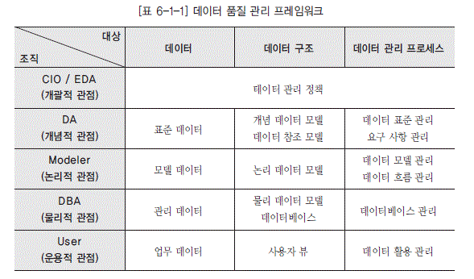

# 과목6. 데이터 품질 관리 이해
# 제1장 데이터 이해
# 제1절 데이터 품질 관리 프레임워크
5-3-4-서버-성능-개선.md

데이터에 관한 연구는 지난 30년 동안 IT 분야에 이론적으로나 산업적으로 엄청난 변화를 일으켜 왔다. 현재 데이터 품질 관리에 관한 연구는 경영 관리 사이클(Plan-Do-See) 관점에서 재해석되고 있으며, 많은 학계 및 산업계에서 데이터 품질에 대한 중요성을 인식하고 있다.

데이터 품질 관리란 조직 내외부의 지식 노동자와 최종 사용자의 기대를 만족시키기 위한 지속적 인 데이터 및 데이터 서비스 개선 활동을 말한다. 한국데이터베이스진흥원은 데이터 품질 관리 개선 과 관리를 위한 체계적인 계획을 수립하여 2003년에 데이터베이스 품질 관리 확장 모델을 개발한 후, 2005년에는 해당 실무에서 실제로 적용할 수 있는 데이터베이스 품질 관리 지침과 해설서를 제 시함으로써 지속적인 개선을 통한 품질 관리를 지향하고 있다.

데이터 품질 요소에는 크게 데이터 값(Data Value), 데이터 서비스(Data Service), 데이터 구조 (Data Hierarchy), 데이터 관리 프로세스(Data Management Process) 등이 있다. 이러한 요소들 은 서로 연계되어 조직 데이터 품질에 영향을 주고 있어 종합적이고 체계적인 품질 관리 노력을 필요 로 한다. 그 결과 [표 6-1-1]과 같은 데이터 품질 관리 프레임워크를 개발하였다. 프레임워크를 구성 하고 있는 각 요소에 대한 설명은 본 과목에서 다루게 될 주요 내용으로, 2절 표준 데이터를 비롯해 본격적으로 데이터에 대한 이해를 하기 바란다.

  * [표 6-1-1] 데이터 품질 관리 프레임워크" border="0">

※ [표6-1-1]의 ‘DA’는 Data Administrator를 의미함

   
> 출처 : 데이터온에어 – 한국데이터산업진흥원([https://dataonair.or.kr](https://dataonair.or.kr))