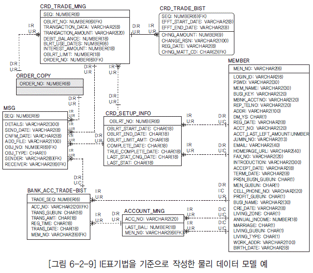

# 과목6. 데이터 품질 관리 이해
# 제2장 데이터 구조 이해
# 제4절 물리 데이터 모델

## 1. 정의 및 관리 목적

물리 데이터 모델이란 논리 데이터 모델을 DBMS의 특성 및 성능을 고려하여 구체화시킨 모델을 말한다. 물리 데이터 모델은 DBMS 선정 이후에 해당 DBMS 상에서 최상의 성능을 보장하도록 논리 데이터 모델에서 저장하는 데이터의 물리적 특성을 최대한 반영하여 설계하고 이를 관리한다. 논리 데이터 모델이 1:1로 데이터베이스의 객체로 대응되어 생성되지 않으므로 DBMS의 성능을 최대한 살릴 수 있고 저장되는 데이터의 특성을 충분히 반영할 수 있다.

물리 데이터 모델로의 설계 단계에서 샘플 데이터를 이용하여 논리 데이터 모델의 정합성을 재 검증할 수 있다. 물리 데이터 모델의 설계를 위해서는 업무 요건과 필요에 따라 사용자 화면이 완성되어야 하므로 사용자 애플리케이션과 상호 검증 하에 설계될 수 있다. 물리 데이터 모델의 설계 시점은 애플리케이션의 설계나 업무 요건이 명확해지는 단계이므로 업무 요건을 반영한 물리 데이터 모델을 설계할 것을 권장한다.

물리 데이터 모델의 테이블명, 관계명, 칼럼명 등은 표준 데이터에서 명시한 표준 단어와 표준 용 어 규칙에 따른 물리명을 선언하고 이를 기준으로 하여 생성할 것을 권장한다. 물리 데이터 모델에서 는 무엇보다 도메인의 선언이 중요하며 도메인 규칙에 대한 충실한 준수는 물리 데이터 모델 내에서 유지하는 데이터를 고품질로 유지할 수 있는 필수 조건이 될 것이다. 물리 데이터 모델에 대한 예로 [그림 6-2-8]을 들 수 있다. [그림 6-2-9]는 IE표기법을 기준으로 작성한 예이다.

  * [그림 6-2-8] 물리 데이터 모델 예

  * [그림 6-2-9] IE표기법을 기준으로 작성한 물리 데이터 모델 예

## 2. 세부 관리 대상

### 가. 주제 영역(Subject Area)

주제 영역은 분산 DBMS의 고려나 업무 영역에 따라 다른 스키마의 설계로 대응을 고려할 수 있다. 논리 데이터 모델에서 정의한 주제 영역은 물리 데이터 모델에서 스키마나 서버로 분산될 수도 있으나 경우에 따라서는 하나의 서버에 하나의 스키마 내에서 테이블의 명명 관례(Naming Convention)에 의하여 물리적 주제 영역을 구분하여 관리할 수도 있다. 물리 데이터 모델의 주제 영역 관리 기준은 개념 데이터 모델과 논리 데이터 모델의 관리 기준을 따른다. 논리적인 주제 영역은 분산 DBMS의 인스턴스나 스키마와의 대응 관계에 따라서 관리되어야 한다.

### 나. 테이블

테이블은 데이터의 물리적 특성과 DBMS의 특성에 따라 하나의 물리적 저장 장소인 테이블 혹은 서브타입이나 업무적 특성에 따라 하나 이상의 물리적 테이블로 분할될 수 있으며, 다음과 같은 기준에 따라 관리되어야 한다.

  * 영속성

테이블의 데이터는 현재 관리하고 있는 데이터이며 앞으로도 관리해야 할 필요가 있다.

  * 식별성

테이블 내의 레코드들은 하나 이상의 칼럼 데이터에 의해 구별 가능해야 한다.

테이블 내에 저장되는 데이터의 생명주기와 일정 기간 유지되어야 하는 데이터의 양이 반영된 설계 정보를 관리한다.

### 다. 관계(Relationship)

관계는 부모 테이블과 자식 테이블 간의 데이터 생성, 삭제, 변경 규칙을 정의할 수 있으며, 다음과 같은 기준에 따라 관리되어야 한다.

  * 생성 규칙

자식 테이블의 데이터 생성시 부모 테이블에 참조되는 데이터가 반드시 존재해야 한다.

  * 변경 규칙

부모 테이블의 키 데이터가 변경되면 참조하는 자식 테이블의 참조 데이터는 같이 변경되거나 혹은 자식 데이터가 존재하면 부모 테이블의 키 데이터는 변경되지 못한다.

  * 삭제 규칙

부모 테이블의 데이터가 삭제되면 해당 데이터를 참조하는 자식 테이블의 데이터가 함께 삭제되거나 혹은 자식 데이터가 존재하면 부모 테이블의 데이터는 삭제될 수 없다.

관계는 업무 규칙이므로 DBMS 수준에서 관리할 것인지 혹은 애플리케이션 수준에서 관리할 것인지 먼저 결정되어야 하며, 트리거에 의한 자동 변경은 DBMS 오류시 추적이 어려우므로 가능한 최소화 한다.

### 라. 칼럼

데이터아키텍처 전문가 가이드 칼럼은 표준화된 도메인 내에서 업무 규칙이 반영된 데이터를 저장하도록 정의한다. 하나의 칼럼 데이터는 같은 데이터 유형(Type)을 갖는다. 비슷한 데이터 유형과 표현을 갖는 칼럼의 물리적 속성 을 도메인으로 정의하여 관리할 수 있다. 칼럼은 물리적 성질이 다양하나 표준화된 도메인 내에서 물리적 특성이 선택되도록 한다.

즉, 저장하는 데이터의 개별 단위가 가능하면 모두 표준화되어 도메인으로 미리 선언되고 칼럼의 물리적 특성은 미리 선언된 도메인 내에서 선택될 것을 권장한다. 이러한 칼럼 관리는 부하가 따를 수 있으나 데이터의 품질을 지속적으로 관리할 수 있는 최선의 방안이 될 것이다.

   
> 출처 : 데이터온에어 – 한국데이터산업진흥원([https://dataonair.or.kr](https://dataonair.or.kr))