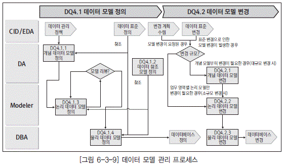
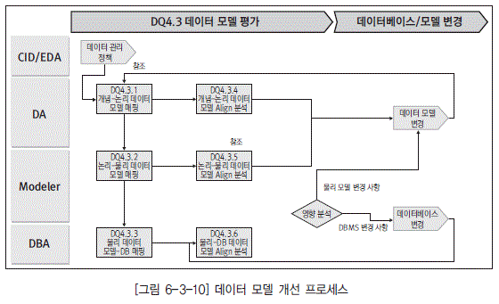

###### 과목6. 데이터 품질 관리 이해
###### 제3장 데이터 관리 프로세스 이해
###### 제4절 데이터 모델 관리

## 1. 정의 및 관리 목적

데이터 모델 관리란 데이터 요구 사항 관리에 의해 변경되는 데이터 구조를 모델에 반영하는 작업 절차와 데이터베이스 시스템 구조와 동일하게 데이터 모델을 유지하도록 하는 작업 절차를 말한다. 데이터 모델은 기관의 비즈니스 목적에 맞는 최적화된 데이터 서비스를 제공하고 데이터베이스를 구 성하고 유지하기 위해 체계적으로 관리되어야 한다.

개념 데이터 모델을 관리함으로써 논리, 물리 데이터 모델의 연관 관계 분석을 통한 전사 데이터 구조에 대한 파악이 가능하다. 또한 물리 데이터 모델과 데이터베이스 간의 상관 관계 분석을 통해 현재 운영 중인 데이터베이스와 동일한 모델 확보를 통해 유지 보수 및 체계적인 전사 데이터베이스 관리가 가능하다. 이외에도 데이터 참조 모델을 활용함으로써 일정 수준 이상의 데이터 모델 및 고품 질의 데이터 서비스가 가능하다. 개념 데이터 모델, 논리 데이터 모델, 물리 데이터 모델을 관리하기 위해서는 모델링 도구를 활용하는 것이 효과적이다. 또한 업무 영역별 개별 관리 방식보다는 데이터 의 중복 및 불필요한 인터페이스를 확인하고 조정이 가능한 전사적 통합 관리 방식을 권장한다.

## 2. 세부 관리 대상

세부 관리 대상으로 개념 데이터 모델, 데이터 참조 모델, 논리 데이터 모델, 물리 데이터 모델이 있으며, 해당 데이터 모델과 관련된 내용은 앞서 2장 데이터 구조 이해에서 다루었으므로 여기서는 생략한다.

## 3. 데이터 모델 관리 프로세스

### 가. 데이터 모델 관리 프로세스

  * [그림 6-3-9] 데이터 모델 관리 프로세스

  * DQ4.1.1 개념 데이터 모델 정의

[그림 6-3-9]의 DQ4.1.1 개념 데이터 모델 정의는 각 기관의 비전을 수립하는 데 필요한 데이터 주제 영역을 정의하고, 세부적인 내역보다는 전사 정보를 중복되지 않고 확장성 있게 설계하는 데 초점을 맞춘다. 데이터의 주제 영역과 핵심 데이터 집합 및 데이터 집합 간의 관계를 정의하여 향 후에 정의하게 될 상세 논리 데이터 모델과 물리 데이터 모델과의 데이터 구조적 정렬을 지원한다.

  * DQ4.1.2 데이터 참조 모델 정의

[그림 6-3-9]의 DQ4.1.2 데이터 참조 모델 정의는 업무 영역별, 주제 영역별 표준 데이터 집합, 관리 항목들이 표기되어 재사용이 가능한 데이터 모델을 정의하는 작업이다. 이미 검증된 데이터 모델을 참조함으로써 데이터 모델의 정확성과 재사용률을 높이고 일정 수준 이상의 설계 품질을 보장할 수 있다.

  * DQ4.1.3 논리 데이터 모델 정의

[그림 6-3-9]의 DQ4.1.3 논리 데이터 모델 정의는 비즈니스 규칙을 토대로 업무의 모든 데이터 구 조를 상세하고 구체적으로 정의한 모델로, 데이터 참조 모델 및 데이터 표준을 참고하여 설계 작업 을 수행한다. 개념 데이터 모델 정의 시에는 다른 주제 영역 간의 인터페이스 추출 작업에 초점을 맞 춘다면, 논리 데이터 모델 정의 작업 시에는 개념 데이터 모델의 인터페이스를 토대로 주제 영역 내 의 연관 관계를 중심으로 설계 작업을 수행한다. 논리 데이터 모델 정의 작업이 완료되면 데이터 관 리자 및 사용자 등과 함께 재검토 작업을 수행하여 해당 비즈니스 요건에 적합한 형태로 설계되었는 지를 검토한다.

  * DQ4.1.4 물리 데이터 모델 정의

[그림 6-3-9]의 DQ4.1.4 물리 데이터 모델 정의는 논리 데이터 모델 및 데이터 표준을 기준으로 대상 데이터베이스의 물리 특성을 고려하여 최적의 성능이 발휘될 수 있도록 상세한 설계 작업을 수행한다.

  * DQ4.2.1 개념 데이터 모델 변경

[그림 6-3-9]의 DQ4.2.1 개념 데이터 모델 변경은 사용자 요구 사항의 특성에 따라 모델 변경 요 청 및 표준에 대한 변경 요청으로 분리되는데, 이 중에서 변경 규모가 클 경우(다른 주제 영역 간의 인터페이스 조정 및 핵심 엔터티 타입의 변경, 핵심 엔터티 타입 간의 관계 변경) 개념 데이터 모델 의 변경 작업이 발생된다. 개념 데이터 모델의 변경 시에는 반드시 논리 데이터 모델 및 물리 데이 터 모델의 변경이 발생된다.

  * DQ4.2.2 논리 데이터 모델 변경

[그림 6-3-9]의 DQ4.2.2 논리 데이터 모델 변경은 개념 데이터 모델이 변경되거나 개념 데이터 모델의 변경이 없는 작은 규모의 변경(주제 영역 내의 인터페이스 조정 및 엔터티 타입의 변경, 엔 터티 타입 간의 관계 변경, 속성 변경)이 요청된 경우, 또는 데이터 표준이 변경된 경우 논리 데이 터 모델의 변경 작업이 수행된다. 논리 데이터 모델 변경 시에는 다른 주제 영역에 동일한 형태의 데이터 집합이 존재하는지 중복성을 검토하고, 데이터 표준 및 데이터 참조 모델 등을 참조하여 표 준화된 모델을 유지할 수 있도록 한다.

  * DQ4.2.3 물리 데이터 모델 변경

[그림 6-3-9]의 DQ4.2.3 물리 데이터 모델 변경은 변경 요청된 내역을 논리 데이터 모델 및 데이터 표준, 데이터베이스의 물리 특성 등을 참고하여 최적의 성능을 발휘할 수 있도록 물리 데이터 모델 변경 작업을 수행한다.

### 나. 데이터 모델 개선 프로세스

  * [그림 6-3-10] 데이터 모델 개선 프로세스

  * DQ4.3.1 개념-논리 데이터 모델 매핑

[그림 6-3-10]의 DQ4.3.1 개념-논리 데이터 모델 매핑은 개념적으로 생성된 데이터 집합 또는 관리 항목과 논리 데이터 모델 사이의 구조적 정렬 정보를 생성하는 작업으로, 데이터 아키텍처 관 점에서 개념 데이터 모델의 각 객체와 논리 데이터 모델의 각 객체 간 연결 정보를 설정한다.

  * DQ4.3.2 논리-물리 데이터 모델 매핑

[그림 6-3-10]의 DQ4.3.2 논리-물리 데이터 모델 매핑은 비즈니스 규칙을 토대로 업무의 모델 데이터 구조와 이를 바탕으로 데이터베이스의 물리적인 특성을 고려하여 정의한 물리 데이터 모델 간의 구조적 연결 정보를 설정한다. 예를 들어 하나의 엔터티가 여러 개의 테이블이 되는 경우도 존재한다.

  * DQ4.3.3 물리 데이터 모델-DB 매핑

[그림 6-3-10]의 DQ4.3.3 물리 데이터 모델-DB 매핑은 물리 데이터 모델(최종 설계 도면)과 DBMS 카탈로그(건축물) 정보와의 구조적 연결 정보를 설정한다. 대부분의 모델링 툴은 물리 데이터 모델과 DB 간의 연결 정보를 자동으로 생성한다.

  * DQ4.3.4 개념-논리 데이터 모델 얼라인(Align) 분석

[그림 6-3-10]의 DQ4.3.4 개념-논리 데이터 모델 얼라인 분석은 개념 데이터 모델에 정의된 모델이 실제 논리 데이터 모델에 구체적으로 정의되지 않은 모델이 존재하는지를 체크하는 등의 차이 분석 작업을 말한다. 이렇게 분석된 결과에 의해 개념 데이터 모델의 변경 또는 논리 데이터 모델 변경의 프로세스를 수행하게 된다.

  * DQ4.3.5 논리-물리 데이터 모델 얼라인 분석

[그림 6-3-10]의 DQ4.3.5 논리-물리 데이터 모델 얼라인 분석은 논리 데이터 모델과 물리 데이터 모델 사이의 차이를 분석한다. 모델러 관점에서 변경 사항을 분석하여 해당 데이터 모델에 대한 변경을 수행하게 된다.

  * DQ4.3.6 물리 데이터 모델-DB 얼라인 분석

[그림 6-3-10]의 DQ4.3.6 물리 데이터 모델-DB 얼라인 분석은 물리 데이터 모델과 실제 DB와의 차이를 분석한다. 이렇게 함으로써 데이터 모델에 표현되지 않는 DB 객체가 있는지를 분석할 수 있다. 물론 정상적인 데이터 모델 변경 프로세스 또는 데이터베이스 변경 프로세스를 수행했다면 이러한 차이는 발생하지 않을 것이다.

   
> 출처 : 데이터온에어 – 한국데이터산업진흥원([https://dataonair.or.kr](https://dataonair.or.kr))