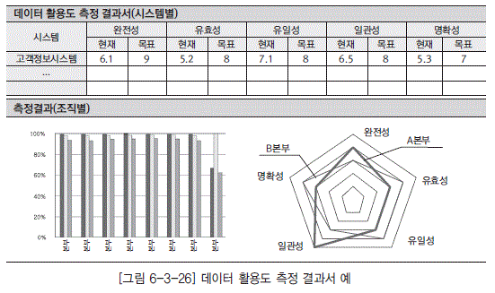
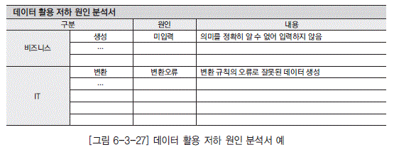

# 과목6. 데이터 품질 관리 이해
# 제3장 데이터 관리 프로세스 이해
# 제7절 데이터 활용 관리

## 1. 정의 및 관리 목적

데이터 활용 관리란 데이터의 활용 여부를 점검하거나 활용도를 높이기 위해 측정 대상 데이터와 품질 지표를 선정하여 품질을 측정하고 분석하여 품질을 충족시키지 못하는 경우, 원인을 분석하여 담당자로 하여금 조치하도록 하는 작업을 말한다. 애플리케이션에서 활용되지 않는 데이터를 점검하 여 데이터베이스의 사용 환경을 개선하고 업무적 중요도가 높은 데이터에 대한 품질의 평가와 개선 으로 데이터의 활용도를 높인다. 데이터 활용 관리를 통해 데이터의 정확성을 저하시키는 원인을 분 석하고 개선함으로써 지속적인 데이터의 품질을 높이고 활용성을 높일 수 있다.

품질 저하를 개선하기 위해서는 조직 간의 원활한 협조 체계와 지속적인 활동이 필요하다. 미활용 테이블/칼럼에 대해 정리를 할 경우, 관련 항목을 사용하는 다른 애플리케이션이 있는지를 철저히 검토해야 한다. 데이터 품질 평가는 한 번의 수행을 통해 이루어지는 것이 아니라 반복적이고 지속적 으로 진행되었을 때 고품질의 데이터를 유지할 수 있다.

## 2. 세부 관리 대상

### 가. 핵심 데이터

핵심 데이터는 회사의 고객, 프로세스, 시장 환경, 재무 정보 등에 직접적으로 영향을 미치는 중요성이 높은 데이터를 말하며, 다음과 같은 기준에 따라 관리되어야 한다.

  * 완전성

데이터의 모든 값은 의미 있게 채워져 있어야 한다.

  * 일관성

데이터의 값은 동일하게 관리되어야 한다.

  * 최신성

데이터의 값은 실제 세계의 객체들이 가지고 있는 값과 같아야 한다.

  * 유효성

데이터의 값은 업무 규칙을 준수해야 한다.

  * 유일성

데이터의 값은 동일 테이블에서 중복 관리되어서는 안 된다.

  * 명확성

데이터의 의미가 혼동되지 않도록 분명하게 관리되어야 한다.

핵심 데이터는 업무 프로세스상의 중요성, 재무적 관점에서 관리의 필요성, 최종적인 사용자의 활용성 등을 기준으로 도출해 해당 테이블의 칼럼 수준으로 관리한다.

### 나. 측정 방법

데이터의 업무적인 규칙 및 물리적 특성(도메인, 유효성 등)을 반영한 데이터 품질 측정 기준을 말한다. 업무적인 규칙과 물리적인 특성이 정확하게 반영되도록 하며, 핵심 데이터별로 측정 방법을 관 리한다.

## 3. 데이터 활용 관리 프로세스

### 가. 데이터 활용 관리 프로세스

  * [그림 6-3-25] 데이터 활용 관리 프로세스

  * DQ7.1.1 핵심 데이터 수집

[그림 6-3-25]의 DQ7.1.1 핵심 데이터 수집은 개선 대상이 되는 데이터를 선정 기준에 따라 선정 하고, 업무부하 및 시스템 부하를 고려하여 측정 데이터 량을 조정한다.

  * DQ7.1.2 데이터 활용도 측정 기준 수립

[그림 6-3-25]의 DQ7.1.2 데이터 활용도 측정 기준 수립은 데이터별 활용도 측정 기준을 정량적으 로 마련하고 데이터 활용 개선 목표치를 설정하여 향후 개선 작업에 대한 평가 작업 수행 시 활용한다.

  * [그림 6-3-26] 데이터 활용도 측정 결과서 예

  * DQ7.1.3 데이터 활용 측정

[그림 6-3-25]의 DQ7.1.3 데이터 활용 측정은 데이터 활용도 측정 기준에 따른 활용도 평가 작업을 수행하고, 데이터 활용도 측정 결과서를 작성한다. [그림 6-3-26]과 같은 형식으로 작성할 수 있다.

  * DQ7.1.4 활용 저하 요인 분석

[그림 6-3-25]의 DQ7.1.4 활용 저하 요인 분석은 데이터 활용의 저하를 유발한 비즈니스적, IT 적 원인을 데이터의 생성, 갱신, 변환, 활용 관점에서 도출하고, 데이터 활용 저하 원인 분석서를 작성한다. [그림 6-3-27]과 같은 형식으로 작성할 수 있다.

  * [그림 6-3-27] 데이터 활용 저하 원인 분석서 예

  * DQ7.2.1 개선 방안 마련

[그림 6-3-25]의 DQ7.2.1 개선 방안 마련은 활용 저하 원인별로 개선 방안을 마련한다. 개선 방 안은 주로 프로세스 개선, 표준화, 클린징의 범주로 분류될 수 있다.

  * DQ7.2.2 개선 활동 수행

[그림 6-3-25]의 DQ7.2.2 개선 활동 수행은 승인된 개선 방안과 원인별로 도출된 개선 방안의 활동 계획에 따라서 개선 활동을 추진한다.

  * DQ7.2.3 개선 활동 평가

[그림 6-3-25]의 DQ7.2.3 개선 활동 평가는 개선 활동을 평가하는 과정으로, 측정 목표치를 초 과한 데이터에 대해서는 개선 항목에서 제외시키거나 목표치를 조정한다. 종합적인 수행 결과를 정리하여 향후 활동에 활용할 수 있도록 한다.

   
> 출처 : 데이터온에어 – 한국데이터산업진흥원([https://dataonair.or.kr](https://dataonair.or.kr))